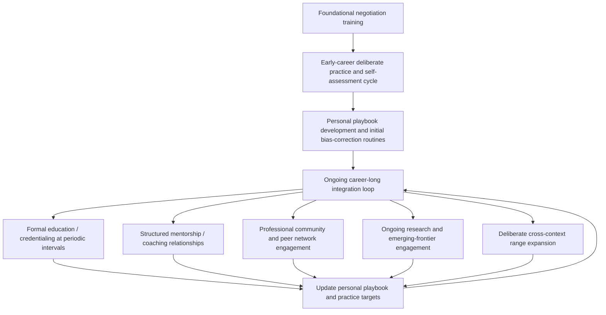

## Lifelong Learning Pathways in Negotiation Expertise

### Overview

Lifelong learning pathways in negotiation expertise describe the long-horizon structures, resources, and progression models through which negotiators sustain and deepen their capability across an entire career, integrating the individual practices established throughout this chapter, self-assessment, deliberate practice, structured debriefing, personal playbook maintenance, and bias correction, into an ongoing, multi-decade developmental trajectory rather than a bounded training period. This topic closes the syllabus's mastery chapter by addressing how expertise is sustained and extended over time, beyond the acquisition of any single skill or the completion of any single training program.

### Why Negotiation Expertise Requires Ongoing, Not Terminal, Development

- **The negotiation environment itself evolves**: As discussed under Emerging Research Frontiers in Negotiation Theory, new negotiation contexts (AI-mediated negotiation, novel dispute-resolution mechanisms, evolving legal and regulatory environments affecting drafting practice) continue to emerge, meaning a fixed skill set acquired early in a career risks becoming incomplete or outdated without ongoing engagement with new developments.
- **Expertise is domain- and context-specific, requiring continued breadth expansion**: A negotiator who has developed strong expertise in one context (e.g., commercial supply negotiations) does not automatically possess equivalent expertise in a structurally different context (e.g., multi-party diplomatic negotiation, per Historic Trade and Treaty Negotiations, or labor-relations negotiation), meaning career-long development often involves deliberate expansion into new negotiation contexts, not only deepening within a single one.
- **Bias susceptibility and skill plateaus persist without ongoing intervention**: As established under Recognizing and Correcting Personal Biases, cognitive biases are not permanently eliminated through early-career training alone, and skill development without continued deliberate practice risks plateauing well short of full potential, consistent with general findings on skill maintenance across many expertise domains.

### Structural Pathways for Sustained Development

**Formal Education and Credentialing**

Structured academic and professional programs (negotiation-focused coursework, professional certificates, executive education programs) provide periodic, structured exposure to current theoretical frameworks and research findings, functioning as a systematic complement to the individually-directed self-assessment and practice cycles emphasized elsewhere in this chapter.

**Structured Mentorship and Coaching Relationships**

Ongoing relationships with a more experienced negotiator or professional coach provide continued external, triangulated feedback (as emphasized under Self-Assessment of Negotiation Strengths and Weaknesses) well beyond any initial training period, addressing the self-serving-bias and blind-spot risks that persist even for experienced negotiators.

**Professional Communities and Peer Networks**

Participation in professional negotiation-practice communities (industry associations, alumni networks from negotiation training programs, informal peer groups) provides access to peer debrief partners (see Structured Debriefing and Feedback Techniques), a source of diverse counterpart practice (see Deliberate Practice Through Simulation and Role-Play), and exposure to a wider range of negotiation contexts than any single individual's own direct experience would provide.

**Engagement With Ongoing Research and Emerging Frontiers**

Periodic engagement with current negotiation research (academic literature, industry analysis) keeps a practitioner's frameworks current with developments such as those surveyed under Emerging Research Frontiers in Negotiation Theory, rather than relying indefinitely on a static body of knowledge acquired at a single point in a career.

**Cross-Context Practice and Deliberate Range Expansion**

Deliberately seeking negotiation experience or simulation practice (see Deliberate Practice Through Simulation and Role-Play) in contexts structurally different from one's primary professional domain (e.g., a commercial negotiator practicing multi-party coalition simulations) builds transferable meta-skill and reduces the risk of narrow, context-bound expertise that fails to generalize when circumstances shift.

### Lifelong Development Pathway Architecture

### Stages of Long-Term Expertise Development

**Novice-to-Competent Stage**

Characterized by heavy reliance on explicit, formal frameworks (BATNA/ZOPA calculation, structured preparation checklists) and structured training environments (simulations per Simulation Exercises Used in Negotiation Pedagogy), with self-assessment primarily focused on foundational tactical execution gaps.

**Competent-to-Proficient Stage**

Characterized by the personal playbook (see Building a Personal Negotiation Playbook) becoming a more central, individually customized tool, and self-assessment shifting toward more nuanced pattern recognition (recurring personal triggers, situational bias susceptibility) rather than foundational skill gaps.

**Proficient-to-Expert Stage**

[Inference] Consistent with general expertise-development literature across skill domains, this stage is typically characterized by increasingly intuitive, rapid situational assessment that draws on a large accumulated base of prior pattern recognition, alongside a continued (and, per the general expertise literature, often increased rather than decreased) commitment to structured debrief and bias-checking specifically because unexamined intuitive judgment at this stage carries higher stakes and is more difficult for others to challenge or verify; this staged characterization is a general extrapolation from broader expertise-development research rather than a negotiation-specific finding established here.

**Master-to-Mentor Stage**

Characterized by a shift toward contributing to others' development (mentoring, coaching, contributing to organizational feedback loops per Feedback Loops for Improving Future Negotiations), which itself often reinforces the mentor's own expertise through the requirement to articulate previously intuitive judgment in explicit, teachable terms.

### Integrating Career-Long Learning With the Practices Established Elsewhere in This Chapter

| Chapter Practice | Lifelong Learning Integration |
| --- | --- |
| Self-assessment | Periodic reassessment (per that topic) becomes a recurring career-long cadence, not a bounded early-career activity |
| Deliberate practice | Practice targets evolve over a career as foundational gaps close and new contexts or emerging frontiers are engaged |
| Structured debriefing | Debrief discipline should persist even at senior/expert career stages, resisting the tendency to treat experience alone as sufficient |
| Personal playbook | The playbook itself becomes a career-spanning document, with version history reflecting an individual's full developmental arc |
| Bias correction | Bias-correction routines remain relevant indefinitely, since expertise does not eliminate susceptibility to the biases discussed in the prior topic |

### Measuring Progress Across a Long-Term Development Pathway

**Longitudinal Self-Tracking**

Applying the same objective outcome-pattern review methodology discussed under Self-Assessment of Negotiation Strengths and Weaknesses across a much longer time horizon (years rather than months) can reveal genuine long-term development trends, distinguishing durable expertise growth from short-term, context-specific performance fluctuation.

**External Validation Milestones**

Formal credentials, mentorship endorsements, or objective role progression (e.g., being entrusted with increasingly complex or higher-stakes negotiations within an organization) can serve as periodic external validation checkpoints, complementing the self-directed tracking methods emphasized elsewhere in this syllabus.

**Contribution as a Development Indicator**

[Inference] An individual's transition toward mentoring or teaching others (per the master-to-mentor stage above) is sometimes treated in expertise-development literature more broadly as itself an indicator of, and further contributor to, advanced mastery, since effectively teaching a skill typically requires a more explicit and complete understanding than performing the skill alone requires; this connection is a general pattern from broader expertise literature rather than a claim specific to empirical negotiation-expertise research cited here.

### Common Failures in Sustaining Long-Term Development

- **Assuming experience alone produces continued growth**: as emphasized throughout this chapter, accumulated years of negotiation experience without continued structured debrief, self-assessment, and deliberate practice risks a plateau well short of full potential, rather than continued automatic improvement.
- **Disengaging from ongoing research and emerging developments**: relying indefinitely on frameworks and knowledge acquired early in a career, without periodic engagement with developments such as those covered under Emerging Research Frontiers in Negotiation Theory, risks an increasingly outdated practitioner toolkit.
- **Remaining within a single negotiation context indefinitely**: deep expertise in one specific negotiation domain does not automatically transfer to structurally different contexts; a career-long pathway that never deliberately expands range risks narrow, context-bound expertise.
- **Discontinuing structured debrief and bias-checking at senior career stages**: as discussed above, the increasing stakes and reduced external challenge typically associated with senior roles make continued structured self-examination more, not less, important, even though it is often the practice most likely to be abandoned as informal confidence grows with experience.

### Practical Application Exercise

**Example**

A negotiator ten years into a commercial procurement career applies a lifelong-learning-pathway review to their own development trajectory:

1. **Stage assessment**: Self-assessment (using the methodology from Self-Assessment of Negotiation Strengths and Weaknesses) suggests the negotiator has reached a proficient-to-expert stage within commercial supplier negotiations specifically, with a mature, well-validated personal playbook (per Building a Personal Negotiation Playbook) and reliably applied bias-correction routines (per Recognizing and Correcting Personal Biases) for that specific context.
2. **Range-expansion decision**: Recognizing that expertise has been built almost exclusively within bilateral commercial contexts, the negotiator deliberately seeks a cross-context development opportunity, participating in a multi-party coalition simulation (per Deliberate Practice Through Simulation and Role-Play) to build transferable skill for an anticipated future role involving multi-stakeholder negotiations.
3. **Emerging-frontier engagement**: Given the organization's increasing use of AI-assisted negotiation tools, the negotiator engages with current research on human-AI negotiation delegation modalities (per Emerging Research Frontiers in Negotiation Theory) to inform how the personal playbook should be updated to address this newly relevant context.
4. **Mentor-stage contribution**: The negotiator begins formally mentoring a junior colleague, requiring explicit articulation of previously intuitive judgment patterns; this process itself surfaces a previously undocumented personal heuristic, which is then added to the personal playbook, illustrating how the mentoring relationship reinforces the mentor's own continued development rather than being a purely one-directional transfer of expertise.
5. **Long-term tracking**: The negotiator's decade-long outcome and relationship-health data (per the objective outcome-pattern review methodology) is reviewed to confirm genuine long-term improvement trends distinguishable from short-term fluctuation, validating the cumulative value of the sustained self-assessment, practice, debrief, and playbook-maintenance cycle applied throughout the reviewed period.

### Related Topics

- Stages of Expertise Development Across Professional Skill Domains
- Cross-Context Range Expansion as a Career-Long Development Strategy
- Mentorship and Coaching as Bidirectional Development Mechanisms
- Sustaining Structured Debrief Discipline at Senior Career Stages
- Engaging With Emerging Negotiation Research as a Practitioner
- Long-Horizon Longitudinal Self-Tracking of Negotiation Outcomes
- Professional Community and Peer Network Structures for Ongoing Practice
- Teaching and Mentoring as Indicators of Advanced Mastery