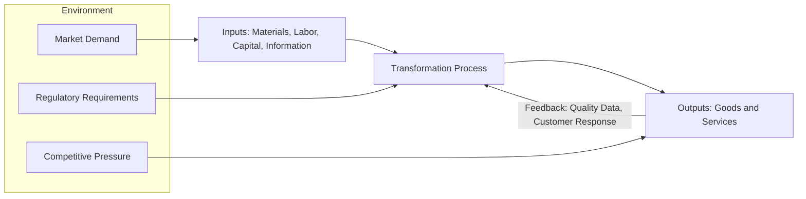
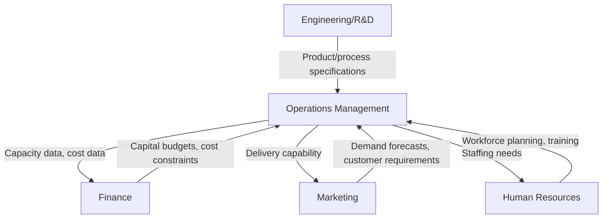

## Definition and Scope of Operations Management

### Definition

Operations management (OM) is the field of management concerned with designing, executing, and controlling the processes that transform inputs (materials, labor, capital, information) into outputs (goods and services) that create value for customers. It applies to manufacturing environments (production of physical goods) and service environments (delivery of intangible offerings) alike.

**Key Points**

- OM sits at the intersection of strategy, engineering, and management, focused on the efficient and effective use of resources.
- The core objective is to maximize the ratio of output value to input cost while meeting quality, time, and flexibility requirements.
- OM decisions are typically classified into strategic (long-term, e.g., facility location), tactical (medium-term, e.g., capacity planning), and operational (short-term, e.g., scheduling) levels.

### The Transformation Process Model

At its core, OM is described by the input-transformation-output model:

$$Inputs \rightarrow Transformation \ Process \rightarrow Outputs$$

- **Inputs**: raw materials, labor, capital, energy, information, technology
- **Transformation process**: physical (manufacturing), locational (transportation), exchange (retail), physiological (healthcare), informational (telecommunications), or psychological (entertainment)
- **Outputs**: goods, services, or a hybrid (product-service bundle)

Feedback loops connect outputs back to inputs and the transformation process for continuous improvement, typically through quality control and performance monitoring.

### Scope of Operations Management

The scope of OM spans the full lifecycle of a product or service, encompassing several major functional areas:

- **Product/service design**: translating customer requirements into specifications
- **Process design and selection**: choosing between job shop, batch, assembly line, or continuous flow processes
- **Capacity planning**: determining the maximum sustainable output level over short, medium, and long horizons
- **Facility location and layout**: deciding where operations occur and how physical space is arranged
- **Supply chain management**: coordinating suppliers, logistics, and distribution
- **Inventory management**: balancing carrying costs against stockout risks
- **Quality management**: ensuring outputs meet specifications (e.g., via Total Quality Management, Six Sigma)
- **Scheduling and workforce management**: sequencing work and allocating labor
- **Project management**: planning and controlling one-time or non-repetitive initiatives
- **Maintenance and reliability**: sustaining equipment and system uptime

### Goods vs. Services in Operations

| Dimension | Goods (Manufacturing) | Services |
| --- | --- | --- |
| Tangibility | Tangible, storable | Intangible, perishable |
| Customer contact | Typically low during production | Often high (customer present during "production") |
| Quality measurement | Measurable against physical specs | Often subjective, based on perception |
| Inventory | Can be held as buffer | Cannot be inventoried (capacity perishes if unused) |
| Output consistency | Easier to standardize | Harder to standardize due to variability in delivery |

[Inference] Many real-world operations exist on a continuum rather than as pure goods or pure services — a restaurant, for example, combines a manufactured product (food) with a delivered service (dining experience).

### Historical Evolution of the Field

- **Craft production (pre-1800s)**: Individual artisans produced customized goods
- **Industrial Revolution (late 1700s–1800s)**: Mechanization and factory systems emerged
- **Scientific Management (early 1900s)**: Frederick Taylor introduced time-and-motion studies and standardized work methods
- **Mass production (1910s–1920s)**: Henry Ford's moving assembly line enabled interchangeable parts and division of labor
- **Operations research (1940s–1950s)**: Quantitative methods developed during WWII applied to logistics and resource allocation
- **Quality revolution (1970s–1980s)**: Japanese manufacturing practices (TQM, Just-in-Time, Kaizen) reshaped global competitiveness
- **Lean and Six Sigma (1990s–2000s)**: Toyota Production System principles combined with statistical process control
- **Digital and Industry 4.0 (2010s–present)**: IoT, automation, AI, and data analytics integrated into operations

### Objectives of Operations Management

Operations management typically balances four (sometimes five) competing performance objectives, often called the "operations performance objectives":

1. **Cost**: minimizing the cost of producing goods/services
2. **Quality**: meeting or exceeding specifications and customer expectations consistently
3. **Speed**: reducing the time between order and delivery
4. **Dependability**: delivering on time, every time
5. **Flexibility**: adapting to changes in volume, mix, delivery, or design

[Inference] These objectives often involve trade-offs; for example, prioritizing extreme customization (flexibility) can increase cost and reduce speed, though lean and agile methodologies attempt to reduce the severity of these trade-offs.

### Relationship to Other Business Functions

Operations management does not function in isolation; it interfaces continuously with marketing (demand and customer requirements), finance (budgeting and investment decisions), human resources (staffing and skills), and engineering (product and process specifications).

### Example

A bakery's operations manager must decide:

- **Capacity**: How many ovens and staff are needed to meet daily demand?
- **Process design**: Should bread be made in batches or via continuous mixing/baking lines?
- **Inventory**: How much flour and yeast to stock to avoid both spoilage and stockouts?
- **Quality**: What checks ensure consistent taste and appearance across batches?
- **Scheduling**: When should baking shifts start to have fresh bread ready by opening time?

This illustrates how a single small business touches nearly every core OM function simultaneously.

### Key Metrics Used to Evaluate Operations

- **Productivity**: $Productivity = \dfrac{Output}{Input}$
- **Utilization**: $Utilization = \dfrac{Time \ Used}{Time \ Available} \times 100\%$
- **Efficiency**: $Efficiency = \dfrac{Actual \ Output}{Standard \ (Effective) \ Output} \times 100\%$
- **Cycle time**: total time from process start to finish for one unit
- **Throughput**: rate at which a system generates output over time

### Common Misconceptions

- OM is not limited to factories; it applies equally to hospitals, banks, airlines, and government agencies.
- OM is not solely about cost-cutting; it also drives revenue through improved quality, speed, and reliability.
- Operations and logistics/supply chain management are related but distinct: supply chain management is often treated as a broader, inter-organizational subset or adjacent discipline focused on the flow of materials and information across firms, while OM traditionally emphasizes the internal transformation process.

### Conclusion

Operations management is the discipline responsible for designing and controlling the processes that convert inputs into valuable outputs, applicable across manufacturing and service contexts alike. Its scope spans strategic decisions (facility location, capacity), tactical decisions (process design, supply chain coordination), and operational decisions (scheduling, quality control), all oriented toward balancing cost, quality, speed, dependability, and flexibility.

**Related Topics**

- Historical evolution of operations management (Scientific Management to Industry 4.0)
- Goods vs. services operations distinctions
- The transformation process model in depth
- Operations strategy and competitive priorities
- Productivity measurement and analysis
- Role of operations management in supply chain integration
- Process types: job shop, batch, line, continuous flow
- Introduction to Total Quality Management (TQM) and Six Sigma
- Capacity planning fundamentals
- Facility location decision models