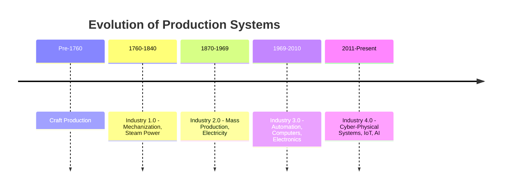
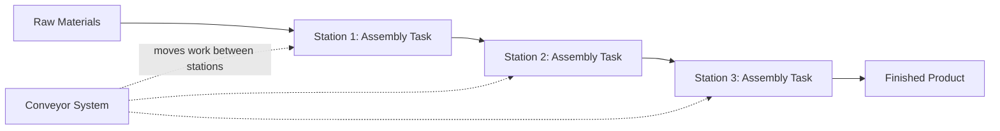
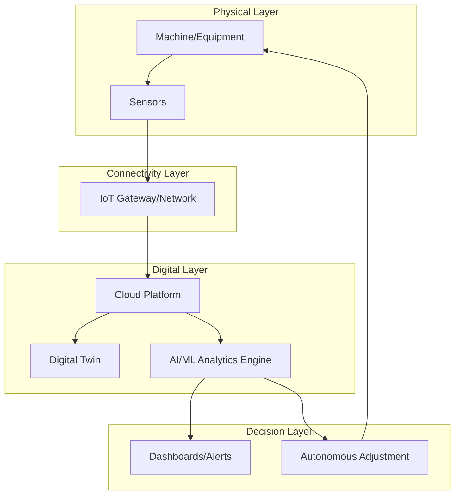

## Historical Evolution from Craft Production to Industry 4.0

### Overview

The evolution of operations and production systems spans several distinct eras, each triggered by technological breakthroughs, economic pressures, and shifts in customer expectations. This progression is typically framed as four industrial revolutions, preceded by a pre-industrial craft era.

### Craft Production Era (Pre-1760)

**Key Points**

- Production was performed by skilled artisans (craftsmen) who controlled the entire process from raw material to finished product.
- Products were highly customized, made to individual customer specification, using general-purpose tools.
- Output volume was low, prices were high, and production was decentralized (home-based or small workshop-based, often called the "cottage industry" or "putting-out system").
- Labor mobility was limited; skills were transferred through apprenticeship systems and guilds, which also controlled quality, pricing, and entry into trades.

[Inference] Craft production, while flexible and high in perceived quality, could not scale to meet growing urban populations and expanding trade networks — creating the economic pressure that led to mechanization.

### First Industrial Revolution — Industry 1.0 (c. 1760–1840)

**Key Points**

- Triggered by the invention of the steam engine (James Watt, 1769) and mechanized textile equipment (spinning jenny, power loom).
- Shifted production from human/animal power to mechanical power sourced from water and steam.
- Enabled the first factory system: workers and machinery centralized under one roof rather than distributed across homes.
- Textiles, iron production, and mining were the primary industries transformed.

**Example**

The mechanized cotton mill replaced hand-spinning: a single water-powered spinning frame could do the work of dozens of manual spinners, driving down cost per unit and enabling mass availability of cloth.

### Second Industrial Revolution — Industry 2.0 (c. 1870–1969)

**Key Points**

- Enabled by the introduction of electricity, the internal combustion engine, and steel production advances (Bessemer process).
- Introduced **interchangeable parts** and **division of labor**, formalized by Frederick Winslow Taylor's Scientific Management (early 1900s), which used time-and-motion studies to standardize tasks.
- Henry Ford's moving assembly line (1913) became the emblematic achievement of this era, reducing Model T production time from over 12 hours to about 90 minutes per vehicle. [Unverified — specific figures vary by source and production year]
- Mass production drove economies of scale, lowering unit costs and enabling consumer goods to reach broader populations.
- Introduced hierarchical, centralized management structures suited to large-scale, repetitive production.

### Third Industrial Revolution — Industry 3.0 (c. 1969–2010)

**Key Points**

- Marked by the shift from purely mechanical/electrical systems to **electronics and computerization**.
- The Programmable Logic Controller (PLC), introduced by Modicon in 1969, allowed automated control of machinery without manual rewiring.
- Introduced computer-aided design/manufacturing (CAD/CAM), industrial robotics, and early enterprise resource planning (ERP) systems.
- Gave rise to key operations philosophies still taught today:
  - **Toyota Production System (TPS)** / **Lean Manufacturing** (1950s–1970s, widely adopted globally in this era): elimination of waste (*muda*), Just-in-Time (JIT) production, and continuous improvement (*Kaizen*)
  - **Total Quality Management (TQM)**: quality as an organization-wide responsibility, influenced by W. Edwards Deming and Joseph Juran
  - **Six Sigma** (1980s, Motorola): statistical methods to reduce process variation and defects
- Enabled flexible manufacturing systems (FMS) capable of producing multiple product variants on the same line.

[Inference] The shift toward Lean and quality-focused philosophies in this era was substantially driven by competitive pressure from Japanese manufacturers, whose efficiency and quality outperformed Western mass-production models through the 1970s–1980s.

### Fourth Industrial Revolution — Industry 4.0 (c. 2011–Present)

**Key Points**

- The term "Industrie 4.0" originated from a German government high-tech strategy initiative around 2011, aimed at promoting the computerization of manufacturing.
- Defined by the integration of **cyber-physical systems (CPS)**: physical machinery embedded with sensors, software, and network connectivity that allow real-time data exchange and autonomous decision-making.
- Core enabling technologies:
  - **Internet of Things (IoT)**: networked sensors on equipment providing continuous operational data
  - **Big Data and Analytics**: processing high-volume operational data to identify patterns and optimize decisions
  - **Artificial Intelligence and Machine Learning**: predictive maintenance, demand forecasting, quality inspection via computer vision
  - **Cloud Computing**: centralized, scalable storage and processing of operational data
  - **Digital Twins**: virtual replicas of physical assets or processes used for simulation and optimization
  - **Additive Manufacturing (3D Printing)**: on-demand, low-volume, customizable production
  - **Collaborative Robots (Cobots)**: robots designed to work safely alongside humans
  - **Autonomous Systems**: self-guided vehicles (AGVs/AMRs) for material handling

**Example**

A smart factory uses vibration sensors on a CNC machine to continuously stream data to a cloud analytics platform. A machine learning model detects a pattern historically associated with bearing failure and triggers a maintenance work order automatically — before the machine breaks down (predictive maintenance), rather than waiting for a scheduled inspection or a failure event.

### Comparative Summary Table

| Era | Approx. Period | Power Source | Key Innovation | Production Style |
| --- | --- | --- | --- | --- |
| Craft Production | Pre-1760 | Human/animal | Skilled artisanship | Customized, low-volume |
| Industry 1.0 | 1760–1840 | Water/steam | Mechanization | Centralized, factory-based |
| Industry 2.0 | 1870–1969 | Electricity | Assembly line, mass production | Standardized, high-volume |
| Industry 3.0 | 1969–2010 | Electronics/computers | Automation, PLCs, Lean/TQM | Flexible, computer-aided |
| Industry 4.0 | 2011–present | Data/connectivity | Cyber-physical systems, IoT, AI | Smart, adaptive, autonomous |

### Emerging Discussion: Industry 5.0

[Speculation] Some academic and policy sources (notably a 2021 European Commission publication) have begun discussing "Industry 5.0" as a proposed successor concept, emphasizing human-centricity, sustainability, and resilience alongside the technological capabilities of Industry 4.0. This concept is not yet as broadly standardized in operations management curricula as the four preceding industrial revolutions, and its scope continues to be debated among researchers and policymakers.

### Conclusion

The evolution from craft production to Industry 4.0 reflects a continuous drive to increase output volume, consistency, and speed while progressively reducing dependence on manual skill and, more recently, on manual decision-making itself. Each transition was driven by a foundational technology — steam power, electricity, computerization, and now data connectivity — that reshaped how organizations structure their operations, manage their workforce, and compete in the market.

**Related Topics**

- Lean manufacturing and the Toyota Production System in depth
- Total Quality Management (TQM) principles and tools
- Six Sigma methodology (DMAIC framework)
- Smart factory architecture and Industrial IoT (IIoT) protocols
- Predictive maintenance strategies
- Digital twin technology in operations
- Additive manufacturing (3D printing) applications
- Industry 5.0 and human-centric manufacturing debates
- Flexible manufacturing systems (FMS)
- Automation vs. workforce displacement in operations strategy