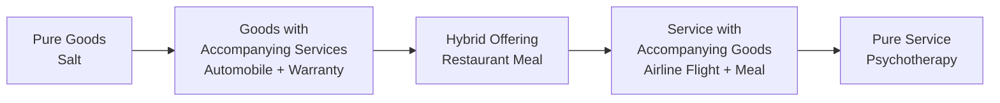

## Goods versus Services Distinction

### Definition

The goods-versus-services distinction is a foundational classification in operations management describing two broad categories of output produced by transformation processes: **goods** (tangible physical items) and **services** (intangible acts or performances). This distinction shapes how operations are designed, measured, and managed, since the two categories differ fundamentally in how they are produced, delivered, and consumed.

### Core Defining Characteristics

**Key Points**

Five characteristics are traditionally used to differentiate goods from services:

1. **Tangibility**: Goods are physical and can be seen, touched, and stored. Services are intangible acts or performances.
2. **Perishability**: Goods can typically be stored as inventory for later use. Services are perishable — unused service capacity (e.g., an empty airline seat, an idle consulting hour) cannot be stored or recovered.
3. **Simultaneity of production and consumption**: Goods are produced, then stored, then consumed at a later point. Services are often produced and consumed at the same time (e.g., a haircut, a medical consultation).
4. **Heterogeneity (variability)**: Goods can be manufactured to a consistent, uniform standard through automation. Services often vary from one delivery instance to another because of the human element involved in delivery.
5. **Customer participation/contact**: Goods production typically occurs with low or no direct customer involvement. Services frequently require the customer's presence or active participation during the transformation process.

### Comparative Table

| Dimension | Goods | Services |
| --- | --- | --- |
| Tangibility | Tangible | Intangible |
| Storability | Can be inventoried | Cannot be inventoried (perishable capacity) |
| Timing | Production precedes consumption | Production and consumption often simultaneous |
| Consistency | Standardizable via automation | Variable, dependent on provider/context |
| Customer contact | Generally low | Generally high |
| Quality measurement | Objective, measurable against specs | Often subjective, perception-based |
| Transportability | Can be shipped/transported | Cannot be transported (location-bound to delivery point) |
| Ownership transfer | Ownership transfers to buyer | No ownership transfer; access/experience is provided |

### The Goods-Services Continuum

Rather than treating goods and services as a strict binary, operations management commonly treats them as two ends of a continuum, since most real-world offerings are hybrids that bundle a physical product with a service component (or vice versa).

**Example**

- **Pure good**: A bag of table salt — no accompanying service is required for the customer to derive value.
- **Hybrid offering**: A restaurant meal — combines a manufactured product (the food) with a delivered service (seating, order-taking, ambiance, table service).
- **Pure service**: Psychotherapy — no physical good changes hands; value comes entirely from the interpersonal interaction and expertise delivered.

### Operational Implications of the Distinction

**Key Points**

- **Capacity planning**: Because services cannot be inventoried, service operations must plan capacity to match demand fluctuations directly (e.g., call centers staffing up for peak hours), whereas goods-producing operations can build inventory ahead of demand spikes.
- **Quality control**: Goods quality can often be inspected before the customer receives the product (statistical process control on a production line). Service quality control frequently must happen in real time, during delivery, since defects are experienced directly by the customer as they occur.
- **Location decisions**: Goods-producing facilities can be located based on cost factors (labor, materials, logistics) since the product is shipped to the customer. Many services must be located near or accessible to the customer, since delivery and consumption are simultaneous.
- **Standardization vs. customization**: Goods manufacturing often pursues standardization to gain economies of scale. Services frequently must balance standardization (efficiency) against customization (customer-perceived value), a tension sometimes called the "efficiency-customization trade-off" in service operations design.
- **Demand management**: Because service capacity is perishable, service operations rely heavily on demand-management tactics such as reservations, dynamic pricing (yield management), and appointment scheduling to align demand with fixed capacity — practices less critical in goods-producing operations that can use inventory as a buffer.

### The Service-Dominant Logic Perspective

[Inference] Some contemporary marketing and operations scholarship — notably the "service-dominant logic" framework proposed by Vargo and Lusch (2004) — argues that all economic exchange is fundamentally service-based, with goods acting merely as a distribution mechanism for service value (e.g., a washing machine is valuable because it provides the "service" of clean clothes, not because of the physical object itself). This is a theoretical reframing rather than the traditional operational classification, and it is not universally adopted across all operations management curricula, but it is worth noting as an alternative lens.

### Measuring Quality: Goods vs. Services

- **Goods quality dimensions** (based on Garvin's framework): performance, features, reliability, conformance, durability, serviceability, aesthetics, perceived quality.
- **Service quality dimensions** (based on the SERVQUAL model by Parasuraman, Zeithaml, and Berry): reliability, responsiveness, assurance, empathy, tangibles.

$$Service \ Quality \ Gap = Customer \ Expectations - Customer \ Perceptions$$

[Unverified — behavior may vary by industry context] The SERVQUAL gap model is widely taught, though its practical predictive validity has been debated in some service marketing literature.

### Example: Applying the Distinction to a Real Business

A car dealership illustrates both categories within one business:

- **Goods component**: The vehicle itself — manufactured off-site, inventoried on the lot, inspected for quality before sale, transportable.
- **Service component**: Sales consultation, financing arrangement, and after-sales maintenance — delivered in real time, dependent on staff-customer interaction, not inventoriable (an empty service bay hour is lost forever), and variable in quality depending on the technician or salesperson.

### Why This Distinction Matters in Operations Strategy

- Determines which performance objectives (cost, quality, speed, dependability, flexibility) are prioritized differently by process type.
- Shapes process design choices (e.g., a "back office" that processes standardized, low-contact work like check clearing, versus a "front office" that handles direct customer interaction).
- Influences workforce design: service operations often require greater investment in soft-skills training and empowerment of front-line employees who directly shape the customer's real-time experience.

### Conclusion

The goods-versus-services distinction is not a strict binary but a spectrum defined by tangibility, perishability, simultaneity, variability, and customer contact. Most real-world offerings are hybrids positioned along this continuum. Understanding where an offering sits on this spectrum directly informs decisions in capacity planning, quality control, facility location, and demand management — making this distinction one of the foundational lenses through which operations strategies are designed.

**Related Topics**

- The service-profit chain and service operations strategy
- SERVQUAL and service quality gap models
- Yield management and dynamic pricing in perishable-capacity services
- Front office vs. back office process design
- Garvin's eight dimensions of quality
- Service blueprinting as a design tool
- Capacity planning for perishable services
- Mass customization strategies bridging goods and services