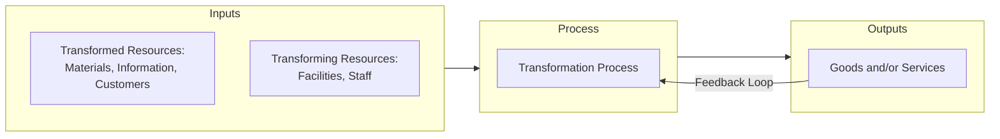
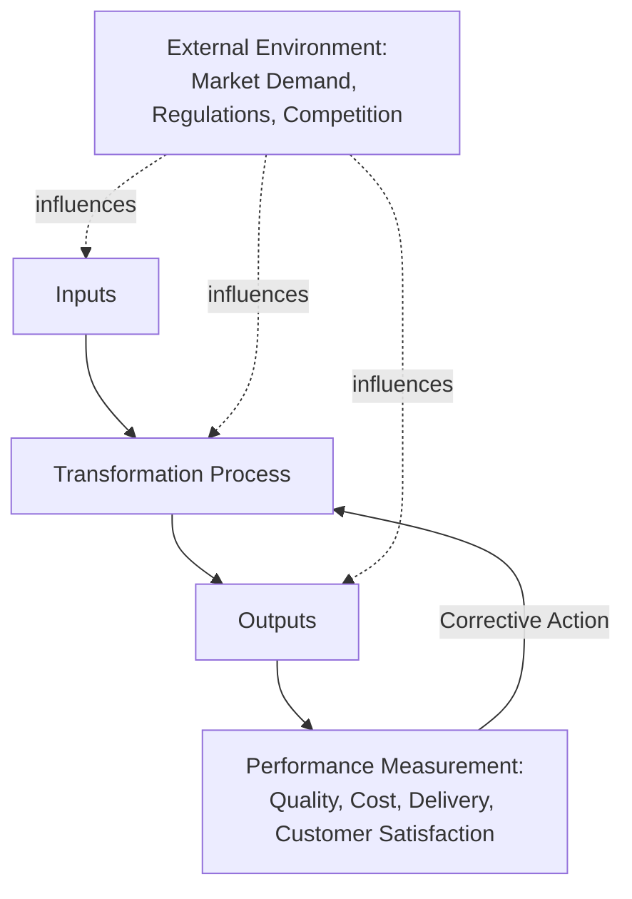
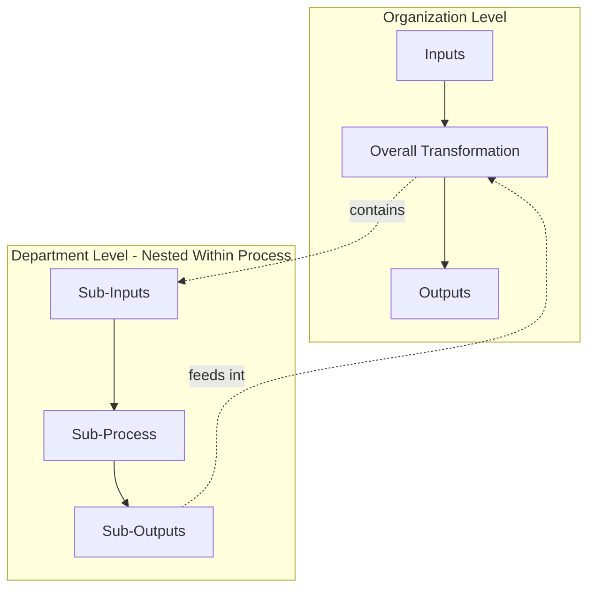

## The Input-Transformation-Output Model

### Definition

The input-transformation-output (I-T-O) model is the fundamental conceptual framework in operations management describing any operation as a system that acquires **inputs**, subjects them to a **transformation process**, and generates **outputs** of greater value than the combined cost of the inputs. This model applies universally across manufacturing, service, and hybrid operations, regardless of industry or scale.

### The Basic Model Structure

$$Inputs \rightarrow Transformation \ Process \rightarrow Outputs$$

### Categories of Inputs

**Key Points**

Inputs are traditionally divided into two categories:

1. **Transformed resources**: the resources that are acted upon and changed by the process. These are typically:
   - **Materials**: physically transformed (e.g., raw steel becomes a car chassis), transported (e.g., packages moved by a courier), or their ownership changes (e.g., retail transactions)
   - **Information**: transformed in form (e.g., raw data into a report), transported (e.g., telecommunications), or its ownership changes (e.g., market research firms)
   - **Customers**: physically transformed (e.g., a hairdresser, a hospital), accommodated (e.g., a hotel), transported (e.g., an airline), or their psychological state is changed (e.g., entertainment, education)
2. **Transforming resources**: the resources that act upon the transformed resources to enact the change. These are typically:
   - **Facilities**: buildings, equipment, plant, process technology
   - **Staff**: the people who operate the process, ranging from direct labor to management

### Categories of Outputs

- **Goods**: tangible outputs that can be produced, stored, and transported prior to consumption
- **Services**: intangible outputs, often produced and consumed simultaneously, that cannot be stored

[Inference] Most operations generate a mix of goods and services rather than a pure output type; see the related goods-versus-services distinction for the continuum model.

### Types of Transformation Processes

The transformation process itself can be categorized by the nature of change applied to transformed resources:

| Transformation Type | Description | Example |
| --- | --- | --- |
| Physical | Changes the physical properties of materials | Manufacturing, construction |
| Locational | Changes the location of materials, information, or customers | Transportation, courier services, warehousing |
| Exchange | Changes the ownership of materials or information | Retail, wholesale |
| Storage | Accommodates materials or customers | Warehousing, hotels |
| Physiological/Psychological | Changes the physical or mental state of customers | Healthcare, education, entertainment |
| Informational | Changes the form or accessibility of information | Consulting, accounting, telecommunications |

### The Role of the Environment and Feedback

**Key Points**

- The I-T-O model does not operate in isolation; it is embedded within a broader environment consisting of market demand, competitive pressures, regulatory requirements, and stakeholder expectations.
- A **feedback loop** connects outputs (via measures such as quality, customer satisfaction, and cost) back into the transformation process, enabling continuous improvement and corrective action.
- This feedback mechanism is central to quality management systems (e.g., the Plan-Do-Check-Act cycle) and to control theory as applied in operations.

### Worked Examples Across Industries

**Example — Manufacturing (Automobile Assembly Plant)**

- Inputs: steel, plastic components, electronic parts (transformed resources); assembly line facilities, robotic equipment, skilled labor (transforming resources)
- Transformation process: physical assembly, welding, painting, quality inspection
- Outputs: finished vehicles

**Example — Service (Hospital)**

- Inputs: patients (transformed resource); medical staff, diagnostic equipment, hospital facilities (transforming resources)
- Transformation process: physiological transformation (treatment, surgery) and psychological transformation (care, reassurance)
- Outputs: treated/healthier patients, medical records

**Example — Informational Service (Accounting Firm)**

- Inputs: client financial data (transformed resource); accountants, software systems (transforming resources)
- Transformation process: informational transformation (raw transactions converted into structured financial statements)
- Outputs: audited financial reports, tax filings

### Value-Added Perspective

A central principle underlying the I-T-O model is that the transformation process must add value — the output must be worth more to the customer than the sum of the input costs, or the operation is not economically viable.

$$Value \ Added = Value \ of \ Output - Cost \ of \ Inputs$$

[Inference] This value-added lens is also the conceptual basis for process mapping techniques like value stream mapping, which explicitly distinguish value-adding transformation steps from non-value-adding (wasteful) steps within a process.

### Nested/Hierarchical Nature of the Model

**Key Points**

- The I-T-O model is fractal: an entire organization can be modeled as one transformation system, while each department, process, or even individual task within it can also be modeled using the same input-transformation-output structure.
- This nesting allows the model to be applied at the strategic (whole-organization) level, the tactical (department/process) level, and the operational (individual task) level.

### Common Pitfalls in Applying the Model

- Treating inputs as only physical materials and overlooking information and customers as legitimate transformed resources, particularly in service contexts.
- Failing to account for the environment's influence, leading to transformation processes that are efficient internally but misaligned with market or regulatory demands.
- Overlooking the feedback loop, which results in operations that do not adapt or improve over time.

### Conclusion

The input-transformation-output model provides the conceptual backbone of operations management, offering a universal way to describe any process — whether manufacturing a physical good, delivering a service, or processing information — as a system that consumes resources, transforms them, and produces value-added outputs, all while being shaped by and responsive to its external environment through feedback.

**Related Topics**

- Types of transformation processes in depth (physical, locational, exchange, storage, informational)
- Value stream mapping and identifying non-value-adding activities
- Process types: job shop, batch, line, continuous flow
- Goods versus services distinction
- Feedback loops and the Plan-Do-Check-Act (PDCA) cycle
- Process design and selection criteria
- Systems thinking in operations management