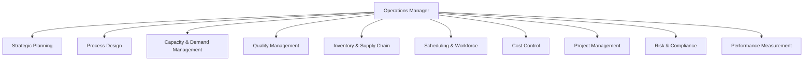
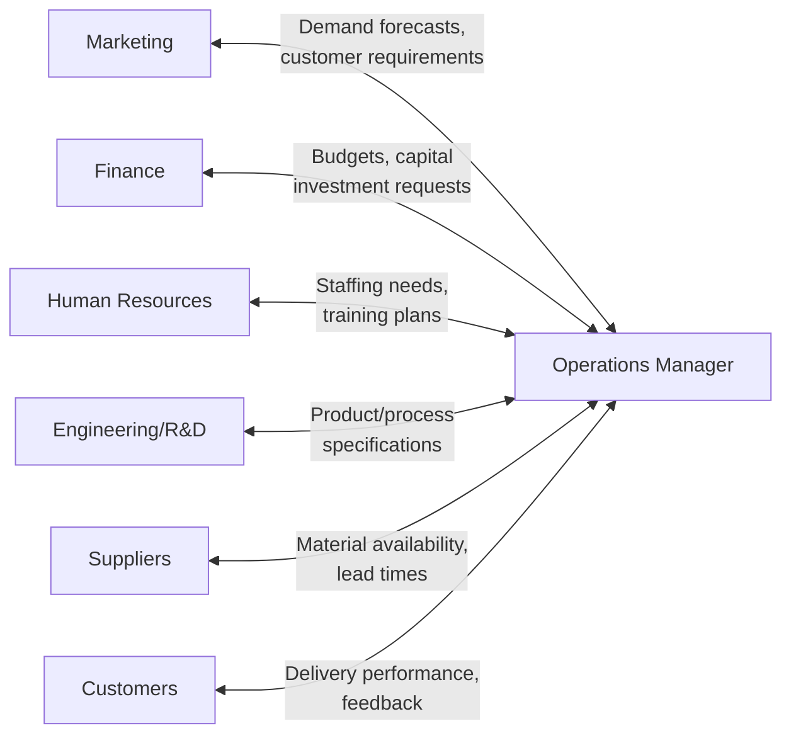

## Roles and Responsibilities of the Operations Manager

### Definition

The operations manager is the individual (or role) responsible for planning, organizing, directing, and controlling the resources and processes involved in producing an organization's goods and/or services. This role bridges strategic organizational goals with day-to-day execution, ensuring that transformation processes consistently deliver value while meeting cost, quality, speed, dependability, and flexibility targets.

### Core Functional Responsibilities

**Key Points**

The operations manager's responsibilities are generally grouped into planning, organizing, staffing, directing, and controlling functions applied specifically to the transformation process:

1. **Strategic planning**: Setting long-term capacity levels, facility locations, technology investments, and process design in alignment with overall business strategy.
2. **Process design and improvement**: Selecting and refining the methods, layouts, and workflows used to convert inputs into outputs.
3. **Capacity and demand management**: Determining the appropriate level of resources (labor, equipment, facilities) needed to meet forecasted demand without excessive idle capacity or shortages.
4. **Quality management**: Establishing and enforcing standards, implementing quality control/assurance systems, and driving continuous improvement initiatives.
5. **Inventory and supply chain coordination**: Managing the flow of materials, components, and finished goods, and coordinating with suppliers and distribution partners.
6. **Scheduling and workforce management**: Sequencing work, allocating labor and equipment, and ensuring on-time completion of production or service delivery.
7. **Cost control and budgeting**: Monitoring and controlling operational expenditures against budgeted targets.
8. **Project management**: Overseeing non-repetitive initiatives such as new facility launches, process redesigns, or equipment installations.
9. **Risk and compliance management**: Ensuring operations comply with safety regulations, environmental standards, and industry-specific requirements.
10. **Performance measurement and reporting**: Tracking key operational metrics and communicating performance to senior leadership.

### Decision-Making Levels

Operations manager responsibilities span three distinct decision-making horizons:

| Level | Time Horizon | Example Decisions |
| --- | --- | --- |
| Strategic | Years | Facility location, capacity expansion, technology selection, make-or-buy decisions |
| Tactical | Months to a year | Aggregate production planning, workforce sizing, supplier contracts |
| Operational | Days to weeks | Detailed scheduling, order sequencing, daily quality inspections |

[Inference] In smaller organizations, a single operations manager may be responsible for decisions across all three levels, whereas larger organizations often distribute these responsibilities across a hierarchy of operations roles (e.g., VP of Operations for strategic decisions, plant managers for tactical decisions, shift supervisors for operational decisions).

### Key Skill Areas

**Key Points**

- **Analytical skills**: Ability to interpret data, apply quantitative models (forecasting, capacity planning, queuing theory), and make evidence-based decisions.
- **Technical/process knowledge**: Understanding of the specific technologies, equipment, and methods used in the organization's transformation process.
- **Leadership and people management**: Motivating, training, and managing the workforce responsible for executing operations.
- **Problem-solving**: Diagnosing root causes of quality defects, delays, or inefficiencies using structured methods (e.g., root cause analysis, fishbone diagrams).
- **Communication and cross-functional coordination**: Interfacing effectively with marketing, finance, HR, and engineering functions.
- **Adaptability**: Responding to disruptions such as supply shortages, demand volatility, or equipment failures.

### Interfacing with Other Business Functions

The operations manager does not operate independently; effective performance of this role requires ongoing coordination across nearly every other business function.

### Example: A Day in the Role (Manufacturing Context)

- **Morning**: Reviews overnight production reports and quality metrics; addresses any equipment downtime reported by the night shift.
- **Mid-morning**: Meets with the supply chain team to resolve a delayed shipment of a key raw material and adjusts the production schedule accordingly.
- **Midday**: Reviews labor allocation for the coming week against a revised sales forecast from the marketing department.
- **Afternoon**: Investigates a quality defect flagged by inspection, working with the quality team to identify root cause and implement a corrective action.
- **Late afternoon**: Reports weekly operational KPIs (output volume, defect rate, on-time delivery percentage, cost per unit) to senior leadership.

### Example: A Day in the Role (Service Context — Hospital Operations Manager)

- Reviews patient wait times and bed occupancy rates from the previous 24 hours.
- Adjusts nurse staffing schedules to address a projected increase in patient volume.
- Coordinates with procurement regarding medical supply inventory levels.
- Reviews compliance documentation ahead of an upcoming regulatory audit.
- Analyzes patient satisfaction survey results and identifies a service delivery improvement opportunity.

### Key Performance Indicators (KPIs) Typically Owned by Operations Managers

- **Cost**: cost per unit, labor cost as a percentage of revenue
- **Quality**: defect rate, first-pass yield, customer complaint rate
- **Speed**: cycle time, order lead time
- **Dependability**: on-time delivery percentage, schedule adherence
- **Flexibility**: changeover time, ability to adjust volume/mix
- **Utilization**: equipment utilization rate, labor utilization rate
- **Safety**: incident rate, lost-time injury frequency

$$Labor \ Utilization = \dfrac{Productive \ Labor \ Hours}{Total \ Available \ Labor \ Hours} \times 100\%$$

### Distinguishing Operations Manager from Adjacent Roles

| Role | Primary Focus |
| --- | --- |
| Operations Manager | Internal transformation process — converting inputs into outputs efficiently and effectively |
| Supply Chain Manager | End-to-end flow of materials/information across multiple organizations (suppliers, distributors) |
| Project Manager | One-time, temporary initiatives with defined start/end dates and scope |
| Quality Manager | Specifically focused on quality assurance/control systems, often reporting into or working closely with operations |
| Plant/Facility Manager | Site-specific operational leadership, often a subset of broader operations management responsibilities |

[Inference] In practice, organizational structures vary considerably, and these roles often overlap substantially or are combined into a single position, particularly in small and medium-sized enterprises.

### Common Challenges Faced by Operations Managers

- Balancing competing performance objectives (e.g., cutting costs without compromising quality or delivery speed).
- Managing demand variability and its impact on capacity utilization.
- Responding to supply chain disruptions (material shortages, supplier delays, geopolitical events).
- Integrating new technologies (automation, data analytics) into existing processes without disrupting ongoing operations.
- Maintaining workforce engagement and managing labor turnover in operationally intensive roles.

### Conclusion

The operations manager holds a central, cross-functional role responsible for ensuring that an organization's transformation processes reliably and efficiently convert inputs into valuable outputs. This requires competence across strategic planning, process design, quality management, and workforce leadership, combined with constant coordination across marketing, finance, HR, and supply chain functions, all measured against a balanced scorecard of cost, quality, speed, dependability, and flexibility metrics.

**Related Topics**

- Operations strategy and competitive priorities
- Key performance indicators (KPIs) in operations management
- Capacity planning and demand management
- Quality management systems and continuous improvement
- Supply chain management fundamentals
- Organizational structure of operations functions
- Root cause analysis and problem-solving tools (fishbone diagrams, 5 Whys)
- Workforce scheduling and labor management