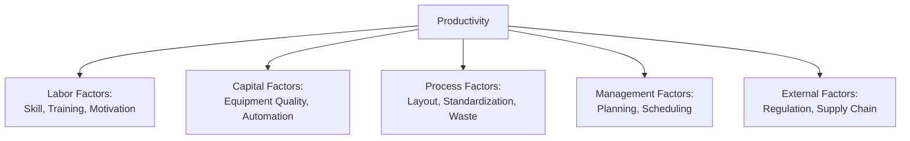

## Productivity Measurement and Analysis


### Definition

Productivity is a quantitative measure of operational efficiency, defined as the ratio of outputs produced to the inputs consumed in generating those outputs. It is one of the most fundamental performance metrics in operations management, used to evaluate, compare, and improve the effectiveness of resource utilization across processes, departments, and organizations.

$$Productivity = \dfrac{Output}{Input}$$

### Categories of Productivity Measures

**Key Points**

Productivity measures are classified based on the scope of inputs considered:

1. **Partial (single-factor) productivity**: measures output relative to a single input category.
2. **Multifactor productivity**: measures output relative to a combination (but not all) of input categories.
3. **Total factor productivity**: measures output relative to all inputs consumed in the process.

```mermaid
flowchart TD
    A[Productivity Measures]
    A --> B[Partial/Single-Factor
Productivity]
    A --> C[Multifactor
Productivity]
    A --> D[Total Factor
Productivity]
    B --> B1[Labor Productivity]
    B --> B2[Machine Productivity]
    B --> B3[Capital Productivity]
    B --> B4[Energy Productivity]
    C --> C1[Output / (Labor + Capital)]
    D --> D1[Output / (All Inputs Combined)]
```

### Partial Productivity Formulas

$$Labor \ Productivity = \dfrac{Output}{Labor \ Hours \ (or \ Labor \ Cost)}$$


$$Machine \ Productivity = \dfrac{Output}{Machine \ Hours}$$


$$Capital \ Productivity = \dfrac{Output}{Capital \ Invested}$$


$$Energy \ Productivity = \dfrac{Output}{Energy \ Consumed}$$

**Example**

A factory produces 5,000 units in a week using 500 labor hours.

$$Labor \ Productivity = \dfrac{5{,}000 \ units}{500 \ hours} = 10 \ units/hour$$

### Multifactor Productivity Formula

$$Multifactor \ Productivity = \dfrac{Output}{Labor + Capital + Materials + Energy}$$

**Example**

A workshop produces output valued at $50,000 in a month. Labor cost is $15,000, materials cost $10,000, and overhead (capital + energy) is $5,000.

$$Multifactor \ Productivity = \dfrac{\$50{,}000}{\$15{,}000 + \$10{,}000 + \$5{,}000} = \dfrac{\$50{,}000}{\$30{,}000} = 1.67$$

This indicates that for every $1 of combined input cost, $1.67 of output value is generated.

### Distinguishing Productivity from Related Concepts

| Concept | Definition | Formula |
| --- | --- | --- |
| Productivity | Ratio of output to input | $Output / Input$ |
| Efficiency | Actual output relative to standard/potential output | $\dfrac{Actual \ Output}{Standard \ Output} \times 100\%$ |
| Effectiveness | Degree to which goals/objectives are achieved | Not typically a single ratio; measured against objectives |
| Utilization | Proportion of available capacity/time actually used | $\dfrac{Time \ Used}{Time \ Available} \times 100\%$ |

[Inference] These terms are sometimes used loosely or interchangeably in casual business language, but in operations management they represent conceptually distinct measures, and confusing them can lead to misdiagnosing the root cause of a performance problem (e.g., a process can be highly efficient relative to its own standard yet still have low productivity if the standard itself is set at a low benchmark).

### Productivity Analysis Techniques

**Key Points**

1. **Trend analysis**: Tracking productivity over successive time periods to identify improvement or decline patterns.
2. **Benchmarking**: Comparing productivity metrics against industry standards, competitors, or best-in-class organizations.
3. **Variance analysis**: Comparing actual productivity against budgeted or planned productivity to identify gaps.
4. **Data Envelopment Analysis (DEA)**: A linear programming-based technique used to evaluate the relative efficiency of multiple decision-making units (e.g., branches, plants) that use similar inputs to produce similar outputs.
5. **Growth accounting**: An economic technique used at a macro level to decompose output growth into contributions from labor, capital, and total factor productivity (technology/efficiency gains).

[Inference] Data Envelopment Analysis is a more advanced, less commonly covered technique at the introductory level, typically found in graduate-level operations research or productivity economics coursework rather than foundational operations management courses.

### Factors Affecting Productivity

- **Labor factors**: skill level, training, motivation, workforce turnover, ergonomics
- **Capital factors**: quality and age of equipment, level of automation, maintenance practices
- **Process factors**: layout efficiency, method standardization, degree of waste (non-value-adding activity) in the process
- **Management factors**: quality of planning, scheduling accuracy, leadership effectiveness
- **External factors**: regulatory requirements, supply chain reliability, market/economic conditions



### Common Productivity Improvement Strategies

- **Process improvement**: eliminating non-value-adding steps (waste reduction, Lean methods)
- **Automation and technology investment**: substituting or augmenting manual labor with machinery, robotics, or software
- **Employee training and engagement**: improving skill levels and motivation to increase output per labor hour
- **Standardization**: reducing process variability to improve consistency and reduce rework
- **Better scheduling and capacity utilization**: minimizing idle time and bottlenecks

### Worked Multi-Period Example

A company tracks its multifactor productivity over three quarters (output in units, input in combined labor + material cost in $000s):

| Quarter | Output (units) | Input Cost ($000) | Multifactor Productivity (units/$000) |
| --- | --- | --- | --- |
| Q1 | 10,000 | 200 | 50.0 |
| Q2 | 10,500 | 200 | 52.5 |
| Q3 | 10,500 | 210 | 50.0 |

**Analysis**: Productivity improved from Q1 to Q2 (output increased with constant input cost), but declined back to the original level in Q3 (input cost rose without a corresponding output increase) — signaling a need to investigate whether the input cost increase in Q3 (e.g., a material price increase or added labor) is generating proportional value, or whether corrective action is needed.

### Productivity at the National/Macro Level

[Unverified — figures fluctuate and require current sourcing] Productivity is also measured at a national economic level (e.g., GDP per labor hour) and is commonly used by economists and policymakers as an indicator of a country's competitiveness and standard-of-living growth potential. This macro-level application uses the same fundamental output/input ratio logic as firm-level productivity measurement, extended to an entire economy.

### Common Pitfalls in Productivity Measurement

- **Ignoring quality**: A pure volume-based productivity increase that comes at the expense of quality (e.g., more units produced but with a higher defect rate) may not represent genuine improvement in value creation.
- **Choosing an inappropriate input base**: Labor productivity alone can be misleading if capital or automation substitution is not accounted for (e.g., productivity gains from new machinery may be misattributed to labor efficiency).
- **Short time horizons**: Measuring productivity over too short a period can be distorted by one-off events (e.g., equipment breakdowns, unusual demand spikes) rather than reflecting sustained performance.
- **Comparing non-comparable units**: Benchmarking productivity across facilities or organizations with different product mixes, automation levels, or market contexts can produce misleading conclusions.

### Conclusion

Productivity measurement and analysis provides operations managers with a quantitative basis for evaluating how effectively an organization converts inputs into outputs. By selecting appropriate partial, multifactor, or total factor productivity measures, and by using trend analysis and benchmarking to interpret results, organizations can identify where and how to focus improvement efforts — while remaining cautious of measurement pitfalls such as ignoring quality trade-offs or comparing non-comparable contexts.

**Related Topics**

- Efficiency versus effectiveness in operations
- Data Envelopment Analysis (DEA) for benchmarking
- Lean manufacturing and waste elimination
- Total Quality Management and its relationship to productivity
- Capacity utilization and its effect on productivity
- Standard time setting and work measurement techniques
- Growth accounting and macroeconomic productivity analysis