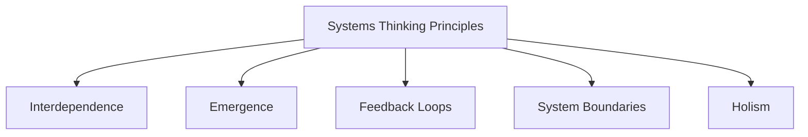
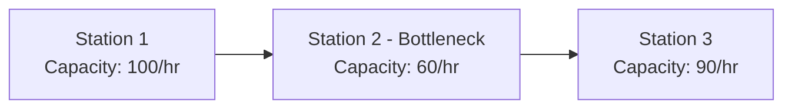
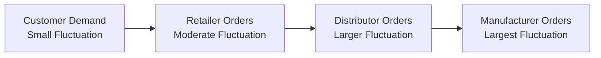

## Systems Thinking in Operations

### Definition

Systems thinking is an analytical approach that views an operation not as a collection of isolated, independent activities, but as an interconnected whole in which components interact with one another, with the wider organization, and with the external environment to produce outcomes. In operations management, systems thinking is used to understand how changes in one part of a process — a single workstation, a supplier relationship, a policy decision — ripple through and affect performance elsewhere in the system, often in non-obvious ways.

### Core Principles of Systems Thinking

**Key Points**

1. **Interdependence**: Components of an operation (people, processes, technology, information) do not function independently; a change in one element affects others.
2. **Emergence**: The behavior of the overall system cannot be fully understood or predicted by examining its individual parts in isolation — system-level outcomes "emerge" from the interactions between parts.
3. **Feedback loops**: Systems contain reinforcing (amplifying) and balancing (stabilizing) feedback loops that drive dynamic behavior over time.
4. **Boundaries**: Every system has a boundary distinguishing it from its environment; where that boundary is drawn affects what is considered "internal" versus "external" to the analysis.
5. **Holism over reductionism**: Systems thinking favors understanding the whole and its relationships, in contrast to a purely reductionist approach that optimizes individual parts without regard to the whole.

### Systems Thinking versus Reductionist (Silo) Thinking

| Dimension | Reductionist/Silo Approach | Systems Thinking Approach |
| --- | --- | --- |
| Unit of analysis | Individual department/process in isolation | Interconnected whole, including relationships between parts |
| Optimization target | Local optimum (e.g., maximize one department's efficiency) | Global optimum (overall system performance) |
| View of problems | Problems have a single, isolated root cause | Problems often arise from interactions and feedback across the system |
| Risk | Local improvements may harm overall performance (suboptimization) | Requires more complex analysis but avoids unintended trade-offs |

**Example**

A warehouse manager who maximizes labor efficiency by minimizing staff on the picking floor may inadvertently increase order fulfillment time and reduce downstream customer satisfaction — a classic case of **suboptimization**, where improving one subsystem in isolation degrades overall system performance.

### Feedback Loops in Operational Systems

**Key Points**

- **Reinforcing (positive) feedback loops**: amplify change in a consistent direction, often leading to exponential growth or decline if unchecked (e.g., a defect causes rework, rework causes delay, delay causes rushed work, rushed work causes more defects).
- **Balancing (negative) feedback loops**: counteract change and drive the system toward a stable equilibrium (e.g., inventory control systems that trigger reordering when stock falls below a threshold, restoring balance).

This loop illustrates a reinforcing feedback cycle sometimes referred to in Lean/quality literature as a "vicious cycle" — where without intervention, defect rates can escalate over successive cycles.

### The Systems Perspective Applied to Common Operations Trade-offs

- **Capacity vs. cost**: Increasing capacity in one part of a process (e.g., adding a machine at a bottleneck) affects flow, inventory levels, and cost throughout the entire system — not just at that single point.
- **Inventory vs. service level**: Reducing inventory to cut holding costs at one stage can increase stockout risk and disrupt downstream stages, illustrating why inventory decisions cannot be optimized station-by-station without considering the whole supply chain.
- **Quality vs. speed**: Rushing a process step to meet a deadline can introduce defects that require rework later, which may ultimately increase total cycle time — a systemic trade-off invisible if each step is evaluated only on its own local speed metric.

### Theory of Constraints as an Applied Systems Thinking Framework

**Key Points**

- The **Theory of Constraints (TOC)**, developed by Eliyahu Goldratt, is a widely taught operations management application of systems thinking, based on the premise that any system's overall performance (throughput) is limited by its single most binding constraint (the "bottleneck").
- TOC's **Five Focusing Steps**:
  1. **Identify** the system's constraint.
  2. **Exploit** the constraint (maximize its output without capital investment).
  3. **Subordinate** all other processes to support the constraint's schedule.
  4. **Elevate** the constraint (invest in additional capacity if needed).
  5. **Repeat** the process, since removing one constraint reveals a new one elsewhere in the system.

**Example**

In the diagram above, the overall system throughput is capped at 60 units/hour regardless of how efficient Stations 1 and 3 are, because Station 2 constrains total flow. A systems-thinking approach recognizes that improving Station 1 or Station 3 in isolation produces no system-level benefit until the constraint at Station 2 is addressed — a direct illustration of the difference between local optimization and system optimization.

### System Dynamics and the Bullwhip Effect

**Key Points**

- **System dynamics** is a modeling methodology (originated by Jay Forrester) used to simulate how feedback loops and time delays produce complex, sometimes counterintuitive behavior in operational and supply chain systems over time.
- A well-documented application is the **bullwhip effect**: small fluctuations in end-customer demand become progressively amplified as they propagate upstream through a supply chain (retailer to distributor to manufacturer to raw material supplier), due to factors such as order batching, demand forecasting practices, and lead-time delays.

[Inference] The bullwhip effect is one of the most commonly cited real-world demonstrations of systems thinking principles in supply chain and operations coursework, because it shows how locally rational decisions (e.g., each party ordering a safety buffer) can produce a highly volatile and inefficient outcome at the system level.

### Tools Used to Support Systems Thinking in Operations

- **Causal loop diagrams**: visualize reinforcing and balancing feedback relationships between variables in a system.
- **Value stream mapping**: traces the flow of materials and information across an entire process, exposing interdependencies and non-value-adding activity.
- **Process flowcharting**: maps sequential and interacting steps to reveal handoffs and dependencies between functions.
- **Simulation modeling**: used to model complex systems with multiple interacting variables and stochastic (random) elements, allowing "what-if" analysis without disrupting the real system.

### Why Systems Thinking Matters in Operations Management

- Prevents suboptimization, where local efficiency improvements unintentionally harm overall performance.
- Supports better root cause analysis, since problems in complex operations are frequently caused by interactions between multiple factors rather than a single isolated cause.
- Improves cross-functional decision-making, since operations decisions routinely affect and are affected by marketing, finance, HR, and supply chain functions.
- Provides the conceptual foundation for widely used operations frameworks, including the Theory of Constraints, Lean/value stream mapping, and supply chain dynamics analysis.

### Conclusion

Systems thinking reframes operations management from a collection of isolated tasks and departments into an interconnected whole shaped by interdependence, feedback loops, and emergent behavior. This perspective underlies major operations frameworks such as the Theory of Constraints and system dynamics modeling, and it directly explains real-world phenomena such as suboptimization and the bullwhip effect — making it a foundational lens for diagnosing and improving operational performance holistically rather than piecemeal.

**Related Topics**

- Theory of Constraints and the Five Focusing Steps
- The bullwhip effect in supply chain management
- Value stream mapping and Lean process analysis
- Causal loop diagramming techniques
- Simulation modeling in operations
- Suboptimization and local versus global optimization
- Process flow analysis and bottleneck identification