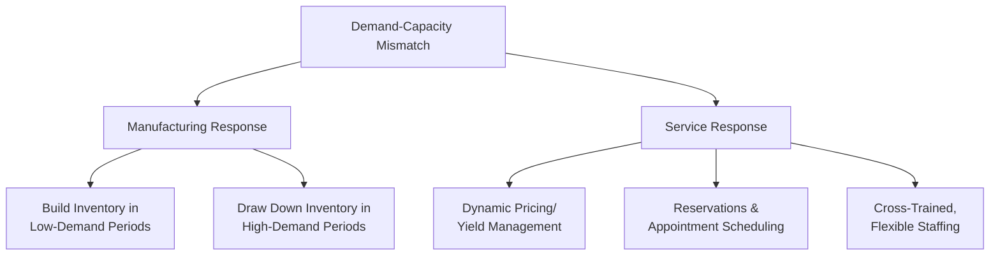
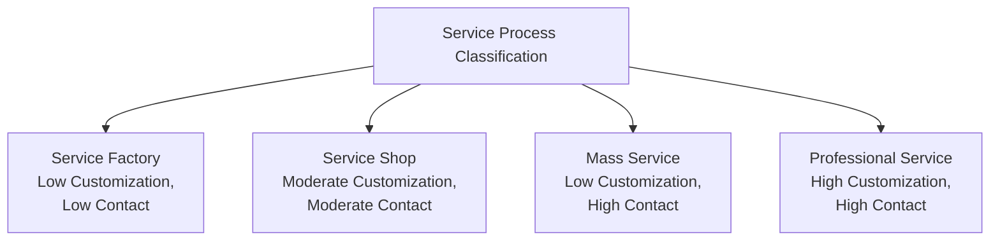

## Operations Management Across Manufacturing and Service Industries

### Definition

Operations management principles apply universally to any organization that transforms inputs into outputs, but the specific practices, priorities, and challenges differ substantially between manufacturing industries (producing physical goods) and service industries (delivering intangible experiences or performances). Understanding these cross-industry differences and similarities is essential for applying operations concepts appropriately in diverse organizational contexts.

### Shared Foundational Principles

**Key Points**

Despite operational differences, both manufacturing and service operations are governed by the same underlying frameworks:

- Both are modeled using the **input-transformation-output** system.
- Both are evaluated against the same core performance objectives: cost, quality, speed, dependability, and flexibility.
- Both require capacity planning, process design, scheduling, quality management, and workforce management.
- Both can apply process improvement methodologies such as Lean and Six Sigma, adapted to their respective contexts.

### Key Structural Differences

| Dimension | Manufacturing Operations | Service Operations |
| --- | --- | --- |
| Output nature | Tangible, storable goods | Intangible, perishable services |
| Customer contact | Typically low during production | Often high; customer present during delivery |
| Quality control timing | Can inspect before shipment | Often assessed only at/after point of delivery |
| Location strategy | Optimized for cost (labor, logistics) | Often must be near/accessible to customer |
| Capacity strategy | Inventory buffers demand fluctuations | Capacity must match real-time demand (no inventory buffer) |
| Output consistency | High, via automation and standardization | More variable, due to human involvement in delivery |
| Demand forecasting horizon | Can plan further ahead using inventory | Often requires shorter-term, more granular forecasting |

### Capacity Management: A Key Point of Divergence

**Key Points**

- **Manufacturing**: Capacity mismatches with demand can be buffered using finished-goods inventory — producing ahead of demand during slow periods and drawing down inventory during peaks.
- **Services**: Because service capacity is perishable (an empty hotel room or an idle call center agent cannot be "stored" for later use), service operations must rely on strategies to shift demand or capacity in real time, such as:
  - **Reservation systems**: pre-committing capacity to manage flow (restaurants, hotels, airlines)
  - **Yield/revenue management**: dynamic pricing to shift demand toward off-peak periods (airlines, hotels)
  - **Appointment scheduling**: spreading demand evenly across available time slots (healthcare, professional services)
  - **Flexible/cross-trained staffing**: shifting labor between tasks or locations based on real-time demand (retail, call centers)

### Quality Management Across Industries

**Key Points**

- **Manufacturing quality control**: relies heavily on statistical process control (SPC), inspection sampling, and defect-rate tracking at discrete points in the production line, often before the product reaches the customer.
- **Service quality control**: quality is frequently assessed by the customer in real time, during the service encounter itself — making it harder to inspect and correct before the customer perceives it. Tools such as the SERVQUAL model (measuring gaps between customer expectations and perceptions across reliability, responsiveness, assurance, empathy, and tangibles) are commonly used instead of physical defect sampling.

[Inference] This difference is a major reason service organizations invest heavily in staff training, scripting, and empowerment — since front-line employees often are the quality control mechanism in real time, unlike manufacturing where automated inspection can occur independently of the worker.

### Process Design Considerations

- **Manufacturing process types**: project, job shop, batch, assembly line, continuous flow — chosen based on production volume and product variety (see the product-process matrix).
- **Service process types**: often classified by degree of customer contact and customization, ranging from:
  - **Service factory** (low customization, low customer contact — e.g., airlines, package delivery)
  - **Service shop** (moderate customization and contact — e.g., hospitals, auto repair)
  - **Mass service** (low customization, high customer contact — e.g., retail, public transportation)
  - **Professional service** (high customization, high customer contact — e.g., legal counsel, consulting, medical specialists)

### Example: Manufacturing Operations — Automobile Plant

- Facility located based on labor cost, logistics access, and proximity to suppliers.
- Production scheduled using material requirements planning (MRP) systems.
- Quality controlled via in-line inspection and statistical sampling before vehicles leave the plant.
- Finished vehicle inventory buffers fluctuations between production rate and dealer demand.

### Example: Service Operations — Retail Bank Branch

- Facility located based on customer accessibility and foot traffic (not primarily cost-driven).
- Staffing scheduled around predictable daily/weekly customer traffic patterns (e.g., lunchtime rushes, month-end peaks).
- Quality assessed through customer wait time, transaction accuracy, and service interaction quality — measured in real time via customer satisfaction surveys, not pre-shipment inspection.
- No inventory buffer exists for "banking service capacity" — an idle teller during a slow period represents permanently lost capacity.

### Hybrid Operations: Manufacturing-Service Integration

**Key Points**

- Many modern organizations operate hybrid models that combine manufacturing and service elements, sometimes described under the umbrella of **servitization** — the strategic shift by manufacturers toward bundling services (maintenance contracts, monitoring, consulting) with their physical products.
- **Example**: An industrial equipment manufacturer that sells machinery (manufacturing operation) while also offering predictive maintenance monitoring and service contracts (service operation) built around the same product.

[Inference] Servitization has become an increasingly emphasized strategic theme in operations management literature, as manufacturers seek recurring revenue streams and deeper customer relationships beyond a single point-of-sale transaction, though the extent of adoption varies significantly by industry and firm size.

### Common Cross-Industry Metrics with Different Interpretations

| Metric | Manufacturing Interpretation | Service Interpretation |
| --- | --- | --- |
| Utilization | Machine/equipment usage rate | Staff/service channel usage rate (e.g., agent occupancy) |
| Cycle time | Time to produce one unit | Time to complete one customer service transaction |
| Defect rate | Physical product nonconformance | Service failure/complaint rate |
| Inventory | Physical stock of materials/finished goods | Often reinterpreted as "queue length" or "backlog" of waiting customers/work |

### Applying Lean and Six Sigma Across Both Contexts

- **Lean in manufacturing**: focuses on eliminating physical waste (excess inventory, motion, defects, overproduction) on the shop floor.
- **Lean in services** (sometimes called "Lean Service" or "Lean Office"): adapts the same waste-elimination principles to non-physical processes, such as reducing unnecessary approval steps, redundant data entry, or excessive wait times in administrative or customer-facing processes.
- **Six Sigma** is similarly adapted across both contexts, using the DMAIC (Define-Measure-Analyze-Improve-Control) framework to reduce variation, whether in a manufacturing defect rate or a service process error rate (e.g., billing errors, incorrect data entry).

### Conclusion

While manufacturing and service operations share the same foundational operations management framework — the transformation model and the core performance objectives — they diverge significantly in how capacity, quality, and process design must be managed, primarily due to the differences in output tangibility, storability, and customer contact intensity. Many contemporary organizations operate hybrid models blending both, requiring operations managers to apply manufacturing-oriented and service-oriented tools flexibly within the same organization.

**Related Topics**

- Goods versus services distinction
- Yield management and dynamic pricing strategies
- SERVQUAL and service quality measurement
- The product-process matrix
- Servitization strategy in manufacturing firms
- Lean Service and Lean Office applications
- Capacity planning for perishable versus storable outputs
- Service process classification (service factory, shop, mass service, professional service)