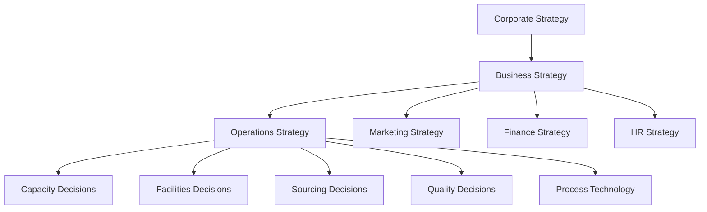
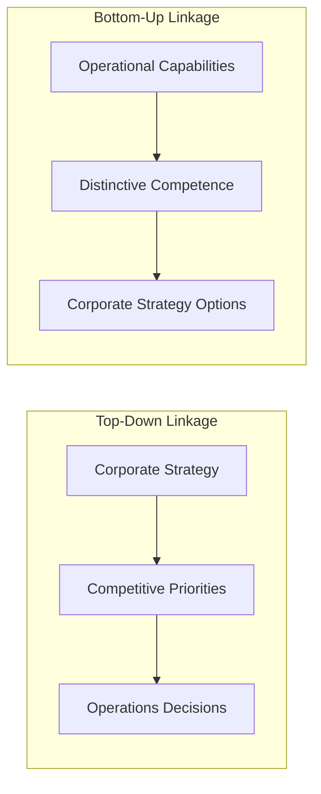
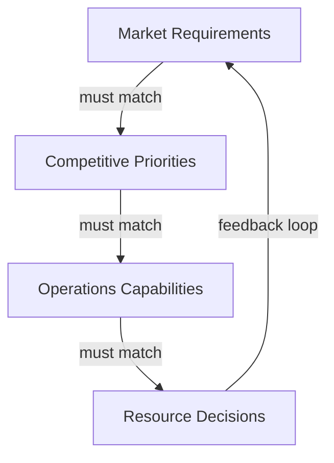

## Linking Corporate Strategy to Operations Strategy

### Overview

Linking corporate strategy to operations strategy is the process of translating high-level organizational direction into operational decisions and capabilities. Operations strategy sits between corporate strategy and daily operational activity, ensuring that decisions about processes, capacity, supply networks, and quality are not made in isolation but are deliberately shaped to support the organization's competitive goals.

### Strategic Hierarchy

**Key Points**

- **Corporate strategy**: Defines the overall direction of the organization — which businesses to compete in, how to allocate resources across business units, and long-term growth objectives.
- **Business strategy**: Defines how a specific business unit will compete within its industry (e.g., cost leadership, differentiation, focus).
- **Functional strategies**: Marketing, finance, HR, and operations strategies each translate the business strategy into decisions specific to their function.
- **Operations strategy**: Determines how the operations function will configure and deploy its resources to support the business strategy, typically expressed through decisions on capacity, facilities, technology, sourcing, human resources, quality, and process design.

### The Two-Way Linkage: Top-Down and Bottom-Up

Operations strategy is not purely a top-down translation exercise. Two complementary perspectives explain how corporate strategy and operations strategy connect.

#### Top-Down Perspective

In the top-down view, corporate and business strategy set competitive priorities, and operations is tasked with organizing itself to deliver them. If a business strategy calls for differentiation through product innovation, operations must prioritize flexibility and new-product introduction speed over pure cost minimization.

#### Bottom-Up (Resource-Based) Perspective

In the bottom-up view, an organization's operational capabilities — its accumulated experience, technology, and process know-how — can themselves shape or constrain what corporate strategy is feasible. A firm with a uniquely efficient distribution network may pursue a corporate strategy of rapid geographic expansion precisely because operations already has that capability. This is closely tied to the **resource-based view (RBV)** of strategy, where valuable, rare, inimitable, and non-substitutable (VRIN) operational resources become a source of sustained competitive advantage.

**Key Points**

- Top-down: strategy shapes operations.
- Bottom-up: operations capability shapes what strategy is possible.
- Mature operations strategy frameworks (e.g., Hayes and Wheelwright's Four-Stage Model) treat this as bidirectional rather than one-directional.

### Competitive Priorities (Order Winners and Order Qualifiers)

Operations strategy is operationalized through **competitive priorities**, commonly grouped into four to five categories:

1. **Cost** — ability to produce and deliver at low cost.
2. **Quality** — consistency (conformance quality) and performance (design quality).
3. **Speed** — delivery speed and time-to-market.
4. **Flexibility** — volume flexibility, mix flexibility, and new-product flexibility.
5. **Dependability** — reliability of delivery promises.

Terry Hill's framework distinguishes:

- **Order winners**: Criteria that directly win business (differentiate the firm from competitors).
- **Order qualifiers**: Criteria that must meet a minimum threshold just to be considered by the customer, but do not by themselves win orders.

**Example**

A hospital equipment manufacturer may treat regulatory compliance and baseline quality as order qualifiers (mandatory, non-negotiable), while delivery speed and customization flexibility act as order winners that differentiate it from competitors in customer selection.

### Trade-offs Concept

Classical operations strategy theory (Skinner, 1969) argues that a plant or process cannot excel simultaneously at all competitive priorities — improving one (e.g., flexibility) often comes at the expense of another (e.g., cost efficiency), producing a **trade-off curve**.

$$\text{Performance}_{\text{cost}} = f(\text{Performance}_{\text{flexibility}}, \text{Performance}_{\text{quality}}, \ldots)$$

More recent views (influenced by lean and Toyota Production System practice) argue that some trade-offs can be overcome through better process design and technology (the "sand cone model," where quality, dependability, speed, and cost improvements are cumulative and mutually reinforcing rather than strictly competitive). Both views remain relevant depending on process maturity and industry context. [Inference: the degree to which trade-offs can be eliminated versus merely shifted is contested in the literature and varies by industry and technology maturity.]

### The Four-Stage Model of Operations Strategy Role (Hayes & Wheelwright)

This model describes how the strategic role of operations evolves within an organization:

| Stage | Role of Operations | Characteristic |
| --- | --- | --- |
| Stage 1 | Internally Neutral | Operations minimizes negative impact; reactive, avoids mistakes |
| Stage 2 | Externally Neutral | Operations matches industry practice; benchmarks against competitors |
| Stage 3 | Internally Supportive | Operations strategy is clearly linked to business strategy |
| Stage 4 | Externally Supportive | Operations is a source of competitive advantage; leads strategy formulation |

**Key Points**

- Stage 1–2 organizations treat operations as a cost center to be controlled.
- Stage 3–4 organizations treat operations as a strategic asset that actively shapes competitive positioning.
- Moving from Stage 3 to Stage 4 reflects the bottom-up linkage described earlier.

### Content Areas of Operations Strategy

Operations strategy decisions are typically grouped into **structural** and **infrastructural** categories:

**Structural Decisions** (long-term, capital-intensive, harder to reverse)

- Capacity: amount, timing, and type of capacity
- Facilities: size, location, and specialization of plants/sites
- Process technology: degree of automation, process choice (job shop, batch, line, continuous)
- Vertical integration: make-or-buy, degree of backward/forward integration

**Infrastructural Decisions** (shorter-term, organizational and systems-based)

- Workforce policies: staffing, skills, compensation, involvement
- Quality systems: standards, control approaches, continuous improvement
- Planning and control systems: production planning, inventory policy, scheduling
- Organization: structure, roles, and decision authority within operations
- New product/service development process

### Alignment Framework: Strategy-Operations Fit

A useful way to assess linkage is checking consistency across four elements:

**Key Points**

- **Market requirements** define what customers actually need (order winners/qualifiers).
- **Competitive priorities** translate market requirements into operations objectives.
- **Operations capabilities** are what the operations function can currently deliver.
- **Resource decisions** (structural and infrastructural) close gaps between required and current capability.
- Misalignment at any link in this chain results in strategic drift, where operations either overinvests in capabilities the market does not value or underinvests in capabilities the market requires.

### Example: Applying the Linkage

**Example**

A furniture retailer's corporate strategy shifts toward rapid e-commerce growth and same-week delivery as a differentiator.

- **Business strategy**: Compete on convenience and speed rather than lowest price.
- **Operations strategy implications**:
  - Capacity: Add regional micro-fulfillment centers rather than a single centralized warehouse.
  - Process technology: Invest in automated pick-and-pack systems to reduce order-processing time.
  - Sourcing: Shift toward suppliers capable of smaller, more frequent replenishment batches.
  - Workforce: Cross-train staff for flexible shift coverage during demand peaks.
  - Quality system: Emphasize order-accuracy metrics (a qualifier) while promoting delivery speed (the order winner).

This shows the full chain: corporate strategy (growth via e-commerce) → business strategy (compete on speed) → operations strategy (capacity, technology, sourcing decisions) → daily operational execution.

### Common Failure Modes in Linkage

**Key Points**

- **Strategy-operations gap**: Corporate strategy is set without consulting operations capability, leading to unrealistic commitments (e.g., promising mass customization without flexible process technology).
- **Operations myopia**: Operations optimizes for internal efficiency metrics (e.g., machine utilization) that do not align with the market-facing competitive priority (e.g., delivery speed).
- **Inconsistent decisions**: Structural decisions (e.g., centralized facility for cost efficiency) conflict with infrastructural decisions (e.g., empowering local teams for fast customer response).
- **Static strategy in dynamic markets**: Operations strategy is not revisited as market requirements shift, causing capability to lag behind competitive necessity. [Inference: the severity of this failure mode is context-dependent and tends to be more pronounced in industries with fast-changing customer expectations, such as consumer electronics or e-commerce.]

### Related Topics

- Competitive priorities and order-winner/order-qualifier analysis
- Hayes & Wheelwright Four-Stage Model (deep dive)
- Resource-based view (RBV) and core competencies in operations
- Process choice and the product-process matrix
- Capacity strategy and facility location decisions
- Trade-off theory vs. the sand cone model
- Supply chain strategy alignment (lean vs. agile vs. leagile)
- Operations strategy formulation frameworks (Hill's framework, Platts-Gregory procedure)