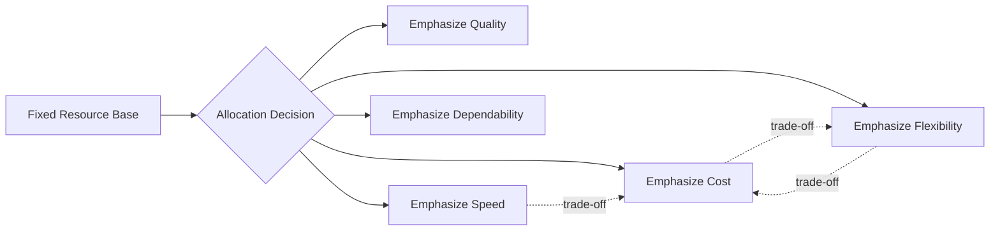
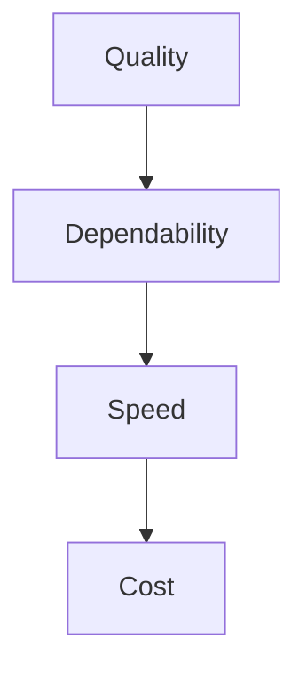

## Competitive Priorities: Cost, Quality, Speed, Flexibility, Dependability

### Overview

Competitive priorities are the specific performance dimensions an operations function chooses to emphasize in order to support the organization's competitive strategy. They translate abstract strategic intent (e.g., "compete on differentiation") into concrete, measurable operational objectives. The five classical categories are cost, quality, speed, flexibility, and dependability, though some frameworks subdivide these further (e.g., separating design quality from conformance quality, or delivery speed from delivery reliability).

### The Five Core Priorities

#### Cost

**Key Points**

- Definition: The ability to produce and deliver goods or services at the lowest possible cost while maintaining acceptable margins.
- Sub-dimensions: Low production cost, low overhead cost, capital productivity, labor productivity.
- Achieved through: Economies of scale, process standardization, automation, waste elimination (lean methods), supplier cost management, and efficient capacity utilization.
- Common metrics: Cost per unit, cost of goods sold (COGS) as a percentage of revenue, overhead absorption rate, labor cost per unit of output.

$$\text{Cost per unit} = \frac{\text{Total Operating Cost}}{\text{Units Produced}}$$

**Example**

A generic pharmaceutical manufacturer competes primarily on cost because its products are chemically equivalent to branded alternatives; the ability to produce at the lowest cost per tablet directly determines its ability to win contracts against other generic producers.

#### Quality

**Key Points**

- Two distinct sub-dimensions:
  - **Design quality**: The degree to which product/service specifications meet customer needs (features, performance, aesthetics, durability).
  - **Conformance quality**: The degree to which the delivered product/service meets its own design specifications consistently (defect rates, process capability).
- Achieved through: Statistical process control (SPC), Total Quality Management (TQM), Six Sigma methodologies, robust design (Taguchi methods), supplier quality certification.
- Common metrics: Defects per million opportunities (DPMO), first-pass yield, customer satisfaction scores, warranty/return rates, process capability index ($C_{pk}$).

$$C_{pk} = \min\left(\frac{USL - \mu}{3\sigma}, \frac{\mu - LSL}{3\sigma}\right)$$

**Example**

A semiconductor fabrication plant treats conformance quality as an order qualifier — a single defect rate outside tolerance can render an entire wafer batch unsellable — making process capability monitoring a core operational priority rather than a discretionary improvement initiative.

#### Speed

**Key Points**

- Sub-dimensions:
  - **Delivery speed**: Elapsed time between order placement and order fulfillment.
  - **Development speed**: Time-to-market for new products or services.
  - **Throughput speed**: Cycle time within the production or service process itself.
- Achieved through: Process redesign to reduce non-value-added time, cellular manufacturing, concurrent engineering, reduced setup/changeover times (SMED), inventory positioning strategies (e.g., postponement).
- Common metrics: Order lead time, manufacturing cycle time, time-to-market, throughput time.

$$\text{Throughput Time} = \text{Processing Time} + \text{Inspection Time} + \text{Move Time} + \text{Queue Time}$$

**Example**

A fast-casual restaurant chain prioritizes speed by designing kitchen layouts and standardized recipes specifically to minimize the time between order placement and food delivery, since customer choice in that segment is heavily influenced by perceived wait time.

#### Flexibility

**Key Points**

- Sub-dimensions:
  - **Volume flexibility**: Ability to rapidly increase or decrease output in response to demand fluctuations.
  - **Mix flexibility**: Ability to produce a wide variety of products/services using the same resources.
  - **New-product flexibility**: Ability to introduce new products or modify existing ones quickly.
  - **Routing/process flexibility**: Ability to reroute work through alternative process paths when disruptions occur.
- Achieved through: Modular product design, flexible/reconfigurable manufacturing systems, cross-trained workforce, general-purpose equipment, agile supply chain contracts.
- Common metrics: Changeover/setup time, product mix breadth, time to ramp production up or down, percentage of workforce cross-trained.

**Example**

A contract electronics manufacturer that serves many client brands on the same production lines relies on mix flexibility — quick changeovers and modular tooling — to profitably run small, varied batches for different customers without dedicating separate lines to each.

#### Dependability

**Key Points**

- Definition: The ability to deliver products or services consistently as promised — on time, in the correct quantity, and to the agreed specification.
- Distinct from speed: Dependability concerns consistency and reliability of delivery promises, not the absolute speed of delivery. A slower but perfectly reliable delivery can outperform a faster but inconsistent one in dependability terms.
- Achieved through: Robust planning and scheduling systems, safety stock and buffer management, supplier reliability programs, preventive maintenance to avoid unplanned downtime.
- Common metrics: On-time delivery rate (OTD), order fill rate, schedule adherence, mean time between failures (MTBF) for equipment reliability.

$$\text{On-Time Delivery Rate} = \frac{\text{Orders Delivered On Time}}{\text{Total Orders Delivered}} \times 100\%$$

**Example**

An industrial equipment supplier to automotive assembly plants prioritizes dependability above raw speed, since a single late delivery can halt an entire customer assembly line; contracts often include penalty clauses tied explicitly to on-time performance rather than delivery speed alone.

### Comparative Summary

| Priority | Primary Focus | Typical Metric | Example Trade-off Partner |
| --- | --- | --- | --- |
| Cost | Minimizing resource consumption | Cost per unit | Often trades off against flexibility |
| Quality | Meeting/exceeding specifications | Defect rate, $C_{pk}$ | Can trade off against speed if inspection adds time |
| Speed | Minimizing elapsed time | Lead time, cycle time | Often trades off against cost (expediting is costly) |
| Flexibility | Adapting to variation | Changeover time, mix breadth | Often trades off against cost (idle capacity, generalist equipment) |
| Dependability | Consistency of delivery promise | On-time delivery rate | Can trade off against cost (buffer inventory, slack capacity) |

### Interrelationships and the Trade-off Debate

Classical operations strategy (Skinner) holds that these priorities compete for the same finite resources, forcing an organization to choose which to emphasize — a plant "cannot do everything well simultaneously." This is visualized as a trade-off frontier.

An alternative view, the **sand cone model** (Ferdows & De Meyer), argues that certain priorities build cumulatively rather than competing: improvements in quality provide the foundation for improvements in dependability, which enable improvements in speed, which in turn enable cost reduction — implying a sequential, mutually reinforcing build rather than a strict zero-sum trade-off. [Inference: the applicability of the cumulative model versus the strict trade-off model is contingent on process maturity, technology, and industry context, and remains an area of ongoing debate in the operations strategy literature.]

### Order Winners and Order Qualifiers Applied to Priorities

**Key Points**

- Not all five priorities carry equal weight in every market; a firm must identify which priorities function as **order qualifiers** (minimum threshold to be considered) versus **order winners** (the factor that actually secures the sale).
- The same priority can be a qualifier in one market segment and a winner in another. Delivery dependability may be a baseline qualifier in commodity retail but an order winner in aerospace parts supply.
- Misidentifying a qualifier as a winner (over-investing in it) wastes resources; misidentifying a winner as a qualifier (under-investing in it) loses business.

### Practical Application Framework

**Example**

To determine competitive priorities for a given business unit, operations managers typically follow this sequence:

1. Identify target market segments and their specific requirements.
2. Classify each requirement as an order winner, order qualifier, or a criterion of lesser importance.
3. Rank the five priorities (cost, quality, speed, flexibility, dependability) by relative importance to that segment.
4. Assess current operational performance against each ranked priority (gap analysis).
5. Direct structural and infrastructural investment decisions toward closing gaps in order-winning priorities first.

### Related Topics

- Order winners vs. order qualifiers (Terry Hill's framework)
- Trade-off theory vs. the sand cone model in depth
- Process choice and the product-process matrix
- Total Quality Management (TQM) and Six Sigma methodologies
- Flexible manufacturing systems (FMS) and reconfigurable production
- Lead time reduction and Single-Minute Exchange of Die (SMED)
- Capacity strategy and demand management
- Service operations and the SERVQUAL quality dimensions