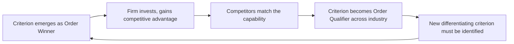

## Order Winners Versus Order Qualifiers

### Overview

Order winners and order qualifiers form a framework, developed by Terry Hill, for classifying the competitive criteria that determine whether a customer selects one supplier's product or service over another's. The framework distinguishes between the minimum performance thresholds a firm must meet simply to be considered ("qualifiers") and the specific criteria that actually secure the purchase decision ("winners"). This distinction guides where operations should focus scarce improvement resources.

### Core Definitions

**Key Points**

- **Order qualifiers**: Criteria on which a firm's performance must meet a minimum acceptable level for the customer to even consider it as a potential supplier. Performing above the threshold on a qualifier does not, by itself, win additional business.
- **Order winners**: Criteria that directly and decisively influence the customer's final purchase decision among the set of qualified suppliers. Improving performance on an order winner directly increases the probability of winning the sale.
- **Order losers (less-important criteria)**: Some frameworks add a third category for criteria that have negligible influence on the purchase decision in a given market, to avoid misallocating resources toward attributes customers do not actually value.

```mermaid
flowchart TD
    A[All Competitive Criteria] --> B{Does it meet minimum threshold?}
    B -->|No| C[Firm is disqualified from consideration]
    B -->|Yes| D[Firm qualifies as a candidate supplier]
    D --> E{Does performance on this criterion determine the sale?}
    E -->|Yes| F[Order Winner]
    E -->|No| G[Order Qualifier]
```

### Qualifiers Versus Winners: Behavioral Distinction

**Key Points**

- A qualifier behaves like a **threshold function**: performance below the minimum eliminates the firm from consideration entirely; performance above the minimum yields little or no additional benefit in the customer's decision.
- A winner behaves like a **continuous, monotonic function**: incremental improvements continue to increase the likelihood of winning the order, at least within a relevant range.
- This means investment logic differs sharply: for a qualifier, the goal is to reach and maintain the threshold at the lowest possible cost; for a winner, continued investment beyond the threshold produces genuine competitive return.

$$P(\text{win} \mid \text{criterion } i) = \begin{cases} 0 & \text{if performance} < \text{threshold}_i \text{ (qualifier)} \\ f(\text{performance}) & \text{if criterion } i \text{ is an order winner} \end{cases}$$

### Relationship to Competitive Priorities

**Key Points**

- Order winners and qualifiers are the market-facing lens through which the five competitive priorities (cost, quality, speed, flexibility, dependability) are prioritized for a specific market segment.
- The same competitive priority can function as a qualifier in one segment and a winner in another; classification is always market- and segment-specific, never a fixed, universal ranking.
- A firm serving multiple market segments may need distinct order-winner/qualifier profiles for each segment, which in turn can require distinct operational configurations (this is one justification for focused factories or dedicated service channels per segment).

### Example: Segment-Specific Classification

**Example**

Consider a company manufacturing industrial fasteners, selling into two segments:

| Criterion | Segment A: General Construction | Segment B: Aerospace Components |
| --- | --- | --- |
| Price | Order winner | Order qualifier (must be competitive, but not decisive) |
| Basic conformance quality | Order qualifier | Order qualifier |
| Certification/traceability documentation | Less important | Order winner |
| Delivery dependability | Order qualifier | Order winner |
| Delivery speed | Order winner | Order qualifier |

In Segment A, customers select suppliers primarily on price and speed once a baseline quality bar is cleared. In Segment B, aerospace customers require rigorous traceability and dependability as decisive factors, with price serving only as a qualifying threshold rather than the deciding criterion. Operations strategy — capacity allocation, quality system investment, documentation infrastructure — should differ materially between the two segments.

### Dynamic Nature of Qualifiers and Winners

**Key Points**

- Order winners tend to migrate into order qualifiers over time as an entire industry adopts a capability, a phenomenon sometimes called **qualifier drift** or **competitive convergence**. A feature that once differentiated a firm (e.g., next-day delivery) can become a baseline expectation once most competitors match it.
- This dynamic requires operations strategy to be periodically reassessed rather than treated as a one-time classification exercise; a criterion correctly classified as a winner five years ago may now only qualify a supplier for consideration.
- Firms that fail to reassess risk **over-investing** in a criterion that no longer differentiates them, while **under-investing** in the newly emerging order winner.

### Using the Framework: Practical Procedure

**Example**

A typical application procedure (based on Hill's methodology) follows these steps:

1. Segment the market into groups of customers with genuinely distinct purchasing criteria (segmenting by product line alone is often insufficient; purchasing behavior should drive the segmentation).
2. For each segment, list all criteria customers use to evaluate suppliers (price, quality, lead time, flexibility, service level, technical support, etc.).
3. Survey or interview actual customers (not assume internally) to classify each criterion as a qualifier, winner, or less important, and to identify minimum thresholds for qualifiers.
4. Benchmark current operational performance against competitors on each criterion.
5. Prioritize operations investment toward closing gaps on order winners first, and toward efficiently meeting (not exceeding) thresholds on qualifiers.
6. Reassess periodically, since qualifier drift can shift the classification over the product/service life cycle.

### Common Misapplications

**Key Points**

- **Gold-plating qualifiers**: Investing heavily to exceed a qualifier's threshold (e.g., driving defect rates far below what customers can perceive or value) diverts resources from criteria that would actually win orders.
- **Internally-driven classification**: Classifying criteria based on what operations believes is important, rather than validated customer research, is a frequent source of strategic misalignment.
- **Treating the classification as permanent**: Failing to revisit classifications as markets, competitors, and customer expectations evolve.
- **Uniform treatment across segments**: Applying a single order-winner/qualifier profile across a diversified customer base when segments actually have materially different purchasing criteria.

### Related Topics

- Competitive priorities: cost, quality, speed, flexibility, dependability
- Market segmentation for operations strategy
- Focused factory concept and plant-within-a-plant strategies
- Product/service life cycle and shifting competitive requirements
- Terry Hill's operations strategy formulation framework
- Platts-Gregory procedure for operations strategy audit
- Voice of the Customer (VOC) methods in operations strategy formulation