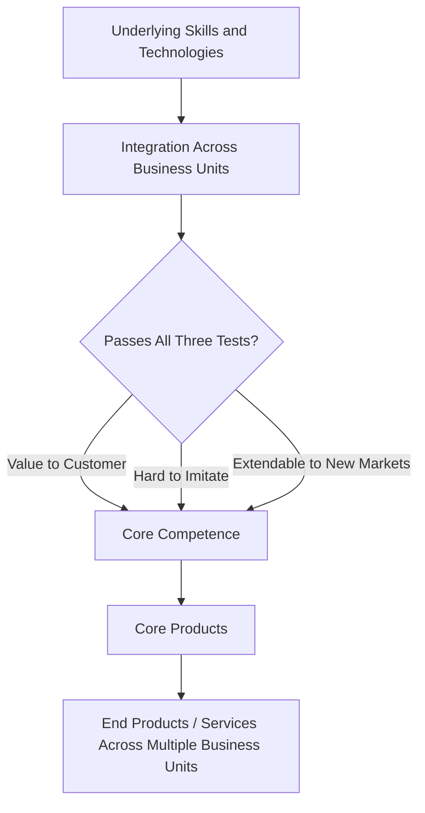
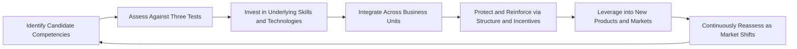

## Core Competencies and Capability Building

### Overview

Core competencies are the distinctive, hard-to-replicate skills, knowledge bases, and integrated capabilities that allow an organization to deliver disproportionate value relative to competitors. In operations strategy, identifying and deliberately building core competencies shifts operations from a passive executor of predetermined strategy into an active source of competitive advantage — the bottom-up linkage between operational capability and corporate strategy.

### Defining Core Competence

**Key Points**

- Coined and developed primarily by Prahalad and Hamel (1990), a core competence is defined by three tests:
  1. **Value to the customer**: It contributes disproportionately to the value customers perceive in the end product or service.
  2. **Competitive differentiation**: It is difficult for competitors to imitate.
  3. **Extendability**: It provides potential access to a range of markets, not just a single product line.
- A core competence is distinct from a single skill, technology, or asset — it is typically a **bundle of skills and technologies** integrated across organizational units, not something that resides in a single department or product.
- Core competencies are organizational, not individual: they persist even as specific employees or products change, because they are embedded in processes, routines, and collective knowledge.

### Core Competencies Versus Core Capabilities Versus Resources

**Key Points**

- **Resources**: The basic inputs available to a firm — tangible (equipment, facilities, capital) and intangible (patents, brand, reputation). Resources alone do not confer advantage; they must be deployed effectively.
- **Capabilities**: The organization's capacity to deploy resources purposefully, usually through combinations of people, processes, and technology, to accomplish a specific task (e.g., "rapid new product development capability").
- **Core competencies**: A subset of capabilities that meet the three tests above (customer value, imitation difficulty, extendability) and represent the firm's most strategically significant, integrated capabilities.
- This hierarchy is closely tied to the **resource-based view (RBV)** of strategy, particularly the VRIN criteria (Valuable, Rare, Inimitable, Non-substitutable), which formalizes when a resource or capability becomes a genuine source of sustained competitive advantage.

| Level | Description | Example |
| --- | --- | --- |
| Resource | Basic input | CNC machining equipment |
| Capability | Organized use of resources | Precision machining process |
| Core Competence | Integrated, hard-to-imitate, extendable capability | Miniaturization and precision engineering across multiple product categories |

### Distinctive Competence in Operations Strategy

**Key Points**

- Terry Hill's operations strategy framework uses the related term **distinctive competence**: the capability that operations possesses which competitors find difficult to match, and which management should deliberately protect and leverage rather than dilute across too many priorities.
- Distinctive competence directly informs the bottom-up perspective in strategy linkage: if operations already has an unusually strong distinctive competence (e.g., an unmatched changeover-time reduction capability), corporate strategy can be shaped to exploit it (e.g., pursuing highly customized, small-batch market segments).
- Distinctive competence should be explicitly identified through internal audit and competitor benchmarking, not assumed.

### Capability Building: The Process

Building a core competence is a deliberate, long-term organizational process rather than a one-time acquisition.

**Key Points**

- **Identification**: Conduct internal audits of skills, technologies, and processes that recur across successful products or services, and validate against the customer-value and imitation-difficulty tests.
- **Deliberate investment**: Core competencies typically require sustained investment over years, not quarters — a firm cannot "outsource its way" into a core competence, since outsourcing the underlying activity often severs the accumulation of tacit knowledge that makes it hard to imitate.
- **Cross-functional integration**: Because a competence is a bundle of skills spanning multiple units, capability building requires structures (cross-functional teams, shared platforms, common R&D infrastructure) that prevent competencies from being trapped within a single business unit's silo.
- **Protection**: Firms must avoid fragmenting a core competence by allowing individual business units to make sourcing or investment decisions (e.g., outsourcing a critical process for short-term cost savings) that erode the competence at the corporate level.
- **Leverage and extension**: Once established, a core competence should be deliberately leveraged into new products, services, or markets to maximize return on the investment required to build it.

### Learning Curve and Experience Effects in Capability Building

**Key Points**

- Capability building is closely linked to the **learning curve** (or experience curve) effect: unit costs and performance improve predictably as cumulative production volume increases, driven by accumulated tacit knowledge, process refinement, and workforce learning.
- The learning curve is often modeled as:

$$C_n = C_1 \cdot n^{\log_2(r)}$$

where $C_n$ is the cost of the $n$-th unit, $C_1$ is the cost of the first unit, $n$ is the cumulative unit count, and $r$ is the learning rate (e.g., $r = 0.85$ for an "85% learning curve," meaning unit cost falls by 15% each time cumulative volume doubles).

- Sustained capability building compounds this effect: a firm that continuously invests in a competence not only starts from a stronger base but also accumulates experience faster relative to competitors entering later, widening the gap over time.

### Example: Capability Building in Practice

**Example**

A contract manufacturer initially specializing in plastic injection molding for consumer electronics housings systematically builds a core competence in **precision tooling and rapid mold-change engineering**. Over several years, it invests in:

- Standardized, modular tooling platforms reusable across customer projects.
- A dedicated internal tooling-design team (rather than outsourcing mold design).
- Process documentation and cross-training so tooling knowledge is organizationally embedded, not held by a few individuals.

This competence, once mature, is deliberately extended beyond consumer electronics into automotive interior components and medical device housings — markets that share the same underlying need for precision tooling and fast changeover, demonstrating the "extendability" test. Competitors attempting to enter these markets face a multi-year gap in tooling expertise, satisfying the "hard to imitate" test.

### Risks and Failure Modes

**Key Points**

- **Competence rigidity (core rigidity)**: A competence that was once a source of advantage can become a liability if the organization over-relies on it and fails to adapt as market requirements shift — the same routines that enabled success can create blind spots and resistance to change.
- **Over-diversification dilution**: Extending a competence into markets that do not genuinely share the underlying skill base dilutes focus and investment without delivering the value or differentiation the framework requires.
- **Outsourcing erosion**: Outsourcing activities central to a core competence for short-term cost savings can permanently degrade the tacit, accumulated knowledge that made the competence hard to imitate in the first place. [Inference: the degree of erosion depends on how tightly the outsourced activity is coupled to the tacit knowledge base, and is more severe for competencies built on accumulated process experience than for those built on codified, transferable technology.]
- **Misidentification**: Treating a widely available capability (one that fails the imitation-difficulty test) as a core competence leads to strategic overconfidence and misallocated investment.

### Related Topics

- Resource-based view (RBV) of the firm and VRIN criteria
- Distinctive competence in Terry Hill's operations strategy framework
- Learning curve and experience curve effects
- Make-or-buy and vertical integration decisions
- Dynamic capabilities and organizational adaptability
- Linking corporate strategy to operations strategy (bottom-up perspective)
- Cross-functional integration and organizational design for operations