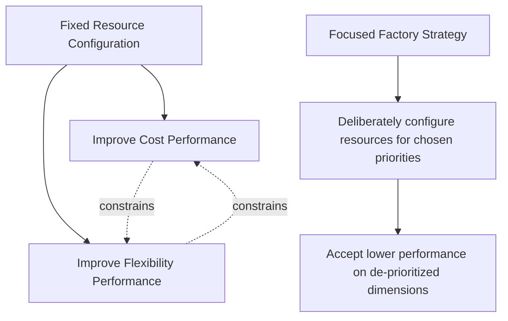
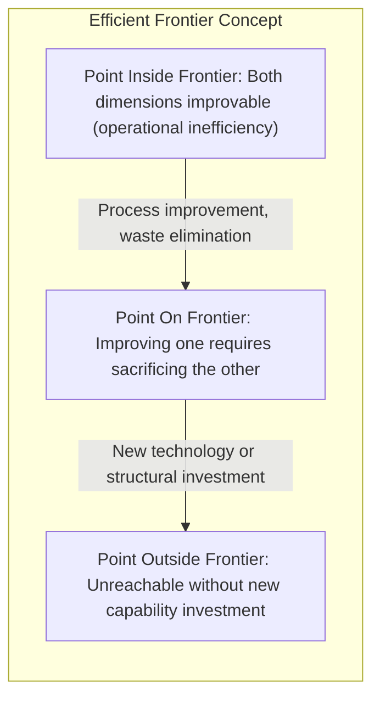
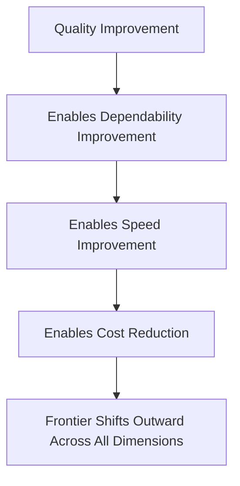

## Strategic Trade-offs and the Efficient Frontier

### Overview

Strategic trade-offs describe the inherent tension operations managers face when attempting to improve multiple competitive priorities simultaneously with a fixed configuration of resources, technology, and processes. The **efficient frontier** concept, adapted from economics and popularized in operations strategy through the work of Michael Porter and, in operations-specific form, through process-choice and capacity-utilization models, visualizes the maximum achievable combination of performance on two competing dimensions given current operational capability.

### The Concept of Trade-offs in Operations

**Key Points**

- Wickham Skinner's foundational argument (1969) holds that a factory or process cannot simultaneously be the best at every competitive priority — pursuing excellence in one dimension (e.g., low cost) typically requires sacrificing performance in another (e.g., flexibility), because the resource configurations, equipment, and workforce practices that optimize one priority often conflict with those that optimize another.
- Trade-offs occur both **within** a single production system (a general-purpose machine trades off speed for flexibility versus a dedicated machine) and **across** the operations decision areas (capacity, process technology, workforce, quality systems).
- The practical implication is the **focused factory** concept: rather than attempting to be good at everything, a facility should be deliberately configured to excel at the specific priorities that matter most for its target market segment.

### The Efficient Frontier Model

**Key Points**

- The efficient frontier represents the set of operating points at which it is impossible to improve performance on one competitive priority without degrading performance on another, given the current process technology and resource base.
- Points **on** the frontier represent efficient configurations — the firm is already extracting the maximum possible combined performance from its current capabilities.
- Points **inside** the frontier (below and to the left) represent inefficient operations — improvement on one or both dimensions is achievable without sacrificing the other, typically through better process design, waste elimination, or improved coordination, rather than new capital investment.
- Points **outside** the frontier are unreachable with current capability; reaching them requires a genuine shift in the frontier itself (new technology, new process architecture, structural investment) rather than incremental operational improvement.

$$\text{Frontier: } g(\text{Priority}_1, \text{Priority}_2) = k$$

where $k$ represents the maximum achievable combined performance given the current technology and resource constraints, and any point satisfying $g(\cdot) < k$ lies inside the frontier (improvable without trade-off).

### Shifting the Frontier Versus Moving Along It

**Key Points**

- **Moving along the frontier**: A firm already at the efficient boundary chooses to reallocate emphasis — for example, accepting a higher unit cost to gain faster delivery speed — without changing its underlying technology or process architecture. This is a strategic positioning choice, not a capability improvement.
- **Shifting the frontier outward**: A firm invests in new process technology, automation, workforce skill development, or process redesign (e.g., adopting flexible manufacturing systems, implementing lean principles) that genuinely expands what combinations of performance are achievable. This is the mechanism by which the classical Skinner trade-off view and the more modern "trade-offs can be overcome" view are reconciled: the frontier itself can move, even though at any given moment, movement along the existing frontier still involves trade-offs.
- Distinguishing between "we are choosing to accept a trade-off" and "we are inefficient and leaving performance on the table" is a critical diagnostic step before committing to new capital investment.

### The Sand Cone Model as a Frontier-Shifting Mechanism

**Key Points**

- The sand cone model (Ferdows & De Meyer) proposes that certain capability investments — beginning with quality, then dependability, then speed, then cost — build cumulatively and can shift the frontier outward across multiple dimensions simultaneously, rather than requiring a strict trade-off.
- This reframes some apparent "trade-offs" as artifacts of an unshifted frontier (operational inefficiency) rather than genuine physical or economic constraints.
- Lean manufacturing and Toyota Production System practices are frequently cited as empirical evidence that simultaneous improvement across quality, speed, dependability, and cost is achievable within the same resource base, at least up to a point — after which genuine trade-offs re-emerge. [Inference: the extent to which lean practices eliminate trade-offs versus merely delay or reduce them at higher performance levels remains debated, and likely varies by industry, process type, and the maturity of existing operations.]

### Example: Applying the Frontier Concept

**Example**

A mid-sized furniture manufacturer currently operates with long changeover times between product variants, forcing a strict trade-off between low-cost, high-volume production runs and the flexibility to offer a wide product mix.

- **Diagnosis**: An internal audit reveals the facility is operating *inside* the efficient frontier — significant idle time exists between changeovers due to disorganized tooling storage and undocumented setup procedures, not a fundamental technological constraint.
- **Frontier-neutral improvement**: Implementing Single-Minute Exchange of Die (SMED) principles and organizing tooling reduces changeover time substantially, improving both flexibility (more product variants per period) and cost (higher effective utilization) simultaneously — moving the firm from inside the frontier toward it, with no new capital investment.
- **Frontier-shifting investment**: Once changeover time is optimized under the current equipment, further simultaneous gains in flexibility and cost require investing in modular, quick-change tooling systems or reconfigurable equipment — a structural decision that genuinely shifts the frontier outward rather than merely reaching the existing one.

This distinction — inefficiency correction (movement toward the current frontier) versus capability investment (movement of the frontier itself) — is central to correctly diagnosing whether an observed trade-off reflects a genuine strategic choice or an operational shortfall.

### Strategic Implications for Positioning

**Key Points**

- Firms should first verify they are operating on (not inside) the frontier before concluding that further gains require accepting a trade-off; process and waste-elimination improvements are typically lower-cost than capital investment and should be exhausted first.
- Once genuinely on the frontier, the choice of *where* to position along it (e.g., cost-focused versus flexibility-focused) should be driven directly by the order-winner/order-qualifier profile of the target market segment, not by internal preference or historical inertia.
- Different business units or product lines serving different market segments may rationally choose different positions along the same underlying frontier, or may require entirely separate, dedicated operations (focused factories) if their required positions are too far apart to serve efficiently from shared resources.
- Competitors who successfully shift their own frontier outward (through technology or process innovation) can erode a firm's relative position even if the firm's own operations remain unchanged — necessitating continuous benchmarking, not one-time positioning.

### Related Topics

- Focused factory concept and plant-within-a-plant strategies
- Sand cone model versus classical trade-off theory
- Single-Minute Exchange of Die (SMED) and setup time reduction
- Lean manufacturing and Toyota Production System principles
- Process choice and the product-process matrix
- Flexible and reconfigurable manufacturing systems
- Competitive priorities: cost, quality, speed, flexibility, dependability
- Order winners versus order qualifiers