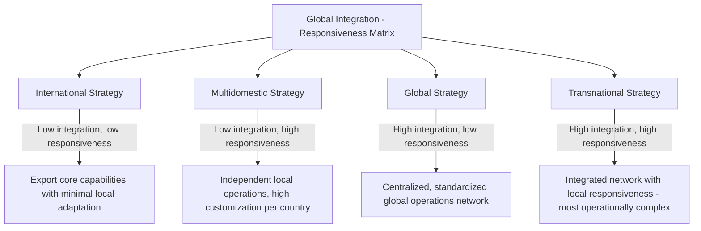
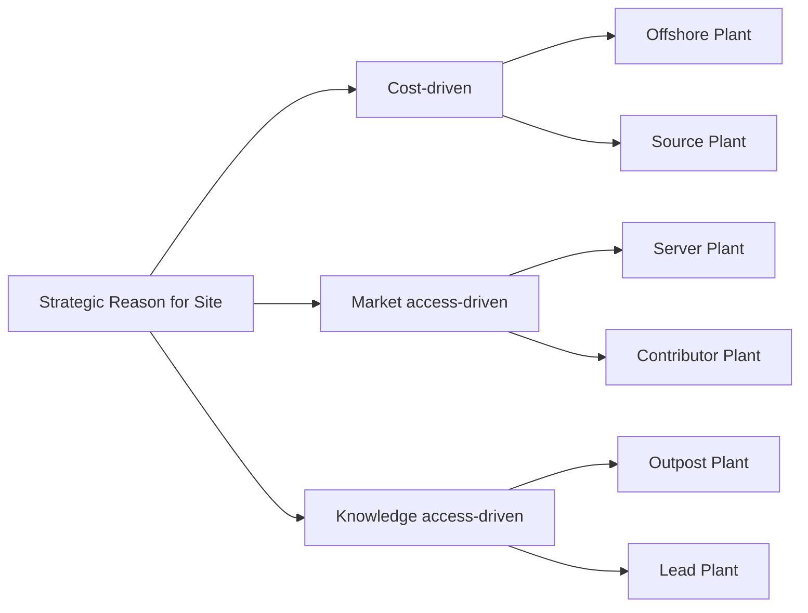
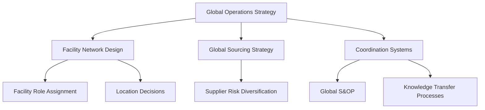
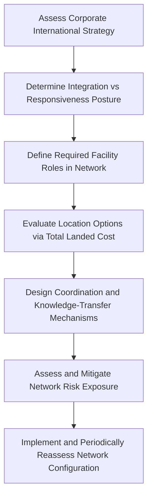

## Global Operations Strategy Formulation

### Overview

Global operations strategy formulation extends domestic operations strategy concepts to organizations that source, produce, and/or deliver across multiple countries. It addresses how a firm decides where to locate operational activities, how to coordinate a geographically dispersed network of facilities, and how to balance global efficiency against local responsiveness — all while remaining aligned with corporate international strategy.

### The Integration-Responsiveness Framework

**Key Points**

- The foundational framework for global strategy formulation (Bartlett & Ghoshal; Prahalad & Doz) positions strategic choice along two axes:
  - **Global integration**: The pressure to standardize operations, products, and processes across countries to capture economies of scale and consistency.
  - **Local responsiveness**: The pressure to adapt operations, products, and processes to meet distinct national or regional customer needs, regulations, and market conditions.
- Four generic strategic postures emerge from this framework, each implying a different operations network design.

| Strategy Type | Integration | Responsiveness | Typical Operations Configuration |
| --- | --- | --- | --- |
| International | Low | Low | Centralized R&D/production, minimal local adaptation |
| Multidomestic | Low | High | Autonomous country-level operations, duplicated capabilities |
| Global | High | Low | Centralized, standardized facilities serving worldwide markets |
| Transnational | High | High | Networked facilities with specialized, interdependent roles |

### Global Operations Network Design

**Key Points**

- Once a strategic posture is chosen, operations strategy must determine the **role of each facility** within the global network, not just its location. Kasra Ferdows' framework classifies plants by strategic role along two dimensions: the primary reason for the site (access to low-cost production, access to skills/knowledge, or proximity to market) and the depth of technical/managerial competence developed there.
- Common facility roles include:
  - **Offshore**: Low-cost production for export, minimal technical competence beyond execution.
  - **Source**: Low-cost production combined with meaningful engineering and process-improvement competence.
  - **Server**: Located to supply a specific national/regional market, limited broader network role.
  - **Contributor**: Serves a local market but also develops capabilities (product/process improvements) that feed back into the broader network.
  - **Outpost**: Located primarily to gain access to skills, suppliers, or knowledge from a particular region (e.g., proximity to a technology cluster).
  - **Lead**: Creates new products, processes, and capabilities for the entire global network; acts as a center of excellence.

### Location Decision Factors

**Key Points**

- Global facility location decisions weigh both **tangible** and **intangible** factors:
  - Tangible: Labor cost, transportation and logistics cost, taxation and tariffs, currency exchange exposure, infrastructure quality, utility reliability, available incentives/subsidies.
  - Intangible: Political and regulatory stability, intellectual property protection strength, workforce skill availability and training infrastructure, cultural compatibility, proximity to lead customers or supplier clusters, quality of local educational/research institutions.
- **Total landed cost** analysis, rather than unit production cost alone, is the standard basis for comparing locations, since production cost savings are frequently offset by transportation, inventory carrying cost (due to longer lead times), tariffs, and coordination overhead.

$$\text{Total Landed Cost} = \text{Production Cost} + \text{Transportation Cost} + \text{Tariffs/Duties} + \text{Inventory Carrying Cost} + \text{Coordination Overhead}$$

- Currency risk is a distinct consideration in global operations strategy: facilities priced and sold in a different currency than their input costs create **operational exposure**, which can be partially mitigated through natural hedging (matching revenue and cost currencies) rather than purely financial hedging instruments.

### Coordination Mechanisms in Global Networks

**Key Points**

- A dispersed global operations network requires explicit coordination mechanisms to function as an integrated system rather than a collection of independent sites:
  - **Standardized processes and technology platforms**: Common ERP systems, quality standards, and manufacturing process specifications across sites to enable flexibility in shifting production between locations.
  - **Global sourcing and supplier networks**: Coordinated procurement across sites to leverage volume and consistency, balanced against the risk of single-source dependency.
  - **Knowledge transfer mechanisms**: Formal processes for transferring process improvements and innovations developed at one site (particularly Lead or Contributor plants) across the broader network.
  - **Capacity and demand coordination**: Global sales and operations planning (S&OP) processes that allow demand fluctuations in one region to be served by capacity in another.

### Risk Management in Global Operations

**Key Points**

- Global operations networks face risk categories largely absent or muted in purely domestic operations:
  - **Supply chain disruption risk**: Natural disasters, geopolitical conflict, and pandemics can disrupt specific nodes; networks with concentrated single-source dependency are especially exposed.
  - **Political and regulatory risk**: Trade policy shifts, tariff changes, expropriation risk, and regulatory divergence across jurisdictions.
  - **Currency risk**: Exchange rate fluctuations affecting the relative cost competitiveness of different sites over time.
  - **Intellectual property risk**: Varying enforcement strength across jurisdictions, particularly relevant when transferring proprietary process knowledge to Lead or Source plants abroad.
- Mitigation approaches include **dual/multi-sourcing** across geographically diversified suppliers, maintaining **flexible capacity buffers** that allow production to shift between sites, and designing networks with deliberate **redundancy** at the cost of some scale efficiency — a direct trade-off between global efficiency and network resilience. [Inference: the optimal balance between efficiency-driven consolidation and resilience-driven redundancy is highly context-dependent and has shifted across firms and industries in response to recent large-scale disruption events.]

### Example: Global Network Configuration

**Example**

A global consumer electronics firm formulates its operations strategy as follows:

- **Lead plant** in a country with a strong engineering talent pool and proximity to key component suppliers, responsible for new product introduction and process innovation for the entire network.
- **Source plants** in two geographically separated lower-cost manufacturing regions, each capable of producing the full product range, providing both cost efficiency and geographic redundancy against disruption in either region.
- **Server plants** in major end markets subject to high import tariffs or requiring rapid replenishment, performing final assembly or configuration close to the customer.
- A **global S&OP process** coordinates demand forecasts across regions and reallocates production between Source plants when one region experiences disruption or capacity constraints.

This configuration reflects a transnational posture: standardized core technology and process platforms (integration) combined with regionally located final-stage operations (responsiveness), with deliberate redundancy built into the Source-plant tier to manage geopolitical and disruption risk.

### Formulation Process Summary

### Related Topics

- Integration-responsiveness framework (Bartlett & Ghoshal)
- Ferdows' plant role typology (offshore, source, server, contributor, outpost, lead)
- Total landed cost analysis and facility location decisions
- Global sourcing and supply chain risk diversification
- Sales and Operations Planning (S&OP) in multinational networks
- Currency exposure and operational hedging strategies
- Linking corporate strategy to operations strategy
- Core competencies and capability building (knowledge transfer across a global network)