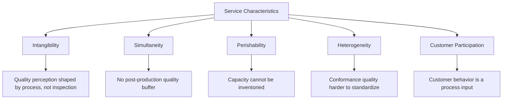
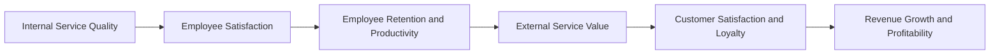
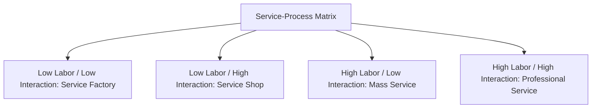

## Operations Strategy in Service Organizations

### Overview

Operations strategy in service organizations applies the same foundational concepts as manufacturing operations strategy — competitive priorities, trade-offs, and strategy-capability alignment — but must account for characteristics unique to services: simultaneity of production and consumption, customer participation in the process, intangibility, and the difficulty of inventorying output. These distinctions materially change how strategic priorities are set and how operational capability is built.

### Distinctive Characteristics of Services Affecting Strategy

**Key Points**

- **Intangibility**: Services cannot be physically inspected before purchase, making quality perception more dependent on process experience and signals (facility appearance, staff behavior) than on inspectable product attributes.
- **Simultaneity (inseparability)**: Production and consumption occur at the same time, meaning quality control cannot rely on post-production inspection before the customer experiences the service — errors are often visible to the customer as they happen.
- **Perishability**: Service capacity that goes unused (an empty hotel room, an idle service technician-hour) cannot be inventoried and sold later, unlike manufactured goods, which fundamentally changes capacity and demand management strategy.
- **Heterogeneity (variability)**: Service delivery quality can vary between employees, between customers, and even between different encounters with the same employee, complicating the concept of process conformance quality.
- **Customer participation**: The customer is often a co-producer of the service (providing information, performing self-service tasks, or physically present during delivery), meaning operational design must account for customer behavior as an input to the process, not merely an output recipient.

### The Service-Profit Chain

**Key Points**

- The service-profit chain (Heskett, Sasser, and Schlesinger) links internal operations strategy decisions to external financial outcomes through a causal sequence: internal service quality drives employee satisfaction, which drives employee retention and productivity, which drives external service value, which drives customer satisfaction and loyalty, which drives revenue growth and profitability.
- This framework has direct operations strategy implications: workforce policy decisions (an infrastructural decision area) are elevated to a primary strategic lever in service operations, often more directly than in manufacturing, because the workforce frequently *is* the product from the customer's perspective.

### Service Positioning: The Service-Process Matrix

**Key Points**

- Analogous to the manufacturing product-process matrix, the service-process matrix (Schmenner) classifies services along two dimensions: **degree of labor intensity** and **degree of customer interaction/customization**, producing four generic service types with distinct operations strategy implications.

| Service Type | Labor Intensity | Interaction/Customization | Example | Strategic Focus |
| --- | --- | --- | --- | --- |
| Service Factory | Low | Low | Airlines, hotels, logistics | Capacity utilization, standardization, scheduling |
| Service Shop | Low | High | Hospitals, repair services | Balancing standardized infrastructure with individualized diagnosis/treatment |
| Mass Service | High | Low | Retail banking, schools | Workforce management, standardized scripts/procedures |
| Professional Service | High | High | Consulting, legal, medical specialists | Talent management, judgment-based quality, customization capability |

### Competitive Priorities Adapted for Services

**Key Points**

- **Cost**: Remains relevant but is frequently constrained by the labor-intensive nature of many services; cost strategy often centers on workforce scheduling efficiency and self-service technology adoption rather than pure automation.
- **Quality**: Split further in services into **technical quality** (the correctness of the outcome — was the diagnosis accurate, was the transaction processed correctly) and **functional/process quality** (how the service was delivered — courtesy, responsiveness, empathy), with the SERVQUAL model (reliability, assurance, tangibles, empathy, responsiveness) commonly used to operationalize the latter.
- **Speed**: Frequently measured as customer-perceived wait time rather than objective elapsed time alone, since perceived wait can be managed through operational design (e.g., visible queue information, distraction, or occupied-wait strategies) independent of actual throughput improvements.
- **Flexibility**: Often centers on the ability to customize the service encounter to individual customer needs in real time, which is a direct function of front-line employee empowerment and training rather than equipment reconfiguration.
- **Dependability**: In services, dependability frequently concerns consistency of the *experience* across encounters and locations (e.g., a restaurant chain delivering the same experience at every branch) rather than only on-time delivery of a physical good.

### Capacity Strategy in Services: Managing Perishability

**Key Points**

- Because service capacity cannot be inventoried, service operations strategy relies heavily on **demand management** and **yield/revenue management** techniques rather than the inventory-buffering strategies common in manufacturing.
- Common capacity strategies include:
  - **Chase demand**: Adjust capacity (staffing levels, hours) closely to match demand fluctuations, common in service factories and mass services with predictable demand patterns.
  - **Level capacity**: Maintain constant capacity and manage demand instead, through reservations, appointment systems, off-peak pricing, or promoting demand during low periods.
  - **Yield management**: Dynamically price capacity based on real-time demand and remaining availability to maximize revenue per unit of perishable capacity (common in airlines, hotels).

$$\text{Service Capacity Utilization} = \frac{\text{Capacity Used}}{\text{Capacity Available}} \times 100\%$$

- Unlike manufacturing, where excess capacity primarily represents a sunk cost, unused service capacity represents permanently lost revenue opportunity, since it cannot be recovered by producing and storing output in advance of future demand.

### Quality Management in Service Operations

**Key Points**

- Because simultaneity removes the post-production inspection buffer available in manufacturing, service quality strategy relies more heavily on:
  - **Fail-safing (poka-yoke) applied to service encounters**: Designing processes and physical environments to prevent customer or employee errors before they occur (e.g., queue-management systems, standardized checklists, guided digital interfaces).
  - **Front-line employee empowerment**: Enabling employees to resolve problems and recover from service failures in real time, since errors are often visible to the customer immediately and cannot be corrected before delivery.
  - **Service recovery strategy**: A deliberate operational capability for responding to service failures, recognized in service operations literature as capable of significantly influencing customer loyalty — sometimes more than an error-free initial encounter, due to the "service recovery paradox."
- Gap models of service quality (notably the SERVQUAL-associated gaps model) identify specific points where service delivery can diverge from customer expectations — for example, the gap between management's perception of customer expectations and the actual expectations, or the gap between service standards and actual delivery — providing a diagnostic structure for quality-focused operations strategy.

### Example: Service Operations Strategy in Practice

**Example**

A national urgent-care clinic chain formulates its operations strategy as follows:

- **Positioning**: Classified as a Service Shop (low-to-moderate labor intensity relative to hospitals, but high customization/interaction per patient), prioritizing dependability (consistent clinical quality across locations) and speed (short wait times) as order winners, with cost as an order qualifier (must remain below a competitive price threshold for uninsured/high-deductible patients).
- **Capacity strategy**: A hybrid chase-and-level approach — base staffing levels are set to cover predictable weekday demand patterns (level), supplemented by on-call staff who can be activated during flu season or other predictable demand surges (chase).
- **Quality strategy**: Standardized clinical protocols and checklists (fail-safing) ensure consistent technical quality across locations, while front-line staff receive explicit authority to resolve billing or scheduling complaints on the spot (service recovery), directly reflecting the service-profit chain's link between employee empowerment and customer loyalty.
- **Workforce strategy**: Because the clinical staff largely *is* the product from the patient's perspective, retention and training investment is treated as a primary strategic lever rather than a secondary HR concern, consistent with the labor-intensity implications of the service-process matrix.

### Related Topics

- Service-profit chain and its operations strategy implications
- Service-process matrix (Schmenner) and service positioning
- SERVQUAL model and gaps model of service quality
- Yield/revenue management and demand-capacity matching
- Service recovery strategy and the service recovery paradox
- Competitive priorities: cost, quality, speed, flexibility, dependability (adapted for services)
- Poka-yoke (fail-safing) applied to service process design
- Workforce scheduling strategies for variable demand