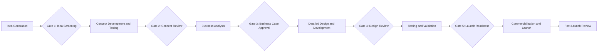
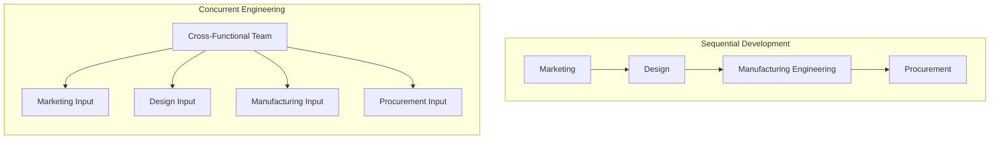

## New Product Development Process

### Overview

New Product Development (NPD) is the structured process by which an organization converts market opportunities and technical possibilities into a commercially viable product or service. In operations management, NPD is treated as a cross-functional process that directly determines a large share of a product's lifetime cost, quality, and manufacturability, even though most of that determination occurs before a single unit is ever produced.

### Strategic Importance in Operations

**Key Points**

- An estimated 70–80% of a product's total lifecycle cost is typically committed during the design phase, even though design activities themselves may represent only a small fraction of total spending — making NPD one of the highest-leverage points for operations cost and quality management. [Inference: the precise percentage varies by industry and source; the underlying principle — that early design decisions lock in disproportionate downstream cost — is well established in the operations literature.]
- NPD speed (time-to-market) is itself a competitive priority; being first or fast to market can determine market share capture, especially in industries with short product life cycles.
- Poor coordination between design, operations, and marketing during NPD is a leading cause of products that are difficult or costly to manufacture, fail to meet customer requirements, or require expensive late-stage redesign.

### Generic Stage-Gate Process

**Key Points**

- The most widely used structural framework for NPD is the **Stage-Gate process** (Cooper), which divides development into discrete stages of work separated by "gates" — formal go/kill decision points where management reviews progress against predefined criteria before authorizing continued investment.
- Gates serve as risk-management checkpoints, allowing an organization to terminate or redirect a project before further resources are committed, rather than discovering fundamental flaws only after full-scale investment.

### Stage-by-Stage Description

#### Idea Generation and Screening

**Key Points**

- Ideas are sourced from multiple channels: customer feedback and market research, competitor benchmarking, internal R&D, supplier suggestions, and employee submission programs.
- Screening applies coarse filters (strategic fit, rough feasibility, estimated market size) to quickly eliminate ideas unlikely to succeed, minimizing wasted investment in later, more expensive stages.

#### Concept Development and Testing

**Key Points**

- Surviving ideas are elaborated into detailed product concepts, including a description of target customer, key benefits, and positioning relative to competitors.
- Concept testing exposes the description (often via mockups, storyboards, or prototypes) to representative customers to validate demand and refine the value proposition before committing to detailed engineering.

#### Business Analysis

**Key Points**

- A formal business case is developed, including demand forecasts, projected pricing, cost estimates, required capital investment, and expected profitability, typically expressed through metrics such as net present value (NPV), payback period, or internal rate of return (IRR).
- This stage determines whether the concept is not just technically feasible but also financially justified relative to the organization's investment criteria and strategic priorities.

$$NPV = \sum_{t=0}^{T} \frac{CF_t}{(1+r)^t} - I_0$$

where $CF_t$ is the net cash flow in period $t$, $r$ is the discount rate, $T$ is the project horizon, and $I_0$ is the initial investment.

#### Detailed Design and Development

**Key Points**

- Engineering translates the concept into detailed specifications: functional requirements, technical drawings, bill of materials (BOM), and manufacturing process requirements.
- This stage typically involves iterative prototyping — building physical or digital models to test form, fit, and function before committing to production tooling.
- Design-focused methodologies applied here include Design for Manufacturability (DFM), Design for Assembly (DFA), and Quality Function Deployment (QFD), each aimed at ensuring the design is not only functionally correct but also efficient and reliable to produce.

#### Testing and Validation

**Key Points**

- Prototypes undergo rigorous testing: functional performance testing, reliability/durability testing, regulatory compliance testing, and often limited market trials (beta testing, pilot production runs) with real customers.
- Process capability studies are typically run on the intended production process at this stage to confirm the manufacturing system can reliably meet design tolerances before full-scale launch.

#### Commercialization and Launch

**Key Points**

- Full-scale production begins, supported by finalized supply chain arrangements, workforce training, and marketing launch activities.
- A phased or pilot launch (limited geographic or channel rollout before full launch) is often used to surface remaining issues at lower risk than a simultaneous full-market launch.

#### Post-Launch Review

**Key Points**

- Performance against the original business case (sales volume, cost targets, quality metrics, customer satisfaction) is formally reviewed, both to inform decisions about the specific product (continuation, modification, discontinuation) and to capture lessons for improving the NPD process itself.

### Cross-Functional Integration: Concurrent Engineering

**Key Points**

- Traditional NPD processes were often **sequential**, with each function (marketing, design engineering, manufacturing engineering, procurement) completing its work before handing off to the next — a structure prone to late-stage discovery of manufacturability problems and long overall development time.
- **Concurrent engineering** (also called simultaneous engineering) restructures NPD so that relevant functions work in parallel and collaboratively from early stages, with manufacturing and procurement input incorporated into design decisions before they are finalized, substantially reducing both development time and the incidence of costly late-stage redesign.

### Key Design Methodologies Embedded in NPD

**Key Points**

- **Quality Function Deployment (QFD)**: A structured method (often visualized as the "House of Quality") for translating customer requirements into specific technical design characteristics, ensuring engineering priorities remain traceable to actual customer needs rather than internal assumptions.
- **Design for Manufacturability (DFM)**: A set of design principles aimed at minimizing production cost and complexity — reducing part count, standardizing components, and designing for existing process capability.
- **Design for Assembly (DFA)**: A related discipline focused specifically on minimizing assembly time, complexity, and error potential, often through part consolidation and simplified fastening methods.
- **Failure Mode and Effects Analysis (FMEA)**: A systematic risk-assessment technique applied during design to identify potential failure modes, rank them by severity, likelihood, and detectability, and prioritize design changes to mitigate the highest-risk failures before production begins.
- **Robust Design (Taguchi Methods)**: A design approach aimed at making product performance insensitive to variation in manufacturing processes or usage conditions, reducing the need for tight (and costly) manufacturing tolerances.

### Measuring NPD Performance

**Key Points**

- Common metrics used to evaluate NPD process effectiveness include:
  - **Time-to-market**: Elapsed time from project initiation (or concept approval) to commercial launch.
  - **Development cost**: Total resources consumed across all stages relative to the original business case estimate.
  - **Percentage of revenue from new products**: A common indicator of an organization's innovation velocity relative to competitors.
  - **Design change rate post-launch**: The frequency of engineering changes required after production begins, often used as a proxy for design quality and cross-functional coordination effectiveness during development.

### Example: NPD Process Applied

**Example**

A consumer appliance manufacturer developing a new countertop kitchen device applies the stage-gate process as follows:

1. **Idea generation**: Internal R&D and customer survey data identify unmet demand for a multi-function device combining two existing product categories.
2. **Concept testing**: Focus groups evaluate a non-functional mockup and confirm strong interest in the combined functionality at a target price point.
3. **Business analysis**: Finance models projected volume, tooling investment, and unit cost, confirming a positive NPV under conservative demand assumptions.
4. **Concurrent design phase**: A cross-functional team including manufacturing engineers and the primary plastic-molding supplier collaborates on the housing design from the outset, applying DFM principles to reduce the part count from an initial 47-part concept to 31 parts, directly reducing both material cost and assembly time.
5. **Testing and validation**: Prototype units undergo durability, electrical safety, and regulatory compliance testing; a limited pilot production run confirms process capability meets design tolerances.
6. **Launch**: A phased regional launch precedes full national rollout, allowing early sales and quality data to inform final production ramp-up decisions.
7. **Post-launch review**: Actual unit cost and defect rates are compared against the original business case, with variance analysis feeding into the next product generation's design assumptions.

### Related Topics

- Quality Function Deployment (QFD) and the House of Quality
- Design for Manufacturability (DFM) and Design for Assembly (DFA)
- Failure Mode and Effects Analysis (FMEA)
- Robust design and Taguchi methods
- Concurrent engineering and cross-functional team structures
- Product life cycle management
- Time-to-market as a competitive priority
- Process capability and $C_{pk}$ in production ramp-up