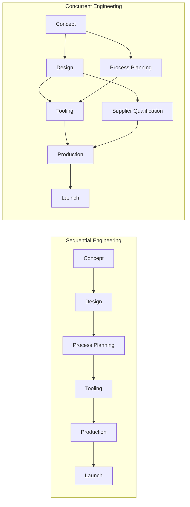

## Concurrent Engineering

### Definition and Core Concept

Concurrent engineering (CE), also known as simultaneous engineering, is a systematic approach to integrated product and service design in which cross-functional teams perform design, engineering, manufacturing, and support activities in parallel rather than in a strict sequential (serial) order. The core objective is to compress the total time from concept to market launch while improving quality and reducing lifecycle cost by involving downstream stakeholders — manufacturing, procurement, quality, marketing, field service — early in the design process, rather than after the design is finalized.

This contrasts with the traditional "over-the-wall" or sequential engineering model, where each department completes its work and passes the output to the next function with little upstream input, often causing late-stage discoveries of manufacturability, cost, or quality problems.

### Historical Background

- Concurrent engineering emerged prominently in the 1980s, largely driven by Japanese automotive manufacturers (notably Toyota) who integrated design and manufacturing planning simultaneously to shorten development cycles.
- The U.S. Department of Defense's Institute for Defense Analyses formally defined and popularized the term in a 1988 report (IDA Report R-338), describing it as "a systematic approach to the integrated, concurrent design of products and their related processes."
- Concurrent engineering became a central practice within Design for Manufacturability (DFM), Design for Assembly (DFA), and Quality Function Deployment (QFD) frameworks during the late 1980s and 1990s.

### Key Principles

**Key Points**

- **Parallel processing of tasks**: Design, process planning, tooling design, and supplier qualification proceed simultaneously with appropriate overlap rather than waiting for full completion of prior stages.
- **Cross-functional teams**: Representatives from engineering, manufacturing, quality, purchasing, marketing, and service are involved from the earliest concept stage.
- **Early supplier involvement (ESI)**: Key suppliers participate in design discussions before specifications are frozen, allowing input on manufacturability and cost.
- **Front-loading of information**: Decisions that are traditionally made late (e.g., tooling feasibility, assembly sequence) are pulled forward so problems are identified when changes are cheap.
- **Design for X (DFX)**: Design decisions explicitly account for manufacturability, assembly, reliability, serviceability, and environmental impact simultaneously.
- **Continuous information sharing**: Shared digital models (CAD/PLM systems) and communication protocols keep all functions synchronized on the current design state.

### Sequential vs. Concurrent Engineering

| Dimension | Sequential Engineering | Concurrent Engineering |
| --- | --- | --- |
| Process flow | Linear, department-to-department handoff | Overlapping, parallel activities |
| Cross-functional input | Late, often after design freeze | Early, from concept phase |
| Design changes | Frequent late-stage changes (costly) | Fewer late changes; issues caught early |
| Communication | Formal documents passed at milestones | Continuous, team-based collaboration |
| Time to market | Longer | Compressed (commonly cited reductions of 30–70% in various case studies) [Unverified] |
| Rework | Higher, discovered late | Lower, discovered early |

### The Rework and Cost-Commitment Rationale

A central justification for CE rests on two well-documented engineering economics patterns:

1. **Cost of change escalates over the product lifecycle.** A design change made during concept development typically costs orders of magnitude less than the same change made after tooling is built or production has started, because tooling, supplier contracts, and manufacturing setups must all be reworked.
2. **Cost is committed early even though it is spent late.** Roughly 70–80% of a product's total lifecycle cost is typically locked in by decisions made during the design phase, even though the majority of that cost is not actually incurred until manufacturing and support phases [Inference — this is a widely cited industry heuristic rather than a fixed universal law].

Concurrent engineering directly targets this mismatch: since most cost is committed early, involving manufacturing, quality, and service expertise during design (rather than after) allows those commitments to reflect real production and support constraints before they become expensive to change.

$$C_{\text{total}} = \sum_{i=1}^{n} C_i(t_i)$$

Where $C_i$ represents the cost of change for activity $i$, and $t_i$ represents the time at which that change is discovered; in traditional models $C_i(t_i)$ increases sharply as $t_i$ moves later in the lifecycle, whereas concurrent engineering seeks to reduce $t_i$ for critical discoveries.

### Enabling Tools and Technologies

- **Product Data Management (PDM) and Product Lifecycle Management (PLM) systems**: Centralized digital repositories (e.g., Siemens Teamcenter, PTC Windchill, Dassault ENOVIA) that give all functions simultaneous access to the current design state, revision history, and change requests.
- **Computer-Aided Design (CAD) with model-based definition**: 3D models serve as the single source of truth, replacing 2D drawings passed sequentially between departments.
- **Quality Function Deployment (QFD)**: Translates customer requirements into engineering characteristics early, feeding both design and process planning simultaneously.
- **Design for Manufacturability and Assembly (DFMA)**: Structured methodologies (e.g., Boothroyd-Dewhurst DFMA software) applied during design rather than post-design review.
- **Failure Mode and Effects Analysis (FMEA)**: Conducted concurrently with design iterations rather than as a final gate check.
- **Rapid prototyping / additive manufacturing**: Enables physical validation of design and manufacturability assumptions in parallel with digital design refinement.
- **Cross-functional co-location or virtual collaboration platforms**: Physical or virtual "war rooms" where team members from different functions work in proximity to accelerate decision cycles.

### Organizational Structures Supporting Concurrent Engineering

- **Integrated Product Teams (IPTs)**: Dedicated cross-functional teams assigned to a single product/project for its full development duration, with authority to make trade-off decisions without escalating through functional silos.
- **Heavyweight project manager structures**: A strong, empowered project manager (as opposed to a light-touch coordinator) with authority over budget and staffing decisions across functions, commonly associated with faster CE outcomes in the automotive industry (a structure notably associated with Toyota's "shusa" or chief engineer system).
- **Matrix organizations**: Team members retain functional reporting lines but are simultaneously assigned to product teams, requiring dual accountability and strong communication protocols.

### Implementation Steps

**Next Steps** (implementation sequence for adopting concurrent engineering)

1. Form a cross-functional team at project initiation, including manufacturing, quality, procurement, and service representatives — not only design engineers.
2. Establish a shared digital platform (PLM/PDM) so all functions work from the same current data set.
3. Integrate DFX reviews (DFM, DFA, DFR — Design for Reliability) into early design milestones rather than end-of-design gate reviews.
4. Engage key suppliers early for components with long lead times or specialized tooling requirements.
5. Use structured concurrent design reviews (e.g., overlapping stage-gates rather than strictly sequential gates) so downstream functions can flag concerns before design freeze.
6. Apply FMEA and QFD iteratively throughout design rather than as single-point checks.
7. Monitor overlap risk: excessive parallelization without adequate communication can cause rework if upstream changes are not communicated promptly downstream (see Risks below).

### Benefits

- **Reduced time-to-market**: Overlapping activities shorten the overall critical path of development.
- **Lower total development cost**: Fewer late-stage engineering changes reduce tooling rework and requalification costs.
- **Improved manufacturability and quality**: Manufacturing and quality input during design reduces defects traceable to design decisions.
- **Better customer alignment**: Marketing and customer-facing functions participating early help keep the design aligned with market requirements throughout development.
- **Improved supplier relationships**: Early supplier involvement can improve component availability, cost negotiation, and quality outcomes.

### Risks and Challenges

- **Coordination complexity**: Parallel work streams increase the risk of inconsistent assumptions between teams if communication is not tightly managed; a change in one work stream can invalidate assumptions in a parallel stream if not communicated promptly.
- **Iteration and rework risk**: If concurrent activities are started before sufficient design stability, downstream work (e.g., tooling) may need to be redone when upstream design changes occur — sometimes called the "concurrency penalty" [Inference — a recognized risk in CE literature, though its magnitude is context-dependent].
- **Organizational resistance**: Functional silos and traditional performance metrics (e.g., engineering measured only on design elegance, manufacturing measured only on unit cost) can conflict with CE's collaborative incentive structure.
- **Information overload**: Continuous real-time information sharing across many stakeholders can create communication bottlenecks without disciplined change-management processes.
- **Requires cultural change**: Concurrent engineering is as much an organizational and cultural shift as a technical methodology; adoption without genuine cross-functional authority-sharing (e.g., token committee participation) tends to yield limited benefit [Inference].

### Example: Automotive New Model Development

**Example**

A vehicle manufacturer developing a new model uses concurrent engineering as follows:

- Body engineers, stamping tool designers, and quality engineers begin working together during the styling/surfacing phase, rather than stamping engineers waiting until styling is frozen.
- Powertrain engineers and NVH (noise, vibration, harshness) specialists validate packaging constraints simultaneously with structural engineers, rather than sequentially.
- Suppliers of major subsystems (seats, infotainment, powertrain components) are engaged during concept phase to align on interface specifications before detailed design begins.
- Digital mock-up (DMU) reviews are conducted iteratively throughout the program, allowing manufacturing feasibility issues (e.g., robot weld access, assembly sequence) to be identified and resolved months before physical prototype builds.

This contrasts with a traditional sequential process where stamping tool design would not begin until the body-in-white design was fully released, extending the overall program timeline.

### Relationship to Other Operations Management Concepts

- **Quality Function Deployment (QFD)**: Frequently used as the front-end mechanism within CE to translate customer needs into design targets shared across functions.
- **Design for Manufacturability/Assembly (DFMA)**: A specific toolkit applied within the concurrent engineering process to evaluate manufacturability during design rather than after.
- **Time-based competition**: Concurrent engineering is a primary operational strategy for competing on speed-to-market as a competitive priority.
- **Stage-gate product development process**: Concurrent engineering modifies the traditional stage-gate model by allowing overlapping stages with defined synchronization points, rather than strict gate-to-gate sequencing.
- **Lean product development**: Shares philosophical roots with concurrent engineering, particularly through practices like set-based concurrent engineering (SBCE), where multiple design alternatives are explored in parallel before narrowing to a final solution (notably associated with Toyota's product development system).

### Set-Based Concurrent Engineering (SBCE) — Related Variant

Set-based concurrent engineering is a specific variant in which teams explore a *set* of design alternatives in parallel across functions, gradually narrowing the set as trade-off information becomes available, rather than committing early to a single "point-based" design that gets refined iteratively. This reduces the risk of costly late-stage redesign because commitment to a final solution is delayed until sufficient cross-functional information is available, while still allowing parallel work on the surviving alternatives.

### Related Topics

- Design for Manufacturability and Assembly (DFMA)
- Quality Function Deployment (QFD)
- Stage-gate new product development process
- Set-based concurrent engineering and Toyota Product Development System
- Early Supplier Involvement (ESI) strategies
- Product Lifecycle Management (PLM) systems
- Failure Mode and Effects Analysis (FMEA)
- Time-based competition and speed-to-market strategy
- Cross-functional team design and integrated product teams (IPTs)