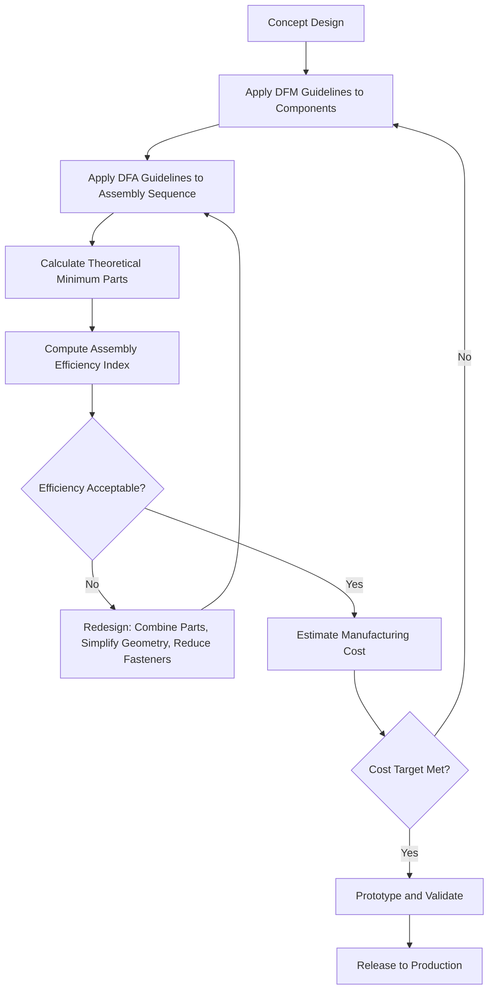

## Design for Manufacturability and Assembly

### Overview

Design for Manufacturability and Assembly (DFMA) is a product design philosophy and set of engineering guidelines aimed at simplifying products so they are easier, faster, and cheaper to manufacture and assemble, without compromising function, quality, or reliability. DFMA merges two complementary disciplines: Design for Manufacturability (DFM), which focuses on simplifying individual component fabrication, and Design for Assembly (DFA), which focuses on reducing the complexity and cost of putting components together into a finished product.

DFMA is applied during the early stages of product development, when design decisions have the greatest influence on downstream production cost, quality, and lead time. Studies commonly cited in operations and industrial engineering literature suggest that roughly 70-80% of a product's manufacturing cost is locked in during the design phase, even though design itself typically represents a small fraction of total product cost. [Inference: the exact percentage varies by industry, source, and product complexity, but the directional principle—that early design decisions dominate downstream cost—is broadly accepted in operations management literature.]

### Core Objectives

- **Reduce part count**: Fewer unique components mean fewer purchase orders, less inventory, simpler assembly sequences, and fewer potential failure points.
- **Simplify assembly operations**: Favor insertion over screwing, snap-fits over fasteners, and top-down assembly over multi-directional assembly.
- **Standardize components**: Reuse common parts (fasteners, connectors, subassemblies) across product lines to leverage economies of scale.
- **Minimize handling and orientation difficulty**: Design parts that are easy to grasp, orient, and insert, ideally symmetric or self-aligning.
- **Design within process capability**: Match tolerances, materials, and geometries to what the chosen manufacturing process can reliably achieve.
- **Enable error-proofing (poka-yoke)**: Design parts that can only be assembled correctly, reducing rework and defects.

### Design for Manufacturability (DFM) Principles

DFM concentrates on making individual parts easier and cheaper to produce.

1. **Minimize the number of unique parts and materials.** Fewer distinct materials simplify procurement, reduce tooling, and lower inventory carrying costs.
2. **Design to process capability.** Avoid specifying tolerances tighter than the process requires; tight tolerances increase cost non-linearly, often exponentially as they approach the limits of a process's capability.
3. **Avoid unnecessary features.** Sharp internal corners, thin walls, deep cavities, and non-standard hole sizes increase tooling complexity and cycle time, particularly in injection molding, casting, and machining.
4. **Design for the dominant process early.** Whether a part will be injection molded, stamped, machined, or 3D printed changes almost every geometric decision; late process changes are expensive.
5. **Use standard, commercially available components** (fasteners, bearings, connectors) rather than custom-designed equivalents where feasible.
6. **Minimize secondary operations.** Each additional operation (deburring, painting, plating, heat treatment) adds cost, cycle time, and quality risk.

**Example**: A plastic housing designed with uniform wall thickness (e.g., 2-3 mm) avoids sink marks and warping during injection molding, and eliminates the need for a secondary machining or finishing step that a variable-thickness design would require.

### Design for Assembly (DFA) Principles

DFA concentrates on how parts come together into the final product.

1. **Minimize part count.** Combine functions into a single component where possible (e.g., replacing a bracket-plus-fasteners with a single molded snap-fit bracket).
2. **Design for one-direction assembly.** Ideally, all parts assemble from a single direction (typically top-down), avoiding the need to reorient the subassembly mid-process.
3. **Eliminate or reduce fasteners.** Screws, bolts, and washers require additional handling time, tooling, and are common sources of assembly error. Snap-fits, press-fits, and integrated latches reduce assembly steps.
4. **Design self-aligning and self-locating parts.** Chamfers, tapers, and guide pins help parts find their correct position with minimal operator or robot precision.
5. **Design parts with symmetry, or make asymmetry obvious.** Symmetric parts eliminate orientation errors; if a part must be asymmetric, exaggerate the asymmetry so it cannot be assembled incorrectly (poka-yoke principle).
6. **Avoid parts that tangle, nest, or are difficult to grasp.** Especially relevant for automated feeding systems (e.g., vibratory bowl feeders) and manual assembly alike.
7. **Minimize adjustments.** Adjustable features (e.g., set screws requiring calibration) add assembly time and variability; fixed, pre-set geometry is faster and more repeatable.

### The Boothroyd-Dewhurst DFA Method

The most widely taught and industrially applied DFA methodology was developed by Geoffrey Boothroyd and Peter Dewhurst in the late 1970s and 1980s, later commercialized as DFMA software.

The method proceeds as follows:

1. **Theoretical minimum parts analysis.** For each part in an assembly, ask three screening questions:
   - Does the part move relative to all other parts already assembled?
   - Must the part be of a different material, or be isolated from other parts already assembled (e.g., for electrical insulation)?
   - Must the part be separate to allow assembly or disassembly of other parts?If the answer to all three is "no," the part is theoretically unnecessary and should be considered for elimination or combination with another part.
2. **Assembly efficiency calculation.** The method computes a **design efficiency index** ($E_{ma}$):

$$E_{ma} = \frac{N_{min} \times t_a}{t_{total}}$$

Where:

- $N_{min}$ = theoretical minimum number of parts
- $t_a$ = the nominal average time to insert one "ideal" part (typically benchmarked at 3 seconds in the original Boothroyd-Dewhurst tables)
- $t_{total}$ = actual estimated total assembly time for the current design

A low efficiency index signals opportunities for part reduction or simplification.

3. **Time and cost estimation tables.** Boothroyd-Dewhurst developed standardized time-penalty tables for handling difficulty (symmetry, size, weight, fragility, flexibility) and insertion difficulty (accessibility, resistance to insertion, need for holding down). Designers use these tables to estimate assembly time for each part and identify high-cost operations for redesign.

**Example**: A design with 12 parts and an assembly time of 90 seconds, where the theoretical minimum is 5 parts:

$$E_{ma} = \frac{5 \times 3}{90} = 0.167 \text{ or } 16.7\%$$

This low efficiency score signals that the assembly is far from optimal and warrants part-count reduction.

### DFMA Process Flow

### Relationship Between DFM, DFA, and Concurrent Engineering

DFMA is a core enabling practice of **concurrent engineering** (also called simultaneous engineering), in which design, manufacturing, quality, and supply chain functions collaborate from the earliest design stages rather than working sequentially. In a traditional sequential ("over-the-wall") development process, manufacturing engineers only see a design after it is finalized, often discovering costly-to-fix manufacturability problems too late. DFMA formalizes cross-functional review earlier, reducing engineering change orders (ECOs) after tooling has been committed.

### Diagram: DFM vs DFA Scope (svg_diagram)

<svg xmlns="http://www.w3.org/2000/svg" viewBox="0 0 700 320" font-family="Arial, sans-serif">
<text x="350" y="25" font-size="16" font-weight="bold" text-anchor="middle" fill="#1a1a1a">DFM vs DFA Scope (svg_diagram)</text>
<rect x="30" y="60" width="280" height="220" rx="10" fill="#eaf2fb" stroke="#3b6fa0" stroke-width="2" />
<text x="170" y="90" font-size="15" font-weight="bold" text-anchor="middle" fill="#1a3c5e">Design for Manufacturability</text>
<text x="170" y="115" font-size="12" text-anchor="middle" fill="#1a3c5e">(Individual Part Focus)</text>

<text x="50" y="145" font-size="12" fill="#333">- Material selection</text>

<text x="50" y="170" font-size="12" fill="#333">- Tolerance vs process capability</text>

<text x="50" y="195" font-size="12" fill="#333">- Tooling complexity</text>

<text x="50" y="220" font-size="12" fill="#333">- Wall thickness / geometry</text>

<text x="50" y="245" font-size="12" fill="#333">- Secondary operations</text>

<text x="50" y="270" font-size="12" fill="#333">- Surface finish requirements</text>

<rect x="390" y="60" width="280" height="220" rx="10" fill="#fbeaea" stroke="#a03b3b" stroke-width="2" />
<text x="530" y="90" font-size="15" font-weight="bold" text-anchor="middle" fill="#5e1a1a">Design for Assembly</text>
<text x="530" y="115" font-size="12" text-anchor="middle" fill="#5e1a1a">(Multi-Part Integration Focus)</text>

<text x="410" y="145" font-size="12" fill="#333">- Part count reduction</text>

<text x="410" y="170" font-size="12" fill="#333">- Assembly direction / sequence</text>

<text x="410" y="195" font-size="12" fill="#333">- Fastener elimination</text>

<text x="410" y="220" font-size="12" fill="#333">- Self-alignment / symmetry</text>

<text x="410" y="245" font-size="12" fill="#333">- Handling and orientation ease</text>

<text x="410" y="270" font-size="12" fill="#333">- Poka-yoke (error-proofing)</text>

<line x1="310" y1="170" x2="390" y2="170" stroke="#555" stroke-width="2" marker-end="url(#arrow)" />
<line x1="390" y1="200" x2="310" y2="200" stroke="#555" stroke-width="2" marker-end="url(#arrow2)" />
<text x="350" y="305" font-size="11" text-anchor="middle" fill="#555" font-style="italic">Both feed into overall product cost, quality, and lead time</text>

</svg>

### Key Guidelines Checklist

| Category | Guideline | Impact |
| --- | --- | --- |
| Part Count | Combine multiple parts into one where feasible | Reduces handling, inventory, assembly steps |
| Fasteners | Replace screws/bolts with snap-fits or integral features | Reduces cycle time and tooling |
| Symmetry | Design parts symmetric about axis of insertion | Eliminates orientation errors |
| Tolerances | Match tolerance to process capability, not arbitrary precision | Avoids exponential cost increase |
| Material | Standardize on fewer material types | Reduces procurement complexity |
| Assembly Direction | Design for single-direction (top-down) assembly | Reduces fixturing and reorientation |
| Access | Ensure tool and hand/gripper access to fastening points | Reduces cycle time, enables automation |
| Modularity | Design modular subassemblies that can be tested independently | Improves quality control, enables parallel assembly |

### Quantitative Benefits and Trade-offs

**Key Points**

- Reduced part count directly lowers Bill of Materials (BOM) complexity, purchasing overhead, and inventory carrying cost.
- Simplified assembly reduces direct labor cost and enables higher rates of automation, since robots and fixtures handle simple, symmetric, self-aligning parts far more reliably than complex ones.
- Fewer parts and simpler geometries generally reduce the number of potential failure modes, improving field reliability. [Inference: reliability improvement is a well-supported general tendency in the reliability engineering literature, but the magnitude depends on the specific product and failure mechanisms involved.]
- DFMA analysis often surfaces opportunities to eliminate 20-50% of parts in a redesign cycle, though actual results vary significantly by product maturity and starting design quality. [Unverified: this range is commonly cited in DFMA case studies and training materials but is not a guaranteed outcome for every application.]

**Trade-offs to Consider**

- Aggressive part consolidation can increase the complexity, tooling cost, or cycle time of the *individual* combined part (e.g., a complex injection mold with many features costs more to tool than several simple parts, even though assembly cost drops).
- Reducing fasteners in favor of permanent snap-fits or welds can hurt serviceability and recyclability, which may conflict with regulatory requirements (e.g., WEEE directive, right-to-repair legislation) or warranty/service strategy.
- Over-standardization on shared components across product lines can create single points of supply chain failure if that component's supplier is disrupted.

### DFMA in the Product Development Lifecycle

Multiple DFMA review gates are typically embedded across the product development lifecycle rather than performed once, since new manufacturability issues can surface as designs mature from concept to detailed CAD to physical prototype.

### Relationship to Other Operations Management Concepts

- **Lean Manufacturing**: DFMA directly supports lean goals by designing out waste (excess motion, excess inventory, defects) at the source, before the product ever reaches the factory floor.
- **Six Sigma / DFSS (Design for Six Sigma)**: DFMA complements DFSS by simplifying the physical design that Six Sigma tools (like FMEA and tolerance stack-up analysis) are then used to control statistically.
- **Total Cost of Ownership**: DFMA decisions affect not just unit production cost but also downstream costs including field service, warranty claims, and end-of-life disassembly/recycling.
- **Mass Customization**: Modular, standardized designs resulting from DFMA make late-stage product differentiation (e.g., final assembly customization) more feasible and cost-effective.

### Common Pitfalls

- Applying DFMA only at the detailed design stage, after major architectural decisions are already frozen, which limits potential savings substantially.
- Treating part-count reduction as an end in itself without evaluating the trade-off in mold/tooling complexity for the consolidated part.
- Ignoring assembly-line ergonomics and operator fatigue in the pursuit of theoretical assembly-time minimization.
- Failing to involve manufacturing, quality, and supply chain stakeholders early, reverting to a sequential ("throw it over the wall") development process despite nominally adopting DFMA.

**Related Topics**

- Design for Six Sigma (DFSS) and Quality Function Deployment (QFD)
- Failure Mode and Effects Analysis (FMEA) in product design
- Concurrent engineering and cross-functional product development teams
- Value engineering and value analysis
- Modular design and product platform strategy
- Tolerance stack-up analysis and Geometric Dimensioning and Tolerancing (GD&T)
- Design for X (DfX): Design for Sustainability, Design for Serviceability, Design for Recyclability
- Poka-yoke and mistake-proofing in process design
- Bill of Materials (BOM) management and part standardization
- Total Cost of Ownership (TCO) analysis in product design decisions