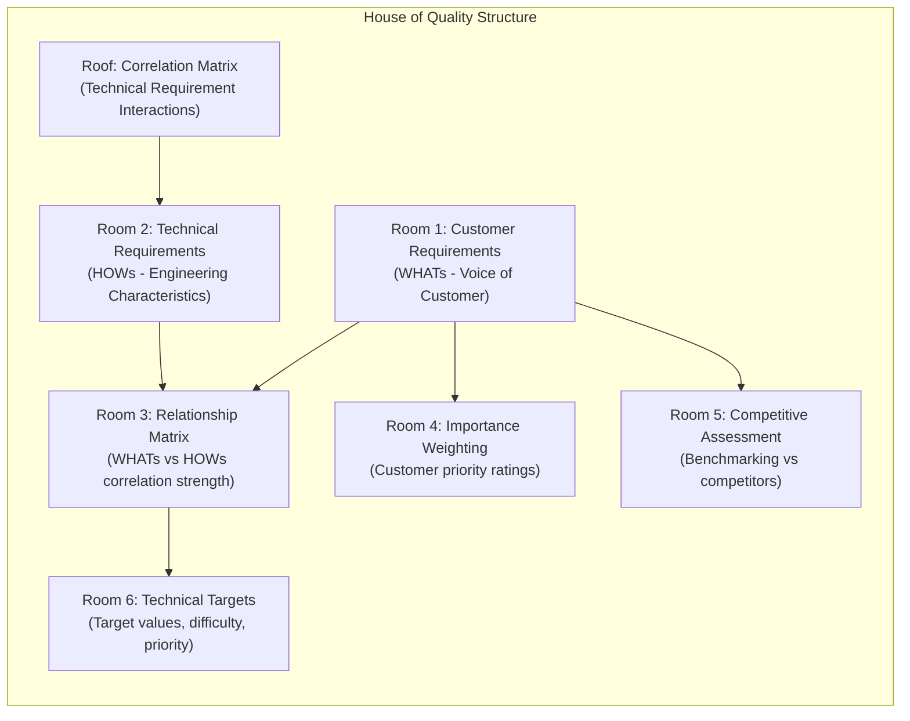
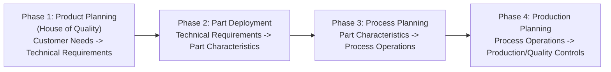

## Quality Function Deployment and the House of Quality

### Overview

Quality Function Deployment (QFD) is a structured, customer-driven methodology used to translate customer needs and wants ("Voice of the Customer") into specific engineering characteristics, technical requirements, and design targets during product or service development. Developed in Japan in the late 1960s by Yoji Akao and Shigeru Mizuno, and first applied at Mitsubishi's Kobe shipyard in 1972, QFD was later adopted widely by Toyota and its supply chain, and subsequently by American automotive and electronics firms in the 1980s.

The core purpose of QFD is to ensure that the customer's voice is systematically carried through every stage of design and production, from initial concept through part characteristics, process planning, and production requirements, so that what gets built genuinely reflects what customers value, rather than what engineers assume they want.

### Core Philosophy

- **Customer-driven design**: Requirements originate from the customer's stated and unstated needs, not solely from engineering intuition or historical practice.
- **Cross-functional collaboration**: QFD requires input from marketing, design engineering, manufacturing engineering, and quality functions working together, rather than sequential handoffs.
- **Traceability**: Every design decision can be traced back to a specific customer requirement, providing a documented rationale for technical choices.
- **Proactive quality planning**: QFD is a front-end planning tool, applied before design finalization, in contrast to inspection-based quality control, which detects defects after production.

### The House of Quality (HOQ)

The House of Quality is the primary matrix-based tool used in the first phase of QFD. It is called the "House of Quality" because the completed diagram resembles a house shape, with a triangular "roof" matrix sitting atop a rectangular body.

#### Structure of the House of Quality

**The six components, described in the traditional order of construction:**

1. **Customer Requirements ("WHATs")** — Left wall of the house. A structured list of customer needs, typically gathered through surveys, interviews, focus groups, warranty data, and complaint analysis, often organized into a hierarchy of primary, secondary, and tertiary needs. These are frequently expressed in the customer's own language (e.g., "the door closes easily") rather than technical terms.
2. **Technical Requirements ("HOWs")** — Roof ridge / top of the house. The engineering characteristics or design parameters that the organization controls and that can be objectively measured (e.g., "door closing force in Newtons"). Each customer WHAT should map to at least one measurable HOW.
3. **Relationship Matrix** — The central body of the house. A matrix where each cell indicates the strength of the relationship between a specific customer requirement (row) and a specific technical requirement (column). Relationships are typically scored using a symbol or numeric scale:
   - Strong relationship: 9 (●)
   - Moderate relationship: 3 (○)
   - Weak relationship: 1 (△)
   - No relationship: 0 (blank)
4. **Correlation Matrix ("Roof")** — The triangular section above the technical requirements, showing how the technical requirements interact with *each other*. This identifies synergies (positive correlation) and trade-offs/conflicts (negative correlation) between engineering characteristics — for example, increasing structural strength (HOW 1) might negatively correlate with reducing weight (HOW 2).
5. **Importance Ratings and Competitive Benchmarking** — Right wall of the house. Customer-assigned importance weights (often 1-5 scale) for each requirement, alongside a competitive comparison showing how the organization's current product performs against key competitors on each customer requirement.
6. **Technical Targets and Priorities** — Basement / bottom of the house. Calculated technical importance scores (derived by multiplying relationship strength by customer importance weight and summing down each column), absolute target values for each technical requirement, technical difficulty ratings, and a competitive technical benchmarking row.

#### Calculating Technical Importance

The technical importance score for each engineering characteristic (column) is typically calculated as:

$$TI_j = \sum_{i=1}^{n} R_{ij} \times CI_i$$

Where:

- $TI_j$ = technical importance of technical requirement $j$
- $R_{ij}$ = relationship strength between customer requirement $i$ and technical requirement $j$ (e.g., 9, 3, 1, or 0)
- $CI_i$ = customer importance weight of customer requirement $i$
- $n$ = total number of customer requirements

**Example**: If "door closing force" (a technical requirement) has a strong relationship (9) with "door closes easily" (customer importance = 4) and a moderate relationship (3) with "door doesn't slam loudly" (customer importance = 3):

$$TI_{closing\ force} = (9 \times 4) + (3 \times 3) = 36 + 9 = 45$$

Technical requirements with the highest calculated importance scores are prioritized for design focus and resource allocation.

### Diagram: House of Quality Layout (svg_diagram)

<svg xmlns="http://www.w3.org/2000/svg" viewBox="0 0 620 480" font-family="Arial, sans-serif">
<text x="310" y="22" font-size="16" font-weight="bold" text-anchor="middle" fill="#1a1a1a">House of Quality Layout (svg_diagram)</text>

<polygon points="150,40 470,40 390,110 230,110" fill="#fdf0d5" stroke="#a0743b" stroke-width="2" />
<text x="310" y="80" font-size="11" text-anchor="middle" fill="#5e451a">Correlation Matrix</text>
<text x="310" y="95" font-size="10" text-anchor="middle" fill="#5e451a">(HOW vs HOW trade-offs)</text>

<rect x="230" y="110" width="160" height="40" fill="#eaf2fb" stroke="#3b6fa0" stroke-width="2" />
<text x="310" y="127" font-size="10" text-anchor="middle" fill="#1a3c5e">Technical Requirements</text>
<text x="310" y="141" font-size="10" text-anchor="middle" fill="#1a3c5e">(HOWs)</text>

<rect x="40" y="150" width="190" height="180" fill="#eafbea" stroke="#3b8f4a" stroke-width="2" />
<text x="135" y="175" font-size="10" text-anchor="middle" fill="#1a4d24">Customer</text>
<text x="135" y="190" font-size="10" text-anchor="middle" fill="#1a4d24">Requirements</text>
<text x="135" y="205" font-size="10" text-anchor="middle" fill="#1a4d24">(WHATs)</text>

<rect x="230" y="150" width="160" height="180" fill="#ffffff" stroke="#555" stroke-width="2" />
<text x="310" y="175" font-size="10" text-anchor="middle" fill="#333">Relationship Matrix</text>
<text x="310" y="190" font-size="10" text-anchor="middle" fill="#333">(WHATs x HOWs)</text>
<circle cx="270" cy="220" r="5" fill="#333" />
<circle cx="310" cy="240" r="4" fill="#666" />
<circle cx="350" cy="260" r="3" fill="#999" />
<text x="310" y="300" font-size="9" text-anchor="middle" fill="#555">9 = strong, 3 = moderate, 1 = weak</text>

<rect x="390" y="150" width="180" height="180" fill="#fbeaea" stroke="#a03b3b" stroke-width="2" />
<text x="480" y="175" font-size="10" text-anchor="middle" fill="#5e1a1a">Importance Ratings &amp;</text>
<text x="480" y="190" font-size="10" text-anchor="middle" fill="#5e1a1a">Competitive Benchmark</text>

<rect x="40" y="330" width="530" height="90" fill="#f0eaf9" stroke="#6b3ba0" stroke-width="2" />
<text x="305" y="360" font-size="10" text-anchor="middle" fill="#3a1a5e">Technical Targets, Difficulty Ratings,</text>
<text x="305" y="378" font-size="10" text-anchor="middle" fill="#3a1a5e">and Technical Importance Scores</text>
<text x="305" y="396" font-size="9" text-anchor="middle" fill="#555">(calculated priority for engineering focus)</text>

<text x="310" y="450" font-size="11" text-anchor="middle" fill="#555" font-style="italic">Roof + walls + basement = "House" shape</text>

</svg>

### The Four Phases of QFD

While the House of Quality is the most well-known artifact, complete QFD implementation (particularly the traditional American Supplier Institute / ASI four-phase model) cascades requirements through four linked matrices, sometimes called the "Voice of the Customer" deployment.

1. **Phase 1 - Product Planning**: Builds the House of Quality, translating customer requirements into prioritized technical (design) requirements.
2. **Phase 2 - Part Deployment**: Takes the highest-priority technical requirements from Phase 1 and translates them into specific part characteristics and specifications for critical components.
3. **Phase 3 - Process Planning**: Translates critical part characteristics into specific manufacturing process parameters and operations needed to achieve them.
4. **Phase 4 - Production Planning**: Translates critical process parameters into production requirements, including control points, inspection methods, and standard operating procedures (SOPs) for the shop floor.

**Key Points**

- Each phase's outputs become the next phase's inputs ("WHATs" become "HOWs," which then become the next phase's "WHATs"), creating a documented, traceable chain from customer voice to shop-floor control.
- In practice, many organizations implement only Phase 1 (the House of Quality) due to the time and resource intensity of the full four-phase cascade. [Inference: this is a commonly observed pattern in industry practice discussed in operations management literature, though adoption depth varies by industry and organizational maturity.]

### Step-by-Step Construction Process

1. **Gather Voice of the Customer (VOC) data** through surveys, interviews, focus groups, complaint logs, warranty claims, and observational studies.
2. **Organize customer requirements** into an affinity diagram, structuring raw customer statements into primary, secondary, and tertiary need categories.
3. **Assign customer importance weightings** to each requirement, typically via customer surveys using a numeric scale (e.g., 1-5 or 1-10).
4. **Conduct competitive benchmarking** ("customer competitive assessment"), asking customers to rate how well the current product and key competitor products satisfy each requirement.
5. **Translate customer requirements into technical requirements**, ensuring each is measurable, actionable, and controllable by the design/engineering team.
6. **Build the relationship matrix**, scoring the strength of correlation between each customer requirement and each technical requirement (cross-functional team consensus is typical here).
7. **Build the roof (correlation matrix)**, identifying positive synergies and negative trade-offs among technical requirements.
8. **Calculate technical importance scores** by weighting relationship strengths against customer importance ratings.
9. **Set target values** for each technical requirement, informed by competitive benchmarking and technical feasibility.
10. **Conduct technical competitive benchmarking**, objectively measuring how current products compare to competitor products on each technical requirement.
11. **Identify priorities** for design focus based on combined customer importance, technical difficulty, and competitive gap.

### Example: Simplified House of Quality for a Coffee Maker

| Customer Requirement (WHAT) | Importance (1-5) | Brew Temp (°C) | Brew Time (min) | Noise Level (dB) |
| --- | --- | --- | --- | --- |
| Coffee tastes strong/flavorful | 5 | 9 | 3 | 0 |
| Brews quickly | 4 | 0 | 9 | 0 |
| Doesn't wake up household | 3 | 0 | 1 | 9 |
| **Technical Importance** |  | **45** | **43** | **27** |

Reading this simplified example: "Brew temperature" scores highest in technical importance (45) because it has a strong relationship (9) with the highest-weighted customer requirement (flavor, importance 5), calculated as $9 \times 5 = 45$. This tells the design team that brew temperature control should receive the most engineering attention and tightest tolerance control.

### Symbols and Scoring Conventions

| Symbol | Meaning | Typical Numeric Value |
| --- | --- | --- |
| ● (filled circle) | Strong relationship/correlation | 9 |
| ○ (open circle) | Moderate relationship/correlation | 3 |
| △ (triangle) | Weak relationship/correlation | 1 |
| (blank) | No relationship | 0 |
| ✓✓ (double checkmark, roof) | Strong positive correlation | — |
| ✓ (single checkmark, roof) | Positive correlation | — |
| ✗ (single X, roof) | Negative correlation (trade-off) | — |
| ✗✗ (double X, roof) | Strong negative correlation (major trade-off) | — |

### Benefits of QFD and the House of Quality

- **Reduces development time and cost**: By surfacing and resolving requirement conflicts early (via the roof matrix), QFD reduces costly late-stage engineering changes.
- **Improves cross-functional communication**: The matrix format gives marketing, engineering, and manufacturing a shared visual reference and common vocabulary.
- **Creates a documented audit trail**: Every technical specification can be traced back to a specific, weighted customer need, supporting design justification and regulatory documentation.
- **Surfaces trade-offs explicitly**: The correlation "roof" forces teams to confront conflicting technical requirements (e.g., strength vs. weight, cost vs. performance) before committing to a design direction, rather than discovering conflicts during prototyping.
- **Supports competitive positioning**: Built-in competitive benchmarking rows/columns directly link design priorities to competitive gaps.

### Common Pitfalls and Limitations

- **Time and resource intensive**: Building a complete, well-populated House of Quality can require substantial cross-functional workshop time, which can be difficult to sustain for fast-moving or low-margin products.
- **Matrix size can become unmanageable**: For complex products with dozens of customer requirements and technical characteristics, the matrix can grow to a size that is difficult to analyze meaningfully; teams often need to prioritize a subset of critical requirements.
- **Subjectivity in relationship scoring**: The 9-3-1 scoring in the relationship matrix relies on team judgment and can vary between cross-functional groups, introducing potential bias. [Inference: scoring subjectivity is a widely acknowledged limitation in QFD literature, though its practical impact depends on the rigor of the cross-functional consensus process used.]
- **Static snapshot risk**: If not revisited, the House of Quality can become outdated as customer preferences or competitive landscapes shift after the initial analysis.
- **Requires accurate, well-structured VOC data**: Poorly gathered or poorly translated customer requirements ("garbage in") will propagate through the entire matrix, undermining the validity of technical priorities.

### Relationship to Other Operations Management Concepts

- **Design for Manufacturability and Assembly (DFMA)**: QFD determines *what* technical characteristics matter most; DFMA then addresses *how* to achieve those characteristics with minimal manufacturing and assembly cost.
- **Kano Model**: Often used alongside QFD to classify customer requirements into "must-be," "performance," and "delighter" categories, refining the importance weighting used in the House of Quality.
- **Failure Mode and Effects Analysis (FMEA)**: Downstream of QFD, FMEA can be applied to the prioritized technical requirements and part characteristics to systematically assess failure risk.
- **Concurrent Engineering**: QFD is inherently a concurrent engineering tool, requiring simultaneous, not sequential, input from marketing, design, and manufacturing.
- **Total Quality Management (TQM)**: QFD is frequently cited as one of the core tools within the broader TQM philosophy of customer-focused, continuous quality improvement.

**Related Topics**

- Kano Model of customer satisfaction
- Voice of the Customer (VOC) research methods
- Failure Mode and Effects Analysis (FMEA)
- Design for Manufacturability and Assembly (DFMA)
- Design for Six Sigma (DFSS)
- Affinity diagrams and the Seven Management and Planning Tools
- Concurrent engineering and cross-functional product teams
- Target costing and value engineering
- Benchmarking and competitive analysis methods
- Total Quality Management (TQM) principles