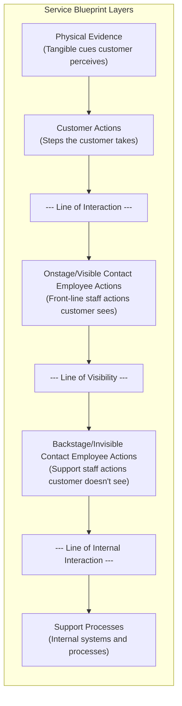
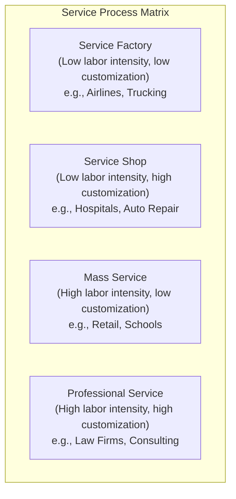

## Service Design Fundamentals

### Overview

Service design is the discipline of planning, structuring, and organizing the people, infrastructure, communication, and material components of a service in order to improve its quality, the interaction between the service provider and the customer, and the experience for both. Unlike goods, which are tangible and can be produced, inventoried, and inspected before reaching the customer, services are typically created and consumed simultaneously, involve direct customer participation, and cannot be stored. These distinctive characteristics require fundamentally different design approaches than those used for physical products.

Service design sits within the broader field of Product and Service Design in operations management, and draws on principles from operations research, marketing, human factors engineering, and increasingly, user experience (UX) design.

### The Four Distinctive Characteristics of Services (IHIP Framework)

Services are traditionally distinguished from goods along four dimensions, often summarized by the acronym IHIP:

1. **Intangibility**: Services cannot be seen, touched, or physically possessed before purchase. A customer cannot "try before they buy" a haircut or a consulting engagement the way they can test-drive a car. This makes quality harder to evaluate in advance and increases reliance on cues like reputation, physical evidence, and staff behavior.
2. **Heterogeneity (Variability)**: Service quality can vary from one delivery instance to the next, even from the same provider, because human performance is inherently variable. A restaurant meal prepared by the same chef can differ slightly each time; a call center interaction depends on which representative answers.
3. **Inseparability (Simultaneous Production and Consumption)**: Services are typically produced and consumed at the same time, often with the customer present during production. This means quality control must happen in real time rather than through post-production inspection, and the customer's own behavior can directly affect service outcomes.
4. **Perishability**: Unused service capacity cannot be stored for later use. An empty hotel room tonight, an empty seat on a departed flight, or an idle hour of a consultant's time represents permanently lost capacity and revenue opportunity.

**Key Points**

- These four characteristics collectively explain why services require different quality management, capacity planning, and design approaches than manufactured goods.
- Most real-world offerings exist on a goods-services continuum rather than being purely one or the other (e.g., a restaurant combines a tangible product—food—with an intangible service—the dining experience).

### The Service Package

Every service offering can be decomposed into a "service package" consisting of five elements, a framework developed to help designers systematically address all dimensions of a service:

| Element | Description | Example (Hotel Stay) |
| --- | --- | --- |
| Supporting Facility | The physical structure/location needed to deliver the service | Hotel building, lobby, parking |
| Facilitating Goods | Physical materials consumed or used during service delivery | Toiletries, bed linens, key cards |
| Information | Data provided by/to the customer needed for service delivery | Reservation details, checkout instructions |
| Explicit Services | Directly observable, essential benefits of the service | Clean room, working amenities |
| Implicit Services | Psychological or extrinsic benefits the customer experiences | Sense of privacy, status, comfort |

### Service Design Frameworks and Tools

#### Service Blueprinting

Service blueprinting is the most widely used technical tool in service design, mapping the entire service delivery process across multiple horizontal layers to visualize what the customer experiences versus what happens behind the scenes.

**Key components of a service blueprint:**

- **Physical evidence**: Tangible items the customer encounters at each step (signage, receipts, uniforms, facilities) that shape perception of quality.
- **Customer actions**: The sequence of steps the customer performs (e.g., arriving, checking in, waiting, receiving service, paying, leaving).
- **Line of interaction**: Separates customer actions from direct employee/system interactions; crossing this line represents a direct customer-provider touchpoint.
- **Onstage (visible) contact employee actions**: What service employees do that the customer can directly observe (e.g., a receptionist greeting a guest).
- **Line of visibility**: Separates what the customer can see from what happens behind the scenes.
- **Backstage (invisible) contact employee actions**: Support activities employees perform that the customer does not see (e.g., a kitchen preparing food).
- **Line of internal interaction**: Separates employee actions from internal support processes and systems.
- **Support processes**: Internal systems, IT infrastructure, and administrative processes that enable service delivery but never directly touch the customer (e.g., inventory management systems, payment processing backend).

**Example**: A restaurant service blueprint would show: physical evidence (menu, table setting) → customer actions (being seated, ordering, eating, paying) → line of interaction → onstage actions (waiter taking order, serving food) → line of visibility → backstage actions (kitchen cooking, dishwashing) → line of internal interaction → support processes (food supplier ordering, POS system).

#### Fail-Safing (Poka-Yoke for Services)

Because services are produced in real time with direct customer involvement, service design incorporates fail-safing methods adapted from manufacturing poka-yoke principles, applied to three failure points:

- **Server (Employee) Fail-Safing**: Checklists, standardized scripts, color-coded materials, or physical constraints that prevent employee errors (e.g., a fast-food register that won't process an order until all items are entered correctly).
- **Customer Fail-Safing**: Design features that prevent customer errors, such as take-a-number systems preventing queue-jumping, or physical barriers guiding customers through a line.
- **Servicescape (Environment) Fail-Safing**: Physical layout and design choices that prevent errors, such as clearly marked exits, entrance-only turnstiles, or drive-through order confirmation screens.

#### The Servicescape

The "servicescape" refers to the physical environment in which a service is delivered, and its deliberate design to influence customer behavior, perception, and employee performance. Key dimensions include:

- **Ambient conditions**: Temperature, lighting, noise, music, and scent.
- **Spatial layout and functionality**: How furniture, equipment, and pathways are arranged to support efficient flow and task completion.
- **Signs, symbols, and artifacts**: Wayfinding signage, décor, and branding elements that communicate the service's identity and guide customer behavior.

### Service Positioning: The Service-Process Matrix

Services can be classified along two dimensions — degree of labor intensity and degree of customization/customer interaction — to determine appropriate process design, staffing models, and management focus.

- **Service Factory** (low labor intensity, low customization): Capital-intensive, standardized, high-volume operations (e.g., airlines, hotels, package delivery). Management focus: capacity utilization, technology investment, scheduling.
- **Service Shop** (low labor intensity, high customization): Capital-intensive but tailored to individual customer needs (e.g., hospitals, repair shops). Management focus: balancing standardization with customization.
- **Mass Service** (high labor intensity, low customization): Labor-driven, standardized processes serving many customers similarly (e.g., retail stores, schools). Management focus: employee training, scripting, hiring.
- **Professional Service** (high labor intensity, high customization): Highly skilled, individualized labor with deep customer interaction (e.g., legal services, management consulting, medical specialists). Management focus: talent retention, judgment-based quality, relationship management.

### Customer Contact and Service Design Implications

The **degree of customer contact** — how much direct interaction occurs between the customer and the service delivery system — is a foundational design variable, following principles established by Richard Chase's customer contact model.

**Key Points**

- **High-contact services** (e.g., healthcare, hospitality, education) require design attention to the physical environment, employee interpersonal skills, and real-time quality management, since the customer directly observes and influences the process.
- **Low-contact services** (e.g., back-office check processing, cloud computing infrastructure) can be designed more like manufacturing operations, emphasizing efficiency, standardization, and cost minimization, since the customer is decoupled from the production process.
- Many service organizations deliberately **decouple** high-contact and low-contact activities (a strategy sometimes called the "line of visibility" separation), allowing back-office operations to be optimized for efficiency while front-office operations are optimized for customer experience.

### Managing Service Quality: The SERVQUAL Model

SERVQUAL is a widely used framework and survey instrument for measuring service quality as the gap between customer expectations and customer perceptions, developed by Parasuraman, Zeithaml, and Berry in the 1980s. It assesses quality across five dimensions:

1. **Reliability**: The ability to perform the promised service dependably and accurately.
2. **Responsiveness**: Willingness to help customers and provide prompt service.
3. **Assurance**: Employee knowledge, courtesy, and ability to inspire trust and confidence.
4. **Empathy**: Caring, individualized attention provided to customers.
5. **Tangibles**: The appearance of physical facilities, equipment, personnel, and communication materials.

The core SERVQUAL gap can be expressed conceptually as:

$$Quality\ Score = Perception - Expectation$$

A positive score indicates perceived quality exceeded expectations; a negative score indicates a service quality shortfall requiring design or delivery intervention.

### Service Recovery

Because service failures cannot always be prevented (given variability and real-time production), service design must incorporate **service recovery** processes — planned responses to service failures aimed at restoring customer satisfaction. Key principles include:

- **Empowerment**: Giving front-line employees authority to resolve problems on the spot without escalation, reducing recovery time.
- **The Service Recovery Paradox**: Research suggests that a customer who experiences a service failure that is then recovered exceptionally well can, in some cases, report higher satisfaction than a customer who experienced no failure at all. [Inference: this "paradox" effect is documented in services marketing research but is not universal — it depends heavily on failure severity, recovery speed, and customer attribution of blame, and does not apply to severe or repeated failures.]
- **Fair process**: Ensuring recovery includes outcome fairness (appropriate compensation), procedural fairness (a reasonable resolution process), and interactional fairness (respectful treatment).

### Applying DFMA-Style Thinking to Services

Analogous to Design for Manufacturability and Assembly in physical products, service design applies similar simplification principles:

- **Minimize service steps**: Reduce the number of touchpoints and handoffs a customer must navigate, since each additional step introduces delay and failure risk.
- **Standardize where customization isn't valued**: Apply mass-service standardization to steps that don't materially affect perceived value, reserving customization for high-value touchpoints.
- **Design self-service options**: Shift low-value, low-risk tasks to customer self-service (kiosks, apps, automated check-in) to reduce cost and wait time, while preserving high-contact human interaction for higher-value moments.
- **Poka-yoke critical touchpoints**: Apply fail-safing specifically at points identified as high-failure-risk in the service blueprint.

### Comparison: Goods Design vs. Service Design

| Dimension | Goods (Product) Design | Service Design |
| --- | --- | --- |
| Tangibility | Physical, inspectable before sale | Intangible, experienced during delivery |
| Quality Control Timing | Pre-delivery inspection possible | Real-time, during delivery |
| Inventory | Can be stockpiled | Cannot be stored (perishable capacity) |
| Customer Role | Passive recipient | Active participant/co-producer |
| Consistency | High, via automated production | Variable, dependent on human performance |
| Primary Design Tool | DFMA, CAD, engineering drawings | Service blueprint, servicescape design |
| Failure Detection | Before customer receives product | Often occurs during/after customer experience |

### Common Pitfalls in Service Design

- **Designing only the "onstage" experience** while neglecting backstage processes and support systems that ultimately determine whether the onstage promise can be reliably delivered.
- **Over-standardizing high-value personal interactions**, stripping out the empathy and judgment that customers value most in professional and high-contact services.
- **Ignoring capacity-perishability trade-offs**, leading to either excessive idle capacity (wasted cost) or chronic overbooking/queuing (poor customer experience).
- **Failing to fail-safe critical touchpoints**, leaving high-failure-risk steps (e.g., manual order entry, ambiguous signage) unaddressed until customer complaints accumulate.
- **Neglecting the physical servicescape**, underestimating how ambient conditions and spatial layout shape customer perception of quality independent of the core service itself.

### Relationship to Other Operations Management Concepts

- **Quality Function Deployment (QFD)**: Can be applied to services by treating "Voice of the Customer" and technical service requirements analogously to product QFD, translating customer needs into measurable service standards.
- **Capacity Planning and Queuing Theory**: Because services are perishable and cannot be inventoried, service design is tightly coupled with capacity planning and waiting-line management to balance service level against cost.
- **Lean Service / Lean Thinking**: Waste elimination principles from lean manufacturing (excess waiting, unnecessary steps, non-value-added handoffs) apply directly to service process redesign.
- **Total Quality Management (TQM) and Six Sigma**: SERVQUAL and service recovery processes are often integrated into broader TQM/Six Sigma quality management systems.

**Related Topics**

- Service blueprinting techniques and notation standards
- Queuing theory and waiting-line management
- Capacity planning for perishable services
- SERVQUAL and other service quality measurement models
- Service recovery strategies and employee empowerment
- Servicescape design and environmental psychology
- Lean service and waste elimination in service processes
- Customer contact theory (Chase's model)
- Self-service technology and automation in service delivery
- Quality Function Deployment (QFD) applied to services