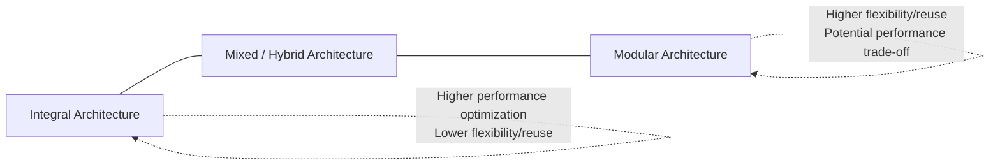
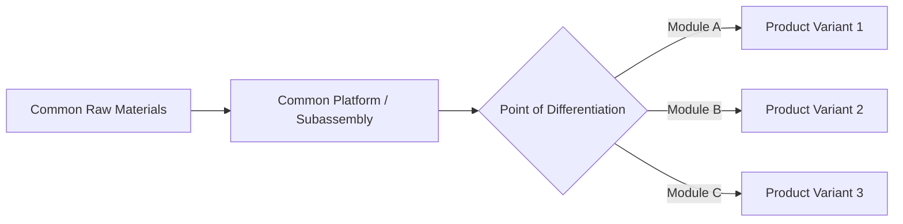

## Modular Design and Product Platforms

### Overview

Modular design is a product architecture strategy in which a product is decomposed into independent, interchangeable modules (or components) that can be combined, substituted, or reconfigured to create variety across a product line, while a product platform refers to the common set of components, subsystems, and interfaces shared across a family of related products. Together, these concepts allow organizations to offer high external variety to customers while maintaining low internal complexity in design, manufacturing, and supply chain operations.

This approach directly addresses one of the central tensions in operations management: the trade-off between **product variety** (which drives customer satisfaction and market coverage) and **manufacturing complexity** (which drives cost, lead time, and quality risk). Modularity and platforming are the primary architectural strategies used to resolve this tension, enabling what is broadly termed **mass customization**.

### Core Concepts

#### Product Architecture: Modular vs. Integral

Product architecture describes how a product's function is mapped to its physical components, and falls along a spectrum from purely integral to purely modular.

- **Integral architecture**: Functions are distributed across multiple components, and components perform multiple functions. Interfaces between components are often complex, coupled, and product-specific. Integral designs can achieve higher performance optimization (e.g., a Formula 1 chassis) but are harder to modify, repair, or reuse across products.
- **Modular architecture**: Each module performs one or a few well-defined functions, and interacts with other modules through standardized, well-defined interfaces. Modules can be developed, manufactured, tested, upgraded, or replaced independently.

#### Types of Modularity

1. **Component-Sharing Modularity**: The same component is used across multiple distinct products (e.g., the same motor used in multiple power tool models).
2. **Component-Swapping Modularity**: Different modules can be swapped into a common base/platform to create different product variants (e.g., different camera lenses on the same camera body).
3. **Cut-to-Fit Modularity**: A component can be adjusted or resized within a standardized architecture (e.g., adjustable shelving in modular furniture).
4. **Mix Modularity**: Combining modules from a set produces a product where individual modules lose their distinct identity in the final product (e.g., paint color mixing).
5. **Bus Modularity**: Multiple different modules attach to a common standardized structural element ("bus"), similar to how peripherals attach to a computer's bus architecture.
6. **Sectional Modularity**: Any module can connect to any other module through a standardized interface, without a fixed base component (e.g., modular sofa sectional pieces, LEGO bricks).

### Product Platforms

A product platform is the set of subsystems, interfaces, and components that remain common (or nearly common) across a family or family of products, from which derivative products are efficiently developed.

**Key Points**

- Platforms reduce redundant engineering effort: once a platform is validated, derivative products can be developed faster and at lower cost by reusing validated subsystems.
- Platforms enable economies of scale in purchasing and manufacturing, since shared components are produced in higher aggregate volumes even though individual end products may be lower-volume.
- Platform strategy directly supports **product family planning**, allowing an organization to position multiple products at different price points and market segments while sharing underlying engineering investment.

#### Platform Architecture Types

- **Modular Platform**: Distinct product variants are created by swapping modules onto a common platform (e.g., automotive platforms like the Volkswagen Group's MQB platform, which underlies multiple vehicle models across different brands and body styles).
- **Scalable Platform**: The platform itself can be stretched, scaled, or resized (e.g., extending a vehicle wheelbase, or scaling a circuit board layout) to produce variants of different size or capacity.
- **Generational Platform**: A platform evolves over time through successive generations, with each new generation replacing components while maintaining a stable overall architecture.

### The Modularity-Variety-Complexity Relationship

Modular design allows organizations to achieve **external variety** (the number of distinct product configurations visible to the customer) while limiting **internal variety** (the number of distinct components and processes the organization must actually design, source, and manage).

The multiplicative potential of modularity can be expressed conceptually. If a product architecture has $k$ independent module categories, each with $n_i$ available options:

$$V_{external} = \prod_{i=1}^{k} n_i$$

**Example**: A laptop platform with 3 processor options, 4 memory configurations, 3 storage options, and 2 color choices can generate:

$$V_{external} = 3 \times 4 \times 3 \times 2 = 72 \text{ distinct configurations}$$

...from only $3 + 4 + 3 + 2 = 12$ actual unique components that must be designed, sourced, and inventoried. This demonstrates how modularity allows variety to scale multiplicatively while component complexity scales only additively.

### Key Design Principles for Modularity

1. **Function-to-module mapping**: Assign each distinct product function to a discrete module wherever possible, minimizing functions that span multiple modules.
2. **Standardized interfaces**: Define clear, stable interface specifications (mechanical, electrical, data, or software) between modules so that any compliant module can connect to any compliant counterpart.
3. **Decoupling**: Minimize interdependencies between modules so that a change in one module does not require redesign of others.
4. **Commonality maximization**: Identify which components can be shared across the entire product family versus which must remain product-specific to preserve differentiation.
5. **Delayed differentiation (postponement)**: Design the product and process so that product-specific customization happens as late as possible in the production/supply chain, keeping upstream stages common across the family.

### Delayed Differentiation (Postponement) and Modularity

Modular design is the primary structural enabler of **postponement** strategy, in which the point of product differentiation is deliberately delayed until closer to the point of customer demand, reducing forecasting risk and finished-goods inventory.

**Example**: Paint retailers stock base (uncolored) paint and add pigment at the point of sale rather than manufacturing and stocking every color in advance; this is a classic postponement strategy enabled by a modular "mix" architecture.

### Trade-offs and Limitations

**Key Points**

- **Performance ceiling**: Modular architectures often sacrifice some degree of system-level optimization compared to fully integral designs, since standardized interfaces impose constraints that a custom, product-specific design would not have. [Inference: this performance trade-off is a well-established principle in product architecture literature, though its magnitude varies significantly by product category and how tightly interfaces are specified.]
- **Interface design cost**: Significant upfront engineering investment is required to define robust, future-proof module interfaces; poorly designed interfaces can undermine the entire platform strategy.
- **Cannibalization and brand differentiation risk**: Excessive component sharing across a product family (especially across different price tiers or brands) can blur perceived differentiation and erode premium positioning if customers become aware of shared underlying components.
- **Platform lock-in risk**: Once a platform is heavily invested in, subsequent products may be constrained by platform limitations even when a fully custom design would better serve a new market segment, creating a form of architectural inertia.
- **Quality propagation risk**: A defect in a shared platform component can propagate across the entire product family simultaneously, unlike an integral design where defects are typically isolated to a single product (a consideration relevant to recall management and supplier quality control).

### Modularity in Software and Systems Design

While originating in physical product design, modularity principles extend directly to software architecture (e.g., microservices, modular monoliths, plug-in architectures) and service design (e.g., modular service bundles). The same core logic applies: standardized interfaces (APIs) allow independent modules (services) to be developed, deployed, tested, and scaled independently, while combining to deliver varied end-user functionality.

### Diagram: Modular Platform Architecture (svg_diagram)

<svg xmlns="http://www.w3.org/2000/svg" viewBox="0 0 640 380" font-family="Arial, sans-serif">
<text x="320" y="22" font-size="16" font-weight="bold" text-anchor="middle" fill="#1a1a1a">Modular Platform Architecture (svg_diagram)</text>

<rect x="180" y="50" width="280" height="70" rx="8" fill="#eaf2fb" stroke="#3b6fa0" stroke-width="2" />
<text x="320" y="80" font-size="13" font-weight="bold" text-anchor="middle" fill="#1a3c5e">Common Platform</text>
<text x="320" y="98" font-size="10" text-anchor="middle" fill="#1a3c5e">(Chassis, core electronics, shared interfaces)</text>

<line x1="240" y1="120" x2="120" y2="180" stroke="#555" stroke-width="2" />
<line x1="320" y1="120" x2="320" y2="180" stroke="#555" stroke-width="2" />
<line x1="400" y1="120" x2="520" y2="180" stroke="#555" stroke-width="2" />

<rect x="60" y="180" width="120" height="50" rx="6" fill="#eafbea" stroke="#3b8f4a" stroke-width="2" />
<text x="120" y="210" font-size="10" text-anchor="middle" fill="#1a4d24">Module A Option 1</text>
<rect x="260" y="180" width="120" height="50" rx="6" fill="#eafbea" stroke="#3b8f4a" stroke-width="2" />
<text x="320" y="210" font-size="10" text-anchor="middle" fill="#1a4d24">Module A Option 2</text>
<rect x="460" y="180" width="120" height="50" rx="6" fill="#eafbea" stroke="#3b8f4a" stroke-width="2" />
<text x="520" y="210" font-size="10" text-anchor="middle" fill="#1a4d24">Module A Option 3</text>

<line x1="120" y1="230" x2="120" y2="270" stroke="#999" stroke-width="1.5" stroke-dasharray="4,3" />
<line x1="320" y1="230" x2="320" y2="270" stroke="#999" stroke-width="1.5" stroke-dasharray="4,3" />
<line x1="520" y1="230" x2="520" y2="270" stroke="#999" stroke-width="1.5" stroke-dasharray="4,3" />
<rect x="60" y="270" width="120" height="50" rx="6" fill="#fbeaea" stroke="#a03b3b" stroke-width="2" />
<text x="120" y="298" font-size="10" text-anchor="middle" fill="#5e1a1a">Product Variant 1</text>
<rect x="260" y="270" width="120" height="50" rx="6" fill="#fbeaea" stroke="#a03b3b" stroke-width="2" />
<text x="320" y="298" font-size="10" text-anchor="middle" fill="#5e1a1a">Product Variant 2</text>
<rect x="460" y="270" width="120" height="50" rx="6" fill="#fbeaea" stroke="#a03b3b" stroke-width="2" />
<text x="520" y="298" font-size="10" text-anchor="middle" fill="#5e1a1a">Product Variant 3</text>

<text x="320" y="355" font-size="11" text-anchor="middle" fill="#555" font-style="italic">One platform + swappable modules = multiple end products</text>

</svg>

### Modularity's Role in Mass Customization

Modular design and product platforms are the primary structural enablers of **mass customization** — the ability to produce individually tailored products at costs approaching those of mass production. The relationship works as follows:

- Standardized, validated modules can be manufactured in high volume using efficient, repeatable processes (achieving mass-production economics).
- Late-stage configuration/assembly of modules into a final product allows individual customer-specific combinations (achieving customization).
- This combination avoids the traditional trade-off in which customization was assumed to require craft-based, low-volume, high-cost production.

### Common Pitfalls

- **Over-modularizing prematurely**: Attempting to modularize a product before core functional requirements and interfaces are stable can lock in poor interface decisions that are costly to revise later.
- **Under-investing in interface robustness**: Treating interface specification as a minor detail rather than a critical design deliverable, leading to compatibility issues as the platform evolves across generations.
- **Ignoring the brand/market differentiation implications** of visible component sharing, particularly across price-tiered product lines within the same company.
- **Neglecting platform governance**: Without a clear organizational process for approving changes to shared platform components, uncoordinated changes by different product teams can break compatibility across the family.
- **Conflating "modular" with "simple"**: A modular architecture with poorly designed interfaces can be more complex to manage than a well-executed integral design; modularity is a strategic trade-off, not an automatic simplification.

### Relationship to Other Operations Management Concepts

- **Design for Manufacturability and Assembly (DFMA)**: Modularity directly supports DFA goals by enabling standardized, repeatable assembly sequences across product variants built on a common platform.
- **Mass Customization**: Modularity and platforming are the core architectural strategies that make mass customization operationally feasible.
- **Supply Chain Management**: Shared platform components allow supply base consolidation, higher-volume purchasing leverage, and reduced supplier qualification overhead.
- **Inventory Management and Postponement**: Modular architecture enables delayed differentiation strategies that reduce finished-goods inventory risk and improve forecast accuracy at the component level (component-level demand is typically more stable and poolable than finished-product-level demand).
- **New Product Development (NPD) Process**: Platform strategy directly shapes NPD roadmaps, allowing derivative product development cycles to be significantly shorter than all-new platform development cycles.

**Related Topics**

- Mass customization strategies and enabling technologies
- Delayed differentiation (postponement) in supply chain design
- Design for Manufacturability and Assembly (DFMA)
- Product family planning and platform roadmapping
- Component commonality and standardization analysis
- Bill of Materials (BOM) structuring for configurable products
- New Product Development (NPD) process and stage-gate models
- Supply chain risk from shared component dependencies
- Configure-to-order and assemble-to-order production strategies
- Software modularity and API-driven system architecture