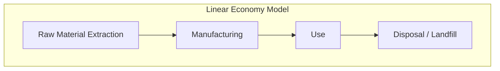
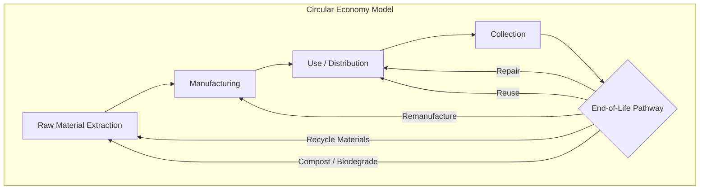

## Design for Sustainability and Circularity

### Overview

Design for Sustainability (DfS) and Design for Circularity (also called Design for Circular Economy, or DfCE) are design philosophies that extend traditional product design considerations beyond function, cost, and manufacturability to explicitly account for environmental impact across the entire product lifecycle — from raw material extraction through end-of-life disposal, reuse, or recycling. These approaches are increasingly formalized as part of the broader "Design for X" (DfX) family of methodologies within operations management, sitting alongside Design for Manufacturability and Assembly (DFMA) as a core early-stage design consideration.

Design for Circularity specifically applies principles from the **circular economy** — an economic model that aims to eliminate waste and keep materials in productive use for as long as possible, in contrast to the traditional **linear economy** model of "take-make-dispose."

### Linear vs. Circular Economic Models

In a linear model, value is extracted once and materials exit the economic system as waste. In a circular model, design decisions are made specifically to keep components, materials, or products cycling back into productive use, minimizing virgin resource extraction and waste generation.

### The R-Framework (Circularity Strategies Hierarchy)

Circular economy literature commonly organizes circularity strategies into a hierarchy, often summarized as the "R-strategies," ordered roughly from highest to lowest value retention:

1. **Refuse**: Eliminate the need for a product or function entirely (e.g., dematerializing a physical product into a digital service).
2. **Reduce**: Minimize material and resource consumption in manufacturing and use (e.g., lightweighting, reduced packaging).
3. **Reuse**: Enable a product to be used again, by another user, in its original form and function with minimal modification.
4. **Repair**: Enable restoration of a broken product to working condition, extending its useful life.
5. **Refurbish**: Restore an older product to good working condition, typically updating it to current standards.
6. **Remanufacture**: Disassemble a product and rebuild it to original (or better) specifications using a combination of reused, repaired, and new parts.
7. **Repurpose**: Use a discarded product or its parts in a different product with a different function.
8. **Recycle**: Process materials to recover raw material inputs for new products, typically the lowest-value circular strategy since it usually involves degradation of material quality ("downcycling").
9. **Recover (Energy Recovery)**: Incinerate materials that cannot be recycled to recover energy, generally considered the last resort before landfill within the circular hierarchy.

**Key Points**

- Strategies higher on this hierarchy (Refuse, Reduce, Reuse) generally retain more of the original product's embedded value (materials, energy, labor) than lower strategies (Recycle, Recover).
- Design decisions made early in product development determine which R-strategies are even feasible later; a product not designed for disassembly, for example, cannot be efficiently remanufactured or recycled regardless of end-of-life intentions.

### Core Design for Circularity Principles

1. **Design for Disassembly (DfD)**: Structure products so they can be taken apart efficiently at end-of-life, using accessible fasteners (screws, snap-fits designed for reversibility) rather than permanent bonding methods (adhesives, welds, rivets) that prevent separation of materials or components.
2. **Material Selection for Recyclability**: Favor mono-materials or easily separable material combinations over composite or bonded multi-material assemblies, which are difficult or impossible to recycle economically. Avoid material combinations that contaminate recycling streams (e.g., certain plastic-metal laminates).
3. **Design for Durability**: Extend product lifespan through robust component selection and structural design, directly supporting the "Reduce" and "Reuse" strategies by delaying the need for replacement.
4. **Design for Modularity and Repairability**: As covered under modular design principles, modular architectures with accessible, replaceable components directly enable repair, refurbishment, and remanufacturing strategies. Standardized fasteners, documented repair procedures, and available spare parts all support this.
5. **Design for Reduced Material Diversity**: Minimize the number of distinct materials and material grades used in a single product, reducing sorting complexity at end-of-life.
6. **Design for Longevity of Function**: Design products (particularly electronics) so that core hardware can support extended software/firmware life, avoiding "planned obsolescence" dynamics where hardware remains functional but software support is discontinued.
7. **Design Out Hazardous Substances**: Eliminate or minimize substances that complicate safe recycling or pose environmental/health risks (e.g., certain flame retardants, heavy metals), often driven by regulatory frameworks such as RoHS (Restriction of Hazardous Substances).

### Life Cycle Assessment (LCA)

Life Cycle Assessment is the primary quantitative analytical tool used to evaluate the environmental impact of a product across its full lifecycle, providing the data foundation for sustainability-driven design decisions. LCA follows a standardized methodology (formalized in ISO 14040 and ISO 14044) consisting of four phases:

1. **Goal and Scope Definition**: Defines the purpose of the study, the system boundaries (e.g., cradle-to-gate, cradle-to-grave, cradle-to-cradle), and the functional unit of comparison.
2. **Life Cycle Inventory (LCI) Analysis**: Quantifies all material and energy inputs and outputs (emissions, waste, resource use) across every stage within the defined system boundary.
3. **Life Cycle Impact Assessment (LCIA)**: Translates inventory data into environmental impact categories, such as global warming potential (measured in CO2-equivalent), resource depletion, water use, and eutrophication potential.
4. **Interpretation**: Analyzes results to identify the most significant environmental "hotspots" in the product lifecycle, informing design priorities.

**Common LCA System Boundary Definitions:**

| Boundary Type | Scope |
| --- | --- |
| Cradle-to-Gate | Raw material extraction through factory gate (excludes use and disposal) |
| Cradle-to-Grave | Full lifecycle: raw material extraction through end-of-life disposal |
| Cradle-to-Cradle | Full lifecycle including recycling/reuse back into new production, reflecting circular economy principles |
| Gate-to-Gate | Single production step or facility only |

### Circular Business Models Enabled by Design

Design for circularity is often paired with new business models that shift incentive structures toward product longevity rather than single-sale transactions:

- **Product-as-a-Service (PaaS)**: The manufacturer retains ownership of the product and sells access/function (e.g., "lighting as a service" instead of selling light fixtures), creating direct manufacturer incentive to design for durability, repairability, and eventual remanufacturing, since the manufacturer bears the full lifecycle cost.
- **Take-Back and Reverse Logistics Programs**: Manufacturers establish systems to collect used products directly from customers for refurbishment, remanufacturing, or recycling, requiring product designs compatible with efficient reverse logistics handling.
- **Extended Producer Responsibility (EPR)**: A regulatory policy approach (widely implemented in the EU and increasingly elsewhere) that legally obligates manufacturers to manage the environmental impact of their products at end-of-life, creating direct financial incentive for circular design.

### Design Metrics for Circularity and Sustainability

| Metric | Description |
| --- | --- |
| Material Circularity Indicator (MCI) | Measures the proportion of a product's material flow that is restorative/circular vs. linear (virgin input, landfill output) |
| Recyclability Rate | Percentage of product mass that can be technically and economically recycled at end-of-life |
| Disassembly Time | Time required to fully or partially disassemble a product into separable material/component streams |
| Recycled Content Percentage | Proportion of a product's material sourced from recycled rather than virgin material |
| Embodied Carbon | Total greenhouse gas emissions associated with material extraction, processing, and manufacturing of a product |
| Product Lifespan / Durability Rating | Expected functional lifetime under normal use conditions |

### Diagram: Design for Circularity Decision Framework (svg_diagram)

<svg xmlns="http://www.w3.org/2000/svg" viewBox="0 0 660 360" font-family="Arial, sans-serif">
<text x="330" y="22" font-size="16" font-weight="bold" text-anchor="middle" fill="#1a1a1a">Design for Circularity Decision Framework (svg_diagram)</text>
<rect x="30" y="55" width="180" height="70" rx="8" fill="#eaf2fb" stroke="#3b6fa0" stroke-width="2" />
<text x="120" y="85" font-size="12" font-weight="bold" text-anchor="middle" fill="#1a3c5e">Material Selection</text>
<text x="120" y="103" font-size="10" text-anchor="middle" fill="#1a3c5e">Mono-materials, recycled content</text>
<rect x="240" y="55" width="180" height="70" rx="8" fill="#eafbea" stroke="#3b8f4a" stroke-width="2" />
<text x="330" y="85" font-size="12" font-weight="bold" text-anchor="middle" fill="#1a4d24">Assembly Method</text>
<text x="330" y="103" font-size="10" text-anchor="middle" fill="#1a4d24">Reversible fasteners vs. bonding</text>
<rect x="450" y="55" width="180" height="70" rx="8" fill="#fdf0d5" stroke="#a0743b" stroke-width="2" />
<text x="540" y="85" font-size="12" font-weight="bold" text-anchor="middle" fill="#5e451a">Modularity Level</text>
<text x="540" y="103" font-size="10" text-anchor="middle" fill="#5e451a">Replaceable, upgradable parts</text>
<line x1="120" y1="125" x2="330" y2="180" stroke="#555" stroke-width="2" />
<line x1="330" y1="125" x2="330" y2="180" stroke="#555" stroke-width="2" />
<line x1="540" y1="125" x2="330" y2="180" stroke="#555" stroke-width="2" />
<rect x="220" y="180" width="220" height="55" rx="8" fill="#fbeaea" stroke="#a03b3b" stroke-width="2" />
<text x="330" y="205" font-size="12" font-weight="bold" text-anchor="middle" fill="#5e1a1a">Life Cycle Assessment (LCA)</text>
<text x="330" y="222" font-size="10" text-anchor="middle" fill="#5e1a1a">Quantify environmental hotspots</text>
<line x1="330" y1="235" x2="330" y2="265" stroke="#555" stroke-width="2" />
<rect x="180" y="265" width="300" height="55" rx="8" fill="#f0eaf9" stroke="#6b3ba0" stroke-width="2" />
<text x="330" y="290" font-size="12" font-weight="bold" text-anchor="middle" fill="#3a1a5e">Optimal R-Strategy Selection</text>
<text x="330" y="307" font-size="10" text-anchor="middle" fill="#3a1a5e">Reuse / Repair / Remanufacture / Recycle</text>

<text x="330" y="345" font-size="11" text-anchor="middle" fill="#555" font-style="italic">Design inputs converge to determine feasible circular pathways</text>

</svg>

### Trade-offs and Challenges

**Key Points**

- **Durability vs. cost trade-off**: More durable materials and construction methods often carry higher upfront material and manufacturing costs, requiring business model alignment (e.g., PaaS) to justify the investment. [Inference: this cost trade-off is a general economic tendency widely discussed in sustainable design literature, though the magnitude depends heavily on material choice, category, and the specific durability improvement targeted.]
- **Recyclability vs. performance trade-off**: Mono-material designs favored for recyclability can sometimes underperform multi-material composite designs on weight, strength, or other functional criteria (e.g., carbon-fiber composites offer superior strength-to-weight ratio but are extremely difficult to recycle compared to mono-material metal alternatives).
- **Modularity vs. integration trade-off**: As with modular design generally, designing for disassembly and repairability can conflict with the tight integration that sometimes enables the smallest, lightest, or most cost-efficient product form (a frequently cited tension in consumer electronics design).
- **Data and measurement complexity**: Conducting a rigorous LCA requires extensive data across a supply chain that may span many tiers and geographies, and results can be sensitive to methodological choices (system boundaries, functional unit definition), which can make cross-product or cross-study comparisons difficult without careful normalization.
- **End-of-life infrastructure dependency**: Even a well-designed circular product depends on the existence of adequate collection, sorting, and processing infrastructure in the markets where it is sold; design for circularity does not guarantee circular outcomes without a supporting reverse logistics ecosystem.

### Regulatory and Market Drivers

- **Extended Producer Responsibility (EPR) legislation**: Increasingly widespread regulatory frameworks, particularly in the European Union, that shift end-of-life management costs and responsibilities onto manufacturers, directly incentivizing circular design.
- **Right-to-Repair legislation**: Emerging regulation in multiple jurisdictions requiring manufacturers to make repair information, parts, and tools available to consumers and independent repair shops, reinforcing design-for-repairability as a compliance consideration rather than a purely voluntary choice.
- **EU Ecodesign for Sustainable Products Regulation (ESPR)**: A regulatory framework establishing mandatory sustainability and circularity requirements (including durability, reparability, and recyclability criteria) for products sold in the EU market. [Unverified: specific regulatory requirements and implementation timelines continue to evolve; readers should consult current official EU documentation for the latest applicable requirements.]
- **Corporate ESG (Environmental, Social, Governance) commitments**: Voluntary corporate sustainability targets increasingly drive internal design standards ahead of, or independent from, regulatory mandates.

### Common Pitfalls

- **"Greenwashing" through superficial claims**: Marketing sustainability attributes (e.g., "recyclable") without addressing whether recycling infrastructure actually exists for the specific material/product combination in target markets.
- **Optimizing a single lifecycle stage in isolation**: Focusing narrowly on manufacturing-phase emissions while ignoring larger impacts in the use phase (e.g., energy-consuming products) or end-of-life phase, missing the stage where the greatest environmental hotspot actually occurs.
- **Treating circularity as purely a materials issue**: Underestimating the role of business model design (ownership structures, take-back programs) in actually achieving circular outcomes, since even a perfectly circular-designed product will not be circular in practice without a functioning collection and reprocessing system.
- **Retrofitting circularity late in development**: Attempting to add disassembly or recyclability features after core architecture is finalized, missing the majority of achievable impact, since (as with DFMA generally) the greatest sustainability leverage exists in early concept and architecture decisions.

### Relationship to Other Operations Management Concepts

- **Design for Manufacturability and Assembly (DFMA)**: Design for Disassembly is often described as "DFMA in reverse," applying similar principles of simplified fastening, part reduction, and material standardization, but optimized for end-of-life separation rather than initial assembly.
- **Modular Design and Product Platforms**: Modularity is a direct structural enabler of repairability, upgradability, and remanufacturing, connecting circular design directly to platform strategy.
- **Supply Chain Management**: Circular design requires corresponding reverse logistics network design, extending traditional forward-flow supply chain management to include return, sorting, and reprocessing flows.
- **Total Cost of Ownership (TCO)**: Circular and durability-focused design decisions shift the cost/value calculus from unit production cost toward full lifecycle cost, relevant to both manufacturer (under PaaS models) and end customer.
- **Quality Function Deployment (QFD)**: Sustainability and circularity requirements can be incorporated as explicit "customer requirements" or regulatory constraints within a House of Quality analysis, ensuring they are weighted alongside traditional performance and cost criteria.

**Related Topics**

- Life Cycle Assessment (LCA) methodology (ISO 14040/14044)
- Extended Producer Responsibility (EPR) and Right-to-Repair regulation
- Design for Disassembly (DfD) techniques
- Reverse logistics and closed-loop supply chain design
- Product-as-a-Service (PaaS) and servitization business models
- Modular design and product platforms
- Design for Manufacturability and Assembly (DFMA)
- Material Circularity Indicator (MCI) and other circularity metrics
- Cradle-to-cradle design philosophy
- Sustainable supply chain management