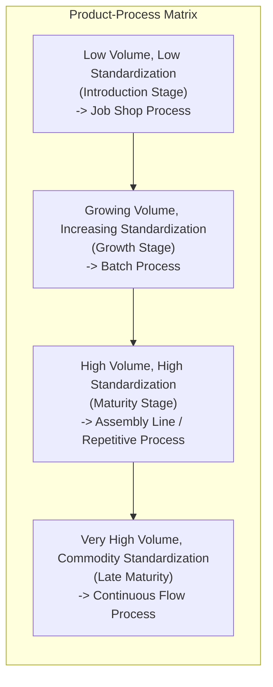

## Managing the Product Life Cycle

### Overview

The Product Life Cycle (PLC) is a foundational operations and marketing management concept describing the stages a product passes through from its market introduction to its eventual decline and withdrawal, and the corresponding shifts in operations strategy, cost structure, competitive dynamics, and process design required at each stage. Managing the product life cycle means deliberately aligning operational decisions — capacity planning, process selection, quality focus, and cost management — with the specific stage a product currently occupies, since a strategy well-suited to one stage can be actively harmful if applied at another.

This concept connects directly to the earlier stages of product design covered in this chapter: decisions made during design (modularity, DFMA, platform strategy) directly shape how efficiently an organization can navigate later life cycle transitions, particularly the shift from low-volume/high-variability introduction to high-volume/standardized maturity.

### The Four Classic Stages of the Product Life Cycle

The PLC is typically visualized as a curve of sales volume (or revenue) plotted against time, forming an S-shaped (sigmoid) growth pattern followed by eventual decline.

#### 1. Introduction Stage

- **Market characteristics**: Low sales volume, slow market awareness growth, high uncertainty about product-market fit.
- **Process design focus**: Low-volume, flexible ("job shop" or low-volume batch) processes, since production volumes don't yet justify capital investment in specialized, high-volume equipment. Frequent design changes are still common as the product is refined based on early market feedback.
- **Cost structure**: High unit costs due to low production volumes, significant R&D and marketing investment, minimal or negative profit margins.
- **Quality focus**: Product reliability and performance validation are critical, since early adopters and reviewers heavily influence broader market perception.
- **Competitive dynamics**: Few or no direct competitors; competition is often against the "status quo" alternative rather than rival products.

#### 2. Growth Stage

- **Market characteristics**: Rapid sales growth as the product gains market acceptance and awareness spreads.
- **Process design focus**: Transition toward more standardized, higher-volume processes begins; capacity expansion becomes a priority to keep pace with demand. Process flexibility becomes less critical than throughput as design stabilizes.
- **Cost structure**: Unit costs begin declining due to economies of scale and accumulated production experience (see learning curve effects); profit margins typically improve significantly.
- **Quality focus**: Process capability and consistency become increasingly important as production volume scales; defect rates that were tolerable at low volume become costly at high volume.
- **Competitive dynamics**: Competitors begin entering the market, drawn by demonstrated demand; differentiation and market share capture become strategic priorities.

#### 3. Maturity Stage

- **Market characteristics**: Sales growth slows and plateaus as the market becomes saturated; this is typically the longest stage of the life cycle for most products.
- **Process design focus**: Production shifts toward highly standardized, efficient, often automated ("line" or continuous flow) processes optimized for cost minimization rather than flexibility, since product design has stabilized.
- **Cost structure**: Unit costs are typically at their lowest point due to accumulated economies of scale and process optimization; competition increasingly shifts to price.
- **Quality focus**: Consistency, defect reduction, and cost efficiency dominate; incremental process improvement (kaizen-style continuous improvement) becomes the primary quality lever rather than major redesign.
- **Competitive dynamics**: Market is typically fragmented among established competitors; differentiation shifts toward brand, service, incremental features, and cost leadership.

#### 4. Decline Stage

- **Market characteristics**: Sales decline as customer needs shift, substitute products emerge, or the market becomes saturated with replacement demand only.
- **Process design focus**: Organizations typically reduce capacity, consolidate production, or shift toward simplified/lower-cost processes; some organizations deliberately avoid further capital investment in aging product lines.
- **Cost structure**: Depends heavily on strategic choice — organizations "milking" the product for residual cash flow minimize further investment, while those planning exit focus on orderly capacity reduction and inventory liquidation.
- **Quality focus**: Often shifts to "good enough" maintenance quality rather than continued improvement investment, unless a deliberate revival/repositioning strategy is pursued.
- **Competitive dynamics**: Weaker competitors typically exit the market first; remaining competitors may consolidate market share among a shrinking customer base.

### Operations Strategy Shifts Across the Life Cycle

| Dimension | Introduction | Growth | Maturity | Decline |
| --- | --- | --- | --- | --- |
| Process type | Job shop / flexible batch | Batch transitioning to line | Line / continuous flow | Simplified or reduced-scale |
| Capacity strategy | Minimal, cautious investment | Aggressive capacity expansion | Capacity optimization | Capacity reduction/consolidation |
| Cost priority | Secondary to speed-to-market | Balancing growth investment with margin | Primary competitive lever | Cash flow preservation |
| Quality priority | Product performance validation | Process consistency at scale | Defect reduction, efficiency | Maintenance-level quality |
| Product design changes | Frequent, exploratory | Narrowing toward dominant design | Minimal, incremental only | Minimal or none |
| Key operational risk | Poor product-market fit | Capacity shortfall vs. demand surge | Margin erosion from competition | Excess capacity, obsolete inventory |

### The Product-Process Matrix (Hayes-Wheelwright Framework)

The Product-Process Matrix, developed by Robert Hayes and Steven Wheelwright, formalizes the relationship between a product's life cycle stage (and corresponding volume/standardization level) and the appropriate process choice, providing a structural explanation for why process strategy must evolve as a product matures.

**Key Points**

- The diagonal of this matrix represents the "natural" alignment between product life cycle stage and process choice; organizations that deviate significantly from this diagonal (e.g., using a rigid assembly line for a low-volume, still-evolving introduction-stage product) typically incur excess cost, inflexibility, or missed efficiency, depending on the direction of mismatch.
- Moving down the diagonal (toward higher volume, more standardized processes) generally trades flexibility for efficiency; moving up trades efficiency for flexibility.

### The Learning Curve Effect

As cumulative production volume increases through the growth and maturity stages, unit costs typically decline in a predictable pattern known as the **learning curve** (or experience curve) effect, driven by accumulated process knowledge, workforce proficiency, and incremental process improvements.

The learning curve is commonly modeled as:

$$T_n = T_1 \times n^{b}$$

Where:

- $T_n$ = time (or cost) required to produce the $n$-th unit
- $T_1$ = time (or cost) required to produce the first unit
- $n$ = cumulative unit number
- $b = \frac{\ln(\text{learning rate})}{\ln 2}$, the learning curve exponent derived from the learning rate percentage

**Example**: With an 80% learning rate (meaning unit cost/time falls to 80% each time cumulative production doubles), $b = \frac{\ln(0.80)}{\ln(2)} \approx -0.322$. If the first unit takes 100 hours to produce, the 100th unit would take approximately:

$$T_{100} = 100 \times 100^{-0.322} \approx 100 \times 0.216 \approx 21.6 \text{ hours}$$

This mathematical relationship helps operations managers forecast cost declines and set pricing/capacity strategy as a product moves through growth into maturity.

### Managing Design Decisions Across the Life Cycle

Product design decisions covered elsewhere in this chapter directly influence how smoothly an organization can navigate life cycle transitions:

- **Modular design and platforms**: Products built on modular platforms can be refreshed, extended, or repositioned at the maturity stage (through new module variants) without the cost of an entirely new platform, effectively extending the profitable portion of the maturity stage.
- **DFMA**: Products designed for manufacturability from the outset transition more smoothly from flexible introduction-stage processes to high-volume maturity-stage processes, since the design does not require substantial rework to support automation.
- **QFD-driven design**: Products designed with a clear, validated understanding of customer priorities (via the House of Quality) tend to experience shorter, less risky introduction stages, since core functional requirements are less likely to require late redesign.
- **Design for sustainability/circularity**: Life cycle stage also affects circularity strategy — decline-stage products are prime candidates for remanufacturing or component harvesting programs, while introduction-stage products benefit most from designing recyclability and durability in from the start, before high-volume production locks in material choices.

### Extending or Renewing the Product Life Cycle

Organizations frequently attempt to extend the maturity stage or delay decline through deliberate strategic interventions, sometimes visualized as an alternative "life cycle extension" curve rather than accepting a purely inevitable decline:

- **Product line extensions**: Introducing variants (new features, sizes, or configurations, often leveraging a shared platform) to re-stimulate growth without the cost of an entirely new product development cycle.
- **Market repositioning**: Targeting new customer segments or geographic markets where the product is still in an earlier life cycle stage relative to that market.
- **Incremental innovation**: Continuous, smaller-scale feature or quality improvements that renew customer interest without a full product relaunch.
- **Planned product family succession**: Deliberately introducing a next-generation product before the current generation fully declines, managing the transition to avoid a sales gap (common in technology and automotive industries).

### Common Pitfalls in Life Cycle Management

- **Over-investing in automation too early**: Committing to high-volume, inflexible process technology during the introduction or early growth stage, before product design has stabilized, risking costly rework or stranded capital if the design changes.
- **Under-investing in capacity during growth**: Failing to scale capacity fast enough during the growth stage can result in lost sales, stockouts, and ceding market share to competitors who can meet demand.
- **Continuing maturity-stage cost strategies into decline**: Maintaining full production capacity and marketing investment as a product enters decline can erode profitability that could otherwise be harvested through a deliberate "milking" strategy.
- **Misreading life cycle stage signals**: Confusing a temporary demand plateau (which may still be growth-stage volatility) with true maturity, or confusing a temporary decline (e.g., due to a controllable external factor) with permanent decline, can lead to premature strategic pivots.
- **Ignoring life cycle variation across market segments**: A product may be in the maturity stage in one geographic or demographic market while still in growth or introduction in another, requiring differentiated operations strategy by market rather than a single global life cycle assumption.

### Relationship to Other Operations Management Concepts

- **Capacity Planning**: Life cycle stage is a primary driver of capacity planning decisions, since demand volume and volatility differ dramatically between introduction, growth, maturity, and decline.
- **Process Selection**: The Product-Process Matrix directly links life cycle stage to appropriate process choice (job shop, batch, line, continuous flow).
- **Forecasting**: Demand forecasting methods and required accuracy differ by life cycle stage; introduction-stage forecasting relies more heavily on qualitative/analogous methods, while mature-stage forecasting can leverage extensive historical time-series data.
- **Inventory Management**: Inventory strategy shifts from cautious, low-commitment approaches during introduction to higher-volume, more predictable inventory management during maturity, and back toward cautious liquidation-focused management during decline.
- **New Product Development (NPD)**: Life cycle management and NPD are tightly linked, since planned product succession requires NPD timelines to be synchronized with the anticipated decline of the current product generation.

**Related Topics**

- Product-Process Matrix (Hayes-Wheelwright framework)
- Learning curve / experience curve analysis
- Capacity planning across demand volatility stages
- Diffusion of innovation and technology adoption curves
- New Product Development (NPD) process and stage-gate models
- Demand forecasting methods by product maturity
- Modular design and product platforms
- Design for Manufacturability and Assembly (DFMA)
- Product portfolio management (e.g., BCG growth-share matrix)
- Design for sustainability and circularity