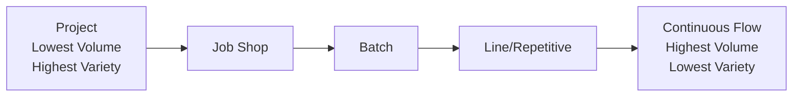

## Process Types: Project, Job Shop, Batch, Line, and Continuous Flow

### Overview

Process type selection is one of the foundational strategic decisions in operations management, determining how an organization organizes its resources, equipment, workflow, and labor to transform inputs into outputs. The five classic process types — project, job shop, batch, line (repetitive/assembly line), and continuous flow — represent points along a spectrum from low-volume/high-variety to high-volume/low-variety production, each with distinct implications for cost structure, flexibility, layout, staffing, and quality management.

This classification connects directly to the Product-Process Matrix (Hayes-Wheelwright framework) introduced in product life cycle management, since process type is typically selected to align with a product's expected volume and degree of standardization at its current life cycle stage.

### The Volume-Variety Spectrum

**Key Points**

- As processes move from left to right along this spectrum, flexibility generally decreases while efficiency, throughput, and standardization generally increase.
- No single process type is universally superior; the correct choice depends on matching the process to the product's volume, variety requirements, and life cycle stage.

### 1. Project Process

A project process is used to produce a single, unique, often large-scale output, typically a one-time or highly infrequent undertaking with a defined beginning and end.

**Characteristics:**

- **Volume**: Very low (often a single unit or a handful of units).
- **Variety**: Extremely high; each project is typically unique in specification.
- **Layout**: Fixed-position layout — the product remains stationary while labor, equipment, and materials are brought to it (since the product itself, e.g., a building, ship, or aircraft, is often too large or immobile to move through a production line).
- **Workforce**: Highly skilled, often specialized labor and project management expertise; workforce composition changes throughout the project lifecycle as different phases require different skills.
- **Equipment**: General-purpose, often mobile equipment; heavy reliance on scheduling and coordination tools (e.g., Gantt charts, Critical Path Method/CPM, Program Evaluation and Review Technique/PERT).
- **Scheduling complexity**: Very high; project management techniques (critical path analysis, resource leveling) are essential due to the complex, interdependent sequence of unique activities.

**Examples**: Construction of a building or bridge, shipbuilding, custom software development, movie production, large-scale event planning, aerospace vehicle manufacturing (e.g., a satellite).

**Key operational challenges**: Cost and schedule overruns are common due to inherent uncertainty in unique, non-repeated work; quality control relies heavily on inspection and expert judgment rather than statistical process control, since there is no repeated production run to establish statistical baselines.

### 2. Job Shop Process

A job shop (also called an intermittent process) produces a wide variety of products in low volumes, typically customized to individual customer specifications, using general-purpose equipment organized by function.

**Characteristics:**

- **Volume**: Low to moderate, per product variant.
- **Variety**: High; jobs vary significantly in required operations and sequence.
- **Layout**: Process layout (functional layout) — similar equipment/functions are grouped together (e.g., all milling machines in one area, all welding stations in another), and each job follows its own unique routing through the relevant departments.
- **Workforce**: Skilled, versatile workers capable of handling varied tasks and equipment setups; higher training investment per worker than line/continuous processes.
- **Equipment**: General-purpose, flexible equipment capable of handling diverse job requirements, but often lower throughput per unit than specialized equipment.
- **Scheduling complexity**: High; each job requires its own routing and scheduling through shared functional departments, and job shop scheduling is one of the most extensively studied combinatorial problems in operations research (e.g., minimizing makespan across multiple jobs and machines).

**Examples**: Custom machine shops, print shops, specialty furniture manufacturing, hospitals (for certain services), custom tailoring, auto repair shops.

**Key operational challenges**: High work-in-process (WIP) inventory due to queuing between functional departments; setup/changeover time between different jobs can consume significant capacity; scheduling and routing complexity increases substantially as job variety grows.

### 3. Batch Process

A batch process produces groups (batches) of similar items together, sharing setup and changeover costs across the batch before switching to a different product batch.

**Characteristics:**

- **Volume**: Moderate; higher than job shop, lower than line production.
- **Variety**: Moderate; a limited number of standard product variants are produced, each in batches.
- **Layout**: Often a hybrid layout — combining elements of process layout (functional grouping) for shared equipment with some product-focused cells for high-volume batch families.
- **Workforce**: Moderately skilled; workers often handle equipment setup/changeover in addition to production tasks.
- **Equipment**: Semi-flexible equipment, often with changeover/setup procedures between batches (e.g., different molds, dies, or recipes).
- **Scheduling complexity**: Moderate; batch sizing and sequencing decisions balance setup cost against inventory holding cost (related directly to Economic Order Quantity/EOQ-style trade-off logic).

**Examples**: Bakeries producing different bread varieties in batches, pharmaceutical manufacturing, print runs for different publications, paint manufacturing, craft brewing.

**Key operational challenges**: Setup/changeover time between batches represents non-value-added capacity loss; batch sizing decisions require balancing setup cost efficiency (favoring larger batches) against inventory carrying cost and responsiveness (favoring smaller batches) — a trade-off directly related to techniques like Single-Minute Exchange of Die (SMED) used to reduce changeover time and enable smaller, more flexible batch sizes.

### 4. Line (Repetitive/Assembly Line) Process

A line process (also called repetitive process or assembly line process) produces a narrow range of standardized products in high volume, using specialized equipment arranged in a fixed sequence matching the product's production steps.

**Characteristics:**

- **Volume**: High.
- **Variety**: Low; typically a limited number of product variants, often built on a common platform (connecting directly to modular design and product platform strategy).
- **Layout**: Product layout — equipment and workstations are arranged in the sequence required by the product, with material flowing in a fixed, linear path (often via conveyor).
- **Workforce**: Often lower individual skill requirement per station (tasks are typically simplified and standardized), though overall line balancing and quality skill remain important; increasingly supplemented or replaced by automation.
- **Equipment**: Specialized, often dedicated equipment optimized for the specific product/task; higher capital investment but higher throughput and lower unit cost than general-purpose equipment.
- **Scheduling complexity**: Lower routing complexity than job shop/batch (fixed sequence), but requires careful **line balancing** — allocating tasks across workstations to minimize idle time and maximize throughput given a target cycle time.

**Examples**: Automobile assembly lines, consumer electronics assembly, fast-food production lines, appliance manufacturing.

**Line Balancing Fundamentals:**

The theoretical minimum number of workstations required for a line is calculated as:

$$N_{min} = \frac{\sum t_i}{C}$$

Where:

- $\sum t_i$ = sum of all individual task times required to complete one unit
- $C$ = cycle time (the maximum time allowed at each workstation, typically set by desired output rate)

**Example**: If total task time to assemble a product is 24 minutes, and the line must produce one unit every 3 minutes (cycle time):

$$N_{min} = \frac{24}{3} = 8 \text{ workstations (minimum)}$$

**Key operational challenges**: Line balancing efficiency losses (idle time at stations where assigned tasks don't perfectly fill the cycle time); high sensitivity to disruption, since a stoppage at any single workstation can halt the entire line (a vulnerability directly addressed by buffer inventory strategies and, in lean systems, by tools like andon cords for rapid problem escalation); limited flexibility to accommodate product variety without significant retooling.

### 5. Continuous Flow Process

A continuous flow process produces very high volumes of highly standardized (often undifferentiated, commodity-like) output through an uninterrupted, always-running production process, typically with minimal discrete units.

**Characteristics:**

- **Volume**: Very high, often measured in continuous units (tons, gallons, barrels) rather than discrete countable items.
- **Variety**: Very low, often a single standardized product or a very narrow set of grades/specifications.
- **Layout**: Product layout, highly fixed and specialized, often physically integrated (e.g., piping, reactors) rather than discrete workstations.
- **Workforce**: Relatively small workforce per unit of output, focused primarily on process monitoring, control, and maintenance rather than direct production tasks; highly automated.
- **Equipment**: Highly specialized, capital-intensive, dedicated equipment; extremely high fixed cost but very low variable/unit cost at scale.
- **Scheduling complexity**: Lowest routing complexity of all process types (fixed, continuous flow), but scheduling shifts toward maximizing uptime, managing planned/unplanned maintenance downtime, and demand forecasting to avoid over/under-production of a difficult-to-store or costly-to-restart process.

**Examples**: Oil refining, chemical processing, steel production, paper manufacturing, electricity generation, water treatment.

**Key operational challenges**: Very high capital investment and fixed cost create strong pressure to maintain high utilization; process downtime (planned or unplanned) is extremely costly given the fixed-cost-heavy structure; quality control relies heavily on statistical process control (SPC) applied to continuous process parameters (temperature, pressure, flow rate) rather than discrete unit inspection.

### Comparative Summary Table

| Dimension | Project | Job Shop | Batch | Line | Continuous Flow |
| --- | --- | --- | --- | --- | --- |
| Volume | Very low | Low-moderate | Moderate | High | Very high |
| Variety | Very high | High | Moderate | Low | Very low |
| Layout | Fixed-position | Process (functional) | Hybrid | Product | Product (integrated) |
| Equipment | General-purpose, mobile | General-purpose, flexible | Semi-flexible | Specialized, dedicated | Highly specialized, capital-intensive |
| Unit cost | Very high | High | Moderate | Low | Very low |
| Fixed cost | Low (per project) | Moderate | Moderate | High | Very high |
| Flexibility | Highest | High | Moderate | Low | Lowest |
| Primary scheduling tool | CPM/PERT | Job shop scheduling algorithms | EOQ/batch sizing, SMED | Line balancing | Uptime/maintenance scheduling |
| Quality approach | Expert inspection | Inspection + sampling | Statistical process control (SPC) | SPC + line quality checks | Continuous process SPC |

### Process Type Selection Diagram (svg_diagram)

<svg xmlns="http://www.w3.org/2000/svg" viewBox="0 0 680 340" font-family="Arial, sans-serif">
<text x="340" y="22" font-size="16" font-weight="bold" text-anchor="middle" fill="#1a1a1a">Process Type Selection by Volume/Variety (svg_diagram)</text>

<line x1="80" y1="280" x2="620" y2="280" stroke="#333" stroke-width="2" />
<line x1="80" y1="280" x2="80" y2="50" stroke="#333" stroke-width="2" />
<text x="350" y="310" font-size="12" text-anchor="middle" fill="#333">Volume (increasing right)</text>
<text x="35" y="165" font-size="12" text-anchor="middle" fill="#333" transform="rotate(-90 35 165)">Variety (increasing up)</text>

<rect x="90" y="230" width="90" height="40" rx="6" fill="#fbeaea" stroke="#a03b3b" stroke-width="2" />
<text x="135" y="254" font-size="11" text-anchor="middle" fill="#5e1a1a">Project</text>
<rect x="200" y="190" width="90" height="40" rx="6" fill="#fdf0d5" stroke="#a0743b" stroke-width="2" />
<text x="245" y="214" font-size="11" text-anchor="middle" fill="#5e451a">Job Shop</text>
<rect x="310" y="150" width="90" height="40" rx="6" fill="#fdfad5" stroke="#a09a3b" stroke-width="2" />
<text x="355" y="174" font-size="11" text-anchor="middle" fill="#5e5a1a">Batch</text>
<rect x="420" y="110" width="90" height="40" rx="6" fill="#eafbea" stroke="#3b8f4a" stroke-width="2" />
<text x="465" y="134" font-size="11" text-anchor="middle" fill="#1a4d24">Line</text>
<rect x="530" y="70" width="90" height="40" rx="6" fill="#eaf2fb" stroke="#3b6fa0" stroke-width="2" />
<text x="575" y="94" font-size="10" text-anchor="middle" fill="#1a3c5e">Continuous Flow</text>
<line x1="135" y1="230" x2="245" y2="230" stroke="#999" stroke-width="1" stroke-dasharray="3,3" />
<line x1="245" y1="190" x2="355" y2="190" stroke="#999" stroke-width="1" stroke-dasharray="3,3" />
<line x1="355" y1="150" x2="465" y2="150" stroke="#999" stroke-width="1" stroke-dasharray="3,3" />
<line x1="465" y1="110" x2="575" y2="110" stroke="#999" stroke-width="1" stroke-dasharray="3,3" />
</svg>

### Hybrid and Emerging Process Configurations

**Key Points**

- **Cellular manufacturing**: A hybrid approach that groups dissimilar equipment into dedicated "cells" organized around a family of similar products (using group technology principles), combining some of the flow efficiency of a line layout with some of the flexibility of a job shop.
- **Mass customization / flexible manufacturing systems (FMS)**: Increasingly, automated, reconfigurable equipment blurs the traditional boundary between batch and line processes, allowing near-line-level throughput with job-shop-level product variety, often enabled by the modular product design principles covered earlier in this chapter.
- **Just-in-Time (JIT) and lean flow**: Even within line and batch environments, lean principles push toward smaller batch sizes and reduced changeover time (via SMED), moving batch processes operationally closer to continuous, one-piece flow.

### Choosing the Right Process Type

Process type selection should be driven primarily by:

1. **Expected production volume**, both current and forecasted over the product's life cycle.
2. **Required product variety and customization level**, informed by the target market segment and competitive strategy.
3. **Product life cycle stage**, per the Product-Process Matrix — introduction-stage products typically warrant job shop or batch flexibility, while mature, stable-design products can justify line or continuous flow investment.
4. **Capital availability and risk tolerance**, since line and continuous flow processes require substantial upfront capital investment that becomes a sunk cost if demand assumptions prove incorrect.
5. **Quality and consistency requirements**, since specialized, repetitive processes generally achieve tighter process capability and lower variability than general-purpose, flexible processes.

### Common Pitfalls

- **Mismatching process type to actual product life cycle stage**: Committing to line or continuous flow investment for a product whose design or demand is still volatile (introduction/early growth stage), risking stranded capital if redesign is needed.
- **Underestimating job shop scheduling complexity**: Treating job shop scheduling as a simple sequencing exercise rather than the genuinely difficult combinatorial optimization problem it is, leading to excessive WIP and missed due dates.
- **Ignoring changeover/setup cost in batch sizing**: Selecting batch sizes based on intuition rather than a structured trade-off analysis (balancing setup cost against holding cost), leading to either excessive changeover losses or excessive inventory.
- **Over-automating too early**: Investing in highly specialized line/continuous equipment before product design has stabilized, a pitfall directly connected to the "over-investing in automation too early" risk discussed under product life cycle management.
- **Neglecting line balance maintenance**: Failing to periodically rebalance an assembly line as task times, product mix, or demand rates change, resulting in accumulating inefficiency and bottlenecks.

### Relationship to Other Operations Management Concepts

- **Product-Process Matrix**: Directly formalizes the relationship between product life cycle stage/volume and the appropriate process type from this list.
- **Design for Manufacturability and Assembly (DFMA)**: DFMA principles are most impactful when a product is transitioning toward line or continuous flow processes, since part reduction and assembly simplification directly reduce line balancing complexity and cycle time.
- **Modular Design and Product Platforms**: Enables hybrid process strategies (e.g., producing a common platform on a line process while final configuration/customization occurs via a more flexible, batch-style postponement step).
- **Facility Layout**: Process type selection directly determines the appropriate facility layout strategy (fixed-position, process/functional, product, or cellular layout), covered in depth as a related process design topic.
- **Capacity Planning**: Continuous flow and line processes require capacity planning decisions with much longer lead times and higher capital stakes than job shop or project processes, given the specialized, less-reconfigurable nature of the equipment involved.

**Related Topics**

- Product-Process Matrix (Hayes-Wheelwright framework)
- Facility layout strategies (fixed-position, process, product, cellular)
- Line balancing techniques and algorithms
- Job shop scheduling and sequencing rules
- Economic Order Quantity (EOQ) and batch sizing trade-offs
- Single-Minute Exchange of Die (SMED) and setup reduction
- Group technology and cellular manufacturing
- Critical Path Method (CPM) and PERT for project scheduling
- Flexible Manufacturing Systems (FMS) and mass customization
- Statistical Process Control (SPC)