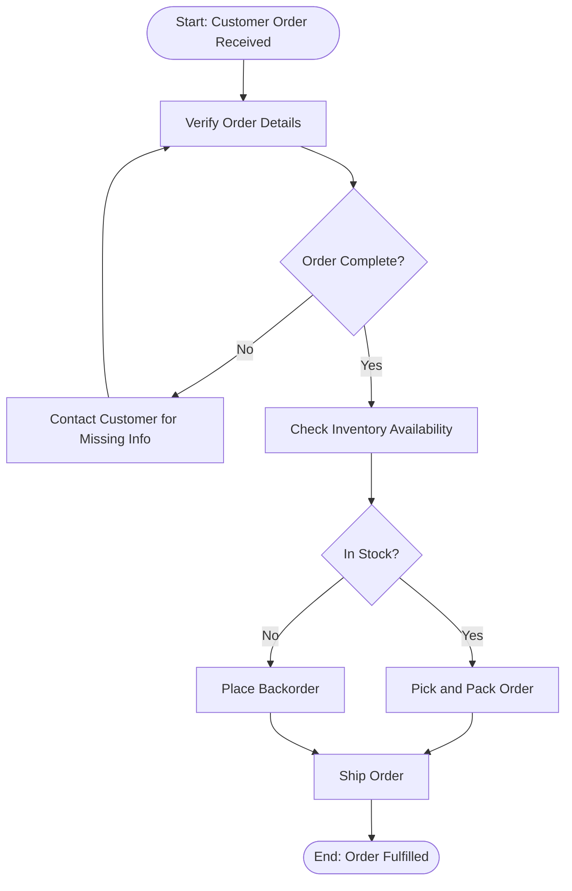
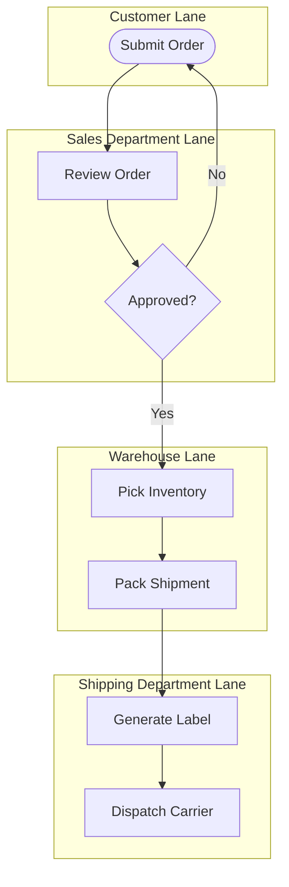

## Process Flowcharting and Process Mapping

### Overview

Process flowcharting and process mapping are foundational analytical tools used to visually document, analyze, and communicate the sequence of activities, decisions, and flows that make up a business process. These tools convert an often implicit, tribal-knowledge understanding of "how work gets done" into an explicit, shared visual representation that can be systematically analyzed for inefficiency, bottlenecks, redundancy, and improvement opportunities. Process mapping is typically the first analytical step in nearly every process improvement methodology, including Lean, Six Sigma, Business Process Reengineering (BPR), and general operations process redesign efforts.

While "flowcharting" and "process mapping" are often used interchangeably, flowcharting typically refers to the narrower symbolic notation for representing a sequence of steps and decisions, while process mapping is the broader activity of documenting a process, which may incorporate flowcharting along with additional layers of information (time, resources, roles, value classification).

### Purpose and Value of Process Mapping

**Key Points**

- **Makes the invisible visible**: Many organizational processes exist only as tacit knowledge in employees' heads; mapping forces this knowledge into an explicit, reviewable, shareable format.
- **Reveals non-value-added activity**: Visual mapping frequently exposes redundant steps, unnecessary approvals, excessive handoffs, and wait times that are difficult to perceive when only experiencing one's own portion of a process.
- **Creates a shared baseline for improvement**: Cross-functional teams often discover they have different mental models of "how the process actually works"; a jointly constructed map creates alignment before improvement efforts begin.
- **Supports training and standardization**: A validated process map serves as a reference document for training new employees and standardizing execution across shifts, locations, or teams.
- **Enables quantitative analysis**: Once mapped, a process can be analyzed for cycle time, capacity, bottlenecks, and flow balance using the quantitative process analysis tools covered elsewhere in this chapter.

### Standard Flowchart Symbols (ANSI/ASME Notation)

Process flowcharts traditionally use a standardized set of symbols, originally formalized by ANSI and later adapted by ASME, allowing consistent interpretation across organizations and industries.

| Symbol | Shape | Meaning |
| --- | --- | --- |
| Terminal | Rounded rectangle/oval | Start or end point of the process |
| Operation | Rectangle | A task, activity, or operation that transforms the input |
| Decision | Diamond | A branching point requiring a yes/no or multi-way choice |
| Document | Rectangle with wavy bottom | A document is created, used, or referenced |
| Delay | Half-circle/D-shape | Waiting time or storage before the next step |
| Inspection | Circle | A quality check or verification step |
| Transportation | Arrow or wide arrow | Physical movement of material or people |
| Flow line | Arrow | Direction of process flow between symbols |
| Connector | Small circle | Connects flowchart segments, often across pages |

### Basic Process Flowchart Example

This example illustrates the core flowcharting elements: a defined start/end, sequential operations, decision points with branching logic, and loops representing rework (in this case, incomplete order information returning to the verification step).

### Types of Process Maps

#### 1. Basic (High-Level) Process Flowchart

A simple sequential representation of major process steps, typically used for initial process understanding or executive-level communication, without deep detail on sub-steps, timing, or resources.

#### 2. Deployment (Swimlane / Cross-Functional) Flowchart

A swimlane flowchart organizes process steps into horizontal or vertical "lanes," each representing a distinct role, department, or system responsible for that portion of the process. This format is particularly valuable for revealing handoffs between functions, which are common sources of delay and error.

**Key Points**

- Swimlane maps make cross-departmental handoffs explicit, which is often where the greatest process delays and communication failures occur.
- Particularly valuable for Business Process Reengineering (BPR) efforts, since the number of lanes a process crosses is often directly correlated with cycle time and error rate.

#### 3. Value Stream Mapping (VSM)

Value Stream Mapping is a specialized, more quantitative form of process mapping originating from the Toyota Production System, used to map the flow of both materials and information through a process, explicitly distinguishing value-added from non-value-added activity, and capturing timing data (cycle time, wait time, changeover time) at each step.

**Key VSM elements:**

- **Process boxes**: Represent discrete process steps, annotated with data boxes showing cycle time, changeover time, uptime, and staffing.
- **Inventory triangles**: Represent WIP or finished goods inventory accumulating between process steps, often quantified in units or days of supply.
- **Information flow lines**: Distinguish manual information flow (e.g., paper-based scheduling) from electronic information flow (e.g., ERP system signals).
- **Timeline ladder**: A summary timeline at the bottom of the map distinguishing value-added processing time from non-value-added wait time, ultimately calculating total lead time versus total value-added time.

$$Process\ Efficiency = \frac{Value\text{-}Added\ Time}{Total\ Lead\ Time} \times 100\%$$

**Example**: If a product spends 45 minutes in actual value-added processing across a series of steps, but the total end-to-end lead time (including all queuing and wait time) is 5 days (7,200 minutes):

$$Process\ Efficiency = \frac{45}{7200} \times 100\% \approx 0.6\%$$

This kind of stark efficiency gap, commonly revealed through VSM, is a frequent finding in manufacturing and service processes alike, and provides the quantitative justification for lean improvement initiatives targeting wait-time reduction. [Inference: while extremely low process efficiency percentages (often in the low single digits) are commonly cited in lean case studies across industries, the specific figure varies enormously by process and should be treated as illustrative rather than a universal benchmark.]

#### 4. SIPOC Diagram

SIPOC (Suppliers, Inputs, Process, Outputs, Customers) is a high-level process mapping tool used primarily at the start of a Six Sigma DMAIC (Define-Measure-Analyze-Improve-Control) project to establish process scope and boundaries before detailed mapping begins.

| Suppliers | Inputs | Process | Outputs | Customers |
| --- | --- | --- | --- | --- |
| Who provides inputs to the process | What materials/information/resources enter the process | The 4-7 high-level steps of the process | What the process produces | Who receives/uses the outputs |

**Example (Order Fulfillment SIPOC)**:

| Suppliers | Inputs | Process | Outputs | Customers |
| --- | --- | --- | --- | --- |
| Sales team, Customer | Order details, payment info | 1. Receive order → 2. Verify inventory → 3. Pick/pack → 4. Ship | Fulfilled order, shipping confirmation | End customer, Accounting |

#### 5. Functional Flowchart / Flow Process Chart

A flow process chart is a detailed, tabular form of process mapping (rather than a purely graphical one) that documents each step of a process using standardized symbols in a table format, alongside quantitative data such as distance traveled, time required, and classification of each step as an operation, transportation, inspection, delay, or storage.

| Step | Description | Operation | Transport | Inspect | Delay | Storage | Time (min) | Distance (ft) |
| --- | --- | --- | --- | --- | --- | --- | --- | --- |
| 1 | Order received at desk | ● |  |  |  |  | 2 | — |
| 2 | Walk to warehouse |  | ● |  |  |  | 3 | 150 |
| 3 | Locate item | ● |  |  |  |  | 5 | — |
| 4 | Verify item matches order |  |  | ● |  |  | 2 | — |
| 5 | Wait for packing station |  |  |  | ● |  | 8 | — |
| 6 | Item placed in staging |  |  |  |  | ● | 1 | — |

This format, originally developed for industrial engineering work-study analysis, is particularly effective for identifying excessive transportation distance and delay time, both classic categories of waste in lean methodology.

### Process Mapping Symbols and Classification (svg_diagram)

<svg xmlns="http://www.w3.org/2000/svg" viewBox="0 0 640 300" font-family="Arial, sans-serif">
<text x="320" y="22" font-size="16" font-weight="bold" text-anchor="middle" fill="#1a1a1a">Flowchart Symbol Reference (svg_diagram)</text>

<rect x="40" y="50" width="120" height="45" rx="22" fill="#eafbea" stroke="#3b8f4a" stroke-width="2" />
<text x="100" y="77" font-size="11" text-anchor="middle" fill="#1a4d24">Start / End</text>

<rect x="220" y="50" width="120" height="45" fill="#eaf2fb" stroke="#3b6fa0" stroke-width="2" />
<text x="280" y="77" font-size="11" text-anchor="middle" fill="#1a3c5e">Operation</text>

<polygon points="460,50 520,72 460,95 400,72" fill="#fdf0d5" stroke="#a0743b" stroke-width="2" />
<text x="460" y="77" font-size="11" text-anchor="middle" fill="#5e451a">Decision</text>

<path d="M40,150 h80 a22,22 0 0 1 0,44 h-80 z" fill="#fbeaea" stroke="#a03b3b" stroke-width="2" />
<text x="90" y="177" font-size="11" text-anchor="middle" fill="#5e1a1a">Delay</text>

<circle cx="290" cy="172" r="30" fill="#f0eaf9" stroke="#6b3ba0" stroke-width="2" />
<text x="290" y="177" font-size="11" text-anchor="middle" fill="#3a1a5e">Inspect</text>

<path d="M420,150 h100 v35 q-25,15 -50,0 q-25,15 -50,0 z" fill="#fdfad5" stroke="#a09a3b" stroke-width="2" />
<text x="470" y="172" font-size="11" text-anchor="middle" fill="#5e5a1a">Document</text>

<polygon points="70,240 130,240 130,225 160,255 130,285 130,270 70,270" fill="#eafbea" stroke="#3b8f4a" stroke-width="2" />
<text x="115" y="300" font-size="10" text-anchor="middle" fill="#1a4d24">Transportation</text>
</svg>

### Best Practices for Process Mapping

1. **Involve people who actually perform the work.** Maps built solely by managers or outside consultants often reflect the *intended* process rather than the *actual* process; frontline involvement is essential for accuracy (a principle related to "go and see," or *genchi genbutsu*, in lean methodology).
2. **Map the current state before designing the future state.** Jumping directly to an idealized process map skips the diagnostic value of understanding actual, current inefficiencies and their root causes.
3. **Define clear process boundaries (start and end points).** Ambiguous scope is one of the most common sources of confusion and scope creep in mapping exercises; SIPOC is often used specifically to establish these boundaries first.
4. **Use consistent symbol notation.** Adopting standardized ANSI/ASME symbols (or a clearly documented custom notation) ensures the map is interpretable by anyone in the organization, not just its original creator.
5. **Validate the map through direct observation ("walking the process").** Cross-checking the drawn map against real-time observation of the process frequently uncovers discrepancies, exceptions, and workarounds not captured in interviews alone.
6. **Capture quantitative data where relevant.** For process improvement purposes (as opposed to simple documentation), capturing cycle time, wait time, and volume data at each step (as in VSM) transforms the map from a qualitative picture into an analyzable dataset.
7. **Keep the appropriate level of detail for the audience and purpose.** A high-level map (SIPOC-style) suits executive communication and scoping, while detailed swimlane or flow process charts suit hands-on improvement teams; mixing detail levels inappropriately reduces map usability.

### Common Pitfalls

- **Mapping the "should be" process instead of the "as is" process**: Teams often unconsciously document how a process is officially supposed to work rather than how it actually operates day-to-day, including informal workarounds, hiding real improvement opportunities.
- **Insufficient cross-functional participation**: Excluding key roles (especially those in handoff-heavy swimlane processes) leads to blind spots at exactly the points where problems are most likely to occur.
- **Excessive detail in early-stage maps**: Attempting to capture every micro-step and exception in an initial high-level map can overwhelm stakeholders and obscure the big-picture flow that early mapping is meant to establish.
- **Treating the map as a one-time deliverable**: Processes evolve; maps that are not periodically revisited and updated become inaccurate and can misinform later improvement or training efforts.
- **Failing to quantify the map**: A purely qualitative flowchart, without associated time, volume, or resource data, limits the map's usefulness for rigorous process analysis (e.g., bottleneck identification, capacity calculations).

### Relationship to Other Operations Management Concepts

- **Process Analysis and Bottleneck Identification**: A validated process map is the essential input to quantitative process analysis techniques (cycle time analysis, capacity analysis, Theory of Constraints bottleneck identification).
- **Lean Manufacturing and Waste Elimination**: Value Stream Mapping is one of the core diagnostic tools of lean methodology, directly identifying the seven (or eight) classic categories of waste (transportation, inventory, motion, waiting, overproduction, overprocessing, defects, and underutilized talent).
- **Six Sigma DMAIC**: SIPOC and detailed process maps are standard tools in the Define and Measure phases of DMAIC projects, establishing process scope and identifying measurement points.
- **Service Blueprinting**: Service blueprinting (covered under service design fundamentals) is a specialized form of process mapping tailored to service environments, adding customer-facing/backstage distinction layers not present in typical manufacturing process maps.
- **Business Process Reengineering (BPR)**: Swimlane and cross-functional maps are particularly central to BPR efforts, since BPR specifically targets the elimination of unnecessary functional handoffs and organizational silos revealed by such maps.

**Related Topics**

- Value Stream Mapping (VSM) in depth
- Bottleneck analysis and Theory of Constraints
- Six Sigma DMAIC methodology
- Lean manufacturing and the seven/eight wastes
- Service blueprinting
- Business Process Reengineering (BPR)
- Cycle time and capacity analysis
- SIPOC diagrams in Six Sigma project scoping
- Work-study and time-and-motion analysis
- Statistical Process Control (SPC)