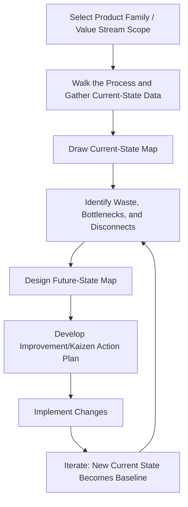

## Value Stream Mapping

### Overview

Value Stream Mapping (VSM) is a structured lean management technique used to visualize, analyze, and improve the flow of both materials and information required to bring a product or service from raw input to the customer. Originating from the Toyota Production System — where it was internally known as "material and information flow mapping" and popularized externally by Mike Rother and John Shook's 1999 book *Learning to See* — VSM extends basic process flowcharting (covered elsewhere in this chapter) by adding quantitative timing data, inventory levels, and information flow, enabling teams to explicitly distinguish value-added activity from waste across an entire end-to-end value stream.

Unlike a general process map, which may focus on a single department or workflow, VSM is deliberately designed to capture the **entire value stream** — often spanning multiple departments, functions, or even organizational boundaries (e.g., supplier to customer) — making visible the cumulative effect of wait times, inventory buildup, and information delays that are invisible when any single process step is examined in isolation.

### Core Purpose and Philosophy

**Key Points**

- VSM's central diagnostic question is: of the total time a product or service spends moving through the value stream, how much of that time is actually value-added from the customer's perspective, versus non-value-added waiting, moving, or reworking?
- VSM treats material flow and information flow as equally important; a common finding is that information delays (e.g., batch-processed order releases, disconnected scheduling systems) create as much or more total lead time as physical material handling delays.
- The technique is explicitly a **team-based, current-state-then-future-state** exercise, not merely a documentation task — its purpose is to drive a specific, prioritized kaizen (continuous improvement) action plan.

### Value-Added vs. Non-Value-Added Activity

A foundational VSM concept is classifying every process step into one of three categories:

1. **Value-Added (VA)**: Activities the customer would be willing to pay for — actions that physically transform the product or directly advance the service toward what the customer wants, done correctly the first time.
2. **Non-Value-Added but Necessary (Business Non-Value-Added, or BNVA)**: Activities that do not add value from the customer's perspective but are currently required due to technology, regulatory, or business constraints (e.g., regulatory quality inspections, required paperwork). These are targeted for *reduction* rather than immediate elimination.
3. **Non-Value-Added (NVA) / Waste**: Activities that add no value and could be eliminated entirely with no negative impact on the customer or the business, corresponding to the classic categories of lean waste.

### The Eight Wastes (TIMWOODS)

VSM is specifically designed to surface the eight classic categories of waste recognized in lean methodology, commonly remembered by the acronym TIMWOODS:

| Waste | Description |
| --- | --- |
| **T**ransportation | Unnecessary movement of materials or products between process steps |
| **I**nventory | Excess raw material, WIP, or finished goods beyond what is immediately needed |
| **M**otion | Unnecessary movement by people (reaching, walking, searching) |
| **W**aiting | Idle time when material, people, or equipment are not being productively used |
| **O**verproduction | Producing more, earlier, or faster than actual demand requires |
| **O**verprocessing | Performing more work or achieving higher specification than the customer requires |
| **D**efects | Errors requiring rework, scrap, or correction |
| **S**kills (underutilized talent) | Failing to use employees' full capabilities, knowledge, or creativity |

### VSM Process Steps

1. **Select the product family or value stream scope.** VSM is typically performed on a single product family (products that share similar processing steps and equipment) rather than an entire facility at once, since mapping an overly broad scope becomes unmanageable.
2. **Walk the process ("go and see" / *genchi genbutsu*).** The team physically follows the material and information flow from end to end, gathering direct, firsthand data rather than relying solely on documented standard procedures, which often diverge from actual practice.
3. **Draw the current-state map**, using standardized VSM icons to represent process steps, inventory, information flow, and transportation.
4. **Calculate key metrics** at each step and summarize them in the timeline ladder at the bottom of the map.
5. **Identify waste and improvement opportunities**, often flagged directly on the map using "kaizen burst" symbols at points of significant waste or disconnect.
6. **Design the future-state map**, representing the target process after planned improvements, typically incorporating lean principles like continuous flow, pull systems, and leveled production.
7. **Develop and execute a prioritized improvement plan** to close the gap between current and future state, with the future state becoming the next iteration's current state baseline (VSM is inherently an iterative, continuous improvement cycle).

### Standard VSM Icons and Notation

| Icon Category | Represents |
| --- | --- |
| Process box | A discrete process step, annotated with a data box (cycle time, changeover time, uptime, number of operators) |
| Data box | Below each process box; contains quantitative metrics: C/T (cycle time), C/O (changeover time), uptime %, number of shifts |
| Inventory triangle | Accumulated WIP or finished goods inventory between steps, quantified in units or days of supply |
| Push arrow (striped) | Material pushed to the next process regardless of downstream need |
| Pull/supermarket icon | A controlled inventory buffer that downstream processes pull from as needed (pull system) |
| Straight arrow | Physical material flow |
| Jagged/lightning arrow | Electronic information flow (e.g., ERP system) |
| Straight thin line | Manual information flow (e.g., phone calls, paper schedules) |
| Truck icon | External shipment (from supplier or to customer) |
| Kaizen burst | Starburst symbol marking a specific point targeted for improvement |
| Timeline ladder | Bottom-of-map summary distinguishing value-added time (bottom line) from lead time/wait time (top line) |

### Key VSM Metrics

**Cycle Time (C/T)**: The time required to complete one unit of work at a given process step, from start of one unit to start of the next.

**Changeover Time (C/O)**: The time required to switch a process from producing one product variant to another, directly relevant to batch sizing decisions covered under process types.

**Takt Time**: The rate at which products must be completed to meet customer demand, calculated as:

$$Takt\ Time = \frac{Available\ Production\ Time}{Customer\ Demand}$$

**Example**: If a facility operates 480 minutes per shift and customer demand is 240 units per day:

$$Takt\ Time = \frac{480\ minutes}{240\ units} = 2\ minutes\ per\ unit$$

This means one unit must be completed, on average, every 2 minutes to exactly match customer demand — a benchmark against which each process step's cycle time is compared to identify bottlenecks (any step with cycle time exceeding takt time constrains the overall value stream).

**Lead Time**: The total elapsed time from the start of the process (or order entry) to completion, including all wait time, queue time, and inventory dwell time — not just active processing time.

**Process Efficiency (Value-Added Ratio)**:

$$Process\ Efficiency = \frac{\sum Value\text{-}Added\ Time}{Total\ Lead\ Time} \times 100\%$$

**Worked Example**: Consider a simplified value stream with three process steps:

| Step | Cycle Time (C/T) | Inventory Before Step (days) |
| --- | --- | --- |
| Cutting | 45 sec | 2.0 days |
| Welding | 60 sec | 3.5 days |
| Painting | 30 sec | 1.5 days |

Total value-added time: $45 + 60 + 30 = 135$ seconds $\approx 0.0016$ days.

Total lead time: $2.0 + 3.5 + 1.5 = 7.0$ days (inventory dwell time dominates total lead time).

$$Process\ Efficiency = \frac{0.0016}{7.0} \times 100\% \approx 0.02\%$$

This stark result, typical of many real-world VSM findings, demonstrates how inventory accumulation between steps — not the actual processing steps themselves — is usually the dominant driver of total lead time, directing improvement focus toward flow and inventory reduction rather than faster processing.

### Illustrative Current-State Value Stream Map (svg_diagram)

<svg xmlns="http://www.w3.org/2000/svg" viewBox="0 0 700 380" font-family="Arial, sans-serif">
<text x="350" y="22" font-size="16" font-weight="bold" text-anchor="middle" fill="#1a1a1a">Simplified Current-State Value Stream Map (svg_diagram)</text>

<rect x="30" y="50" width="90" height="45" fill="#fdf0d5" stroke="#a0743b" stroke-width="2" />
<text x="75" y="77" font-size="11" text-anchor="middle" fill="#5e451a">Supplier</text>
<rect x="580" y="50" width="90" height="45" fill="#fdf0d5" stroke="#a0743b" stroke-width="2" />
<text x="625" y="77" font-size="11" text-anchor="middle" fill="#5e451a">Customer</text>

<rect x="300" y="50" width="100" height="40" fill="#f0eaf9" stroke="#6b3ba0" stroke-width="2" />
<text x="350" y="74" font-size="10" text-anchor="middle" fill="#3a1a5e">Production Control</text>

<line x1="120" y1="72" x2="300" y2="70" stroke="#6b3ba0" stroke-width="1.5" stroke-dasharray="2,2" />
<line x1="400" y1="70" x2="580" y2="72" stroke="#6b3ba0" stroke-width="1.5" stroke-dasharray="2,2" />

<rect x="60" y="150" width="110" height="45" fill="#eaf2fb" stroke="#3b6fa0" stroke-width="2" />
<text x="115" y="177" font-size="11" text-anchor="middle" fill="#1a3c5e">Cutting</text>
<rect x="60" y="195" width="110" height="30" fill="#ffffff" stroke="#3b6fa0" stroke-width="1" />
<text x="115" y="214" font-size="9" text-anchor="middle" fill="#333">C/T = 45s</text>
<rect x="255" y="150" width="110" height="45" fill="#eaf2fb" stroke="#3b6fa0" stroke-width="2" />
<text x="310" y="177" font-size="11" text-anchor="middle" fill="#1a3c5e">Welding</text>
<rect x="255" y="195" width="110" height="30" fill="#ffffff" stroke="#3b6fa0" stroke-width="1" />
<text x="310" y="214" font-size="9" text-anchor="middle" fill="#333">C/T = 60s</text>
<rect x="450" y="150" width="110" height="45" fill="#eaf2fb" stroke="#3b6fa0" stroke-width="2" />
<text x="505" y="177" font-size="11" text-anchor="middle" fill="#1a3c5e">Painting</text>
<rect x="450" y="195" width="110" height="30" fill="#ffffff" stroke="#3b6fa0" stroke-width="1" />
<text x="505" y="214" font-size="9" text-anchor="middle" fill="#333">C/T = 30s</text>

<polygon points="195,170 220,170 207,150" fill="#fdfad5" stroke="#a09a3b" stroke-width="2" />
<text x="207" y="185" font-size="8" text-anchor="middle" fill="#5e5a1a">3.5d</text>
<polygon points="390,170 415,170 402,150" fill="#fdfad5" stroke="#a09a3b" stroke-width="2" />
<text x="402" y="185" font-size="8" text-anchor="middle" fill="#5e5a1a">1.5d</text>

<line x1="170" y1="172" x2="195" y2="172" stroke="#333" stroke-width="2" />
<line x1="220" y1="172" x2="255" y2="172" stroke="#333" stroke-width="2" />
<line x1="365" y1="172" x2="390" y2="172" stroke="#333" stroke-width="2" />
<line x1="415" y1="172" x2="450" y2="172" stroke="#333" stroke-width="2" />

<line x1="60" y1="280" x2="660" y2="280" stroke="#333" stroke-width="1" />
<text x="115" y="300" font-size="9" text-anchor="middle" fill="#333">2.0d</text>
<text x="207" y="300" font-size="9" text-anchor="middle" fill="#333">3.5d</text>
<text x="310" y="300" font-size="9" text-anchor="middle" fill="#333">45s</text>
<text x="402" y="300" font-size="9" text-anchor="middle" fill="#333">1.5d</text>
<text x="505" y="300" font-size="9" text-anchor="middle" fill="#333">60s / 30s</text>

<text x="360" y="330" font-size="11" text-anchor="middle" fill="#555" font-style="italic">Total Lead Time = 7.0 days | Total Value-Added Time = 135 seconds</text>

</svg>

### Current-State vs. Future-State Mapping

**Key Points**

- The **current-state map** is a factual, unembellished documentation of the process as it actually operates today, including all inefficiencies, waste, and workarounds — it is explicitly not meant to represent the ideal or intended process.
- The **future-state map** represents a deliberately designed target state, typically incorporating lean design principles: continuous flow where possible, pull-based (supermarket/kanban) systems where continuous flow isn't feasible, production leveling (heijunka), and reduced batch sizes enabled by setup-time reduction (SMED).
- Future-state design is guided by a set of standard lean questions: Where can continuous flow be introduced? Where is a pull system needed instead? What is the pacemaker process (the single point in the value stream where production scheduling is controlled, with all upstream and downstream steps flowing from that signal)? How can batch sizes and changeover times be reduced?
- The gap between current and future state defines the prioritized kaizen action plan, typically broken into specific, assignable improvement projects ("kaizen bursts") with owners and timelines.

### VSM in Service and Transactional Processes

While VSM originated in manufacturing, the same core methodology (mapping flow, classifying value-added vs. non-value-added time, calculating lead time and efficiency) is widely applied to service, administrative, and transactional processes — sometimes called "Value Stream Mapping for Administrative and Service Processes" or simply applied service blueprinting with VSM-style timing data layered in. Common applications include loan approval processes, insurance claims processing, patient care pathways in healthcare, and software development/IT service delivery.

**Example**: A hospital emergency department might use VSM to map a patient's journey from arrival through discharge, quantifying time spent in active treatment (value-added) versus time spent waiting for test results, bed availability, or physician review (non-value-added), often revealing that active treatment represents a small fraction of total length of stay.

### Common Pitfalls

- **Mapping an overly broad or narrow scope**: Attempting to map an entire multi-product facility at once becomes unmanageable, while mapping a single isolated workstation misses the cross-functional flow issues VSM is specifically designed to reveal; selecting a coherent product family is essential.
- **Relying on documented standard procedures instead of direct observation**: As with general process mapping, VSM specifically requires "walking the process" to capture actual current-state behavior, since documented procedures frequently diverge from practice.
- **Treating VSM as a one-time documentation exercise**: VSM's value comes from driving an iterative improvement cycle; a map that is created once and never acted upon or updated provides limited ongoing value.
- **Focusing improvement efforts on process steps rather than the connections between them**: Since inventory and wait time between steps typically dominate total lead time (as in the worked example above), teams that focus improvement efforts solely on speeding up individual process steps often achieve disappointing lead-time results, missing the greater opportunity in flow and inventory reduction.
- **Insufficient data granularity or accuracy**: VSM's diagnostic power depends on accurate cycle time, inventory, and changeover data; rough estimates without direct time study can lead to misidentified bottlenecks and misdirected improvement effort.

### Relationship to Other Operations Management Concepts

- **Process Flowcharting and Process Mapping**: VSM is a specialized, quantitative extension of general process mapping techniques, adding timing data, inventory levels, and information flow analysis.
- **Lean Manufacturing and the Eight Wastes**: VSM is one of the primary diagnostic tools of lean methodology, directly designed to surface and quantify the TIMWOODS waste categories.
- **Theory of Constraints and Bottleneck Analysis**: Comparing each process step's cycle time against takt time (as demonstrated in the metrics section) directly identifies the constraining (bottleneck) process, connecting VSM to Theory of Constraints analysis.
- **Just-in-Time (JIT) and Pull Systems**: Future-state VSM design explicitly incorporates pull system (kanban/supermarket) principles, directly linking VSM to JIT production philosophy.
- **Single-Minute Exchange of Die (SMED)**: Changeover time (C/O) data captured in VSM data boxes often becomes the direct justification and target for SMED-based setup reduction projects.
- **Six Sigma DMAIC**: VSM is frequently used in the Measure and Analyze phases of DMAIC projects to establish baseline lead time and efficiency metrics before improvement (Improve phase) work begins.

**Related Topics**

- Lean manufacturing and the eight wastes (TIMWOODS)
- Theory of Constraints and bottleneck analysis
- Just-in-Time (JIT) production and pull systems (kanban)
- Single-Minute Exchange of Die (SMED) setup reduction
- Takt time and production leveling (heijunka)
- Process flowcharting and process mapping
- Six Sigma DMAIC methodology
- Service blueprinting for transactional value streams
- Kaizen and continuous improvement events
- Cycle time and capacity analysis