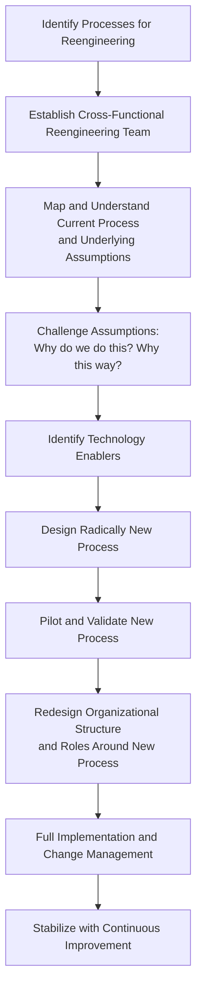

## Business Process Reengineering

### Overview

Business Process Reengineering (BPR) is a radical, top-down approach to process redesign that calls for the fundamental rethinking and complete redesign of core business processes to achieve dramatic improvements in critical performance measures such as cost, quality, service, and speed. BPR was formally introduced and popularized by Michael Hammer and James Champy in their influential 1993 work, building on Hammer's earlier 1990 Harvard Business Review article "Reengineering Work: Don't Automate, Obliterate." BPR represents a deliberate departure from incremental, continuous improvement approaches (such as kaizen and Total Quality Management), instead advocating for clean-slate process redesign, often enabled by new information technology capabilities.

The core premise of BPR is that many organizational processes are structured around outdated assumptions, historical organizational silos, and legacy technology constraints that no longer apply, and that incremental improvement of such processes yields only marginal gains, whereas fundamental redesign can achieve order-of-magnitude improvements.

### Hammer and Champy's Definition

BPR is formally defined around four key terms, each carrying specific meaning within the methodology:

1. **Fundamental**: Reengineering begins with no assumptions and no givens; it asks the basic questions "Why do we do what we do?" and "Why do we do it the way we do?" — challenging the underlying rules and assumptions of the current process rather than accepting them as fixed constraints.
2. **Radical**: Reengineering means disregarding all existing structures and procedures and inventing entirely new ways of accomplishing work — it is redesign, not superficial change, improvement, or modification of what already exists.
3. **Dramatic**: Reengineering targets order-of-magnitude improvements (often cited as 50%, 70%, or greater reductions in cost or cycle time), not marginal or incremental gains of a few percentage points, which is the domain of continuous improvement methods instead.
4. **Processes**: Reengineering is organized around end-to-end business processes (a collection of activities that takes one or more inputs and creates an output of value to the customer) rather than around traditional functional departments or tasks — a shift often described as moving from "task-based" thinking to "process-based" thinking.

### BPR vs. Continuous Improvement (Kaizen/TQM)

BPR is frequently contrasted with continuous, incremental improvement philosophies, representing two fundamentally different approaches to process change.

| Dimension | Business Process Reengineering (BPR) | Continuous Improvement (Kaizen/TQM) |
| --- | --- | --- |
| Scope of change | Radical, clean-slate redesign | Incremental, ongoing refinement |
| Starting point | Blank page; disregard current process | Current process as the baseline |
| Frequency | Episodic, one-time major initiative | Continuous, ongoing activity |
| Risk level | High (major disruption, uncertain outcome) | Low (small, reversible changes) |
| Typical improvement magnitude | Dramatic (order of magnitude) | Incremental (small percentage gains) |
| Who leads | Top-down, senior executive sponsorship | Bottom-up, frontline employee involvement |
| Role of technology | Often a primary enabler/driver of redesign | Secondary; process improvement drives tool selection |
| Organizational impact | Often restructures departments and job roles | Typically operates within existing structure |

**Key Points**

- These approaches are not mutually exclusive; many organizations use BPR for periodic, major process overhauls, followed by continuous improvement methods to refine and stabilize the newly redesigned process over time.
- BPR's high-risk, high-disruption profile means it is typically reserved for processes where incremental improvement has been exhausted or where competitive/technological disruption demands a fundamentally different approach.

### Core BPR Principles

Hammer's original work articulated several specific redesign principles, many of which remain foundational to process redesign practice:

1. **Organize around outcomes, not tasks.** Design a single role or team to perform all the steps in a process, rather than fragmenting the process across multiple specialized departments, each handling a narrow task.
2. **Have those who use the output of the process perform the process.** Push work to where it makes the most operational sense, even if that means work is performed by a different function than historically responsible for it (e.g., allowing a purchasing requester to place their own routine orders rather than routing every request through a separate purchasing department).
3. **Merge information-processing work into the real work that produces the information.** Eliminate handoffs to specialized information-processing groups by having the people or systems that generate data also process and act on it directly.
4. **Treat geographically dispersed resources as though they were centralized.** Use information technology to achieve the coordination benefits of centralization while retaining the flexibility benefits of decentralized operations.
5. **Link parallel activities instead of integrating their results only at the end.** Coordinate parallel-running process branches continuously throughout the process rather than only at a final integration step, reducing rework caused by late-discovered inconsistencies.
6. **Put the decision point where the work is performed, and build control into the process.** Reduce hierarchical approval layers by empowering frontline workers with the information and authority needed to make decisions themselves.
7. **Capture information once, at the source.** Eliminate redundant data entry and reconciliation by capturing each piece of information a single time, directly where it originates, and making it available to all downstream steps.

### The BPR Methodology

1. **Identify processes for reengineering.** Not all processes warrant BPR's high risk and disruption; candidates are typically identified based on strategic importance, current performance gaps, and the degree to which the process is broken or fundamentally misaligned with current business needs.
2. **Establish a cross-functional reengineering team**, typically including senior sponsorship, since BPR frequently requires authority to restructure departments and roles that no single functional manager could authorize alone.
3. **Map and understand the current process**, using process mapping and value stream mapping techniques, but explicitly to understand root assumptions and constraints, not to preserve the current structure.
4. **Systematically challenge every assumption** underlying the current process, asking fundamental "why" questions about rules, approval steps, and organizational boundaries that may no longer be necessary or even remembered as to their original purpose.
5. **Identify enabling technologies** that make previously impossible process redesigns feasible (e.g., real-time data sharing enabling parallel rather than sequential approval, self-service systems eliminating intermediary handoffs).
6. **Design the new process from a blank slate**, applying BPR principles (outcome-based organization, single point of information capture, decision authority at point of work) rather than modifying the existing process incrementally.
7. **Pilot the new process** on a limited scale to validate assumptions and surface implementation issues before full organizational rollout.
8. **Redesign organizational structure and roles** to align with the new process, since BPR frequently requires restructuring reporting lines, job descriptions, and departmental boundaries that were built around the old, task-fragmented process.
9. **Implement with deliberate change management**, given the high disruption and resistance risk inherent in radical redesign affecting job roles, reporting structures, and established ways of working.
10. **Transition to continuous improvement** once the reengineered process stabilizes, shifting from radical redesign mode to ongoing incremental refinement.

### Classic BPR Example: Ford Motor Company Accounts Payable

One of the most frequently cited BPR case studies, described in Hammer and Champy's original work, involved Ford Motor Company's accounts payable process. The original process required matching purchase orders, receiving documents, and invoices across three separate documents, handled by a large accounts payable department, with mismatches (common due to minor discrepancies) triggering time-consuming investigation and resolution. Ford's reengineered process eliminated the invoice entirely: the receiving dock would enter receipt of goods directly into a shared database, and payment would be automatically triggered by matching the purchase order to the goods receipt alone, without waiting for or reconciling a separate supplier invoice. This eliminated an entire category of task (invoice matching and discrepancy resolution) rather than merely making it faster, resulting in a dramatic reduction in accounts payable headcount. [Unverified: this case is widely cited in BPR literature and business education, but specific quantitative outcome figures vary across different retellings and should be treated as illustrative of the BPR principle rather than independently verified figures.]

### BPR and Information Technology

**Key Points**

- IT is frequently described in BPR literature as both an enabler and a catalyst — new technology capabilities (shared databases, real-time data access, workflow automation, expert systems) make process redesigns possible that would have been impractical under prior technological constraints.
- Hammer's original critique specifically warned against merely "automating" a flawed process ("paving the cow path"), arguing that applying technology to an unchanged, poorly designed process typically only speeds up existing waste rather than eliminating it.
- Enterprise Resource Planning (ERP) system implementations are frequently intertwined with BPR initiatives, since ERP adoption often forces (or provides the opportunity for) fundamental process redesign to align organizational workflows with the system's built-in best-practice process templates.

### Risks, Criticisms, and Limitations

**Key Points**

- **High failure rate**: BPR initiatives have been widely reported in management literature to have high failure rates, frequently cited in a range around 50-70% failing to achieve their intended dramatic performance improvements. [Inference: this failure rate range is commonly cited across BPR critique literature from the 1990s onward, though methodologies and definitions of "failure" vary across studies, and the figure should be treated as a widely referenced but not universally standardized statistic.]
- **Employee and organizational disruption**: Because BPR frequently involves significant job elimination, role redefinition, and organizational restructuring, it often generates substantial employee resistance, anxiety, and, in some criticisms, is viewed as a rationale for workforce reduction rather than genuine process improvement.
- **Underestimation of organizational and cultural change requirements**: Many BPR failures are attributed not to flawed process redesign itself, but to insufficient attention to change management, employee buy-in, and the organizational culture shifts required to sustain a radically redesigned process.
- **Loss of institutional knowledge**: Radical redesign that eliminates roles and restructures departments can inadvertently discard valuable tacit knowledge embedded in the prior process and workforce.
- **Association with downsizing**: BPR became closely (and in the view of many critics, unfairly) associated with corporate downsizing and layoffs during the 1990s, damaging the methodology's reputation and complicating organizational buy-in for legitimate process redesign efforts in subsequent years.
- **Big-bang implementation risk**: Unlike incremental improvement, which can be tested and adjusted in small steps, BPR's clean-slate, large-scope redesign approach creates greater risk of large-scale implementation failure if the new process design proves flawed after full rollout.

### When BPR Is Appropriate

Given its high risk and disruption profile, BPR is generally most appropriate under specific conditions:

- **Processes that are fundamentally broken**, where incremental improvement has been attempted and has failed to close a significant performance gap.
- **Significant competitive or technological disruption** that renders the existing process structure obsolete (e.g., digital transformation displacing paper-based workflows).
- **Strategic mandate with strong executive sponsorship**, since BPR typically requires authority to restructure across departmental boundaries that no single functional leader can unilaterally approve.
- **Availability of enabling technology** that makes a fundamentally different process design newly feasible.
- **Organizational readiness for significant change**, including change management capability and, ideally, some degree of organizational stability to absorb the disruption of radical redesign.

### Diagram: BPR vs. Continuous Improvement Change Profile (svg_diagram)

<svg xmlns="http://www.w3.org/2000/svg" viewBox="0 0 660 340" font-family="Arial, sans-serif">
<text x="330" y="22" font-size="16" font-weight="bold" text-anchor="middle" fill="#1a1a1a">BPR vs. Continuous Improvement Change Profile (svg_diagram)</text>

<line x1="80" y1="280" x2="620" y2="280" stroke="#333" stroke-width="2" />
<line x1="80" y1="280" x2="80" y2="50" stroke="#333" stroke-width="2" />
<text x="350" y="310" font-size="12" text-anchor="middle" fill="#333">Time</text>
<text x="35" y="165" font-size="12" text-anchor="middle" fill="#333" transform="rotate(-90 35 165)">Performance Level</text>

<polyline points="90,260 150,255 150,240 220,235 220,220 290,215 290,200 360,195 360,180 430,175 430,160 500,155 500,140 570,135" fill="none" stroke="#3b8f4a" stroke-width="2.5" />
<text x="580" y="130" font-size="10" fill="#1a4d24">Continuous Improvement</text>

<line x1="90" y1="260" x2="300" y2="258" stroke="#a03b3b" stroke-width="2.5" stroke-dasharray="4,3" />
<line x1="300" y1="258" x2="300" y2="90" stroke="#a03b3b" stroke-width="2.5" stroke-dasharray="4,3" />
<line x1="300" y1="90" x2="570" y2="80" stroke="#a03b3b" stroke-width="2.5" stroke-dasharray="4,3" />
<text x="330" y="75" font-size="10" fill="#5e1a1a">BPR: Radical Redesign</text>
<text x="200" y="275" font-size="9" fill="#5e1a1a">Redesign period</text>
<text x="140" y="275" font-size="9" fill="#5e1a1a">(disruption/risk)</text>
</svg>

### Relationship to Other Operations Management Concepts

- **Process Flowcharting and Process Mapping**: BPR relies on process mapping (particularly swimlane/cross-functional mapping) as a diagnostic starting point, but explicitly uses it to understand and then discard existing structure rather than to preserve it.
- **Value Stream Mapping and Lean Manufacturing**: While BPR and lean/VSM share the goal of eliminating non-value-added activity, they differ fundamentally in approach — lean methodology favors incremental, continuous flow improvement, while BPR favors episodic, radical redesign; the two are often used complementarily at different points in an organization's improvement journey.
- **Enterprise Resource Planning (ERP) Implementation**: ERP system adoption frequently serves as both a catalyst for and an enabler of BPR initiatives, since ERP systems typically impose standardized, cross-functional process templates that force organizational process redesign.
- **Organizational Change Management**: BPR's high disruption profile makes it one of the most change-management-intensive initiatives in operations management, directly connecting the methodology to broader organizational behavior and change leadership disciplines.
- **Six Sigma and Design for Six Sigma (DFSS)**: While Six Sigma's DMAIC methodology is generally associated with incremental process improvement, its Design for Six Sigma (DFSS) variant, which creates entirely new processes or products, shares more philosophical overlap with BPR's clean-slate redesign approach than with DMAIC's incremental improvement focus.

**Related Topics**

- Process flowcharting and swimlane/cross-functional process mapping
- Value stream mapping and lean process improvement
- Continuous improvement (kaizen) methodology
- Six Sigma DMAIC and Design for Six Sigma (DFSS)
- Enterprise Resource Planning (ERP) implementation and process standardization
- Organizational change management
- Total Quality Management (TQM)
- Process ownership and cross-functional team structures
- Information technology as a process redesign enabler
- Theory of Constraints and systemic bottleneck analysis