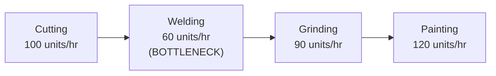
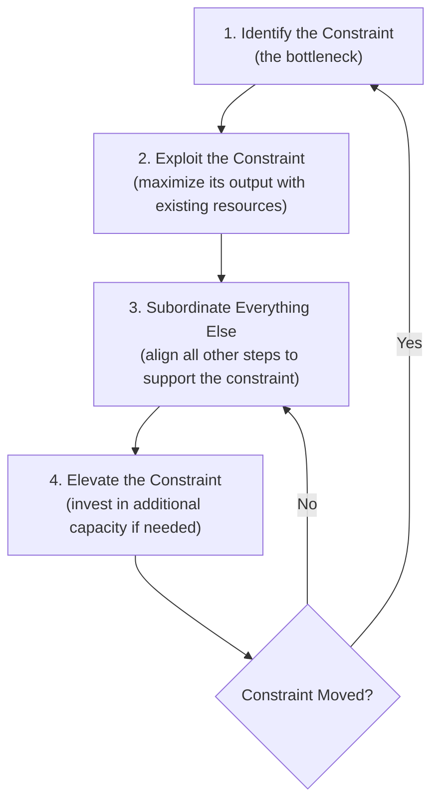
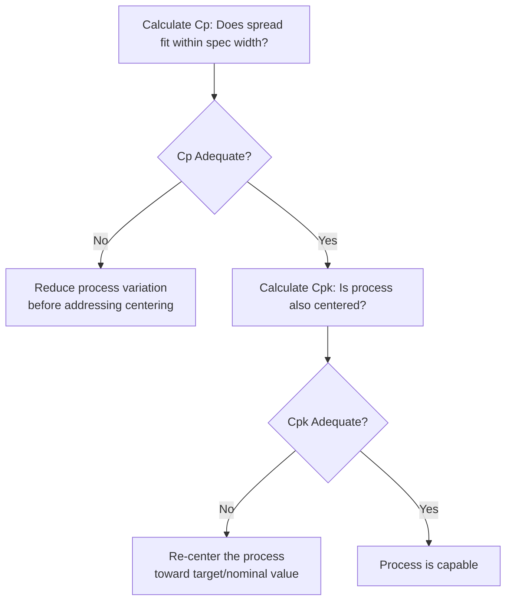

## Process Capability and Bottleneck Analysis

### Overview

Process capability and bottleneck analysis are core quantitative tools in operations management used to determine how well a process can meet demand and specification requirements, and to identify the specific process step that constrains overall system throughput. While these two concepts are often taught together, they address distinct questions: **process capability** typically refers to a statistical measure of whether a process can consistently produce output within specification limits, while **bottleneck analysis** refers to identifying the process step with the lowest capacity, which constrains the throughput of the entire system, regardless of how much capacity exists elsewhere in the process.

Both concepts build directly on process mapping and value stream mapping techniques covered earlier in this chapter, using the quantitative data (cycle time, capacity, variability) gathered during mapping to drive analytical conclusions about where and how to improve a process.

### Part 1: Process Capacity Analysis and Bottleneck Identification

#### Defining Capacity and Throughput

**Capacity** is the maximum sustainable output rate of a process or process step over a given time period. **Throughput** is the actual rate at which units flow through the entire process, which is always constrained by the process step with the lowest capacity.

**The Bottleneck** is the process step (resource, workstation, or activity) with the lowest capacity in a sequential process — it determines the maximum possible throughput of the entire system, regardless of how much excess capacity exists at any other step.

$$Process\ Capacity = \min(Capacity_1, Capacity_2, ..., Capacity_n)$$

Where $Capacity_i$ represents the capacity of each individual process step in the sequence.

#### Worked Example: Identifying the Bottleneck

Consider a four-step sequential process with the following individual step capacities:

| Step | Capacity (units/hour) |
| --- | --- |
| Step 1: Cutting | 100 |
| Step 2: Welding | 60 |
| Step 3: Grinding | 90 |
| Step 4: Painting | 120 |

$$Process\ Capacity = \min(100, 60, 90, 120) = 60\ units/hour$$

Step 2 (Welding) is the bottleneck. Even though Steps 1, 3, and 4 could individually process more units per hour, the overall system can never produce more than 60 units per hour, since every unit must pass through the Welding step. Any capacity increase at Steps 1, 3, or 4 alone will have **zero effect** on total system throughput until the Welding bottleneck itself is addressed.

#### Cycle Time and Capacity Relationship

Capacity and cycle time are inversely related:

$$Capacity = \frac{1}{Cycle\ Time}$$

**Example**: If the Welding step has a cycle time of 1 minute per unit:

$$Capacity_{Welding} = \frac{1}{1\ minute/unit} = 1\ unit/minute = 60\ units/hour$$

This confirms the bottleneck calculation above and illustrates why bottleneck identification is often performed directly by comparing cycle times: the process step with the **longest cycle time** is the bottleneck, since it processes units the slowest.

#### Utilization Calculation

Once the bottleneck (and therefore maximum system throughput) is identified, the **utilization** of every non-bottleneck resource can be calculated relative to that maximum throughput:

$$Utilization_i = \frac{Actual\ Output\ Rate}{Capacity_i} \times 100\%$$

**Example**: Using the process above, since system throughput is capped at 60 units/hour by the Welding bottleneck, the utilization of the other steps is:

- Cutting: $\frac{60}{100} \times 100\% = 60\%$
- Welding (bottleneck): $\frac{60}{60} \times 100\% = 100\%$
- Grinding: $\frac{60}{90} \times 100\% = 66.7\%$
- Painting: $\frac{60}{120} \times 100\% = 50\%$

This demonstrates a fundamental operations management principle: **non-bottleneck resources will always show idle capacity (utilization below 100%) in a properly functioning system**, since they must wait for the bottleneck to release work. Attempting to run non-bottleneck resources at full utilization typically only generates excess inventory (overproduction), not increased system throughput.

### Theory of Constraints (TOC)

The Theory of Constraints, developed by Eliyahu Goldratt (most notably articulated in his 1984 business novel *The Goal*), formalizes bottleneck analysis into a broader management philosophy centered on identifying and systematically managing the single constraint that limits system performance.

#### The Five Focusing Steps of TOC

1. **Identify the constraint.** Determine which resource, step, or policy is currently limiting system throughput (the bottleneck, as calculated above).
2. **Exploit the constraint.** Before investing in additional capacity, maximize the output of the existing bottleneck resource — eliminate idle time, defects, and non-value-added activity specifically at the bottleneck, since any unit of bottleneck time lost is lost system throughput permanently.
3. **Subordinate everything else to the constraint.** Align the pace and priorities of all non-bottleneck resources to support the bottleneck's schedule, rather than optimizing each resource independently (which, as shown above, only creates excess inventory without increasing throughput).
4. **Elevate the constraint.** If exploitation alone is insufficient to meet demand, invest in additional capacity at the bottleneck (added equipment, overtime, additional shifts).
5. **Repeat the process; avoid inertia.** Once a constraint is resolved, a new bottleneck will emerge elsewhere in the system; the cycle must be repeated continuously rather than assuming the original constraint remains fixed indefinitely.

**Key Points**

- A core TOC insight is that improvement effort applied anywhere other than the current bottleneck produces **no system-level benefit**, even if it produces a local efficiency improvement at that specific step — this directly challenges traditional cost-accounting approaches that evaluate and reward every workstation's individual efficiency independently.
- TOC's Drum-Buffer-Rope (DBR) scheduling methodology operationalizes these principles: the bottleneck sets the pace ("drum") for the entire system, a time or inventory buffer protects the bottleneck from upstream disruption, and a "rope" mechanism paces material release into the system to match the bottleneck's actual consumption rate, preventing excess WIP accumulation.

### Part 2: Process Capability Analysis (Statistical)

While bottleneck analysis addresses throughput/capacity, **process capability analysis** addresses a related but distinct question: given the natural variation in a process, how well does it perform relative to specification limits (customer or design requirements)?

#### Process Capability Indices

**Cp (Process Capability Index)**: Measures whether the process spread (variability) fits within the specification width, assuming the process is centered.

$$C_p = \frac{USL - LSL}{6\sigma}$$

Where:

- $USL$ = Upper Specification Limit
- $LSL$ = Lower Specification Limit
- $\sigma$ = process standard deviation

**Cpk (Process Capability Index, accounting for centering)**: Measures process capability while also accounting for how well the process is centered relative to the specification limits, using whichever side (upper or lower) is closer to the process mean.

$$C_{pk} = \min\left(\frac{USL - \mu}{3\sigma}, \frac{\mu - LSL}{3\sigma}\right)$$

Where $\mu$ is the process mean.

**Interpretation of Cpk values:**

| Cpk Value | Interpretation |
| --- | --- |
| Cpk < 1.0 | Process is not capable; significant defects likely |
| Cpk = 1.0 | Process just meets specification limits (marginal capability) |
| Cpk = 1.33 | Commonly cited minimum acceptable capability in many industries |
| Cpk = 1.67 | Considered a robust, well-controlled process |
| Cpk ≥ 2.0 | Six Sigma level capability (very low defect rate) |

**Worked Example**: A process produces a component with a target dimension of 50mm, specification limits of $USL = 52mm$ and $LSL = 48mm$, a process mean $\mu = 50.5mm$, and a process standard deviation $\sigma = 0.5mm$.

$$C_{pk} = \min\left(\frac{52 - 50.5}{3(0.5)}, \frac{50.5 - 48}{3(0.5)}\right) = \min\left(\frac{1.5}{1.5}, \frac{2.5}{1.5}\right) = \min(1.0, 1.67) = 1.0$$

The Cpk of 1.0 indicates the process is only marginally capable — specifically constrained by its proximity to the upper specification limit (since the process mean is shifted 0.5mm above target, toward the USL), even though the process would show much stronger capability (1.67) relative to the lower specification limit alone. This illustrates why Cpk (rather than Cp alone) is the preferred metric in practice: it captures the real-world risk created by process centering, not just raw variability. [Inference: the specific numeric thresholds (e.g., 1.33 as a common minimum) reflect widely cited industry conventions in quality management literature, but acceptable capability targets vary by industry, regulatory context, and the criticality of the specific characteristic being measured.]

#### Cp vs. Cpk: Why Both Matter

**Key Points**

- A process can have a high Cp (low variability, spread fits comfortably within specification width) but a low Cpk if the process is significantly off-center from the target — meaning the process is consistent but consistently producing output that skews toward one specification limit.
- Cpk can never exceed Cp; they are equal only when the process is perfectly centered on the target value.
- Addressing a low Cpk caused by poor centering (a mean-shift problem) typically requires a different corrective action (recalibration, process re-centering) than addressing a low Cp caused by excessive variability (which requires variation-reduction efforts, such as those used in Six Sigma DMAIC projects).

### Diagram: Process Capability vs. Specification Limits (svg_diagram)

<svg xmlns="http://www.w3.org/2000/svg" viewBox="0 0 640 320" font-family="Arial, sans-serif">
<text x="320" y="22" font-size="16" font-weight="bold" text-anchor="middle" fill="#1a1a1a">Process Capability vs. Specification Limits (svg_diagram)</text>

<line x1="60" y1="260" x2="580" y2="260" stroke="#333" stroke-width="1.5" />

<line x1="150" y1="60" x2="150" y2="260" stroke="#a03b3b" stroke-width="2" stroke-dasharray="5,3" />
<text x="150" y="50" font-size="11" text-anchor="middle" fill="#5e1a1a">LSL (48mm)</text>
<line x1="450" y1="60" x2="450" y2="260" stroke="#a03b3b" stroke-width="2" stroke-dasharray="5,3" />
<text x="450" y="50" font-size="11" text-anchor="middle" fill="#5e1a1a">USL (52mm)</text>
<line x1="300" y1="60" x2="300" y2="260" stroke="#999" stroke-width="1" stroke-dasharray="2,2" />
<text x="300" y="50" font-size="10" text-anchor="middle" fill="#555">Target (50mm)</text>

<path d="M 200,260 Q 260,260 320,150 Q 340,110 360,150 Q 420,260 480,260" fill="#eaf2fb" stroke="#3b6fa0" stroke-width="2" opacity="0.8" />
<text x="340" y="90" font-size="10" text-anchor="middle" fill="#1a3c5e">Process Distribution</text>
<text x="340" y="105" font-size="9" text-anchor="middle" fill="#1a3c5e">(mean = 50.5mm)</text>

<text x="320" y="290" font-size="11" text-anchor="middle" fill="#555" font-style="italic">Cp = 1.33 (spread fits) | Cpk = 1.0 (off-center toward USL)</text>

</svg>

### Integrating Bottleneck Analysis with Process Capability

**Key Points**

- Both concepts are frequently applied together in practice: bottleneck analysis identifies *where* to focus improvement effort (the constraining resource), while process capability analysis at that specific bottleneck step determines *whether* its output quality is acceptable, since a bottleneck operating with poor process capability compounds throughput loss with defect-driven rework.
- A defect occurring at the bottleneck step is particularly costly, since bottleneck time lost to producing defective output (requiring rework or scrap) directly reduces total system throughput in a way that a defect at a non-bottleneck step (with idle capacity to absorb rework) does not.
- This connects directly to TOC's "exploit the constraint" step: ensuring the bottleneck resource produces only good, first-pass-quality output is one of the highest-leverage actions available, since it maximizes effective throughput without requiring additional capital investment.

### Common Pitfalls

- **Optimizing non-bottleneck resources first**: Investing improvement effort in speeding up or increasing utilization of steps that are not the current bottleneck produces no system-level throughput benefit and often only increases WIP inventory, a frequently observed and counterintuitive finding for teams new to TOC principles.
- **Treating the bottleneck as permanently fixed**: Failing to recognize that resolving one constraint shifts the bottleneck elsewhere in the system (TOC's fifth focusing step), leading organizations to stop analysis prematurely after a single improvement cycle.
- **Confusing Cp and Cpk**: Reporting only Cp (which ignores centering) can create a false sense of process capability when the process is actually significantly off-target and producing defects concentrated near one specification limit.
- **Applying capability analysis to non-normal or unstable process data**: Standard Cp/Cpk formulas assume a stable, statistically in-control process following an approximately normal distribution; applying them to an out-of-control or non-normal process can produce misleading capability estimates. [Inference: this is a well-established statistical prerequisite discussed broadly in quality engineering literature, though the degree of formula robustness to departures from normality is a more technical statistical question outside the scope of a general overview.]
- **Ignoring variability in bottleneck identification**: Simple average-capacity bottleneck analysis can miss situations where a non-average bottleneck (a step with high variability, even if average capacity appears adequate) periodically becomes the binding constraint — a consideration explored further in queuing theory and simulation-based capacity analysis.

### Relationship to Other Operations Management Concepts

- **Process Flowcharting and Value Stream Mapping**: Both provide the structural and timing data (cycle times, step sequence) required to perform bottleneck identification and capacity analysis.
- **Theory of Constraints**: Formalizes bottleneck analysis into a complete management methodology (the Five Focusing Steps and Drum-Buffer-Rope scheduling).
- **Six Sigma DMAIC**: Process capability analysis (Cp/Cpk) is a standard quantitative tool in the Measure and Analyze phases of Six Sigma projects, establishing baseline capability before improvement efforts targeting variation reduction.
- **Statistical Process Control (SPC)**: Process capability analysis assumes the process is first in a state of statistical control (as verified via control charts); capability indices calculated on an out-of-control process are not meaningful.
- **Capacity Planning**: Bottleneck identification directly informs capacity investment decisions, ensuring capital is allocated to the resource that will actually increase system throughput rather than to resources with existing idle capacity.
- **Line Balancing** (from process types): Line balancing techniques are directly aimed at minimizing bottleneck-driven idle time by allocating tasks across workstations as evenly as possible relative to a target cycle time.

**Related Topics**

- Theory of Constraints and the Five Focusing Steps
- Drum-Buffer-Rope (DBR) scheduling
- Statistical Process Control (SPC) and control charts
- Six Sigma DMAIC methodology
- Line balancing techniques
- Queuing theory and variability-driven capacity analysis
- Capacity planning and long-term capacity strategy
- Value stream mapping
- Six Sigma quality levels and defect rate calculations
- Little's Law and flow time analysis