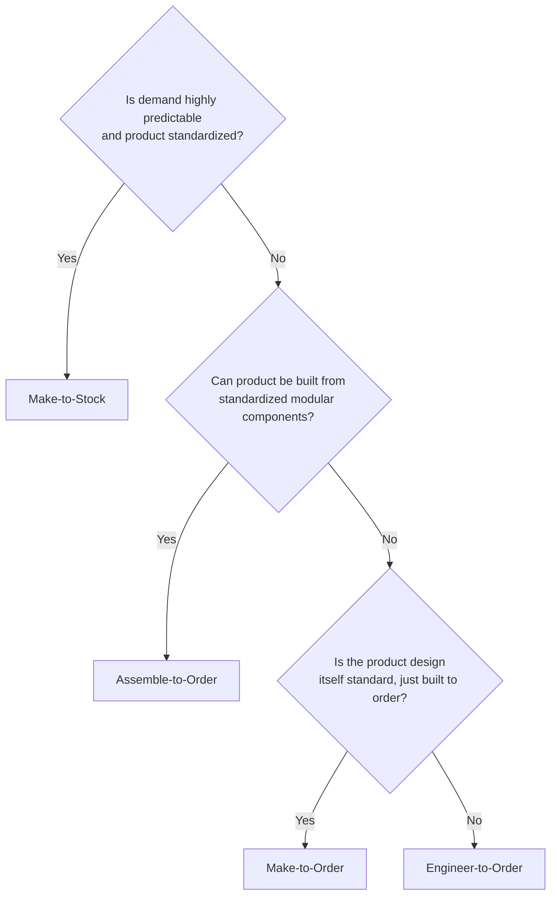

## Make-to-Stock, Make-to-Order, and Hybrid Strategies

### Overview

Make-to-stock (MTS), make-to-order (MTO), and their hybrid variants are fundamental production and order fulfillment strategies that determine at what point in the production process customer demand triggers manufacturing activity, relative to when actual production begins. This decision — often referred to as the **customer order decoupling point (CODP)** or **order penetration point** — is one of the most consequential strategic choices in operations management, directly shaping inventory strategy, lead time, forecasting requirements, process design, and customer responsiveness.

These strategies connect directly to several concepts covered earlier in this chapter: process type selection (job shop, batch, line, continuous flow), modular design and postponement, and the product life cycle all interact closely with the choice of fulfillment strategy.

### The Customer Order Decoupling Point (CODP)

The customer order decoupling point is the location in the value stream — moving from raw material through final product delivery — where inventory is held in anticipation of demand (upstream of the CODP) versus where production is triggered directly by an actual customer order (downstream of the CODP).

**Key Points**

- Everything upstream of the CODP is driven by demand **forecasts** (push-based, speculative production).
- Everything downstream of the CODP is driven by actual **customer orders** (pull-based, committed production).
- The position of the CODP is the primary variable distinguishing the strategies described below, moving progressively upstream (toward raw material) as customization requirements increase and demand predictability decreases.

### Make-to-Stock (MTS)

Make-to-Stock is a strategy in which products are manufactured based on demand forecasts and held as finished goods inventory, ready for immediate shipment when a customer order arrives. The CODP sits at the very end of the value stream (finished goods inventory).

**Characteristics:**

- **Customer lead time**: Very short (often immediate, limited only by shipping/distribution time), since the product already exists in finished form.
- **Product variety**: Low to moderate; MTS works best with standardized products with relatively predictable, aggregated demand.
- **Forecasting dependency**: Very high; production planning relies entirely on demand forecasts, since no actual customer order exists at the time production decisions are made.
- **Inventory risk**: Highest of all strategies; finished goods inventory is fully committed to specific product configurations before any customer order exists, creating risk of both stockouts (forecast too low) and excess/obsolete inventory (forecast too high).
- **Typical process type**: Line or continuous flow processes (per the Product-Process Matrix), since high-volume, standardized production justifies capital investment in specialized, efficient equipment.

**Examples**: Consumer packaged goods (toothpaste, canned foods), standard retail apparel, common hardware store items, most fast-moving consumer electronics.

### Make-to-Order (MTO)

Make-to-Order is a strategy in which production does not begin until a confirmed customer order is received, with the CODP positioned near the beginning of the value stream, often at or near raw material procurement.

**Characteristics:**

- **Customer lead time**: Long, since the entire production process (including any raw material procurement not already stocked) occurs only after order confirmation.
- **Product variety**: High; MTO accommodates significant customization since each unit is built specifically to the confirmed order's requirements.
- **Forecasting dependency**: Low for finished product configuration, though raw material and component-level forecasting may still be used to maintain reasonable material availability.
- **Inventory risk**: Low for finished goods (since nothing is produced speculatively), though risk shifts to component/raw material inventory and to capacity/lead-time commitment risk if customer demand volume is uncertain.
- **Typical process type**: Job shop or batch processes, given the high variety and lower volume per specific configuration.

**Examples**: Custom furniture, made-to-measure clothing, custom machinery, most business-to-business (B2B) industrial equipment, many professional services deliverables.

### Engineer-to-Order (ETO)

A related, more extreme variant of MTO, Engineer-to-Order involves not just production but also **design and engineering** occurring after the customer order is received, since the product specification itself is unique to that customer's requirements.

**Characteristics:**

- **Customer lead time**: Longest of all strategies, since design/engineering time precedes any procurement or production activity.
- **Product variety**: Maximum; each order is potentially a unique design.
- **Typical process type**: Project process (per process type classification), given the one-off, highly customized nature of each order.

**Examples**: Custom industrial plant construction, bespoke shipbuilding, large custom software systems, custom architectural projects.

### Assemble-to-Order (ATO)

Assemble-to-Order is a hybrid strategy in which standardized components and subassemblies are produced to forecast and held in inventory, while final assembly/configuration into the specific ordered product variant occurs only after a customer order is received. The CODP sits between component/subassembly production and final assembly.

**Characteristics:**

- **Customer lead time**: Moderate — shorter than pure MTO (since components are already available) but longer than pure MTS (since final assembly still occurs after order receipt).
- **Product variety**: High external variety achievable through combinatorial configuration of standardized components (directly connecting to modular design and product platform strategy covered earlier in this chapter).
- **Forecasting dependency**: Moderate; forecasting is required at the component/subassembly level (which is typically more stable and aggregatable than finished-product-level forecasting) rather than at the finished product configuration level.
- **Inventory risk**: Moderate; risk is concentrated in component-level inventory rather than finished-goods inventory, generally lower risk than MTS since components can often be shared across multiple finished product configurations.
- **Typical process type**: Hybrid — component fabrication often uses line/batch processes, while final assembly may use a more flexible batch or cellular approach.

**Examples**: Dell's historic build-to-order computer model, automobile manufacturing with configurable trim/options packages, many industrial equipment manufacturers offering modular product lines.

### Comparative Summary Table

| Dimension | Make-to-Stock (MTS) | Assemble-to-Order (ATO) | Make-to-Order (MTO) | Engineer-to-Order (ETO) |
| --- | --- | --- | --- | --- |
| CODP location | End (finished goods) | Between components and final assembly | Near raw material/start of production | Before design/engineering |
| Customer lead time | Shortest (immediate) | Short-moderate | Long | Longest |
| Product variety | Low-moderate | High (via configuration) | High (via full customization) | Maximum (unique per order) |
| Forecast dependency | Very high | Moderate (component level) | Low (finished product level) | Minimal |
| Finished goods inventory risk | Highest | Low-moderate | Very low | None |
| Typical process type | Line, continuous flow | Hybrid (line + batch/cellular) | Job shop, batch | Project |
| Example | Grocery products | Configurable computers, vehicles | Custom furniture | Custom industrial plants |

### Decision Framework: Choosing a Fulfillment Strategy

**Key factors influencing the strategy decision:**

1. **Customer lead time tolerance**: Markets where customers expect immediate availability (retail consumer goods) push the CODP downstream toward MTS; markets where customers accept longer lead times for customization (industrial equipment) allow the CODP to move upstream.
2. **Demand predictability**: Stable, forecastable demand supports MTS; volatile or highly individualized demand favors MTO/ETO, since speculative production against an unpredictable forecast carries excessive inventory risk.
3. **Product variety and customization requirements**: High variety with low forecasting confidence per specific configuration favors positioning the CODP earlier (MTO/ETO) or leveraging modularity to enable ATO.
4. **Cost of inventory carrying and obsolescence risk**: Products with high per-unit value, rapid technology change, or short product life cycles (see product life cycle management) often favor MTO/ATO to avoid carrying expensive, potentially obsolete finished goods inventory.
5. **Product architecture and modularity**: As covered under modular design and product platforms, a highly modular product architecture is often the specific enabler that makes ATO feasible for a product category that would otherwise require either pure MTS (accepting high variety-driven inventory risk) or pure MTO (accepting longer lead times).

### Diagram: Customer Order Decoupling Point Positioning (svg_diagram)

<svg xmlns="http://www.w3.org/2000/svg" viewBox="0 0 700 300" font-family="Arial, sans-serif">
<text x="350" y="22" font-size="16" font-weight="bold" text-anchor="middle" fill="#1a1a1a">Customer Order Decoupling Point by Strategy (svg_diagram)</text>

<line x1="60" y1="150" x2="640" y2="150" stroke="#333" stroke-width="2" />
<text x="60" y="140" font-size="10" text-anchor="start" fill="#333">Raw Material</text>
<text x="640" y="140" font-size="10" text-anchor="end" fill="#333">Customer Delivery</text>

<line x1="60" y1="180" x2="60" y2="220" stroke="#a03b3b" stroke-width="2" />
<text x="60" y="235" font-size="10" text-anchor="middle" fill="#5e1a1a">ETO</text>
<text x="60" y="250" font-size="9" text-anchor="middle" fill="#5e1a1a">(design + build to order)</text>

<line x1="200" y1="180" x2="200" y2="220" stroke="#a0743b" stroke-width="2" />
<text x="200" y="235" font-size="10" text-anchor="middle" fill="#5e451a">MTO</text>
<text x="200" y="250" font-size="9" text-anchor="middle" fill="#5e451a">(build to order)</text>

<line x1="400" y1="180" x2="400" y2="220" stroke="#3b8f4a" stroke-width="2" />
<text x="400" y="235" font-size="10" text-anchor="middle" fill="#1a4d24">ATO</text>
<text x="400" y="250" font-size="9" text-anchor="middle" fill="#1a4d24">(assemble to order)</text>

<line x1="600" y1="180" x2="600" y2="220" stroke="#3b6fa0" stroke-width="2" />
<text x="600" y="235" font-size="10" text-anchor="middle" fill="#1a3c5e">MTS</text>
<text x="600" y="250" font-size="9" text-anchor="middle" fill="#1a3c5e">(ship from stock)</text>

<text x="350" y="280" font-size="11" text-anchor="middle" fill="#555" font-style="italic">CODP moves upstream (left) as customization increases, downstream (right) as standardization increases</text>

</svg>

### Postponement and Its Relationship to Hybrid Strategies

**Postponement** (also called delayed differentiation, covered under modular design and product platforms) is the strategic practice of deliberately delaying product differentiation as late as possible in the value stream, and is the core enabling principle behind ATO and other hybrid strategies.

$$Total\ Customer\ Lead\ Time = Order\ Processing\ Time + Time\ from\ CODP\ to\ Delivery$$

By positioning the CODP later (closer to final delivery) through modular design, an organization can reduce customer-facing lead time relative to pure MTO, while still limiting speculative inventory risk relative to pure MTS, since only common, shared components are produced against a forecast — and component-level demand is typically more stable and easier to forecast accurately than finished-product-level demand (because component demand aggregates across all the finished product variants that use it).

**Example**: A computer manufacturer using ATO might forecast and stock common components (specific processor models, memory modules, storage drives) based on aggregate historical demand across all customer configurations, while final assembly into a specific customer's exact configuration occurs only after order receipt — achieving customer lead times of days rather than the weeks a pure MTO approach might require, while avoiding the enormous finished-goods inventory risk that stocking every possible configuration combination under a pure MTS approach would create.

### Mixed and Multi-Tier Strategies

Many organizations operate multiple fulfillment strategies simultaneously across different product lines or even within a single product line, based on customer segment or specific product characteristics:

- **Product-line segmentation**: High-volume, standard products within a portfolio may be managed as MTS, while premium or highly customized variants within the same broader product family are managed as MTO or ATO.
- **Channel-based segmentation**: The same product may be offered as MTS through retail channels (immediate availability) while offered as ATO or MTO through direct/B2B channels serving customers with specific configuration requirements.
- **Dynamic CODP repositioning**: Some organizations deliberately shift the CODP position over a product's life cycle — for example, using MTO during the introduction stage (when demand is uncertain and forecasting is unreliable) and transitioning toward MTS or ATO as the product matures and demand becomes more predictable, directly connecting to the product life cycle management concepts covered earlier in this chapter.

### Common Pitfalls

- **Misaligning process type with fulfillment strategy**: Attempting to run MTS-level standardized, high-volume line processes for a product line that actually requires MTO-level customization (or vice versa) creates fundamental process-strategy mismatch, a specific application of the Product-Process Matrix principle.
- **Underinvesting in modularity when pursuing ATO**: ATO's effectiveness depends heavily on the underlying product architecture actually supporting clean, standardized component interfaces (as covered under modular design); attempting ATO with a fundamentally integral, non-modular product architecture undermines the strategy's core benefits.
- **Forecasting at the wrong level of aggregation**: In ATO environments, forecasting at the finished-product-configuration level (rather than the component level) reintroduces much of the forecasting risk ATO is specifically designed to avoid.
- **Failing to segment strategy by product or customer characteristics**: Applying a single, uniform fulfillment strategy across an entire, diverse product portfolio often results in some products being poorly served by an inappropriate strategy — high-volume standard items forced through MTO processes, or highly customized items forced into MTS-style forecasting.
- **Ignoring capacity/lead-time commitments in MTO**: Unlike MTS (where finished inventory exists), MTO customer lead time promises depend directly on available production capacity at order time; failing to actively manage capacity against order backlog can lead to unreliable delivery promises.

### Relationship to Other Operations Management Concepts

- **Product-Process Matrix**: Directly informs which process type (job shop, batch, line, continuous flow) aligns with each fulfillment strategy's volume/variety profile.
- **Modular Design and Product Platforms**: The primary structural enabler of ATO and other postponement-based hybrid strategies, allowing high external variety with limited internal component complexity.
- **Product Life Cycle Management**: Fulfillment strategy often shifts across a product's life cycle stages, moving from MTO/uncertain forecasting during introduction toward MTS/ATO as demand stabilizes during maturity.
- **Demand Forecasting**: MTS and the component-level forecasting used in ATO both depend heavily on forecasting accuracy, while MTO/ETO reduce (but do not eliminate) forecasting dependency, shifting it toward raw material and capacity planning rather than finished-product-level demand.
- **Inventory Management**: The choice of fulfillment strategy is one of the primary determinants of where inventory risk and carrying cost are concentrated across the value stream.

**Related Topics**

- Customer Order Decoupling Point (CODP) positioning strategy
- Postponement and delayed differentiation
- Modular design and product platforms
- Product-Process Matrix (Hayes-Wheelwright framework)
- Demand forecasting methods and aggregation levels
- Inventory management and safety stock strategy
- Product life cycle management
- Configure-to-order systems and product configurators
- Capacity planning and order backlog management
- Mass customization strategies