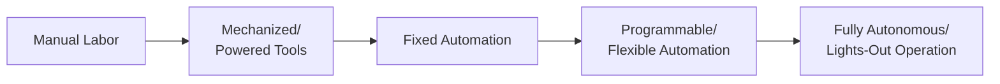
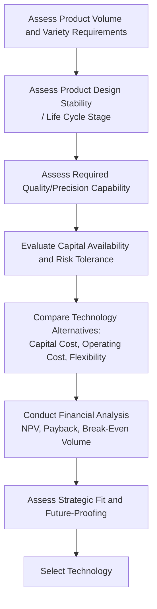

## Process Technology Selection

### Overview

Process technology selection is the strategic decision-making activity of choosing the specific equipment, automation level, and technological approach used to execute a production or service process. This decision sits downstream of process type selection (project, job shop, batch, line, continuous flow) and directly shapes capital investment requirements, flexibility, labor requirements, quality capability, and cost structure. Process technology decisions are among the most capital-intensive and difficult-to-reverse choices in operations management, since specialized equipment often represents a multi-year or multi-decade commitment that constrains future process flexibility.

This topic connects directly to several concepts covered earlier in this chapter: process type (which establishes the general volume/variety context for technology choice), the product life cycle (which determines how much design stability exists to justify specialized technology investment), and process capability/bottleneck analysis (which technology investment decisions are often specifically targeted to resolve).

### Key Dimensions of Process Technology Choice

#### 1. Degree of Automation

Process technology spans a spectrum from fully manual labor through various levels of mechanization and automation to fully autonomous, "lights-out" operation.

- **Manual labor**: Human workers perform tasks with hand tools or minimal equipment assistance; highest flexibility, lowest capital cost, highest per-unit labor cost, generally lowest consistency.
- **Mechanized/powered equipment**: Human-operated machines and powered tools increase output rate and reduce physical strain, but still require direct human control for each operation.
- **Fixed (hard) automation**: Equipment designed and tooled for a single, specific task or product, achieving very high throughput and consistency for that specific application, but with minimal flexibility to accommodate product changes without significant retooling.
- **Programmable (flexible) automation**: Equipment that can be reprogrammed to handle different tasks or product variants (e.g., CNC machining centers, industrial robots with interchangeable end-effectors and programmable motion paths), balancing higher throughput/consistency with moderate flexibility.
- **Fully autonomous operation**: Highly integrated systems requiring minimal direct human intervention during normal operation, often incorporating sensor feedback, adaptive control, and, increasingly, AI-driven decision-making for quality inspection, scheduling, or process adjustment.

#### 2. Degree of Process Integration

- **Stand-alone equipment**: Individual machines operate independently, with material transferred manually or via simple material handling between operations.
- **Linked/integrated systems**: Equipment is physically and/or digitally connected, allowing automated material transfer and coordinated control across multiple operations (e.g., a Flexible Manufacturing System, or FMS).
- **Fully integrated production systems**: Entire production lines or facilities operate as a coordinated system with centralized or distributed digital control, real-time data sharing, and automated scheduling/routing decisions (closely associated with the broader "Industry 4.0" and "smart manufacturing" movement).

#### 3. Flexibility vs. Efficiency Trade-off

**Key Points**

- This trade-off is the central tension in process technology selection: fixed/hard automation typically achieves the lowest unit cost and highest throughput for a stable, high-volume, low-variety product, but at the cost of very high switching cost if the product design or mix changes.
- Flexible/programmable automation sacrifices some throughput efficiency and unit cost relative to hard automation, but can accommodate product variety and design changes without major capital re-investment.
- This trade-off directly parallels the volume-variety spectrum underlying process type selection (job shop through continuous flow) — technology choice at each process type should generally align with that process type's inherent flexibility/efficiency positioning, though flexible automation increasingly allows some processes to achieve efficiency historically associated only with less flexible, higher-volume-dedicated technology.

### Framework for Process Technology Decisions

1. **Assess product volume and variety requirements.** Establishes the baseline volume/variety profile that determines whether flexible or dedicated (fixed) technology is more appropriate, directly connecting to process type selection.
2. **Assess product design stability and life cycle stage.** As emphasized under product life cycle management, committing to specialized, high-capital technology before a product design has stabilized (typically during introduction or early growth) risks costly rework or stranded investment.
3. **Assess required quality and precision capability.** Some quality/tolerance requirements can only be reliably achieved with specific technology (e.g., certain tolerances are achievable only via CNC machining, not manual operation), directly connecting to process capability analysis (Cp/Cpk).
4. **Evaluate capital availability and organizational risk tolerance.** Automated and integrated technology typically requires substantial upfront capital investment; organizations must weigh this against available capital and the risk of demand or design uncertainty.
5. **Compare technology alternatives quantitatively**, considering capital cost, ongoing operating cost (labor, maintenance, energy), expected useful life, and flexibility to accommodate future product/volume changes.
6. **Conduct financial analysis**, typically using capital budgeting techniques (Net Present Value, payback period, break-even volume analysis) to compare alternatives on a common financial basis.
7. **Assess broader strategic fit**, including alignment with competitive strategy (cost leadership vs. differentiation), supply chain implications, and technology future-proofing against anticipated industry or product evolution.

### Break-Even Volume Analysis for Technology Selection

A common quantitative technique for comparing technology alternatives (e.g., manual/flexible technology with low fixed cost but high variable cost, versus automated/dedicated technology with high fixed cost but low variable cost) is break-even volume analysis.

$$Total\ Cost_{Option\ A} = FC_A + (VC_A \times Q)$$

$$Total\ Cost_{Option\ B} = FC_B + (VC_B \times Q)$$

Setting the two total cost equations equal and solving for $Q$ gives the break-even volume:

$$Q_{break\text{-}even} = \frac{FC_B - FC_A}{VC_A - VC_B}$$

**Worked Example**: Comparing a manual production approach (Option A: fixed cost $50,000, variable cost $40/unit) against an automated approach (Option B: fixed cost $400,000, variable cost $15/unit):

$$Q_{break\text{-}even} = \frac{400{,}000 - 50{,}000}{40 - 15} = \frac{350{,}000}{25} = 14{,}000\ units$$

Below 14,000 units of expected annual volume, the manual approach (Option A) has lower total cost; above 14,000 units, the automated approach (Option B) becomes more cost-effective due to its lower variable cost per unit spreading the higher fixed investment across more units.

### Diagram: Break-Even Volume Comparison (svg_diagram)

<svg xmlns="http://www.w3.org/2000/svg" viewBox="0 0 640 340" font-family="Arial, sans-serif">
<text x="320" y="22" font-size="16" font-weight="bold" text-anchor="middle" fill="#1a1a1a">Technology Break-Even Volume Analysis (svg_diagram)</text>

<line x1="70" y1="280" x2="580" y2="280" stroke="#333" stroke-width="2" />
<line x1="70" y1="280" x2="70" y2="50" stroke="#333" stroke-width="2" />
<text x="325" y="310" font-size="12" text-anchor="middle" fill="#333">Volume (units)</text>
<text x="30" y="165" font-size="12" text-anchor="middle" fill="#333" transform="rotate(-90 30 165)">Total Cost ($)</text>

<line x1="70" y1="255" x2="580" y2="80" stroke="#3b6fa0" stroke-width="2.5" />
<text x="530" y="75" font-size="10" fill="#1a3c5e">Option A: Manual</text>
<text x="530" y="90" font-size="9" fill="#1a3c5e">(low fixed, high variable)</text>

<line x1="70" y1="180" x2="580" y2="110" stroke="#a03b3b" stroke-width="2.5" />
<text x="530" y="120" font-size="10" fill="#5e1a1a">Option B: Automated</text>
<text x="530" y="135" font-size="9" fill="#5e1a1a">(high fixed, low variable)</text>

<circle cx="320" cy="150" r="5" fill="#333" />
<line x1="320" y1="150" x2="320" y2="280" stroke="#999" stroke-width="1" stroke-dasharray="4,3" />
<text x="320" y="298" font-size="10" text-anchor="middle" fill="#333">Break-even: 14,000 units</text>
</svg>

### Total Cost of Ownership Considerations

Beyond initial capital cost, comprehensive process technology selection should account for the full **Total Cost of Ownership (TCO)** across the technology's useful life:

| Cost Category | Description |
| --- | --- |
| Initial capital cost | Purchase price, installation, facility modification |
| Training cost | Operator and maintenance staff training on new technology |
| Ongoing operating cost | Energy, consumables, routine operating labor |
| Maintenance cost | Preventive and corrective maintenance, spare parts |
| Downtime cost | Lost production value during planned/unplanned outages |
| Integration cost | Connecting new technology with existing systems (ERP, MES, other equipment) |
| Disposal/decommissioning cost | End-of-life removal, and potentially resale/salvage value |
| Obsolescence risk | Cost/risk of technology becoming outdated before its economic useful life ends |

### Emerging Process Technology Trends

**Key Points**

- **Industry 4.0 / Smart Manufacturing**: The integration of Internet of Things (IoT) sensors, real-time data analytics, and interconnected digital systems into process technology, enabling predictive maintenance, real-time quality monitoring, and adaptive process control. [Unverified: specific vendor platforms and standards in this rapidly evolving space change frequently; readers evaluating specific smart manufacturing technology should consult current vendor documentation and industry standards bodies for up-to-date capability and interoperability information.]
- **Collaborative robots ("cobots")**: Robotic systems designed to work safely alongside human operators without traditional safety cages, offering a middle ground between fully manual and fully automated operation, often with lower deployment cost and greater reconfigurability than traditional industrial robotics.
- **Additive manufacturing (3D printing)**: Increasingly viable for both prototyping and, in some applications, direct production, offering unique flexibility advantages (tool-less production, complex geometries, on-demand/distributed manufacturing) at the cost of typically slower per-unit production speed compared to traditional subtractive or forming processes at scale.
- **Digital twins**: Virtual, data-driven replicas of physical production systems used to simulate, test, and optimize process technology decisions before physical implementation, reducing the risk associated with major capital technology investments.
- **AI-driven process control and quality inspection**: Machine learning models increasingly applied to real-time process parameter adjustment and automated visual/sensor-based quality inspection, though the maturity and reliability of such systems vary significantly by application and industry. [Speculation: the long-term trajectory and eventual standard adoption patterns of AI-driven process technology remain an active area of industry development, and specific capability claims should be evaluated against current, verifiable vendor performance data rather than general industry narrative.]

### Strategic Risks in Process Technology Selection

**Key Points**

- **Technology obsolescence risk**: Committing to a specific technology platform before understanding its long-term viability can result in stranded capital if superior alternatives emerge or if the underlying technology standard is discontinued or unsupported.
- **Over-automation risk**: As referenced under product life cycle management and process types, committing to highly specialized, inflexible automation before product design has stabilized risks costly rework if design changes are needed.
- **Under-automation risk**: Conversely, failing to invest in appropriate automation when volume and design stability justify it can leave an organization at a persistent cost or consistency disadvantage relative to competitors who have made the investment.
- **Integration and change management risk**: New process technology, particularly highly automated or digitally integrated systems, often requires significant organizational change management, workforce retraining, and IT integration effort that is frequently underestimated in initial technology business cases.
- **Vendor/supplier lock-in risk**: Highly specialized or proprietary technology platforms can create long-term dependency on a specific vendor for maintenance, spare parts, software updates, and support, reducing future negotiating leverage and flexibility.

### Common Pitfalls

- **Selecting technology based on latest trends rather than actual volume/variety fit**: Adopting highly automated or "cutting-edge" technology because it is fashionable or because competitors have adopted it, without a rigorous volume/variety and financial justification specific to the organization's actual product and demand profile.
- **Underestimating total cost of ownership**: Focusing exclusively on initial capital cost while underestimating ongoing operating, maintenance, training, and integration costs, leading to inaccurate technology comparisons.
- **Ignoring product life cycle stage**: As emphasized throughout this chapter, committing to inflexible, high-capital technology during a product's introduction or early growth stage (when design is still evolving) is one of the most common and costly process technology selection errors.
- **Insufficient flexibility for future product variety**: Selecting highly dedicated, single-purpose technology without considering anticipated future product family expansion, particularly when modular design and product platform strategies suggest future variety is likely.
- **Neglecting workforce and organizational readiness**: Assuming new technology can be deployed successfully without adequate investment in training, process redesign, and change management, a risk directly paralleling similar concerns raised under Business Process Reengineering.

### Relationship to Other Operations Management Concepts

- **Process Types (Project, Job Shop, Batch, Line, Continuous Flow)**: Establishes the fundamental volume/variety context within which specific technology choices are made; technology should align with, not contradict, the underlying process type strategy.
- **Product Life Cycle Management**: Product design stability across life cycle stages directly determines how much specialized, high-capital technology investment is justified at any given point in time.
- **Process Capability and Bottleneck Analysis**: Technology investment is frequently the specific mechanism used to "elevate the constraint" (per Theory of Constraints) once exploitation of existing bottleneck capacity has been exhausted, and technology choice directly determines achievable process capability (Cp/Cpk).
- **Modular Design and Product Platforms**: Flexible/programmable automation is often specifically required to support the variety generated by modular product architectures within a single production system.
- **Capacity Planning**: Process technology selection and capacity planning are tightly interlinked decisions, since technology choice directly determines the capital cost and lead time required to add future capacity.

**Related Topics**

- Capital budgeting and investment analysis (NPV, payback period)
- Flexible Manufacturing Systems (FMS)
- Industry 4.0 and smart manufacturing
- Capacity planning and expansion strategy
- Theory of Constraints (elevating the constraint)
- Process capability analysis (Cp/Cpk)
- Total Cost of Ownership (TCO) analysis
- Automation and workforce transition management
- Additive manufacturing and digital twins
- Modular design and product platforms