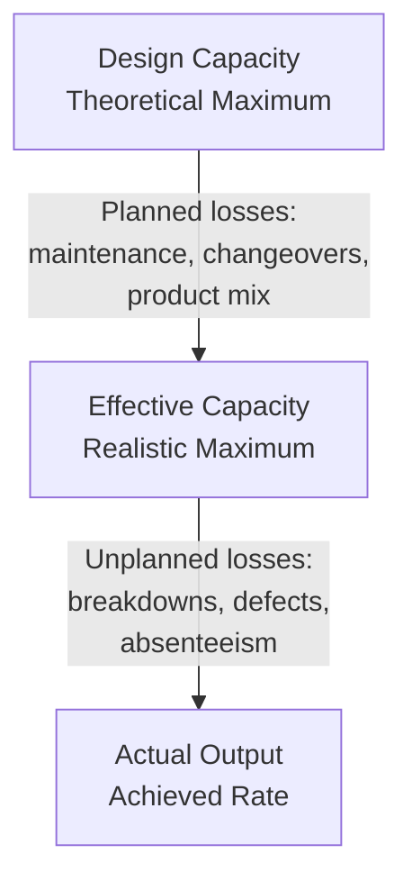
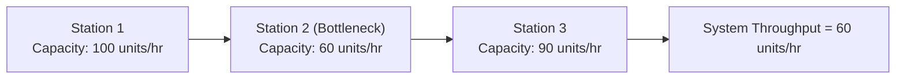

## Capacity Measurement and Utilization Metrics

### Definitions and Core Concepts

**Capacity** is the maximum output rate a process, system, or resource can achieve under defined conditions over a specified time period. Capacity is not a single fixed number — it varies with the measurement basis chosen (design vs. effective) and the time horizon considered.

Three foundational capacity concepts:

- **Design Capacity**: The maximum theoretical output rate achievable under ideal conditions — no breakdowns, no maintenance, no quality losses, optimal staffing. This is a ceiling value rarely sustained in practice.
- **Effective Capacity**: The maximum output rate achievable under normal, realistic operating conditions, accounting for product mix, maintenance schedules, quality standards, scheduling constraints, and legitimate downtime.
- **Actual Output**: The output rate actually achieved, which is typically lower than effective capacity due to unplanned disruptions — machine breakdowns, absenteeism, material shortages, quality defects, and other losses.

The relationship is hierarchical: Design Capacity ≥ Effective Capacity ≥ Actual Output.

### Key Formulas

**Efficiency** measures how well a process performs relative to its effective capacity:

$$\text{Efficiency} = \frac{\text{Actual Output}}{\text{Effective Capacity}} \times 100\%$$

**Utilization** measures how well a process performs relative to its design capacity:

$$\text{Utilization} = \frac{\text{Actual Output}}{\text{Design Capacity}} \times 100\%$$

Because effective capacity is always ≤ design capacity, utilization is always ≤ efficiency for the same actual output.

**Example**

A bakery has a design capacity of 120 loaves/hour. Due to scheduled cleaning cycles and shift changeovers, effective capacity is 100 loaves/hour. During a given hour, the bakery produces 90 loaves.

- Efficiency = $90 / 100 \times 100\% = 90\%$
- Utilization = $90 / 120 \times 100\% = 75\%$

This gap (90% efficiency vs. 75% utilization) tells a manager the process is performing well *relative to its realistic ceiling*, but there's a larger, harder-to-close 25-point gap against the theoretical maximum — informative for long-term capacity investment decisions versus short-term operational tuning.

### Rated Capacity

**Rated Capacity** combines effective capacity with efficiency to estimate a realistic expected output, useful for planning when historical efficiency data exists:

$$\text{Rated Capacity} = \text{Effective Capacity} \times \frac{\text{Efficiency}}{100}$$

**Example**

A machine's effective capacity is 300 units/day. Historical efficiency data shows the machine typically runs at 85% efficiency.

$$\text{Rated Capacity} = 300 \times 0.85 = 255 \text{ units/day}$$

This 255 units/day figure — not the 300 or the design capacity — should be used for realistic order promising and master scheduling.

### Utilization Metrics in Practice

#### Machine/Equipment Utilization

$$\text{Machine Utilization} = \frac{\text{Actual Machine Hours Used}}{\text{Total Available Machine Hours}} \times 100\%$$

"Total Available" here typically refers to scheduled operating time (e.g., a 3-shift, 24-hour operation minus planned maintenance), not calendar time, unless the analysis explicitly compares against calendar hours (relevant for capital-intensive continuous-process industries like petrochemicals).

#### Labor Utilization

$$\text{Labor Utilization} = \frac{\text{Productive Labor Hours}}{\text{Total Paid Labor Hours}} \times 100\%$$

Productive hours exclude idle time, training, unplanned breaks, and rework — though some frameworks classify training time separately as an investment rather than a loss.

#### Overall Equipment Effectiveness (OEE)

OEE is the most widely used composite utilization metric in manufacturing operations, decomposing capacity loss into three multiplicative factors:

$$\text{OEE} = \text{Availability} \times \text{Performance} \times \text{Quality}$$

Where:

$$\text{Availability} = \frac{\text{Operating Time}}{\text{Planned Production Time}}$$

$$\text{Performance} = \frac{\text{Ideal Cycle Time} \times \text{Total Count}}{\text{Operating Time}}$$

$$\text{Quality} = \frac{\text{Good Count}}{\text{Total Count}}$$

**Example**

A production line's shift has:

- Planned Production Time: 480 minutes
- Downtime (changeovers + breakdowns): 60 minutes → Operating Time = 420 minutes
- Ideal Cycle Time: 1 minute/unit
- Total Count Produced: 380 units
- Good Units (passed quality): 361 units

Calculations:

- Availability = $420 / 480 = 87.5\%$
- Performance = $(1 \times 380) / 420 = 90.5\%$
- Quality = $361 / 380 = 95.0\%$
- OEE = $0.875 \times 0.905 \times 0.95 = 75.2\%$

World-class OEE benchmarks are commonly cited around 85%, though this varies significantly by industry [Unverified — benchmark figures are widely circulated in lean manufacturing literature but vary by source and industry context].

### Capacity Cushion

**Capacity Cushion** (or capacity slack) is the amount of reserve capacity a firm maintains beyond expected demand, used to absorb demand variability, enable flexibility, and accommodate growth.

$$\text{Capacity Cushion} = 100\% - \text{Utilization Rate}$$

A **positive cushion strategy** (capacity exceeds expected demand) suits firms in growing markets, industries with high demand volatility, or where stockouts are extremely costly (e.g., hospitals, emergency services). A **negative cushion strategy** (planned capacity shortfall, demand exceeds capacity) suits capital-intensive industries seeking to maximize asset utilization, or firms competing primarily on cost efficiency.

**Trade-off**: Large cushions increase flexibility and service level but raise fixed costs and reduce capital efficiency (return on assets). Small or negative cushions maximize utilization and reduce per-unit fixed costs but increase the risk of stockouts, long lead times, and lost sales during demand spikes.

### Bottleneck Identification and Capacity Measurement Units

Capacity of a multi-stage process is governed by its **bottleneck** — the stage with the lowest effective capacity. System capacity cannot exceed the bottleneck's capacity, regardless of how much excess capacity exists elsewhere in the chain (a core principle of the Theory of Constraints).

Choosing the correct **unit of capacity measurement** depends on output homogeneity:

| Situation | Recommended Unit |
| --- | --- |
| Single, standardized product | Output units (units/hour, tons/day) |
| Multiple product types, similar processing | Input units (machine-hours, labor-hours) |
| Highly variable/customized products | Standard equivalent units, or aggregate revenue/value throughput |
| Service operations | Customers served/hour, transactions/day, available seat-hours |

**Example**: A hospital measures capacity not in "patients per day" alone (too heterogeneous — a routine checkup differs vastly from major surgery) but often in **bed-days available**, **surgical suite-hours**, or **staffed-bed occupancy rate**, since these normalize across variable service types.

### Utilization Metrics in Service Operations

Service capacity is often perishable (an empty airline seat or hotel room cannot be inventoried for later sale), making utilization tracking time-critical.

$$\text{Occupancy Rate (Hospitality)} = \frac{\text{Rooms Occupied}}{\text{Rooms Available}} \times 100\%$$

$$\text{Load Factor (Airlines)} = \frac{\text{Revenue Passenger Miles}}{\text{Available Seat Miles}} \times 100\%$$

**Yield management** (revenue management) is frequently paired with these metrics — dynamically adjusting price to shift demand toward underutilized capacity periods, since unlike physical goods, unused service capacity cannot be stored as inventory. [Inference: the specific pairing of yield management with utilization metrics is a widely taught OM practice rather than a formally "proven" universal law, though it is standard industry practice in airlines, hospitality, and car rental.]

### Time-Based Capacity Losses (Six Big Losses Framework)

A structured taxonomy commonly used alongside OEE to categorize capacity loss:

**Availability Losses**

- Equipment failure/breakdowns
- Setup and changeover time

**Performance Losses**

- Idling and minor stoppages
- Reduced speed running

**Quality Losses**

- Process defects (startup scrap)
- Reduced yield (defects during steady-state production)

### Long-Term vs. Short-Term Capacity Measurement

| Horizon | Focus | Typical Metrics | Decision Type |
| --- | --- | --- | --- |
| Long-range (>1 year) | Facility size, major equipment | Design/effective capacity, capacity cushion | Capital investment, facility location |
| Medium-range (6 months–1 year) | Aggregate planning | Utilization rate, workforce levels | Subcontracting, overtime, hiring |
| Short-range (<6 months, often daily/weekly) | Scheduling | OEE, machine utilization, labor efficiency | Job sequencing, shift scheduling |

### Common Pitfalls in Interpreting Utilization Metrics

- **Over-optimizing non-bottleneck utilization**: Pushing utilization on non-bottleneck resources above the bottleneck's rate only builds excess work-in-process inventory without increasing system throughput.
- **Confusing utilization with productivity**: A machine can show 100% utilization while producing defective output — utilization alone says nothing about output quality or value-add.
- **Ignoring variability's effect on utilization limits**: Queuing theory shows that as utilization approaches 100% in systems with variable arrival/service times, waiting time and queue length increase non-linearly (approaching infinity as utilization → 100%). This is why most service and many manufacturing systems deliberately target utilization below 85–90%, not the theoretical maximum. [Inference: the specific target range is a commonly cited operational heuristic derived from queuing theory (e.g., the M/M/1 queue relationship), not a universal fixed constant across all systems.]

$$L_q = \frac{\rho^2}{1-\rho}$$

Where $\rho$ is the utilization rate (server utilization) in a simple M/M/1 queuing model, illustrating the non-linear growth in average queue length ($L_q$) as $\rho \to 1$.

### Utilization Data Collection Methods

**Key Points**

- **Direct observation/time studies**: Manual stopwatch timing of operations; accurate but labor-intensive and prone to observer effect.
- **Work sampling**: Random-interval observations of whether a resource is active/idle, statistically inferring utilization percentages without continuous monitoring.
- **Automated data capture**: SCADA systems, IoT sensors, and machine PLCs providing real-time cycle counts, uptime/downtime logs — standard in modern OEE software platforms.
- **ERP/MES transaction logs**: Deriving utilization from work-order start/stop timestamps recorded during production execution.

### Related Topics / Next Steps

- Theory of Constraints and bottleneck management
- Capacity strategy: lead, lag, and match strategies
- Aggregate planning and chase vs. level production strategies
- Queuing theory and waiting-line models in capacity design
- Break-even analysis for capacity expansion decisions
- Learning curve effects on effective capacity over time
- Total Productive Maintenance (TPM) and its link to OEE improvement
- Yield management and revenue optimization in perishable-capacity industries