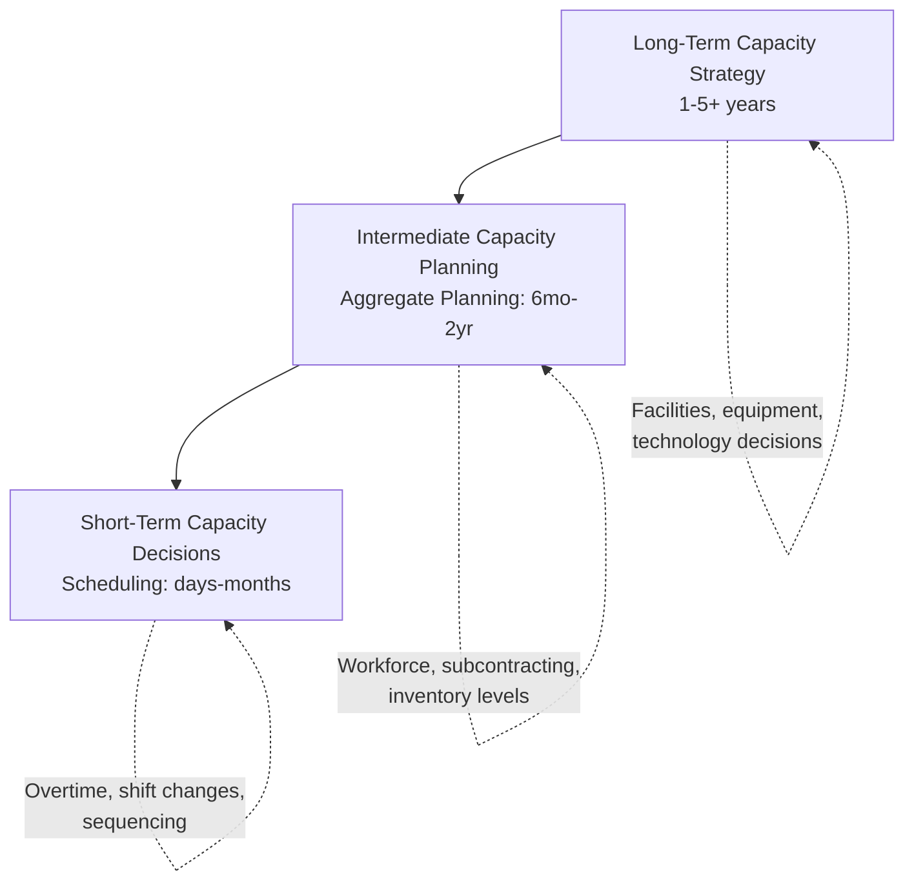
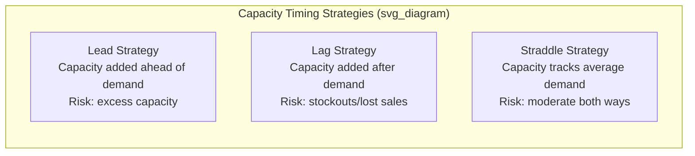
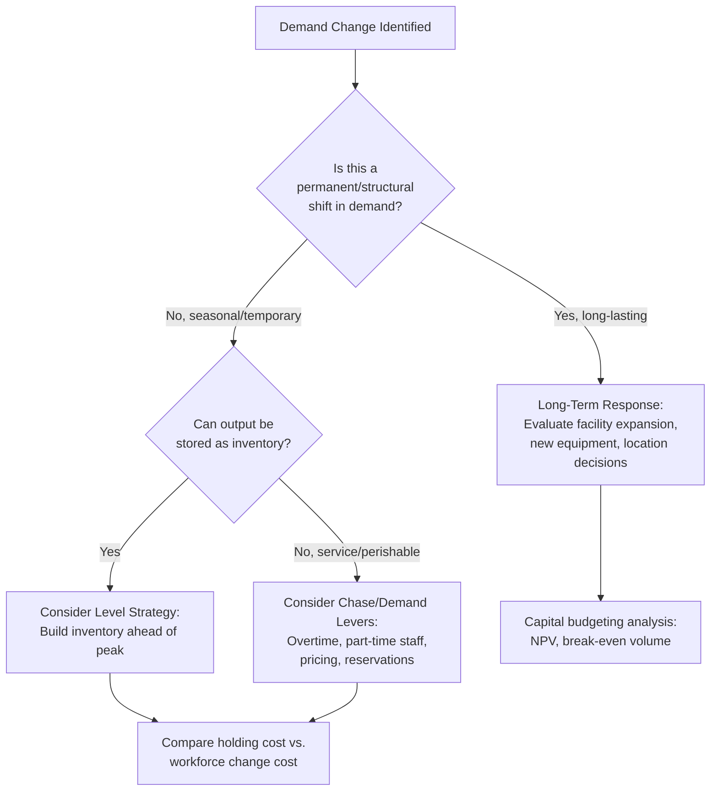

## Long-Term Versus Short-Term Capacity Strategies

### Overview and Time Horizon Classification

Capacity strategies are classified by planning horizon because the levers available, the cost structures involved, and the reversibility of decisions differ fundamentally between horizons.

| Horizon | Duration | Typical Scope | Reversibility |
| --- | --- | --- | --- |
| Long-term (strategic) | 1–5+ years | Facilities, major equipment, technology platforms | Low — high capital commitment, slow to reverse |
| Intermediate-term (aggregate/tactical) | 6 months–2 years | Workforce levels, subcontracting, inventory buildup | Moderate |
| Short-term (operational) | Days to a few months | Scheduling, overtime, shift patterns | High — fast to adjust, low cost to reverse |

### Long-Term Capacity Strategy

Long-term capacity decisions involve major, capital-intensive commitments that determine the ceiling of what a firm can produce for years into the future. These decisions are strategic in nature and tightly linked to corporate/business strategy, demand forecasting accuracy, and competitive positioning.

#### Core Long-Term Strategic Decisions

- **Facility sizing**: How large should a new plant, warehouse, or service facility be?
- **Facility location**: Where should new capacity be built, considering labor costs, logistics, market proximity, and regulatory environment?
- **Technology and equipment selection**: What level of automation, process technology, and equipment scale to invest in?
- **Vertical integration decisions**: Build in-house capacity versus rely on suppliers/partners long-term.
- **Capacity expansion timing and increment size**: Whether to build capacity in large, infrequent increments or small, frequent increments.

#### Timing Strategies for Long-Term Capacity

Three canonical strategies describe how capacity additions are timed relative to demand growth:

**1. Capacity Lead Strategy (Expansionist)**

Capacity is added *ahead* of demand, anticipating growth.

- **Advantages**: Rarely stocks out; can capture market share by serving demand competitors cannot; provides a buffer against demand forecast errors; supports aggressive marketing.
- **Disadvantages**: Higher risk of excess capacity and underutilized assets if demand growth does not materialize as forecast; higher carrying costs of unused capacity; larger upfront capital risk.
- **Best suited for**: Growing markets, industries where being first-to-market with capacity confers strategic advantage (e.g., semiconductor fabs, cloud data centers).

**2. Capacity Lag Strategy (Wait-and-See)**

Capacity is added *after* demand has clearly materialized and exceeded current capacity.

- **Advantages**: Minimizes risk of excess capacity; higher utilization rates and better return on capital; reduces the chance of costly, irreversible overbuilding.
- **Disadvantages**: Risk of lost sales, stockouts, and ceding market share to competitors during the gap; potential permanent loss of customers who switch to competitors during shortage periods.
- **Best suited for**: Mature or declining markets, industries with high capital cost per unit of capacity, firms prioritizing capital efficiency over market share growth.

**3. Average/Straddle Strategy**

Capacity is added to track average expected demand, meaning capacity alternates between being slightly ahead and slightly behind actual demand.

- **Advantages**: Balances risk of both excess capacity and stockouts; moderate capital risk.
- **Disadvantages**: Never fully avoids either stockouts or underutilization — a compromise position rather than an optimized one for either extreme.

#### Capacity Expansion Increment Size

$$\text{Number of Expansions} = \frac{\text{Total Demand Growth}}{\text{Increment Size}}$$

- **Large increments**: Lower cost per unit of capacity (economies of scale in construction/equipment), but higher risk of prolonged excess capacity and larger single capital outlay.
- **Small, frequent increments**: Better demand matching and lower risk per decision, but loses economies of scale and incurs more frequent disruption/setup costs.

**Example**

A firm forecasts demand will grow from 10,000 to 25,000 units/year over 5 years. Building one large plant with 15,000-unit additional capacity captures economies of scale but risks 5+ years of partial underutilization early on. Alternatively, building three smaller 5,000-unit increments as demand materializes reduces this risk but each increment costs proportionally more per unit of capacity and incurs repeated construction/commissioning costs.

#### Economies and Diseconomies of Scale

Long-term capacity decisions must account for the **minimum efficient scale** — the output level at which average unit cost is minimized.

$$\text{Average Unit Cost} = \frac{\text{Fixed Cost}}{\text{Volume}} + \text{Variable Cost per Unit}$$

Beyond a certain scale, **diseconomies of scale** emerge — added complexity, coordination overhead, and organizational bureaucracy increase average costs despite continued volume growth. This creates a U-shaped long-run average cost curve, and long-term capacity strategy should target operating near the minimum point of this curve where feasible.

#### Capacity Focus and the Plant-Within-a-Plant Concept

Long-term strategy also addresses **whether to build focused or general-purpose capacity**:

- **Focused facilities**: Dedicated to a narrow product range or process, achieving deep expertise and operational efficiency but less flexibility.
- **Plant-within-a-plant (PWP)**: Segmenting a single facility into separate sub-operations, each with its own workforce, equipment, and policies tailored to a specific product line or process type — combining some focus benefits within one physical facility.

### Short-Term Capacity Strategy

Short-term (and intermediate-term/aggregate) capacity decisions work *within* the ceiling set by long-term facility and equipment decisions, adjusting output to match demand fluctuations using flexible, quickly reversible levers.

#### Core Short-Term Capacity Levers

**Demand-Side Levers** (shaping demand to fit existing capacity):

- Pricing and promotions to shift demand into off-peak periods (yield/revenue management)
- Reservation and appointment systems
- Complementary/counter-cyclical product or service offerings to smooth demand
- Advance-order and backlog management

**Supply-Side Levers** (adjusting available capacity to meet demand):

| Lever | Mechanism | Trade-offs |
| --- | --- | --- |
| Overtime/undertime | Extend or reduce working hours | Overtime raises labor cost per unit and risks worker fatigue/quality issues |
| Workforce size changes | Hire/layoff | Hiring/training costs; layoffs affect morale and may lose skilled workers |
| Part-time/temporary labor | Flexible staffing pool | Lower cost, less training investment, but often lower productivity/quality |
| Subcontracting/outsourcing | Shift excess demand to external suppliers | Loses margin, quality control risk, but avoids capital investment |
| Inventory building (make-to-stock) | Produce ahead during low-demand periods | Only viable for storable goods; incurs holding costs |
| Cross-training | Multi-skilled workforce reassigned across stations | Increases flexibility to shift labor to bottlenecks |
| Shift scheduling / staggered shifts | Adjust shift patterns and start/end times | Operational complexity, potential labor relations issues |

#### Aggregate Planning Strategies (Intermediate-Term Bridge)

Aggregate planning sits between long-term and short-term horizons and offers three pure strategies for matching production to demand over the medium term:

**1. Chase Strategy**: Production rate is adjusted to match demand period-by-period by varying workforce/output levels (hiring, layoffs, overtime).

- Minimizes inventory holding costs; maximizes responsiveness.
- High cost and disruption from frequent hiring/firing; may harm workforce morale and quality consistency.

**2. Level Strategy**: Production rate is held constant, with fluctuations absorbed by inventory buildup/drawdown, backorders, or demand shaping.

- Stable workforce, consistent quality, lower administrative cost from constant staffing.
- Requires holding costs for inventory buffers; not viable for services (non-storable output) or highly perishable goods.

**3. Mixed/Hybrid Strategy**: Combines elements of chase and level — e.g., a stable core workforce supplemented by overtime and subcontracting during peaks.

- Most commonly used in practice; balances cost trade-offs.
- Requires more complex planning and coordination.

$$\text{Total Cost} = \text{Regular Time Cost} + \text{Overtime Cost} + \text{Hiring/Layoff Cost} + \text{Inventory Holding Cost} + \text{Subcontracting Cost} + \text{Backorder/Stockout Cost}$$

Linear programming and other optimization models are commonly used to solve for the cost-minimizing mix of these levers across the planning horizon.

### Comparative Decision Framework

### Key Interdependency: Short-Term Decisions Constrained by Long-Term Capacity

A critical principle linking the two horizons: **short-term levers cannot exceed the ceiling set by long-term capacity decisions.** Overtime, subcontracting, and workforce flexibility can only stretch output up to the physical/technological limits established by prior facility and equipment investments. If demand growth permanently exceeds what short-term levers can absorb, this signals the need to revisit long-term capacity strategy (triggering a new lead/lag/straddle decision cycle).

**Example**: A call center with a facility sized for 200 workstations can flex staffing between 100–200 agents using part-time/overtime short-term levers. If sustained demand requires 250 concurrent agents, no combination of short-term levers can close this gap — a long-term decision (new facility, additional workstations) becomes necessary.

### Risk and Flexibility Trade-off Summary

| Dimension | Long-Term Strategy | Short-Term Strategy |
| --- | --- | --- |
| Capital intensity | High | Low to moderate |
| Decision reversibility | Low | High |
| Response speed to demand change | Slow (months to years) | Fast (days to weeks) |
| Primary risk | Over/under-building fixed capacity | Cost inefficiency, quality/morale issues from frequent adjustment |
| Typical decision-maker level | Executive/board level | Operations/plant management level |
| Forecasting horizon required | Long-range, higher uncertainty | Short-range, higher accuracy |

[Inference: The specific mapping of "executive/board level" versus "operations management level" decision authority reflects common organizational practice but varies by company size and governance structure.]

### Related Topics / Next Steps

- Capacity measurement and utilization metrics (bottleneck analysis, OEE)
- Aggregate planning mathematical models (linear programming, transportation method)
- Break-even and capital budgeting analysis for facility investment decisions
- Forecasting methods and their role in capacity risk assessment
- Facility location decision models (factor rating, center-of-gravity)
- Yield/revenue management as a demand-shaping short-term lever
- Theory of Constraints applied to short-term bottleneck management
- Flexible manufacturing systems and their effect on long-term capacity strategy risk