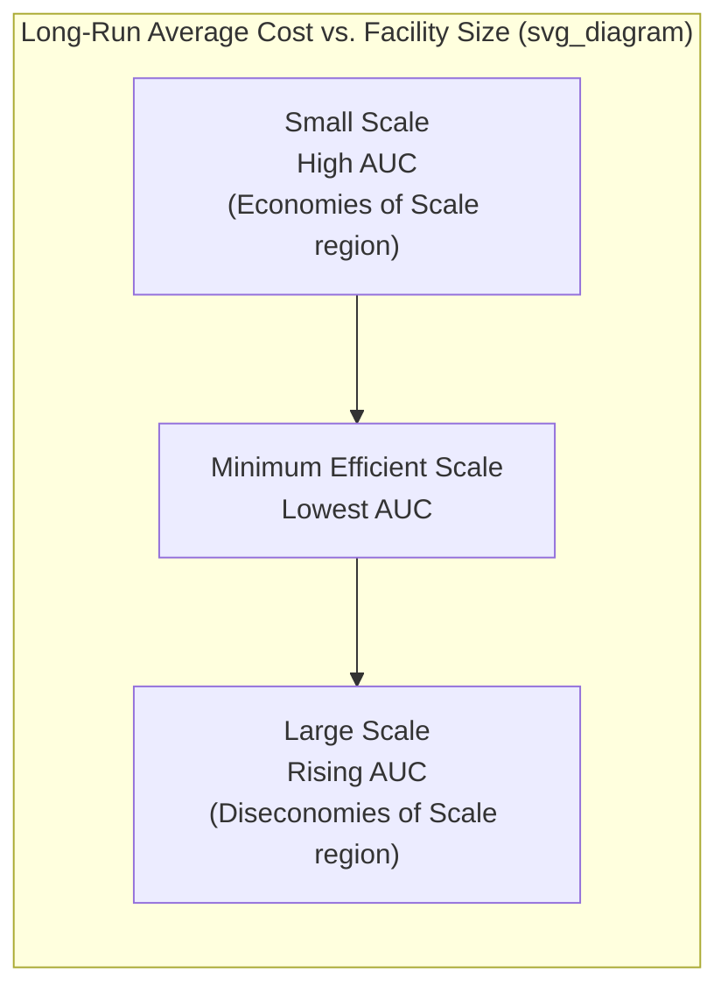
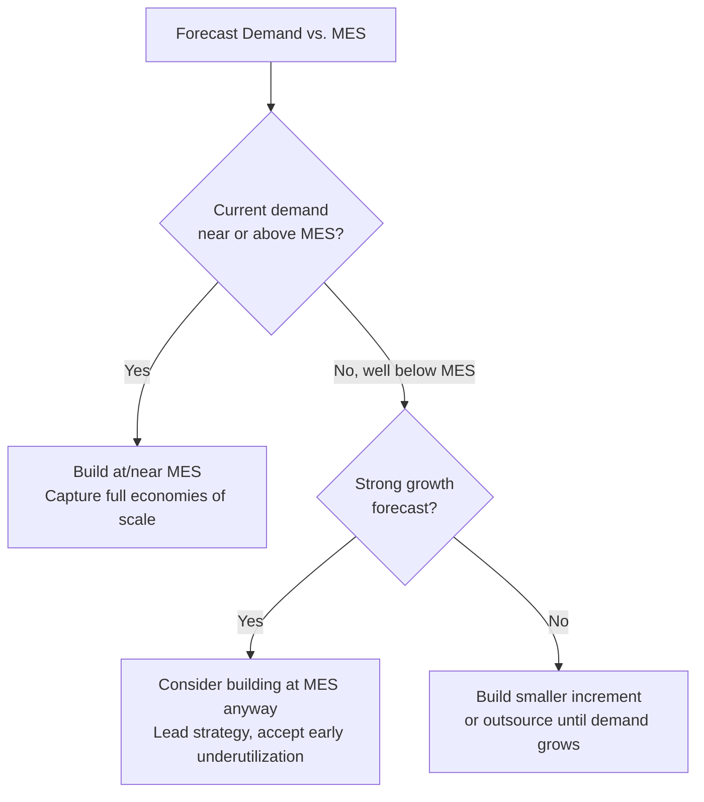

## Economies and Diseconomies of Scale

### Definitions and Core Concept

**Economies of scale** occur when the average cost per unit of output decreases as production volume/capacity increases. **Diseconomies of scale** occur when average cost per unit *increases* as production volume/capacity increases beyond some threshold. Together, these phenomena explain why average unit cost as a function of facility size typically traces a U-shaped curve, and they are central to long-term capacity sizing decisions.

$$\text{Average Unit Cost (AUC)} = \frac{\text{Total Fixed Cost}}{\text{Volume}} + \text{Variable Cost per Unit}$$

As volume increases, fixed cost is spread across more units, driving AUC down — this is the fundamental arithmetic driver of economies of scale, independent of any operational efficiency gains.

### The U-Shaped Long-Run Average Cost Curve

The **Minimum Efficient Scale (MES)** is the output/capacity level at which average unit cost is minimized — the point where economies of scale have been fully captured but diseconomies have not yet begun to dominate. Long-term capacity strategy generally seeks to size facilities near this point, though strategic considerations (market growth, competitive positioning) can justify operating away from strict cost-minimization.

Below is an illustrative SVG of the curve shape:

<svg xmlns="http://www.w3.org/2000/svg" viewBox="0 0 640 340">
<text x="320" y="24" font-size="15" text-anchor="middle" font-weight="bold" fill="#222">Long-Run Average Cost Curve (svg_diagram)</text>
<line x1="70" y1="280" x2="600" y2="280" stroke="#333" stroke-width="2" />
<line x1="70" y1="280" x2="70" y2="50" stroke="#333" stroke-width="2" />
<text x="335" y="310" font-size="13" text-anchor="middle" fill="#333">Output / Facility Size (Volume)</text>
<text x="30" y="165" font-size="13" text-anchor="middle" fill="#333" transform="rotate(-90 30 165)">Average Unit Cost</text>
<path d="M 100 250 C 200 90, 300 60, 340 65 C 420 80, 500 160, 570 240" fill="none" stroke="#2563eb" stroke-width="3" />
<line x1="340" y1="65" x2="340" y2="280" stroke="#999" stroke-width="1" stroke-dasharray="4,4" />
<text x="340" y="298" font-size="12" text-anchor="middle" fill="#555">MES</text>
<circle cx="340" cy="65" r="5" fill="#dc2626" />
<text x="175" y="120" font-size="12" text-anchor="middle" fill="#16a34a">Economies of Scale</text>
<text x="480" y="150" font-size="12" text-anchor="middle" fill="#dc2626">Diseconomies of Scale</text>
</svg>

### Sources of Economies of Scale

#### 1. Fixed Cost Spreading

The dominant mechanical driver — fixed costs (equipment depreciation, facility overhead, management salaries) are amortized over a larger unit volume.

**Example**

A factory with $1,000,000 in annual fixed costs and $5 variable cost per unit:

- At 50,000 units/year: $AUC = \frac{1{,}000{,}000}{50{,}000} + 5 = \$25$
- At 200,000 units/year: $AUC = \frac{1{,}000{,}000}{200{,}000} + 5 = \$10$

Quadrupling volume reduces average unit cost by 60% purely through fixed-cost dilution.

#### 2. Bulk Purchasing Power

Larger-volume producers can negotiate lower per-unit prices on raw materials and components due to purchasing leverage with suppliers.

#### 3. Specialization of Labor and Equipment

Larger operations permit finer division of labor — workers specialize in narrower tasks, developing higher proficiency (related to learning curve effects). Larger scale also justifies investment in specialized, higher-throughput equipment that would be uneconomical at smaller volumes.

#### 4. Technological/Process Economies

Some process technologies exhibit **non-linear cost-to-capacity relationships** — often approximated by the "0.6 power rule" or "six-tenths rule" common in process industries (chemical plants, refineries):

$$\text{Cost}_2 = \text{Cost}_1 \times \left(\frac{\text{Capacity}_2}{\text{Capacity}_1}\right)^{0.6}$$

This reflects the geometric relationship where equipment volume/capacity (e.g., of a tank or reactor) scales with the cube of a linear dimension, while the material/surface cost of construction scales roughly with the square — meaning capacity grows faster than construction cost, doubling capacity for well under double the cost. [Inference: the 0.6 exponent is an empirically observed approximation common in chemical/process engineering cost estimation, and the actual exponent varies by equipment type and industry — it is a heuristic, not a universal physical law.]

**Example**

A chemical reactor with 1,000-unit capacity costs $2,000,000. Estimating the cost of a 2,000-unit capacity reactor:

$$\text{Cost}_2 = 2{,}000{,}000 \times \left(\frac{2000}{1000}\right)^{0.6} = 2{,}000{,}000 \times 1.516 \approx \$3{,}032{,}000$$

Capacity doubled, but cost increased only ~52% — illustrating substantial scale economies in capital-intensive process industries.

#### 5. Managerial and Administrative Efficiency

Central administrative, IT, finance, and R&D functions can serve a larger production base without proportional cost increases, up to a point.

#### 6. Risk Pooling / Statistical Economies of Scale

For inventory and capacity buffers specifically, combining independent, variable demand streams into a single larger operation reduces the *relative* variability of aggregate demand (a consequence of the statistical law that the coefficient of variation of a sum of independent variables decreases as the number of variables increases). This allows a centralized larger facility to hold proportionally less safety stock/capacity buffer than the sum of what multiple smaller decentralized facilities would require.

$$\sigma_{\text{aggregate}} = \sqrt{\sum \sigma_i^2} \quad \text{(for independent demand streams)}$$

Because aggregate standard deviation grows with the square root of the number of pooled units rather than linearly, the safety margin needed per unit of expected demand shrinks as scale increases.

### Sources of Diseconomies of Scale

#### 1. Coordination and Communication Complexity

As organizations grow, the number of communication channels and coordination points grows combinatorially:

$$\text{Communication Channels} = \frac{n(n-1)}{2}$$

Where $n$ is the number of nodes (people, departments, facilities) requiring coordination. This drives disproportionate growth in management/administrative overhead relative to output.

#### 2. Bureaucratic Overhead

Larger organizations typically add layers of management, approval processes, and formal procedures to maintain control — increasing indirect labor cost per unit of output and slowing decision-making speed.

#### 3. Motivation and Agency Problems

In larger facilities, individual worker output becomes harder to monitor and attribute, potentially reducing individual accountability and motivation (related to the "free-rider" effect in large teams). Labor relations can also become more formalized/adversarial at scale (e.g., unionization dynamics), raising negotiation and compliance costs.

#### 4. Logistics and Transportation Cost Increases

Very large centralized facilities may require sourcing inputs from farther away and shipping outputs to more distant markets, increasing transportation costs — potentially offsetting production-side economies of scale (a key driver of "diseconomies of distance" that sometimes favor a network of smaller regional facilities over one mega-facility).

#### 5. Reduced Flexibility and Responsiveness

Large-scale, highly specialized capacity investments are often less adaptable to product mix changes or demand shifts, increasing the cost and risk of responding to market changes.

#### 6. Quality Control Complexity

Maintaining consistent quality standards becomes more difficult across a larger, more complex operation with more process variations, more workers, and more handoff points.

### Capacity Planning Implications

| Factor | Favors Larger Scale | Favors Smaller Scale |
| --- | --- | --- |
| Fixed cost intensity | High | Low |
| Process technology | Continuous-flow, capital-intensive | Flexible, labor-intensive |
| Product standardization | High (mass production) | Low (customization) |
| Demand variability | Pooled/aggregated across regions | Localized, distinct regional demand |
| Transportation cost sensitivity | Low (low-bulk, high-value goods) | High (bulky, low-value, perishable goods) |
| Market growth stage | Mature, stable demand | Volatile or emerging demand |

### Applying MES to Capacity Sizing Decisions

Identifying the minimum efficient scale is central to the long-term capacity **lead/lag/straddle** decision (see related topic: Long-term versus short-term capacity strategies). If forecasted demand is well below MES, a firm faces a strategic choice:

1. **Build at MES anyway**, accepting underutilization initially, betting on demand growth (a lead strategy).
2. **Build below MES**, accepting a higher average unit cost per unit but lower capital risk, and expand later.
3. **Outsource/subcontract** until demand justifies building at or near MES in-house.

**Example**

A firm forecasts current demand of 40,000 units/year, but MES for its process technology is estimated at 150,000 units/year with 10% annual demand growth projected. Building at MES immediately would mean operating at ~27% utilization initially — years of high fixed-cost burden per unit — while waiting to build until demand nears MES risks losing market share to a competitor who builds first (the classic lead-vs-lag trade-off, now informed by where MES sits relative to current demand).

### Key Points

- Economies of scale arise from fixed-cost spreading, purchasing power, specialization, process technology non-linearities, administrative leverage, and statistical risk pooling.
- Diseconomies of scale arise from coordination complexity, bureaucracy, motivation/agency problems, logistics costs, reduced flexibility, and quality control difficulty.
- The Minimum Efficient Scale marks the theoretical cost-minimizing facility size, but real capacity decisions weigh MES against demand forecasts, capital risk, and strategic positioning.
- The 0.6 power rule is a useful heuristic for estimating capital cost changes with capacity scaling in process industries, not a precise engineering formula for all contexts.

### Related Topics / Next Steps

- Long-term versus short-term capacity strategies (lead, lag, straddle)
- Capacity measurement and utilization metrics
- Break-even analysis and capital budgeting for capacity investment
- Facility location decisions and network design (centralized vs. distributed capacity)
- Learning curve theory and its interaction with scale-driven cost reduction
- Process technology selection (flexible vs. dedicated/product-focused)
- Risk pooling and safety stock in multi-location inventory/capacity systems