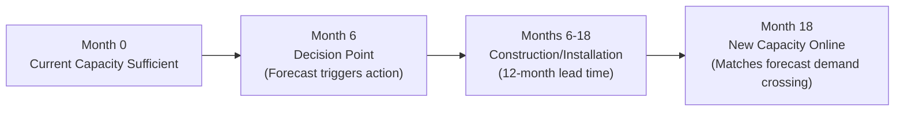
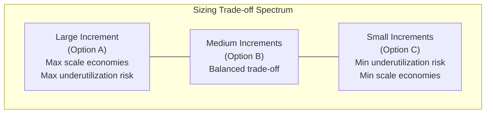
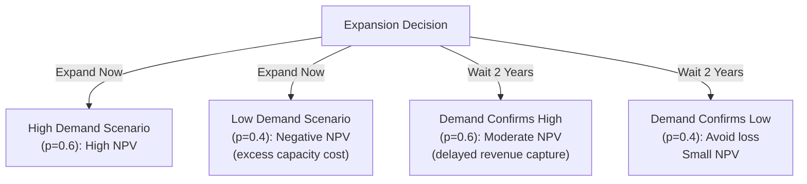

## Capacity Expansion Timing and Sizing

### Overview

Capacity expansion timing and sizing decisions address two interlinked questions in long-term capacity planning: **when** to add new capacity, and **how much** to add at each expansion event. These decisions determine a firm's trajectory of capacity versus demand over time, and they directly interact with the lead/lag/straddle timing strategies and economies-of-scale principles that govern facility sizing.

### The Core Trade-off

Capacity expansion decisions balance two opposing cost pressures:

- **Cost of carrying excess capacity**: Idle capacity still incurs fixed costs (depreciation, financing, maintenance, insurance) even when unused, reducing return on invested capital.
- **Cost of capacity shortage**: Insufficient capacity results in lost sales, stockouts, long lead times, customer defection to competitors, and potential permanent market share loss.

$$\text{Total Expansion Cost} = \text{Construction/Acquisition Cost} + \text{Cost of Excess Capacity} + \text{Cost of Capacity Shortage}$$

Optimal timing and sizing seeks to minimize this total cost function over the planning horizon, though in practice, strategic considerations (competitive response, market signaling, risk tolerance) often override pure cost minimization.

### Timing Decision: When to Expand

#### Trigger-Based Timing Approaches

**1. Demand Threshold Triggers**

Capacity expansion is initiated when utilization or demand crosses a predefined threshold (e.g., "expand when utilization exceeds 85% for two consecutive quarters"). This is reactive but systematic, reducing ad hoc decision-making.

**2. Forecast-Based Triggers**

Expansion is triggered by a demand forecast crossing a threshold before it actually materializes, allowing lead time for construction/installation. Requires accounting for the **capacity lead time** — the duration between the expansion decision and the new capacity becoming operational.

$$\text{Decision Point} = \text{Forecast Date Demand Reaches Threshold} - \text{Capacity Lead Time}$$

**Example**

A firm's current capacity is 100,000 units/year. Demand is forecast to reach 100,000 units/year in Month 18. Building new capacity takes 12 months from the decision to commission. The firm must therefore make the expansion decision no later than Month 6 to avoid a capacity gap — well before the threshold is actually reached.

#### Timing Strategy Classification (Recap in Expansion Context)

| Strategy | Timing Relative to Demand | Risk Profile |
| --- | --- | --- |
| Lead (expansionist) | Capacity added before demand materializes | Risk of excess capacity/underutilization |
| Lag (wait-and-see) | Capacity added after demand exceeds current capacity | Risk of stockouts/lost sales |
| Straddle (average) | Capacity added to track average forecasted demand | Alternates between both risks moderately |

### Sizing Decision: How Much to Add

#### Large vs. Small Increment Trade-off

$$\text{Number of Expansion Events} = \frac{\text{Total Projected Demand Growth}}{\text{Increment Size}}$$

**Large, Infrequent Increments**

- Captures economies of scale in construction (per the 0.6 power rule and fixed-cost spreading — see related topic: Economies and diseconomies of scale).
- Minimizes the number of disruptive commissioning/ramp-up events.
- Higher risk: capacity may sit underutilized for an extended period if demand growth is slower than forecast; larger single capital exposure and financing risk.

**Small, Frequent Increments**

- Better tracks actual demand growth, reducing both excess-capacity and shortage risk at any point in time.
- Avoids large, risky capital commitments in a single decision.
- Loses scale economies — higher cost per unit of capacity added; incurs repeated setup/commissioning disruption and administrative overhead each cycle.

#### Quantitative Sizing Example

A firm currently has 50,000 units/year capacity. Demand is forecast to grow linearly to 130,000 units/year over 8 years (10,000 units/year growth).

**Option A — Single Large Expansion**: Build 80,000 additional units of capacity immediately (Year 0), reaching 130,000 total.

- Utilization starts at $50,000/130,000 = 38.5\%$ in Year 0, rising to 100% by Year 8.
- Captures maximum scale economies on construction cost but carries years of low utilization.

**Option B — Two Medium Expansions**: Add 40,000 units in Year 0 and another 40,000 in Year 4.

- Utilization starts at $50,000/90,000 = 55.6\%$, resets lower at Year 4 when the second increment comes online, then rises to 100% by Year 8.
- Moderate scale economies retained; reduced early underutilization risk versus Option A.

**Option C — Four Small Expansions**: Add 20,000 units every 2 years (Years 0, 2, 4, 6).

- Utilization stays consistently higher (typically 70–100% range) throughout, minimizing carrying cost of idle capacity.
- Sacrifices the most scale economies; four separate commissioning disruptions instead of one or two.

### Analytical Tools for Expansion Decisions

#### Break-Even Analysis

Break-even analysis determines the minimum volume at which a capacity expansion becomes profitable, comparing fixed and variable costs against revenue.

$$Q_{BE} = \frac{\text{Fixed Cost of Expansion}}{\text{Price per Unit} - \text{Variable Cost per Unit}}$$

**Example**

A proposed expansion has $2,000,000 in annualized fixed costs, sells output at $50/unit, with $30/unit variable cost.

$$Q_{BE} = \frac{2{,}000{,}000}{50 - 30} = 100{,}000 \text{ units/year}$$

If forecast demand supporting this expansion is reliably above 100,000 units/year, the expansion is justified on a break-even basis; if forecast demand hovers near or below this threshold, the expansion carries higher financial risk.

#### Net Present Value (NPV) Analysis

Because expansion decisions involve upfront capital outlay and multi-year cash flow streams, NPV is the standard tool for comparing expansion timing/sizing alternatives on a time-value-of-money basis.

$$NPV = \sum_{t=0}^{n} \frac{CF_t}{(1+r)^t} - \text{Initial Investment}$$

Where $CF_t$ is net cash flow in period $t$, and $r$ is the discount rate (cost of capital). Comparing NPV across Lead/Lag/Straddle timing scenarios and Large/Medium/Small sizing scenarios allows ranking of strategies on expected financial return, though this must be supplemented with risk/sensitivity analysis given forecast uncertainty.

#### Decision Tree Analysis

For expansion decisions under demand uncertainty (e.g., high-growth vs. low-growth demand scenarios), decision trees allow explicit modeling of probability-weighted outcomes across sequential decision points (e.g., "expand now" vs. "wait and expand later if demand confirms").

Expected value is calculated for each branch and compared across the "expand now" versus "wait" decision paths, incorporating the probability-weighted outcomes.

$$EV = \sum_{i} p_i \times \text{Outcome}_i$$

### Capacity Cushion and Expansion Sizing Interaction

The choice of expansion increment size directly determines the **capacity cushion trajectory** over the planning horizon — larger increments produce a cushion that starts large and shrinks to zero just before the next expansion; smaller increments produce a cushion that oscillates in a narrower band.

$$\text{Capacity Cushion}(t) = \frac{\text{Available Capacity}(t) - \text{Demand}(t)}{\text{Available Capacity}(t)} \times 100\%$$

Industries with high stockout costs (pharmaceuticals, emergency services, cloud infrastructure) typically favor smaller, more frequent increments (or lead-strategy larger increments) to maintain consistently high cushion levels. Industries competing primarily on cost efficiency (commodity manufacturing) typically favor larger increments with lag-strategy timing to maximize utilization and minimize cushion-related carrying costs.

### Capacity Expansion in Multi-Facility Networks

For firms with multiple facilities, expansion sizing/timing decisions also involve **where** within the network to add capacity — a related but distinct question from facility location (siting entirely new locations). Key considerations:

- **Centralization vs. decentralization**: Expanding an existing large facility (capturing more scale economies) versus adding a new smaller facility closer to demand (reducing transportation cost/lead time — a diseconomy-of-scale mitigation).
- **Network flexibility**: Sizing expansions to preserve the ability to shift production/service capacity between facilities in response to regional demand shifts.

### Common Pitfalls in Expansion Timing and Sizing

- **Underestimating capacity lead time**, resulting in gaps between demand growth and capacity availability (a lag-strategy risk incurred unintentionally).
- **Ignoring the bottleneck principle**: Expanding non-bottleneck capacity provides no system throughput benefit and wastes capital — expansion must target the actual constraining resource (see related topic: Capacity measurement and utilization metrics).
- **Static forecast reliance**: Treating a single-point demand forecast as certain rather than incorporating scenario/sensitivity analysis, leading to poorly hedged large-increment bets.
- **Ignoring competitor capacity response**: In lead-strategy contexts, a competitor's simultaneous capacity expansion can result in industry-wide overcapacity, depressing prices and returns for all players — a game-theoretic dimension often underweighted in single-firm NPV models. [Inference: this competitive-response risk is a well-recognized strategic consideration in operations/capacity literature, though the magnitude of impact is industry- and context-specific rather than quantifiable by a general formula.]

### Key Points

- Expansion timing must account for capacity lead time — the decision point precedes the demand threshold by the duration of construction/commissioning.
- Expansion sizing trades off economies of scale (favoring large increments) against underutilization/shortage risk (favoring small increments).
- Break-even, NPV, and decision tree analyses are the standard quantitative tools for evaluating expansion alternatives.
- Expansion decisions must target actual system bottlenecks, not arbitrary or convenient capacity points.
- Real-world decisions often deviate from pure cost-minimization due to strategic, competitive, and risk-tolerance factors.

### Related Topics / Next Steps

- Long-term versus short-term capacity strategies (lead, lag, straddle)
- Economies and diseconomies of scale
- Capacity measurement and utilization metrics
- Break-even analysis and capital budgeting for capacity investment
- Facility location decision models
- Decision analysis under uncertainty (decision trees, expected value, sensitivity analysis)
- Theory of Constraints and bottleneck-focused capacity investment