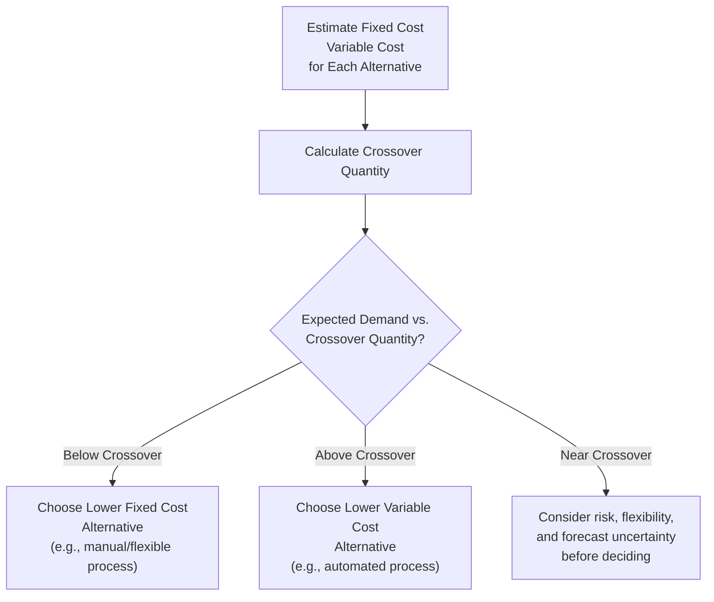

## Break-Even Analysis for Capacity Decisions

### Definition and Purpose

Break-even analysis is a quantitative technique that determines the output volume at which total revenue equals total cost — the point of zero profit and zero loss. In capacity planning, break-even analysis is used to evaluate whether a proposed capacity investment (new equipment, facility expansion, process technology change) is financially justified given expected demand volume, and to compare alternative capacity options against each other.

### Core Cost Structure

Break-even analysis relies on classifying costs into two categories:

- **Fixed Costs (FC)**: Costs that do not vary with output volume within the relevant range — depreciation, lease/facility costs, insurance, salaried management, equipment financing.
- **Variable Costs (VC)**: Costs that vary directly and proportionally with output volume — raw materials, direct labor (in many contexts), energy consumption tied to production, sales commissions.

$$\text{Total Cost (TC)} = FC + (VC \times Q)$$

$$\text{Total Revenue (TR)} = P \times Q$$

Where $P$ is price per unit and $Q$ is quantity produced/sold.

### The Break-Even Point Formula

The break-even quantity $Q_{BE}$ is found by setting Total Revenue equal to Total Cost:

$$P \times Q_{BE} = FC + (VC \times Q_{BE})$$

Solving for $Q_{BE}$:

$$Q_{BE} = \frac{FC}{P - VC}$$

The denominator $(P - VC)$ is the **contribution margin per unit** — the amount each unit sold contributes toward covering fixed costs after variable costs are paid.

$$\text{Contribution Margin per Unit} = P - VC$$

$$\text{Contribution Margin Ratio} = \frac{P - VC}{P}$$

**Break-even in revenue dollars** (useful when multiple products with different unit prices are involved):

$$\text{Break-Even Revenue} = \frac{FC}{\text{Contribution Margin Ratio}}$$

### Graphical Representation

<svg xmlns="http://www.w3.org/2000/svg" viewBox="0 0 640 380">
<text x="320" y="24" font-size="15" text-anchor="middle" font-weight="bold" fill="#222">Break-Even Chart (svg_diagram)</text>
<line x1="70" y1="320" x2="600" y2="320" stroke="#333" stroke-width="2" />
<line x1="70" y1="320" x2="70" y2="40" stroke="#333" stroke-width="2" />
<text x="335" y="350" font-size="13" text-anchor="middle" fill="#333">Quantity (Q)</text>
<text x="30" y="180" font-size="13" text-anchor="middle" fill="#333" transform="rotate(-90 30 180)">Cost / Revenue ($)</text>
<line x1="70" y1="270" x2="600" y2="270" stroke="#f59e0b" stroke-width="2.5" />
<text x="605" y="274" font-size="12" fill="#f59e0b">Fixed Cost (FC)</text>
<line x1="70" y1="270" x2="600" y2="90" stroke="#dc2626" stroke-width="2.5" />
<text x="500" y="95" font-size="12" fill="#dc2626">Total Cost (TC)</text>
<line x1="70" y1="320" x2="600" y2="55" stroke="#2563eb" stroke-width="2.5" />
<text x="500" y="60" font-size="12" fill="#2563eb">Total Revenue (TR)</text>
<circle cx="352" cy="170" r="6" fill="#16a34a" />
<text x="365" y="165" font-size="12" font-weight="bold" fill="#16a34a">Break-Even Point</text>
<line x1="352" y1="170" x2="352" y2="320" stroke="#999" stroke-width="1" stroke-dasharray="4,4" />
<text x="352" y="338" font-size="12" text-anchor="middle" fill="#555">Q_BE</text>
<text x="150" y="300" font-size="11" fill="#dc2626">Loss Region</text>
<text x="480" y="150" font-size="11" fill="#16a34a">Profit Region</text>
</svg>

The vertical distance between the Total Revenue line and the Total Cost line at any quantity $Q$ represents profit (if TR > TC) or loss (if TC > TR). Below $Q_{BE}$, the firm operates at a loss; above $Q_{BE}$, it earns profit.

### Basic Example

A firm is evaluating a new production line with:

- Fixed costs: $500,000/year (equipment depreciation, facility lease, supervisory salaries)
- Selling price: $40/unit
- Variable cost: $25/unit

$$Q_{BE} = \frac{500{,}000}{40 - 25} = \frac{500{,}000}{15} = 33{,}334 \text{ units/year}$$

If demand forecast for this product is reliably above 33,334 units/year, the capacity investment is justified on a break-even basis. If forecast demand is close to or below this threshold, the investment carries significant financial risk.

### Comparing Capacity Alternatives (Crossover Analysis)

A core application in capacity planning is comparing two or more process/technology alternatives with different fixed and variable cost structures to determine which is more economical at a given expected volume. This is done by finding the **crossover point** — the quantity at which two alternatives have equal total cost.

$$FC_1 + VC_1 \times Q = FC_2 + VC_2 \times Q$$

$$Q_{crossover} = \frac{FC_2 - FC_1}{VC_1 - VC_2}$$

**Example**

A firm is choosing between two process technologies for a new capacity investment:

|  | Process A (Manual/Labor-Intensive) | Process B (Automated) |
| --- | --- | --- |
| Fixed Cost | $100,000/year | $400,000/year |
| Variable Cost | $20/unit | $8/unit |

$$Q_{crossover} = \frac{400{,}000 - 100{,}000}{20 - 8} = \frac{300{,}000}{12} = 25{,}000 \text{ units}$$

**Interpretation**:

- Below 25,000 units/year: Process A (lower fixed cost, higher variable cost) has the lower total cost — favors low-volume operations.
- Above 25,000 units/year: Process B (higher fixed cost, lower variable cost, typically automated) has the lower total cost — favors high-volume operations.
- At exactly 25,000 units: both processes cost the same.

This crossover logic directly informs the automation/technology investment decision central to long-term capacity strategy — labor-intensive, flexible processes suit low-volume/high-variety capacity needs, while capital-intensive automated processes suit high-volume/standardized capacity needs.

### Multi-Alternative Crossover Analysis

When comparing three or more capacity alternatives, the process extends to pairwise crossover comparisons across the full expected volume range, identifying which alternative minimizes total cost within each volume band.

**Example**

Three alternatives for a facility expansion:

|  | Option 1 | Option 2 | Option 3 |
| --- | --- | --- | --- |
| Fixed Cost | $50,000 | $150,000 | $300,000 |
| Variable Cost | $30/unit | $18/unit | $10/unit |

Pairwise crossovers:

- Option 1 vs. Option 2: $Q = \frac{150{,}000 - 50{,}000}{30 - 18} = 8{,}333$ units
- Option 2 vs. Option 3: $Q = \frac{300{,}000 - 150{,}000}{18 - 10} = 18{,}750$ units

Resulting decision bands:

- Volume < 8,333 units: Option 1 minimizes cost.
- 8,333 < Volume < 18,750 units: Option 2 minimizes cost.
- Volume > 18,750 units: Option 3 minimizes cost.

This produces a piecewise-linear "lower envelope" of total cost across alternatives — each alternative is optimal only within its specific volume band.

### Break-Even Analysis Limitations for Capacity Decisions

- **Linearity assumption**: Assumes constant unit price and constant variable cost per unit across all volumes — ignores volume discounts on materials, price elasticity effects on demand, or step-fixed costs that jump at certain thresholds (e.g., needing a second supervisor at higher output).
- **Single-period, static view**: Standard break-even analysis does not account for the time value of money or multi-year cash flow timing — for large capital investments, it should be supplemented with NPV/discounted cash flow analysis (see related topic: Capacity expansion timing and sizing).
- **Ignores capacity constraints beyond the immediate decision**: Break-even quantity may exceed what current bottleneck capacity can actually produce, requiring cross-reference with capacity/utilization analysis.
- **Deterministic, not probabilistic**: Treats demand forecast as a single point estimate; does not natively incorporate demand uncertainty or risk (decision tree or sensitivity/Monte Carlo analysis is needed for that). [Inference: this is a well-established critique of standard break-even models in OM textbooks, not a claim about any specific firm's practice.]
- **Step-fixed costs**: In reality, "fixed" costs are often fixed only within a range (a "step function") — a large enough increase in volume eventually requires additional fixed investment (another supervisor, a second shift's worth of equipment), which the simple linear model does not capture unless explicitly modeled with multiple fixed-cost segments.

### Sensitivity and Margin of Safety

**Margin of Safety** measures how far actual/expected demand exceeds the break-even point, indicating a cushion against forecast error:

$$\text{Margin of Safety} = \text{Expected Sales} - Q_{BE}$$

$$\text{Margin of Safety \%} = \frac{\text{Expected Sales} - Q_{BE}}{\text{Expected Sales}} \times 100\%$$

**Example**

Using the earlier example ($Q_{BE} = 33,334$ units), if expected demand is 45,000 units/year:

$$\text{Margin of Safety} = 45{,}000 - 33{,}334 = 11{,}666 \text{ units}$$

$$\text{Margin of Safety \%} = \frac{11{,}666}{45{,}000} \times 100\% = 25.9\%$$

Demand could fall by up to 25.9% below forecast before the investment would move into a loss position — a useful risk indicator when evaluating capacity investment proposals, particularly when comparing alternatives with different margin-of-safety profiles at the same expected demand level.

### Degree of Operating Leverage

Related to break-even analysis, **operating leverage** measures how sensitive profit is to changes in volume, which is directly a function of the fixed-vs-variable cost structure chosen in a capacity decision:

$$\text{Degree of Operating Leverage (DOL)} = \frac{\text{Contribution Margin}}{\text{Operating Profit}} = \frac{Q(P - VC)}{Q(P-VC) - FC}$$

Capacity alternatives with higher fixed costs and lower variable costs (e.g., automated processes) exhibit higher operating leverage — profit is more volatile relative to volume changes (larger upside above break-even, larger downside below it) compared to lower-fixed-cost, higher-variable-cost alternatives. This risk dimension should be weighed alongside the crossover-point cost comparison, particularly under demand uncertainty.

### Key Points

- Break-even quantity is calculated as $Q_{BE} = FC / (P - VC)$, identifying the volume at which a capacity investment neither profits nor loses.
- Crossover analysis extends break-even logic to compare multiple capacity/process alternatives, identifying the volume thresholds at which each alternative is cost-minimizing.
- Break-even analysis is most useful as a first-pass screening tool; large capital capacity decisions should be supplemented with NPV, sensitivity analysis, and margin-of-safety assessment.
- Higher fixed-cost/lower variable-cost capacity alternatives (typically automation) carry higher operating leverage — more profit potential at high volume, more risk at low volume.

### Related Topics / Next Steps

- Capacity expansion timing and sizing (NPV and decision tree analysis)
- Economies and diseconomies of scale
- Long-term versus short-term capacity strategies
- Capacity measurement and utilization metrics
- Process/technology selection and automation investment decisions
- Cost-volume-profit (CVP) analysis in operations and managerial accounting
- Sensitivity analysis and Monte Carlo simulation for capacity risk assessment