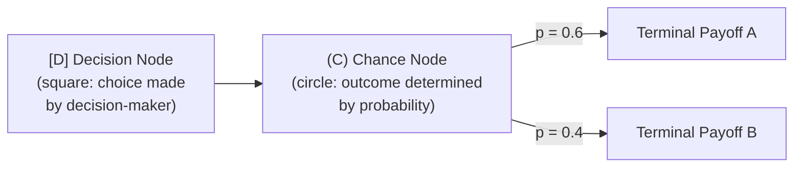
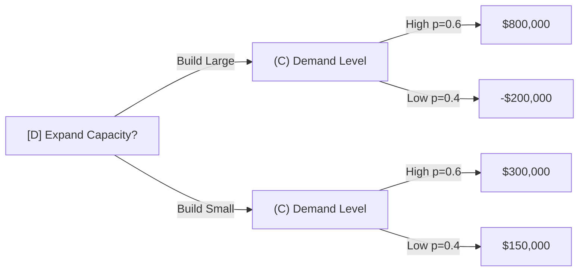
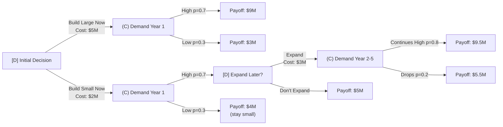

## Decision Trees Under Uncertainty

### Definition and Purpose

A decision tree is a graphical, quantitative decision-analysis technique that maps out sequential decisions and their possible chance outcomes, along with associated probabilities and payoffs, to identify the strategy that maximizes expected value (or minimizes expected cost/regret). In capacity planning, decision trees are used when a decision (e.g., whether/how much to expand capacity) must be made under demand uncertainty, and where the decision may unfold across multiple sequential stages (e.g., an initial decision followed by a later decision contingent on how demand evolves).

### Core Components and Notation

A decision tree consists of two node types and connecting branches:

- **Decision Nodes** (typically drawn as squares): Points where the decision-maker chooses among alternative actions. The decision-maker controls which branch is taken.
- **Chance/Event Nodes** (typically drawn as circles): Points where an uncertain outcome occurs, with each branch assigned a probability. Nature, not the decision-maker, determines which branch occurs.
- **Branches**: Represent possible actions (from decision nodes) or possible outcomes (from chance nodes).
- **Terminal/Payoff values**: The end-point value (profit, cost, NPV) associated with each complete path through the tree.

### Solving a Decision Tree: Expected Value and Rollback

Decision trees are solved using **backward induction** ("rollback" or "folding back"): starting from the terminal payoffs at the rightmost end of the tree and working backward toward the initial decision.

**At each chance node**, calculate the **Expected Monetary Value (EMV)** by probability-weighting the possible outcomes:

$$EMV = \sum_{i=1}^{n} p_i \times \text{Payoff}_i$$

**At each decision node**, select the branch with the highest EMV (for profit-maximization) or lowest expected cost (for cost-minimization), and that EMV becomes the value carried backward to represent that decision node in the next calculation step.

### Single-Stage Capacity Decision Example

A firm must decide whether to build a **Large** or **Small** capacity expansion, facing uncertain future demand (**High** or **Low**, with estimated probabilities).

| Decision | Demand Outcome | Probability | Payoff (NPV) |
| --- | --- | --- | --- |
| Build Large | High Demand | 0.6 | $800,000 |
| Build Large | Low Demand | 0.4 | -$200,000 |
| Build Small | High Demand | 0.6 | $300,000 |
| Build Small | Low Demand | 0.4 | $150,000 |

**Step 1 — Calculate EMV for each decision branch:**

$$EMV(\text{Build Large}) = (0.6 \times 800{,}000) + (0.4 \times -200{,}000) = 480{,}000 - 80{,}000 = \$400{,}000$$

$$EMV(\text{Build Small}) = (0.6 \times 300{,}000) + (0.4 \times 150{,}000) = 180{,}000 + 60{,}000 = \$240{,}000$$

**Step 2 — Select the decision with the highest EMV:**

Build Large has the higher EMV ($400,000 vs. $240,000), so it is the EMV-optimal choice — despite carrying downside risk (a possible $200,000 loss under low demand) that Build Small does not.

### Multi-Stage Decision Tree Example (Sequential Decisions)

Decision trees are especially valuable in capacity planning for modeling **sequential decisions** — e.g., an initial expansion decision, followed by a follow-up decision once initial demand is observed. This is where decision trees outperform simple break-even or single-stage EMV analysis, by explicitly capturing the value of waiting for information (related to the "lag"/"wait-and-see" capacity strategy).

**Scenario**: A firm chooses between building a Large facility now, or building a Small facility now with the option to expand later if demand proves strong.

**Solving via backward induction:**

1. **Rightmost chance node (C3)**: $EMV = (0.8 \times 9.5M) + (0.2 \times 5.5M) = 7.6M + 1.1M = \$8.7M$. Net of the $3M expansion cost: $8.7M - 3M = \$5.7M$.
2. **Decision node D2**: Compare "Expand" ($5.7M net) vs. "Don't Expand" ($5M) → choose **Expand**, carrying forward $5.7M as the value of reaching D2.
3. **Chance node C2**: $EMV = (0.7 \times 5.7M) + (0.3 \times 4M) = 3.99M + 1.2M = \$5.19M$. Net of the initial $2M small-build cost: $5.19M - 2M = \$3.19M$.
4. **Chance node C1**: $EMV = (0.7 \times 9M) + (0.3 \times 3M) = 6.3M + 0.9M = \$7.2M$. Net of the initial $5M large-build cost: $7.2M - 5M = \$2.2M$.
5. **Decision node D1**: Compare "Build Large Now" ($2.2M net) vs. "Build Small Now" ($3.19M net) → choose **Build Small Now**, preserving the option to expand later.

This example illustrates the **value of flexibility/real options**: the staged approach outperforms the large-commitment approach here because it allows the firm to observe demand before committing further capital — directly paralleling the straddle/lag capacity timing strategies but formalized with explicit probability-weighted payoffs.

### Sensitivity Analysis: Probability and Payoff Assumptions

Because EMV results depend heavily on the assumed probabilities and payoff estimates, decision tree conclusions should be stress-tested:

**Break-even probability**: The probability value at which two decision alternatives yield equal EMV, found by setting the EMV expressions equal and solving for $p$.

$$EMV(\text{Option A}) = EMV(\text{Option B})$$

**Example** (using the single-stage example above): Find the probability of high demand $p$ at which Build Large and Build Small yield equal EMV:

$$p(800{,}000) + (1-p)(-200{,}000) = p(300{,}000) + (1-p)(150{,}000)$$

$$800{,}000p - 200{,}000 + 200{,}000p = 300{,}000p + 150{,}000 - 150{,}000p$$

$$1{,}000{,}000p - 200{,}000 = 150{,}000p + 150{,}000$$

$$850{,}000p = 350{,}000$$

$$p = 0.412$$

**Interpretation**: If the probability of high demand is above 41.2%, Build Large is the EMV-optimal choice; below 41.2%, Build Small is optimal. This tells the decision-maker exactly how sensitive the recommendation is to the demand probability estimate — a probability estimate of 0.6 (as originally assumed) is comfortably above this threshold, giving some confidence in the Build Large recommendation, but a decision-maker should examine how confident they are that $p > 0.412$.

### Expected Value of Perfect Information (EVPI)

EVPI quantifies the maximum amount a decision-maker should be willing to pay for perfect advance information about which chance outcome will occur — a useful benchmark for evaluating the value of market research, pilot studies, or forecasting investment before committing to a capacity decision.

$$EVPI = EV_{\text{with perfect information}} - EV_{\text{best decision without information}}$$

Where $EV_{\text{with perfect information}}$ is calculated by assuming the decision-maker could choose the best action *after* knowing which outcome (High/Low demand) will occur, then probability-weighting those best-case outcomes.

**Example** (using the single-stage example):

$$EV_{\text{perfect info}} = (0.6 \times 800{,}000) + (0.4 \times 150{,}000) = 480{,}000 + 60{,}000 = \$540{,}000$$

(Under perfect information: choose Build Large if High demand is known [$800,000], choose Build Small if Low demand is known [$150,000, which beats Build Large's -$200,000]).

$$EVPI = 540{,}000 - 400{,}000 = \$140{,}000$$

This means the firm should be willing to pay up to $140,000 for a forecasting study or market research effort that could perfectly predict whether demand will be High or Low — any information-gathering cost above this threshold would not be economically justified relative to the EMV improvement it could deliver.

### Risk Attitude Considerations Beyond EMV

Pure EMV maximization assumes risk-neutrality. In practice, capacity decisions — particularly large, potentially irreversible ones — may warrant adjustment for risk aversion, since EMV alone does not capture the asymmetric consequences of a large loss versus a foregone gain of equal magnitude.

- **Risk-averse decision-makers** may prefer an alternative with lower EMV but lower variance/downside exposure (e.g., Build Small in the earlier example, despite its lower EMV in some formulations), particularly when a loss scenario threatens firm solvency or violates covenant constraints.
- **Utility theory** formalizes this by transforming monetary payoffs into utility values via a concave utility function before applying the EMV calculation, so that losses are weighted more heavily than equivalent gains. [Inference: applying formal utility functions to capacity decisions is a standard extension taught in decision analysis, though in practice most firms use simpler sensitivity/scenario analysis rather than formally elicited utility functions.]
- **Maximin/Maximax/Minimax Regret criteria** are alternative non-probabilistic decision rules sometimes used alongside or instead of EMV when probability estimates are considered unreliable:
  - *Maximin*: Choose the alternative with the best worst-case outcome (conservative/pessimistic).
  - *Maximax*: Choose the alternative with the best best-case outcome (optimistic).
  - *Minimax Regret*: Choose the alternative that minimizes the maximum possible "regret" (difference between the chosen outcome and the best possible outcome under each demand scenario).

### Decision Trees vs. Other Capacity Analysis Tools

| Tool | Best Suited For | Limitation |
| --- | --- | --- |
| Break-even analysis | Quick single-alternative or two-alternative screening at a known/assumed volume | No explicit uncertainty modeling |
| NPV analysis | Multi-year cash flow comparison at a given demand assumption | Typically single-scenario unless combined with sensitivity analysis |
| Decision trees | Sequential decisions under explicit probability-weighted uncertainty | Requires credible probability estimates; can become complex with many branches/stages |
| Monte Carlo simulation | Continuous probability distributions, complex interacting variables | Computationally intensive; requires simulation software/tools |

Decision trees are particularly well suited to capacity planning because capacity decisions are frequently **sequential and conditional** (build now vs. wait, with the option to expand later contingent on observed demand) — a structure that simple break-even or single-point NPV analysis cannot represent, but which a multi-stage decision tree captures naturally.

### Common Pitfalls

- **Overconfidence in probability estimates**: Treating subjectively assigned probabilities as precise, objective figures rather than uncertain inputs themselves warranting sensitivity analysis.
- **Omitting real options value**: Failing to model the value of deferral/staged decisions (as in the multi-stage example above) can lead to over-committing capital to large, inflexible capacity investments when a staged approach would have higher expected value.
- **Ignoring correlation between branches**: In multi-stage trees, assuming later-period probabilities are independent of earlier outcomes when in reality they may be correlated (e.g., if Year 1 demand is high, Year 2 demand is more likely to also be high) — this requires conditional probability structures rather than simple independent branch probabilities.
- **EMV tunnel vision**: Selecting the EMV-optimal path without considering variance, downside risk, or capital constraints that make a lower-EMV, lower-risk alternative more appropriate for the specific firm's risk tolerance.

### Key Points

- Decision trees solve sequential decisions under uncertainty via backward induction, calculating EMV at chance nodes and selecting the best branch at decision nodes.
- Multi-stage trees capture the value of staged/flexible capacity decisions (real options value) that single-stage break-even or NPV analysis cannot represent.
- Break-even probability analysis and EVPI provide sensitivity benchmarks for how much confidence is needed in probability estimates, and how much additional forecasting/research investment is justified.
- Pure EMV maximization assumes risk-neutrality; large or irreversible capacity decisions often warrant supplementary risk-attitude analysis (utility theory, maximin/minimax regret).

### Related Topics / Next Steps

- Capacity expansion timing and sizing
- Break-even analysis for capacity decisions
- Long-term versus short-term capacity strategies (lead, lag, straddle)
- Real options analysis in capital investment decisions
- Monte Carlo simulation for capacity risk modeling
- Forecasting methods and forecast accuracy metrics
- Utility theory and risk-adjusted decision-making