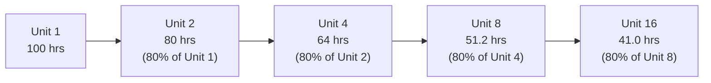

## Learning and Experience Curves

### Definition and Underlying Principle

A **learning curve** (also called an experience curve) describes the systematic, predictable reduction in the time or cost required to produce a unit of output as cumulative production volume increases. The underlying principle is that repetition builds proficiency: as workers, teams, and organizations gain experience performing a task, they identify and eliminate inefficiencies, improve coordination, and refine methods — resulting in a consistent percentage reduction in per-unit labor time or cost each time cumulative output doubles.

This has direct capacity planning implications: effective capacity for a new product or process is typically *lower* than its eventual steady-state capacity, and capacity/staffing plans must account for this ramp-up period rather than assuming full productivity from day one.

### The Learning Curve Formula

The most widely used model is the **Wright's Law / cumulative average model** (originally developed by T.P. Wright in 1936 studying aircraft manufacturing):

$$T_n = T_1 \times n^{b}$$

Where:

- $T_n$ = time (or cost) required to produce the $n$-th unit
- $T_1$ = time (or cost) required to produce the first unit
- $n$ = cumulative unit number
- $b$ = learning exponent, calculated as $b = \frac{\ln(\text{Learning Rate})}{\ln(2)}$

The **learning rate** (or learning percentage) expresses the proportion of prior time/cost that remains each time cumulative production doubles. An 80% learning curve means the 2nd, 4th, 8th, 16th... unit (each a doubling of cumulative volume) requires only 80% of the time/cost of the unit at half that cumulative volume.

$$T_{2n} = 0.80 \times T_n \quad \text{(for an 80\% learning curve)}$$

### Deriving the Exponent

For an 80% learning curve:

$$b = \frac{\ln(0.80)}{\ln(2)} = \frac{-0.2231}{0.6931} = -0.3219$$

So the full formula becomes:

$$T_n = T_1 \times n^{-0.3219}$$

### Worked Example

A firm produces a new custom equipment order. The first unit takes 100 labor-hours. The process follows an 80% learning curve.

**Time for the 2nd unit** (direct doubling from unit 1):

$$T_2 = 100 \times 0.80 = 80 \text{ hours}$$

**Time for the 4th unit** (doubling from unit 2):

$$T_4 = 80 \times 0.80 = 64 \text{ hours}$$

**Time for the 10th unit** (using the general formula, since 10 is not a direct doubling):

$$T_{10} = 100 \times 10^{-0.3219} = 100 \times 0.4780 = 47.8 \text{ hours}$$

**Time for the 25th unit**:

$$T_{25} = 100 \times 25^{-0.3219} = 100 \times 0.3543 = 35.4 \text{ hours}$$

### Learning Curve Shape

<svg xmlns="http://www.w3.org/2000/svg" viewBox="0 0 640 360">
<text x="320" y="24" font-size="15" text-anchor="middle" font-weight="bold" fill="#222">Learning Curve: Time per Unit vs. Cumulative Output (svg_diagram)</text>
<line x1="70" y1="300" x2="600" y2="300" stroke="#333" stroke-width="2" />
<line x1="70" y1="300" x2="70" y2="50" stroke="#333" stroke-width="2" />
<text x="335" y="330" font-size="13" text-anchor="middle" fill="#333">Cumulative Unit Number (n)</text>
<text x="30" y="180" font-size="13" text-anchor="middle" fill="#333" transform="rotate(-90 30 180)">Time per Unit</text>
<path d="M 90 70 C 150 160, 220 220, 300 250 C 380 270, 480 285, 580 292" fill="none" stroke="#2563eb" stroke-width="3" />
<text x="95" y="65" font-size="11" fill="#555">T1</text>
<text x="580" y="295" font-size="11" fill="#555" text-anchor="end">Approaches steady-state floor</text>
</svg>

The curve declines steeply at first (early units show the largest absolute time savings) and flattens progressively — reflecting **diminishing returns to learning**: the *rate* of improvement per unit decreases even though cumulative improvement continues indefinitely under the pure power-law model.

### Cumulative Average Time Model (Alternative Formulation)

An alternative and historically original formulation of the learning curve models the **cumulative average time per unit** (rather than the time for the specific $n$-th unit) as following the power law:

$$\bar{T}_n = T_1 \times n^{b}$$

Where $\bar{T}_n$ is the *average* time per unit across all units produced from 1 to $n$. Total cumulative time is then:

$$\text{Total Time}_n = n \times \bar{T}_n = T_1 \times n^{(1+b)}$$

This "cumulative average" model and the "unit time" model shown earlier produce different numeric predictions for the same learning rate and are **not interchangeable** — the specific model in use should always be stated explicitly when applying learning curve data, since textbooks and industry practice vary in which is used as the default. [Unverified — which model (unit vs. cumulative average) is more prevalent varies by industry/textbook tradition; both are legitimate and widely documented formulations, so the applicable one should be confirmed for a given context rather than assumed.]

### Applications to Capacity Planning

#### 1. Capacity Ramp-Up Planning

When new capacity comes online (new facility, new product line, newly hired workforce), initial effective capacity/output rate will be below the eventual steady-state rate. Capacity plans and delivery commitments made during a ramp-up period must incorporate learning curve projections rather than assuming immediate full productivity — a common cause of capacity shortfalls and missed delivery dates when ignored.

**Example**: If steady-state capacity for an assembly line is projected at 500 units/day (based on a mature learning-curve-adjusted labor time), but the line is new, the first several weeks of operation should be planned using the learning-curve-elevated labor-hour-per-unit figures, yielding a lower realistic daily output during ramp-up — directly affecting near-term delivery promises and staffing/scheduling decisions.

#### 2. Labor and Staffing Requirements Forecasting

Total labor-hours required for a production run/contract can be estimated by summing (or integrating, for large $n$) individual unit times across the learning curve, rather than multiplying the final steady-state unit time by total volume — which would understate the actual labor-hours needed, especially for shorter production runs where the learning effect represents a larger share of total volume.

$$\text{Total Labor Hours} = \sum_{i=1}^{n} T_i \approx T_1 \times \frac{n^{(1+b)}}{1+b} \quad \text{(continuous approximation for large n)}$$

#### 3. Bid Pricing and Cost Estimation

For custom, made-to-order, or low-volume/high-mix production (aerospace, defense contracting, custom equipment), learning curve models are standard for estimating total labor cost across a contract's production run, directly informing bid pricing — underestimating the learning effect leads to overpricing (losing competitive bids) or overestimating it leads to underpricing (eroding margin).

#### 4. Make-vs-Buy and Outsourcing Timing Decisions

Learning curve position affects make-vs-buy analysis: a process still early on its learning curve may have in-house costs temporarily higher than an established supplier's price, but if the firm expects to accumulate volume and move down the curve, in-house production may become cost-competitive at higher cumulative volumes — a timing dimension that a static cost comparison at a single point in time would miss.

#### 5. Capacity Investment Timing (New Technology Adoption)

Experience curve effects also apply at the industry/technology level (distinct from a single firm/process) — as cumulative industry-wide production of a technology increases, unit costs across the industry tend to decline (a broader phenomenon sometimes called the "experience curve effect" in strategy literature, distinguished from firm-specific "learning curves"). This affects the timing logic in lead/lag capacity strategy: waiting to invest in a maturing technology may capture lower unit costs, but at the cost of delayed market entry. [Inference: the industry-level experience curve concept is a well-established strategic framework, though its magnitude and applicability vary significantly by industry and technology type — it should not be treated as a universally precise predictive tool.]

### Learning Curve Coefficient Table (Standard Reference)

For common learning rates, standard tables (and now spreadsheet formulas) provide the unit-time factor $n^b$ directly for common cumulative unit numbers, avoiding repeated manual calculation. Representative values for select learning rates at selected unit numbers:

| Unit (n) | 70% Learning Rate | 80% Learning Rate | 90% Learning Rate |
| --- | --- | --- | --- |
| 1 | 1.000 | 1.000 | 1.000 |
| 2 | 0.700 | 0.800 | 0.900 |
| 4 | 0.490 | 0.640 | 0.810 |
| 8 | 0.343 | 0.512 | 0.729 |
| 16 | 0.240 | 0.410 | 0.656 |
| 32 | 0.168 | 0.328 | 0.590 |

[Unverified — these are standard illustrative learning curve factor values consistent with the power-law formula; for precision-critical applications, values should be recalculated directly from the formula or verified against a formal learning curve table rather than read from a general reference.]

### Factors Affecting the Learning Rate

The learning rate (steepness of the curve) is not universal — it varies by industry, process type, and task characteristics:

- **Labor-intensive, manual assembly processes**: Typically exhibit steeper (lower percentage, e.g., 70–80%) learning curves — more room for worker-driven efficiency gains.
- **Highly automated, capital-intensive processes**: Typically exhibit flatter (higher percentage, e.g., 90–95%) learning curves, since machine-paced cycle times leave less room for human learning to affect overall output rate.
- **Task complexity and length**: Longer, more complex tasks with more manual steps generally show steeper learning curves than short, simple, already-optimized tasks.
- **Workforce stability**: High turnover resets learning gains at the individual level (though some organizational learning may persist through documented procedures, tooling, and process design — a distinction sometimes made between "individual learning" and "organizational learning").
- **Product/process change frequency**: Frequent design changes or engineering revisions can reset or disrupt the learning curve, since accumulated proficiency was tied to the prior process/design configuration.

### Limitations and Cautions

- **Curve flattening/plateau in practice**: The pure power-law model implies indefinite improvement, but in reality, learning effects typically plateau once a process reaches a practical efficiency floor (constrained by machine cycle times, physical/ergonomic limits, or process technology limits) — the model should be applied within a bounded, realistic volume range rather than extrapolated indefinitely.
- **Interruption effects**: Production breaks (a paused product line, a gap between contract orders) can cause partial "forgetting," where output rates regress somewhat before resuming the learning trajectory — not fully captured by the standard continuous model.
- **Learning rate estimation uncertainty**: Early-stage learning rate estimates (based on only the first few units) are statistically unreliable; more data points across a longer production run improve confidence in the estimated learning percentage. [Inference: this is a standard statistical caution in applying learning curve estimation to real production data, not a claim specific to any dataset.]
- **Not applicable to all repetitive work**: Highly standardized, already-mature, short-cycle-time work (e.g., a task already performed millions of times industry-wide) may show negligible further learning-curve improvement, since the relevant experience has effectively already been captured in the initial time estimate.

### Key Points

- Learning curves model the predictable decline in per-unit time/cost as cumulative production volume doubles, following $T_n = T_1 \times n^b$.
- The learning rate (e.g., 80%) determines the exponent $b$ and the steepness of improvement; lower percentages indicate faster learning.
- Capacity ramp-up planning, staffing forecasts, bid pricing, and make-vs-buy timing decisions all require learning-curve-adjusted figures rather than steady-state assumptions.
- Learning rates vary by process type (labor-intensive vs. automated) and are subject to real-world limitations including plateaus, interruption effects, and estimation uncertainty from limited early data.

### Related Topics / Next Steps

- Capacity expansion timing and sizing (ramp-up integration with new capacity)
- Economies and diseconomies of scale
- Capacity measurement and utilization metrics
- Break-even analysis for capacity decisions
- Bid estimation and cost forecasting for custom/low-volume production
- Workforce training and cross-training strategies
- Process/technology selection and automation investment decisions