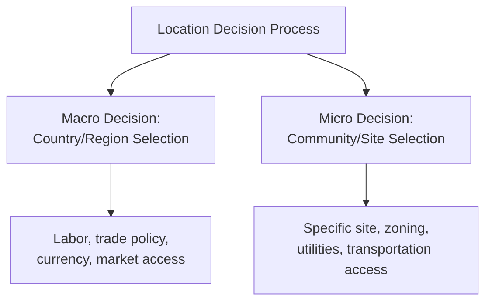
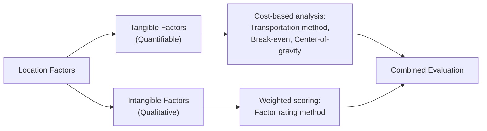
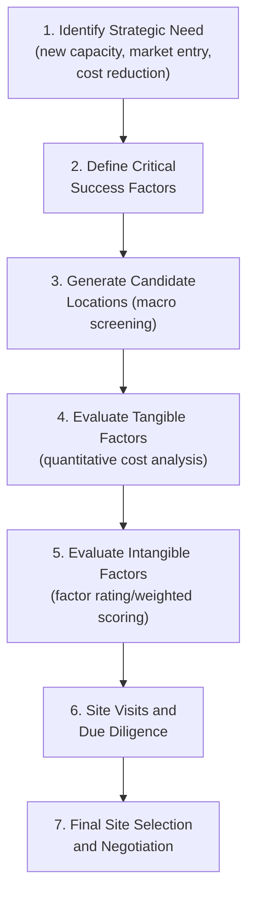

## Location Decision Factors and Criteria

### Overview

Facility location decisions determine where a firm sites its production, distribution, or service operations. These decisions are long-term, capital-intensive, and difficult to reverse, making the systematic identification and weighting of location factors a critical first step before applying quantitative location models (factor rating, center-of-gravity, transportation method). Location criteria are typically grouped into macro-level (country/region selection) and micro-level (specific site within a chosen region) categories, and further classified as tangible (quantifiable, cost-based) or intangible (qualitative, harder to measure) factors.

### Macro-Level (Regional/National) Factors

#### 1. Labor Factors

- **Labor cost**: Wage rates, benefits costs, payroll tax burden — often the dominant factor for labor-intensive operations.
- **Labor availability and skill level**: Sufficient workforce supply matching the required skill profile (unskilled, semi-skilled, technical, or specialized/professional labor).
- **Labor productivity**: Output per labor-hour, which must be weighed against wage rate — a lower-wage location with lower productivity may not yield lower effective unit labor cost.
- **Labor relations climate**: Unionization rates, historical strike activity, and local labor law flexibility.

$$\text{Effective Unit Labor Cost} = \frac{\text{Wage Rate per Hour}}{\text{Productivity (units per hour)}}$$

**Example**: A location with a $15/hour wage rate and 20 units/hour productivity has an effective labor cost of $0.75/unit — potentially lower than a $8/hour location producing only 8 units/hour ($0.75/hour ÷ ... = $1.00/unit), illustrating why raw wage comparison alone is an incomplete criterion.

#### 2. Government and Regulatory Factors

- **Tax structure**: Corporate tax rates, property tax, tax incentives/abatements offered to attract investment, free trade zone status.
- **Trade policy and tariffs**: Import/export duties, trade agreements affecting cross-border supply chains, quota restrictions.
- **Regulatory environment**: Environmental regulations, labor law, permitting and licensing complexity, ease-of-doing-business rankings.
- **Political stability**: Risk of regulatory change, expropriation risk, currency controls, and general governance stability.

#### 3. Market Access Factors

- **Proximity to customers/markets**: Reduces transportation cost and lead time, particularly important for bulky, low-value, or time-sensitive goods, and for services requiring direct customer interaction.
- **Market size and growth potential**: Local/regional demand that can be served from the facility.
- **Trade agreement membership**: Access to preferential tariff treatment within trade blocs (e.g., regional free trade agreements) affecting export competitiveness from that location.

#### 4. Input and Supply Chain Factors

- **Proximity to raw materials/suppliers**: Particularly critical for weight-losing processes (where the finished product weighs significantly less than raw material inputs, e.g., mining/ore processing), favoring **resource-oriented** locations near material sources.
- **Transportation infrastructure**: Availability and quality of highways, rail, ports, and airports; freight cost and transit time implications.
- **Utility infrastructure**: Reliable and cost-effective electricity, water, natural gas, and telecommunications/data infrastructure.

#### 5. Economic and Currency Factors

- **Exchange rate stability**: For multinational operations, currency volatility affects cost competitiveness and repatriated profit value.
- **Cost of living**: Affects wage expectations and relocation feasibility for transferred management/technical staff.
- **Economic development incentives**: Grants, low-interest financing, infrastructure subsidies offered by regional/national development agencies.

### Micro-Level (Site/Community) Factors

#### 1. Site Characteristics

- **Land cost and availability**: Purchase or lease cost, availability of land parcels of sufficient size for current operations and future expansion.
- **Zoning and land use regulations**: Compatibility of intended use with local zoning; ease of obtaining necessary permits.
- **Site topography and soil conditions**: Engineering/construction cost implications (flood risk, seismic considerations, foundation requirements).
- **Environmental factors**: Proximity to environmentally sensitive areas, contamination history (brownfield vs. greenfield sites), climate/weather exposure.

#### 2. Local Transportation Access

- **Proximity to highways, rail spurs, ports, or airports**: Directly affects inbound/outbound logistics cost and speed.
- **Local traffic congestion**: Affects employee commute feasibility and delivery reliability.

#### 3. Community Factors

- **Quality of life**: Housing availability/cost, schools, healthcare, recreational amenities — significant for attracting and retaining management and technical staff, particularly in competitive labor markets.
- **Community attitude toward business**: Local government responsiveness, community support or opposition to new development (particularly relevant for facilities with environmental or traffic impact concerns).
- **Local business climate**: Presence of supporting industries, business associations, and existing supplier/service ecosystems (agglomeration effects).

#### 4. Competitive Positioning

- **Proximity to competitors**: Can be favorable (co-location benefits: shared labor pool, established customer traffic patterns — as seen in "cluster" industries like automotive supply chains or retail centers) or unfavorable (direct competition for local market share, labor, and resources), depending on industry context.

### Tangible vs. Intangible Factor Classification

| Category | Definition | Examples |
| --- | --- | --- |
| **Tangible (Objective) Factors** | Quantifiable in monetary or numeric terms; directly comparable across alternatives | Labor cost, transportation cost, tax rate, construction cost, utility rates |
| **Intangible (Subjective) Factors** | Not directly quantifiable but materially affect suitability | Community attitude, quality of life, labor relations climate, political stability, cultural fit |

This distinction is central to location decision methodology: tangible factors are typically evaluated via quantitative techniques (transportation method, cost-volume analysis, center-of-gravity), while intangible factors are typically incorporated via **factor rating (weighted scoring) methods**, which convert qualitative judgments into a comparable composite score across alternatives.

### Industry-Specific Weighting of Factors

The relative importance of location factors varies significantly by industry and operation type:

| Operation Type | Dominant Location Factors |
| --- | --- |
| Heavy manufacturing (weight-losing process) | Proximity to raw materials, transportation infrastructure |
| Labor-intensive assembly (e.g., electronics, textiles) | Labor cost, labor availability, labor relations |
| Retail/consumer service | Proximity to customers, foot traffic, visibility, market demographics |
| Corporate headquarters/professional services | Access to skilled talent pool, quality of life, proximity to clients/partners |
| Distribution/logistics center | Transportation network access, proximity to major markets, land cost |
| Data centers/technology | Energy cost and reliability, telecommunications infrastructure, climate (cooling cost), tax incentives |
| High-tech/R&D facilities | Access to universities/research institutions, skilled technical talent, innovation ecosystem |

**Example**: A steel mill (heavy, weight-losing process converting bulky ore into more compact finished steel) will weight proximity to raw material sources and bulk transportation (rail, water) heavily — a resource-oriented location strategy. In contrast, a software development office will weight access to skilled programming talent and quality-of-life factors heavily, with land/facility cost being a comparatively minor consideration — a market/labor-oriented location strategy.

### Single vs. Multiple Facility Location Considerations

For firms operating (or planning) multiple facilities, additional criteria beyond single-site factors become relevant:

- **Network configuration**: Whether to centralize (fewer, larger facilities capturing economies of scale) or decentralize (more, smaller facilities reducing transportation cost/lead time and improving market responsiveness) — directly tied to the economies/diseconomies of scale trade-off (see related topic).
- **Demand allocation and coverage**: Ensuring the combined network of facilities adequately covers target markets within acceptable service/delivery time standards.
- **Risk diversification**: Spreading production/service capacity across multiple locations to reduce single-point-of-failure risk from natural disasters, political instability, or labor disruption at any one site.

### Service vs. Manufacturing Location Criteria Differences

Location criteria weighting differs meaningfully between manufacturing and service operations, reflecting the general operations management distinction that services are often produced and consumed simultaneously and cannot be inventoried or shipped:

| Dimension | Manufacturing Emphasis | Service Emphasis |
| --- | --- | --- |
| Primary orientation | Cost minimization (labor, materials, transportation) | Revenue maximization (customer access, market demand) |
| Key proximity factor | Raw materials/suppliers | Customers/target market |
| Site visibility | Generally low priority | Often high priority (retail, hospitality) |
| Facility size flexibility | Large, fixed footprint typical | Ranges widely; may prioritize multiple smaller locations |

### Location Decision Process (Structured Approach)

### Key Points

- Location factors are classified as macro-level (region/country) and micro-level (specific site/community), and as tangible (quantifiable) versus intangible (qualitative).
- Dominant factors vary significantly by industry: resource-oriented industries prioritize material proximity, labor-intensive industries prioritize labor cost/availability, and market-oriented service industries prioritize customer proximity.
- Effective labor cost must account for both wage rate and productivity, not wage rate alone.
- Tangible factors are typically evaluated using quantitative cost/transportation models; intangible factors are typically incorporated via weighted factor rating methods.
- Manufacturing location decisions generally emphasize cost minimization; service location decisions generally emphasize market/customer access.

### Related Topics / Next Steps

- Factor rating method for location selection
- Center-of-gravity method for location selection
- Transportation method (linear programming) for network location decisions
- Economies and diseconomies of scale (centralization vs. decentralization)
- Break-even analysis for facility location alternatives
- Global location decisions and international operations considerations
- Single vs. multiple facility network design