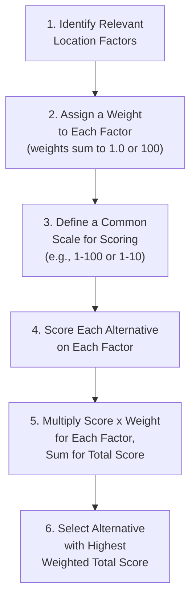
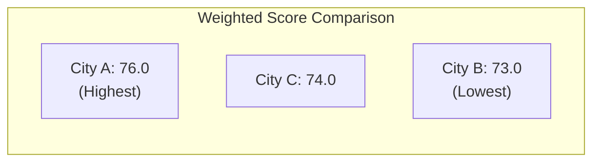
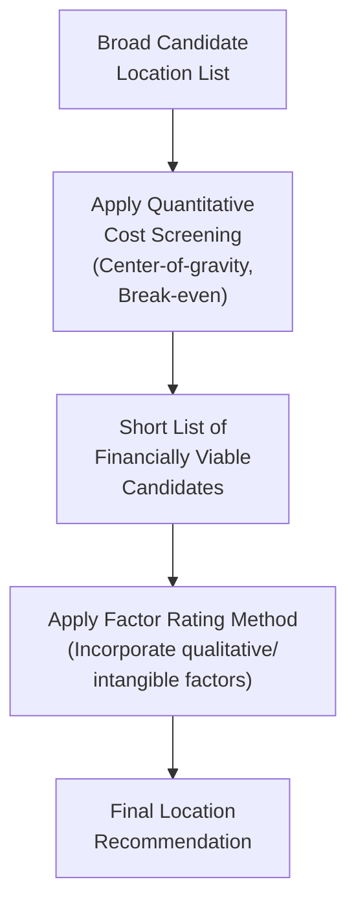

## Factor Rating Method

### Definition and Purpose

The factor rating method (also called the weighted scoring method) is a quantitative technique for evaluating and comparing location alternatives by combining multiple decision factors — both tangible and intangible — into a single composite score per alternative. It is one of the most widely used location decision tools precisely because it accommodates qualitative factors (labor relations climate, community attitude, quality of life) that purely cost-based methods (transportation method, center-of-gravity) cannot incorporate.

### Core Procedure

The factor rating method follows a structured six-step process:

**Step 1 — Identify Relevant Factors**: List the location criteria material to the decision (labor cost, proximity to markets, tax climate, quality of life, transportation access, etc. — see related topic: Location decision factors and criteria).

**Step 2 — Assign Weights**: Assign each factor a weight reflecting its relative importance to the decision, typically normalized so all weights sum to 1.0 (or 100 if using a percentage basis). Weights are usually determined by management judgment, often structured through techniques like paired comparison or group consensus (e.g., Delphi method) to reduce individual bias.

**Step 3 — Define Scoring Scale**: Establish a consistent numeric scale (commonly 0–100 or 1–10) that will be used to score every alternative on every factor, ensuring comparability across factors that may otherwise use very different natural units (dollars, percentages, qualitative ratings).

**Step 4 — Score Each Alternative**: For each location alternative, assign a score on each factor according to the defined scale, based on available data (for tangible factors) or informed judgment (for intangible factors).

**Step 5 — Calculate Weighted Scores**: Multiply each factor's score by its weight, then sum across all factors to produce a total weighted score for each alternative.

$$\text{Total Score}_j = \sum_{i=1}^{n} (W_i \times S_{ij})$$

Where $W_i$ is the weight of factor $i$, $S_{ij}$ is the score of alternative $j$ on factor $i$, and $n$ is the total number of factors.

**Step 6 — Select the Alternative**: Choose the location alternative with the highest total weighted score (assuming higher scores represent more favorable conditions).

### Worked Example

A firm is comparing three candidate locations (City A, City B, City C) for a new distribution center, evaluating five factors on a 0–100 scale.

| Factor | Weight | City A Score | City B Score | City C Score |
| --- | --- | --- | --- | --- |
| Labor cost | 0.30 | 70 | 85 | 60 |
| Proximity to markets | 0.25 | 90 | 60 | 80 |
| Transportation infrastructure | 0.20 | 75 | 70 | 90 |
| Tax incentives | 0.15 | 60 | 80 | 70 |
| Quality of life | 0.10 | 85 | 65 | 75 |
| **Total Weight** | **1.00** |  |  |  |

**Calculating weighted scores for City A:**

$$\text{Total}_A = (0.30 \times 70) + (0.25 \times 90) + (0.20 \times 75) + (0.15 \times 60) + (0.10 \times 85)$$

$$= 21.0 + 22.5 + 15.0 + 9.0 + 8.5 = 76.0$$

**Calculating weighted scores for City B:**

$$\text{Total}_B = (0.30 \times 85) + (0.25 \times 60) + (0.20 \times 70) + (0.15 \times 80) + (0.10 \times 65)$$

$$= 25.5 + 15.0 + 14.0 + 12.0 + 6.5 = 73.0$$

**Calculating weighted scores for City C:**

$$\text{Total}_C = (0.30 \times 60) + (0.25 \times 80) + (0.20 \times 90) + (0.15 \times 70) + (0.10 \times 75)$$

$$= 18.0 + 20.0 + 18.0 + 10.5 + 7.5 = 74.0$$

**Result**: City A (76.0) has the highest total weighted score, followed by City C (74.0), then City B (73.0). City A would be the recommended location based on this analysis, though the narrow margin (76.0 vs. 74.0) suggests sensitivity analysis is warranted before finalizing the decision.

### Determining Factor Weights: Paired Comparison Method

A common structured technique for assigning consistent, defensible weights (Step 2) is the **paired comparison method**, where each factor is compared against every other factor, one pair at a time, and the "more important" factor in each pairing receives a point.

**Example**: For four factors (Labor Cost, Market Proximity, Transportation, Tax Climate), there are $\binom{4}{2} = 6$ pairwise comparisons:

| Comparison | Winner |
| --- | --- |
| Labor Cost vs. Market Proximity | Labor Cost |
| Labor Cost vs. Transportation | Labor Cost |
| Labor Cost vs. Tax Climate | Labor Cost |
| Market Proximity vs. Transportation | Market Proximity |
| Market Proximity vs. Tax Climate | Market Proximity |
| Transportation vs. Tax Climate | Transportation |

Tallying wins: Labor Cost = 3, Market Proximity = 2, Transportation = 1, Tax Climate = 0. Converting to weights (dividing by total possible wins, or normalizing to sum to 1.0):

$$W_{\text{Labor Cost}} = \frac{3}{3+2+1+0} = \frac{3}{6} = 0.50$$

$$W_{\text{Market Proximity}} = \frac{2}{6} = 0.33$$

$$W_{\text{Transportation}} = \frac{1}{6} = 0.17$$

$$W_{\text{Tax Climate}} = \frac{0}{6} = 0.00$$

A weight of exactly zero is often adjusted upward slightly in practice (e.g., assigning a small minimum weight) to avoid completely excluding a factor from the analysis, since a strict zero implies the factor has no bearing at all on the decision, which is rarely the intended interpretation.

### Sensitivity Analysis

Because factor rating results depend on subjectively assigned weights and scores, sensitivity analysis is a critical companion step — testing whether the recommended alternative changes under reasonable variation in the weights or scores.

**Example** (continuing the City A/B/C example): If the weight for "Labor cost" were reduced from 0.30 to 0.20 (redistributing 0.10 to "Proximity to markets," raising it to 0.35), recalculate:

$$\text{Total}_A = (0.20 \times 70) + (0.35 \times 90) + (0.20 \times 75) + (0.15 \times 60) + (0.10 \times 85)$$

$$= 14.0 + 31.5 + 15.0 + 9.0 + 8.5 = 78.0$$

$$\text{Total}_C = (0.20 \times 60) + (0.35 \times 80) + (0.20 \times 90) + (0.15 \times 70) + (0.10 \times 75)$$

$$= 12.0 + 28.0 + 18.0 + 10.5 + 7.5 = 76.0$$

City A remains the top choice under this weight adjustment, which increases confidence in the robustness of the recommendation. If a modest, plausible weight change had flipped the ranking (e.g., made City C the top choice), this would signal that the decision is highly sensitive to subjective weight assumptions and warrants further factor refinement or additional data collection before finalizing.

### Advantages

- **Incorporates qualitative/intangible factors**: Unlike purely cost-based methods, factor rating explicitly accommodates factors like community attitude, quality of life, and labor relations climate that materially affect location suitability but resist direct monetary quantification.
- **Flexible and adaptable**: Factors, weights, and scales can be customized to the specific decision context, industry, and organizational priorities.
- **Transparent and structured**: Provides a documented, auditable rationale for the decision, useful for organizational buy-in and justifying the choice to stakeholders.
- **Facilitates group decision-making**: The weighting and scoring process can be structured as a consensus-building exercise among decision-makers with different priorities.

### Limitations

- **Subjectivity in weights and scores**: Both the factor weights and the alternative scores rely on managerial judgment, introducing potential bias, inconsistency between evaluators, or manipulation to justify a predetermined preference.
- **Apparent precision masking underlying uncertainty**: A single decimal total score (e.g., 76.0 vs. 74.0) can create a false sense of analytical precision when the underlying inputs are inherently approximate judgments — sensitivity analysis is essential to avoid over-relying on narrow score differences.
- **Compensatory scoring can mask critical deficiencies**: Because the method sums weighted scores, a very poor score on one important factor can be numerically offset by strong scores on other factors, potentially producing a recommended alternative with an unacceptable weakness in a single critical dimension (e.g., poor political stability numerically compensated by strong labor cost and tax factors). This compensatory nature should be checked against any "must-have" threshold criteria before finalizing a decision — some practitioners apply a minimum score gate on critical factors before allowing the weighted method to be the deciding tool.
- **Factor independence assumption**: The method implicitly treats each factor as independently contributing to overall suitability, but in reality factors can interact (e.g., labor cost and labor productivity jointly determine effective unit labor cost, as discussed in the related location factors topic) — a naive factor rating approach that scores each independently risks double-counting or under-capturing such interactions unless factors are carefully defined to avoid overlap.

### Factor Rating in Combination with Other Location Methods

Factor rating is rarely used in isolation for major capital location decisions. Best practice combines it with quantitative cost-based methods:

| Method | Role | Complements Factor Rating By |
| --- | --- | --- |
| Break-even/cost-volume analysis | Compares total cost across alternatives at expected volume | Providing a hard cost floor/ranking to cross-check against the qualitative score |
| Center-of-gravity method | Identifies a cost-minimizing central location based on transportation volume/distance | Narrowing candidate locations before qualitative factor rating is applied |
| Transportation method (linear programming) | Optimizes shipment allocation across a multi-facility network | Validating network-level cost implications of a candidate site |

A common practical sequence: use quantitative cost methods (center-of-gravity, transportation method) to narrow the field to a short list of financially viable candidates, then apply factor rating to the short list to incorporate qualitative/intangible considerations that the purely cost-based methods cannot capture.

### Key Points

- The factor rating method combines weighted, scored factors into a composite score, enabling comparison of location alternatives on both tangible and intangible criteria.
- Weights should sum to 1.0 (or 100); paired comparison is a common structured technique for deriving consistent weights.
- Total weighted score is calculated as $\sum (W_i \times S_{ij})$, with the highest-scoring alternative typically recommended.
- Sensitivity analysis on weights and scores is essential given the method's reliance on subjective inputs, particularly when score differences between alternatives are narrow.
- The method's compensatory nature (strong scores offsetting weak ones) means critical "must-have" factors should be checked separately rather than relying solely on the aggregate score.
- Best practice combines factor rating with quantitative cost-based methods rather than using it as a standalone decision tool.

### Related Topics / Next Steps

- Location decision factors and criteria
- Center-of-gravity method for location selection
- Transportation method (linear programming) for facility location
- Break-even analysis for facility location alternatives
- Paired comparison and Delphi method for group decision weighting
- Multi-criteria decision analysis (MCDA) techniques
- Sensitivity analysis in weighted decision models