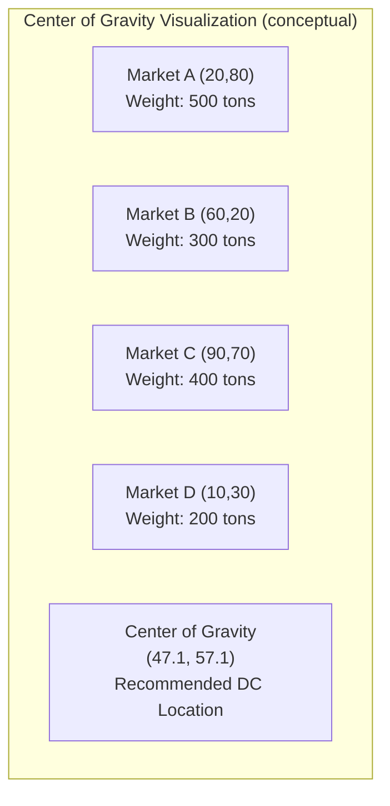
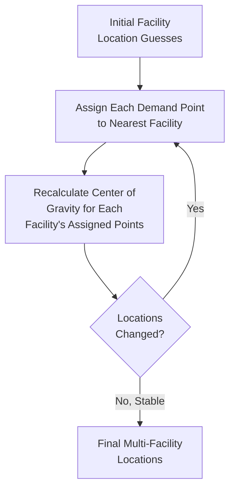

## Center of Gravity Method

### Definition and Purpose

The center of gravity method is a quantitative technique for identifying the geographic coordinates of a single facility location that minimizes total transportation cost (or weighted distance) to/from a set of existing destination points — such as customer markets, retail stores, or supply sources — each with an associated volume or demand weight. It is most commonly applied to siting a distribution center, warehouse, or centralized service facility that must serve multiple demand points efficiently.

The method treats the problem analogously to finding the physical center of gravity of a system of weighted points, where each destination's shipment volume acts as its "weight," pulling the optimal location toward higher-volume points.

### Core Formulas

Given a set of $n$ destination points, each with coordinates $(x_i, y_i)$ and an associated weight $W_i$ (typically shipment volume, demand quantity, or a combined cost-weighted metric), the center of gravity coordinates $(C_x, C_y)$ are calculated as weighted averages:

$$C_x = \frac{\sum_{i=1}^{n} x_i W_i}{\sum_{i=1}^{n} W_i}$$

$$C_y = \frac{\sum_{i=1}^{n} y_i W_i}{\sum_{i=1}^{n} W_i}$$

Coordinates are typically expressed using a simplified Cartesian grid overlaid on a map (e.g., using latitude/longitude directly, or an arbitrary x-y grid with a defined origin and scale), and weights are usually shipment volume (units, tons, or truckloads per period) or a combined weight-distance cost metric.

### Worked Example

A firm needs to locate a new central distribution center serving four regional markets. Coordinates are given on a simplified x-y grid (representing relative geographic position), with weight representing weekly shipment volume in tons.

| Market | X Coordinate | Y Coordinate | Weekly Volume (tons) |
| --- | --- | --- | --- |
| Market A | 20 | 80 | 500 |
| Market B | 60 | 20 | 300 |
| Market C | 90 | 70 | 400 |
| Market D | 10 | 30 | 200 |

**Step 1 — Calculate total weight:**

$$\sum W_i = 500 + 300 + 400 + 200 = 1{,}400 \text{ tons}$$

**Step 2 — Calculate weighted sum of X coordinates:**

$$\sum x_i W_i = (20 \times 500) + (60 \times 300) + (90 \times 400) + (10 \times 200)$$

$$= 10{,}000 + 18{,}000 + 36{,}000 + 2{,}000 = 66{,}000$$

**Step 3 — Calculate weighted sum of Y coordinates:**

$$\sum y_i W_i = (80 \times 500) + (20 \times 300) + (70 \times 400) + (30 \times 200)$$

$$= 40{,}000 + 6{,}000 + 28{,}000 + 6{,}000 = 80{,}000$$

**Step 4 — Calculate center of gravity coordinates:**

$$C_x = \frac{66{,}000}{1{,}400} = 47.1$$

$$C_y = \frac{80{,}000}{1{,}400} = 57.1$$

**Result**: The recommended distribution center location is at approximately $(47.1, 57.1)$ on the grid — pulled toward Market A (highest volume, at 500 tons) and Market C (second-highest, at 400 tons), and away from the lower-volume Market D.

### Visual Plot

<svg xmlns="http://www.w3.org/2000/svg" viewBox="0 0 500 420">
<text x="250" y="24" font-size="15" text-anchor="middle" font-weight="bold" fill="#222">Center of Gravity Plot (svg_diagram)</text>
<line x1="50" y1="370" x2="460" y2="370" stroke="#333" stroke-width="2" />
<line x1="50" y1="370" x2="50" y2="50" stroke="#333" stroke-width="2" />
<text x="255" y="398" font-size="13" text-anchor="middle" fill="#333">X Coordinate</text>
<text x="20" y="210" font-size="13" text-anchor="middle" fill="#333" transform="rotate(-90 20 210)">Y Coordinate</text>
<circle cx="130" cy="114" r="16" fill="#2563eb" />
<text x="130" y="100" font-size="11" text-anchor="middle" fill="#222">A (500t)</text>
<circle cx="290" cy="306" r="11" fill="#2563eb" />
<text x="290" y="330" font-size="11" text-anchor="middle" fill="#222">B (300t)</text>
<circle cx="410" cy="146" r="14" fill="#2563eb" />
<text x="410" y="132" font-size="11" text-anchor="middle" fill="#222">C (400t)</text>
<circle cx="90" cy="274" r="9" fill="#2563eb" />
<text x="90" y="296" font-size="11" text-anchor="middle" fill="#222">D (200t)</text>
<circle cx="264" cy="178" r="9" fill="#dc2626" />
<text x="264" y="164" font-size="12" font-weight="bold" text-anchor="middle" fill="#dc2626">CoG (47.1, 57.1)</text>
</svg>

### Weighting Considerations: Volume vs. Cost-Weighted Distance

The basic formula weights purely by volume ($W_i$ = shipment quantity), which implicitly assumes uniform per-unit-distance transportation cost across all destinations. A more refined version incorporates the actual **cost per unit per unit distance** for each destination, since transportation rates can differ across routes/carriers/modes:

$$W_i' = V_i \times R_i$$

Where $V_i$ is volume and $R_i$ is the transportation rate per unit-distance for destination $i$. Using $W_i'$ in place of raw volume in the center of gravity formulas produces a location that minimizes total transportation *cost* rather than total weighted *distance* — a more accurate optimization when transportation rates vary significantly across the served destinations (e.g., due to differing modes, carrier contracts, or route characteristics).

### Multi-Facility Extension

For networks requiring more than one facility, the basic center of gravity method must be extended — the single-point formula assumes one central facility serves all points. Common approaches for multi-facility problems:

1. **Cluster first, then apply center of gravity per cluster**: Group destination points into geographic clusters (e.g., using judgment, geographic regions, or clustering algorithms), then calculate a separate center of gravity for each cluster, effectively siting one facility per cluster.
2. **Iterative reassignment**: Start with an initial guess of facility locations, assign each destination point to its nearest facility, recalculate each facility's center of gravity based on its assigned points, then reassign destinations to the (possibly changed) nearest facility, and repeat until the solution stabilizes — a heuristic resembling the k-means clustering algorithm.

### Assumptions and Limitations

- **Straight-line (Euclidean) distance assumption**: The basic method assumes transportation cost is proportional to straight-line distance, ignoring actual road/rail network routing, geographic obstacles (mountains, water bodies), and border crossings — actual travel distance and cost can differ meaningfully from the straight-line approximation, especially in areas with limited direct infrastructure.
- **Static demand assumption**: Uses current or forecasted average volumes as fixed weights; does not account for demand growth, seasonality, or shifts in demand geography over time — a location optimal for today's demand pattern may not remain optimal as the demand distribution evolves.
- **Ignores qualitative/intangible factors**: The method purely optimizes weighted transportation distance/cost — it does not account for labor availability, land cost, zoning, tax climate, or other factors covered under the broader location decision criteria (see related topic: Location decision factors and criteria). The resulting coordinate should be treated as a starting point/first approximation, then cross-referenced against actual available real estate and combined with factor rating analysis to select a final feasible site.
- **Ignores fixed facility costs**: The method minimizes variable transportation cost but does not incorporate the fixed cost of establishing a facility at different candidate locations — a location with a lower center-of-gravity transportation cost might have prohibitively higher land/construction/labor costs, requiring the result to be evaluated alongside these additional cost factors before finalizing (commonly via break-even/total-cost comparison across a short list of feasible candidates near the computed center of gravity).
- **Sensitivity to outlier/extreme-volume points**: A single very high-volume destination can dominate the weighted average, pulling the computed location strongly toward that point even if it is geographically distant from the bulk of other, smaller-volume destinations — worth checking whether the result is being driven disproportionately by one or two outlier weights.

### Relationship to Other Location Methods

| Method | What It Optimizes | Typical Role |
| --- | --- | --- |
| Center of gravity | Continuous-space location minimizing weighted transportation distance/cost | Initial candidate location generation, especially for single-facility siting |
| Transportation method (LP) | Optimal shipment allocation across a *given* set of candidate facility locations and demand points | Network-level flow optimization once candidate sites are identified |
| Factor rating | Composite score across tangible and intangible qualitative factors | Refining the final site choice among a short list, incorporating factors the center of gravity method cannot capture |

A common practical workflow: use the center of gravity method to generate an initial geographic target area, identify actual available real estate/candidate sites near that computed point, then apply factor rating (incorporating land cost, zoning, labor, tax incentives, and other qualitative factors) to select the final specific site from among the nearby candidates.

### Key Points

- The center of gravity method calculates the volume-weighted average coordinates $(C_x, C_y)$ of a set of destination points, identifying a location that minimizes total weighted transportation distance.
- Basic weighting uses shipment volume; refined weighting incorporates transportation rate per unit-distance for greater cost accuracy when rates vary across destinations.
- Multi-facility problems require extending the method via clustering or iterative reassignment approaches.
- The method assumes straight-line distance and ignores fixed facility costs and qualitative/intangible factors — its output is best treated as a starting point for further site evaluation, not a final answer.
- Best practice combines center of gravity analysis with factor rating and total-cost comparison across nearby feasible candidate sites.

### Related Topics / Next Steps

- Location decision factors and criteria
- Factor rating method for location selection
- Transportation method (linear programming) for facility location and network flow
- Break-even analysis for facility location alternatives
- Multi-facility network design (centralization vs. decentralization)
- Supply chain network optimization and demand clustering techniques