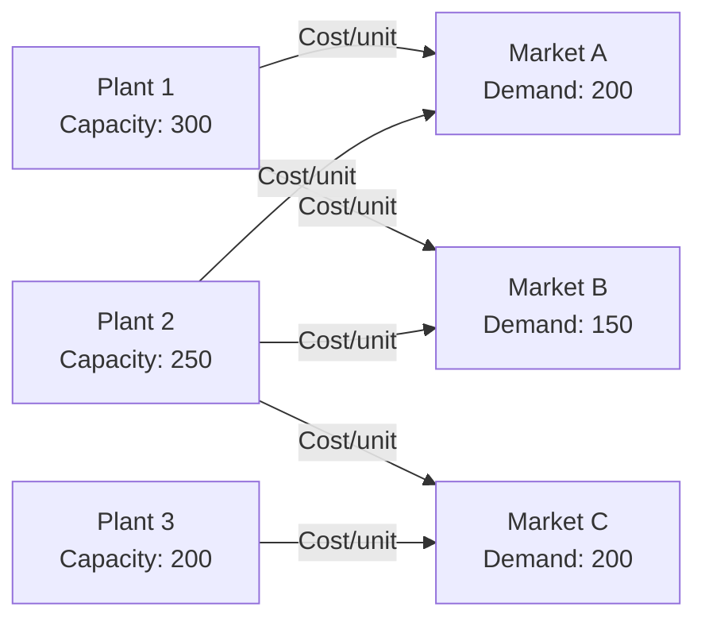
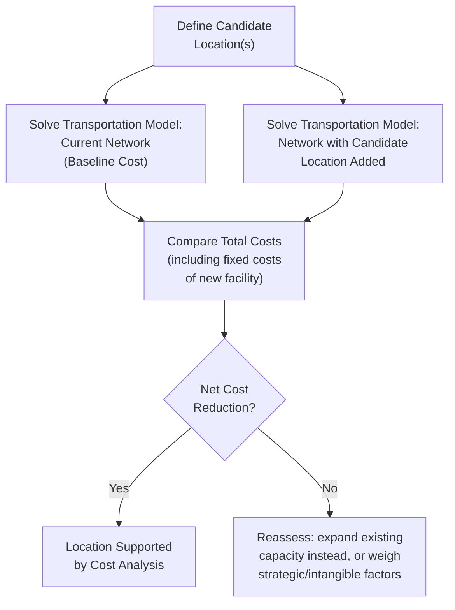

## Transportation Model for Location Decisions

### Definition and Purpose

The transportation model is a linear programming technique used to determine the least-cost distribution plan for shipping goods from multiple supply sources (factories, plants, warehouses) to multiple demand destinations (distribution centers, markets, customers), given per-unit shipping costs and capacity/demand constraints. In facility location planning, it serves a specific and important role: **evaluating the total network transportation cost impact of adding, closing, or relocating a facility**, allowing planners to compare location alternatives not just by isolated site characteristics but by their effect on the entire distribution network's optimal shipping cost.

### The Transportation Problem Structure

The model requires three categories of input data:

1. **Supply points** with their available capacity (existing or candidate plants/warehouses)
2. **Demand points** with their required quantity (markets, distribution centers, customers)
3. **Unit transportation cost** from each supply point to each demand point

### Mathematical Formulation

**Objective function** (minimize total transportation cost):

$$\text{Minimize } Z = \sum_{i=1}^{m} \sum_{j=1}^{n} C_{ij} X_{ij}$$

**Subject to supply constraints** (cannot ship more than available from each source):

$$\sum_{j=1}^{n} X_{ij} \leq S_i \quad \text{for each supply point } i$$

**Subject to demand constraints** (must meet demand at each destination):

$$\sum_{i=1}^{m} X_{ij} \geq D_j \quad \text{for each demand point } j$$

**Non-negativity constraint:**

$$X_{ij} \geq 0$$

Where $C_{ij}$ is the unit transportation cost from source $i$ to destination $j$, $X_{ij}$ is the quantity shipped from source $i$ to destination $j$, $S_i$ is the capacity of source $i$, and $D_j$ is the demand at destination $j$.

**Balance condition**: The model requires total supply to equal total demand ($\sum S_i = \sum D_j$) for a standard balanced transportation problem. If actual supply and demand differ, a **dummy source** (if demand exceeds supply) or **dummy destination** (if supply exceeds demand) is added with zero unit cost to balance the model mathematically — shipments to/from the dummy represent unmet demand or unused capacity respectively.

### Solution Methods

The transportation problem, while solvable as a general linear program (e.g., via the simplex method), has specialized, more efficient solution algorithms exploiting its structure:

**Step 1 — Find an initial feasible solution** using one of:

- **Northwest Corner Method**: Allocates starting from the top-left cell of the cost table, filling as much as possible before moving to the next cell — simple but does not consider cost, often producing a poor starting solution.
- **Least Cost Method**: Allocates to the lowest-cost cell first, then the next-lowest, continuing until all supply/demand is satisfied — generally produces a better starting solution than Northwest Corner.
- **Vogel's Approximation Method (VAM)**: Calculates a penalty cost (difference between the two lowest costs) for each row/column, allocates to the lowest-cost cell in the row/column with the highest penalty first — typically produces a starting solution very close to or at the optimal solution.

**Step 2 — Test for optimality and improve** using:

- **Stepping-Stone Method**: Evaluates whether reallocating shipments along a closed path of adjustments would reduce total cost, iterating until no further improvement is possible.
- **Modified Distribution (MODI) Method**: A more computationally efficient algorithm using dual variables (index numbers) to identify improving reallocations without tracing full closed-path evaluations for every unused cell.

In practice, spreadsheet solvers (e.g., linear programming add-ins) or dedicated optimization software are used for real-world problems rather than manual iteration, given the scale of realistic supply chain networks.

### Worked Example: Application to Location Decisions

A firm currently operates two plants and is evaluating whether to add a third plant at a candidate location to serve three markets, or to expand capacity at existing plants instead.

**Current Network (Two Plants):**

| From \ To | Market A (Demand: 200) | Market B (Demand: 180) | Market C (Demand: 220) | Supply |
| --- | --- | --- | --- | --- |
| Plant 1 | $4 | $6 | $9 | 300 |
| Plant 2 | $7 | $3 | $5 | 300 |
| **Total Demand** |  |  |  | **600** |

Solving this via optimization yields a minimum-cost shipping plan and total cost (e.g., using VAM followed by MODI), producing a baseline total transportation cost — call this $TC_{\text{current}}$.

**Proposed Network (Adding Candidate Plant 3):**

| From \ To | Market A | Market B | Market C | Supply |
| --- | --- | --- | --- | --- |
| Plant 1 | $4 | $6 | $9 | 200 |
| Plant 2 | $7 | $3 | $5 | 200 |
| Plant 3 (candidate) | $5 | $4 | $3 | 200 |
| **Total Demand** | 200 | 180 | 220 | **600** |

Re-solving the transportation problem with the candidate Plant 3 included yields a new minimum total transportation cost, $TC_{\text{proposed}}$. If $TC_{\text{proposed}}$ (inclusive of any changes to fixed costs from reduced reliance on Plants 1/2, plus Plant 3's own fixed costs) is lower than $TC_{\text{current}}$ plus its associated fixed costs, the candidate location is transportation-cost-justified.

$$\Delta \text{Total Cost} = (TC_{\text{proposed}} + FC_{\text{Plant 3}}) - (TC_{\text{current}})$$

A negative $\Delta$ indicates the new facility reduces total network cost (transportation savings exceed the new facility's fixed cost) and supports the location decision; a positive $\Delta$ indicates the expansion is not cost-justified on this basis alone (though intangible/strategic factors from factor rating analysis may still favor it).

### Comparing Multiple Candidate Locations

For comparing several candidate location alternatives (rather than a binary add/don't-add decision), the transportation model is solved separately for each candidate network configuration (each candidate location substituted into the network in turn), and the resulting total costs are ranked.

**Example structure:**

| Candidate Location | Network Total Transportation Cost | Facility Fixed Cost | Total Network Cost |
| --- | --- | --- | --- |
| Candidate Site 1 | $185,000/year | $450,000/year | $635,000/year |
| Candidate Site 2 | $172,000/year | $520,000/year | $692,000/year |
| Candidate Site 3 | $198,000/year | $390,000/year | $588,000/year |

In this illustrative comparison, Candidate Site 3 has the lowest total network cost despite not having the lowest transportation cost alone — its lower fixed cost more than offsets its higher shipping cost relative to Site 2, demonstrating why the transportation model's output must be combined with facility fixed-cost data rather than used as a standalone transportation-cost-minimization criterion for location selection.

### Degeneracy and Other Special Cases

- **Degeneracy**: Occurs when the number of occupied (non-zero) shipping routes in a solution is less than $m + n - 1$ (rows + columns - 1), which can cause complications in the MODI/stepping-stone evaluation process. This is typically resolved by allocating an infinitesimally small quantity (denoted $\epsilon$) to an unused cell to allow the optimality test to proceed.
- **Multiple optimal solutions**: More than one shipping allocation may achieve the same minimum total cost — relevant when secondary criteria (e.g., lead time, single-sourcing preferences, risk diversification) should be used as tiebreakers among cost-equivalent solutions.
- **Prohibited routes**: Certain source-destination pairs may be infeasible (e.g., due to lack of infrastructure, trade restrictions, or capacity constraints on a specific route) — modeled by assigning a very large cost (effectively infinite, denoted $M$) to that cell, ensuring the optimization algorithm avoids allocating shipments there.

### Sensitivity Analysis in Location Context

Because unit transportation costs (fuel prices, freight rates) and demand levels fluctuate, the transportation model's location-decision conclusions should be tested against plausible input variation:

- **Cost sensitivity**: Re-solving the model with increased fuel/freight cost assumptions to check whether the location ranking remains stable under rising transportation costs.
- **Demand sensitivity**: Re-solving with shifted demand patterns (e.g., regional growth differences) to check whether a location optimal for current demand remains optimal under forecasted future demand distribution.
- **Capacity sensitivity**: Testing how total cost changes if a candidate location's planned capacity is under- or over-sized relative to the optimization's allocated volume, informing the capacity sizing decision alongside the location decision (see related topic: Capacity expansion timing and sizing).

### Relationship to Other Location Methods

| Method | Scope | Role Relative to Transportation Model |
| --- | --- | --- |
| Center of gravity | Single-point continuous-space location estimate | Generates an initial candidate location for testing within the transportation model |
| Factor rating | Qualitative/intangible factor scoring | Evaluates non-cost factors for candidates that pass transportation-cost screening |
| Transportation model | Network-level optimal flow and total cost given specific candidate locations | Quantifies the actual network-wide cost impact of specific, real candidate sites — the most rigorous cost-based test among the three |

The transportation model is typically the most data- and computation-intensive of the standard location tools, and is most valuable when a firm already operates a multi-facility network and is evaluating how a new, relocated, or closed facility would affect total system-wide distribution cost — as opposed to a single, isolated greenfield location decision where center of gravity and factor rating may be sufficient on their own.

### Key Points

- The transportation model is a linear program minimizing total shipping cost across a network of supply sources and demand destinations, subject to capacity and demand constraints.
- Vogel's Approximation Method typically provides a strong initial solution; the MODI method is the standard technique for testing and improving toward optimality.
- In location decisions, the model is solved once for the current/baseline network and again with each candidate location included, comparing total network cost (transportation plus fixed facility cost) to determine cost justification.
- The model's balance requirement (total supply = total demand) is handled via dummy sources/destinations when real-world supply and demand are unequal.
- Sensitivity analysis on transportation rates, demand patterns, and capacity assumptions is essential given the inherent uncertainty in long-term facility location decisions.

### Related Topics / Next Steps

- Location decision factors and criteria
- Factor rating method for location selection
- Center of gravity method for location selection
- Linear programming fundamentals and the simplex method
- Capacity expansion timing and sizing
- Supply chain network design and multi-echelon distribution planning
- Sensitivity analysis in optimization models