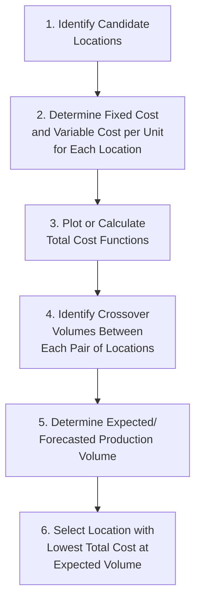
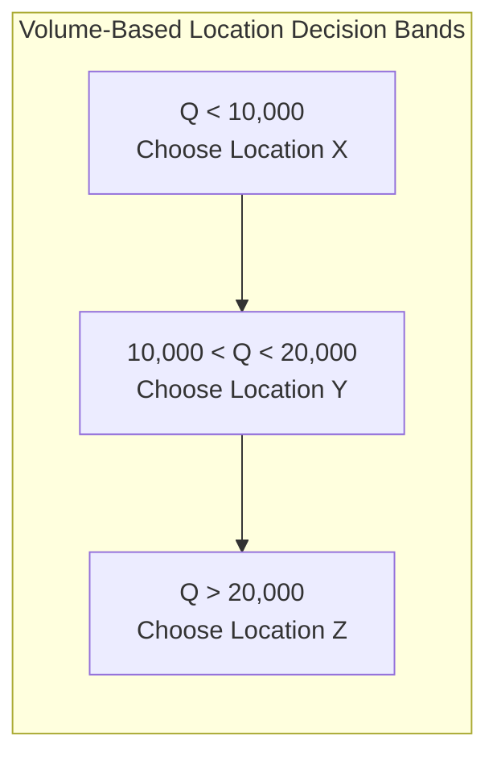
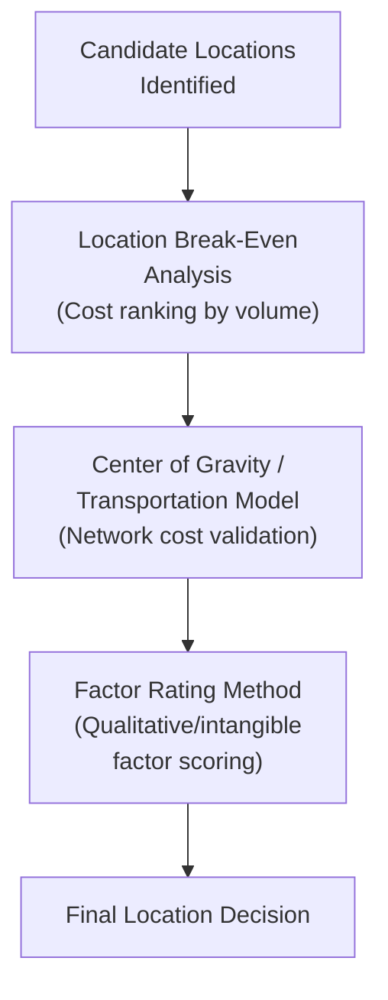

## Location Break-Even Analysis

### Definition and Purpose

Location break-even analysis is an adaptation of standard break-even/crossover analysis applied specifically to comparing facility location alternatives based on their differing cost structures. Each candidate location typically presents a distinct combination of fixed costs (land, construction, facility overhead) and variable costs per unit (labor, materials, local transportation), and location break-even analysis identifies the production/output volume ranges over which each alternative offers the lowest total cost — directly supporting the location decision when volume is a known or forecastable input.

This technique mirrors the crossover analysis logic used in capacity/process alternative comparisons (see related topic: Break-even analysis for capacity decisions), applied here across geographic location alternatives rather than production technologies.

### Core Cost Structure and Formula

$$\text{Total Cost}_j = FC_j + (VC_j \times Q)$$

Where $FC_j$ is the fixed cost of location $j$, $VC_j$ is the variable cost per unit at location $j$, and $Q$ is production/output volume.

**Crossover volume** between two locations is found by setting their total cost equations equal:

$$FC_1 + (VC_1 \times Q) = FC_2 + (VC_2 \times Q)$$

$$Q_{crossover} = \frac{FC_2 - FC_1}{VC_1 - VC_2}$$

The location with the lower fixed cost (typically) has the lower total cost at low volumes; the location with the lower variable cost has the lower total cost at high volumes, with the crossover point marking the volume at which the ranking switches.

### Step-by-Step Procedure

### Worked Example: Three-Location Comparison

A firm is evaluating three candidate locations for a new manufacturing plant, each with different fixed and variable cost structures.

| Location | Annual Fixed Cost | Variable Cost per Unit |
| --- | --- | --- |
| Location X | $150,000 | $45 |
| Location Y | $300,000 | $30 |
| Location Z | $500,000 | $20 |

**Step 1 — Calculate pairwise crossover volumes:**

**Location X vs. Location Y:**

$$Q_{XY} = \frac{300{,}000 - 150{,}000}{45 - 30} = \frac{150{,}000}{15} = 10{,}000 \text{ units}$$

**Location Y vs. Location Z:**

$$Q_{YZ} = \frac{500{,}000 - 300{,}000}{30 - 20} = \frac{200{,}000}{10} = 20{,}000 \text{ units}$$

**Location X vs. Location Z** (checked to confirm consistency of the ranking bands):

$$Q_{XZ} = \frac{500{,}000 - 150{,}000}{45 - 20} = \frac{350{,}000}{25} = 14{,}000 \text{ units}$$

**Step 2 — Determine cost ranking by volume band:**

- **Volume < 10,000 units**: Location X has the lowest total cost (lowest fixed cost dominates at low volume).
- **10,000 < Volume < 20,000 units**: Location Y has the lowest total cost.
- **Volume > 20,000 units**: Location Z has the lowest total cost (lowest variable cost dominates at high volume).

Note that the X-vs-Z crossover (14,000 units) falls *within* the 10,000–20,000 band where Y is already optimal — this is expected and consistent: at 14,000 units, Z would beat X directly, but Y beats both, so the X-vs-Z crossover point is not part of the actual optimal-choice boundary. Only the crossovers between *consecutively ranked* alternatives (X-Y and Y-Z here) define the actual decision bands; this is why plotting all three total cost lines is important — it reveals which pairwise crossovers are actually relevant to the final decision versus which are "dominated" by a third alternative.

### Graphical Representation

<svg xmlns="http://www.w3.org/2000/svg" viewBox="0 0 640 400">
<text x="320" y="24" font-size="15" text-anchor="middle" font-weight="bold" fill="#222">Location Break-Even Chart (svg_diagram)</text>
<line x1="70" y1="340" x2="600" y2="340" stroke="#333" stroke-width="2" />
<line x1="70" y1="340" x2="70" y2="40" stroke="#333" stroke-width="2" />
<text x="335" y="368" font-size="13" text-anchor="middle" fill="#333">Volume (Q, units)</text>
<text x="30" y="190" font-size="13" text-anchor="middle" fill="#333" transform="rotate(-90 30 190)">Total Cost ($)</text>
<line x1="70" y1="300" x2="600" y2="80" stroke="#dc2626" stroke-width="2.5" />
<text x="605" y="80" font-size="12" fill="#dc2626">Location X</text>
<line x1="70" y1="260" x2="600" y2="130" stroke="#2563eb" stroke-width="2.5" />
<text x="605" y="130" font-size="12" fill="#2563eb">Location Y</text>
<line x1="70" y1="180" x2="600" y2="90" stroke="#16a34a" stroke-width="2.5" />
<text x="605" y="90" font-size="12" fill="#16a34a">Location Z</text>
<circle cx="245" cy="215" r="5" fill="#f59e0b" />
<text x="245" y="235" font-size="11" text-anchor="middle" fill="#555">X-Y crossover 10,000 units</text>
<circle cx="420" cy="137" r="5" fill="#f59e0b" />
<text x="420" y="120" font-size="11" text-anchor="middle" fill="#555">Y-Z crossover: 20,000</text>
</svg>

### Incorporating Revenue: Profit-Based Location Break-Even

When selling price is constant across locations (a common assumption when the same product is sold in the same markets regardless of production location), the location decision based on minimizing total cost is equivalent to maximizing profit, since:

$$\text{Profit}_j = (P \times Q) - FC_j - (VC_j \times Q)$$

Minimizing $[FC_j + VC_j \times Q]$ at a given $Q$ is equivalent to maximizing $\text{Profit}_j$ at that same $Q$, since the revenue term $P \times Q$ is identical across locations under this assumption. If price *does* vary by location (e.g., due to local market conditions, tariffs, or currency effects), the analysis must shift from pure cost minimization to explicit profit comparison:

$$\text{Profit}_j = (P_j \times Q) - FC_j - (VC_j \times Q) = Q(P_j - VC_j) - FC_j$$

This modifies the crossover logic to account for differing contribution margins per location, not just differing cost structures.

### Sensitivity to Volume Forecast Accuracy

Because the location decision under this method depends entirely on where the *actual/forecasted* volume falls relative to the crossover points, forecast accuracy is critical, and the analysis should explicitly test the decision's sensitivity to plausible volume forecast error.

**Example** (continuing the X/Y/Z example): If forecasted demand is 18,000 units/year, Location Y is indicated. But if the true demand forecast carries meaningful uncertainty (e.g., a plausible range of 15,000–24,000 units), the recommended location could shift to Z if actual demand comes in above 20,000. In this situation, the firm should assess:

- How close the forecast is to a crossover boundary (18,000 units is relatively close to the 20,000-unit Y-Z crossover, signaling higher decision risk than if forecast demand were, say, 12,000 units — comfortably within the Y band).
- Whether a location with more favorable characteristics on the "wrong side" of a nearby crossover carries acceptable downside if demand comes in differently than forecast (a margin-of-safety-style consideration, echoing the standard break-even analysis concept).

### Incorporating Additional Cost Categories

Real-world location break-even analysis often extends beyond simple fixed/variable labor and facility costs to include location-specific cost components that vary systematically with the location decision:

- **Transportation/logistics cost**: Often modeled as a location-specific variable cost component (cost per unit shipped to market), directly linking this method to the transportation model and center-of-gravity analyses (see related topics).
- **Tax and incentive adjustments**: Location-specific tax rates or incentive packages can be incorporated as adjustments to the effective fixed or variable cost (e.g., a tax abatement reducing effective fixed cost, a favorable corporate tax rate reducing effective variable/operating cost).
- **Currency and inflation considerations**: For international location comparisons, cost inputs should be normalized to a common currency and time basis, with sensitivity analysis on exchange rate assumptions given their volatility over a facility's operating life.

### Limitations

- **Linearity assumption**: As with standard break-even analysis, this method assumes constant variable cost per unit and constant fixed cost across the full relevant volume range, ignoring step-fixed costs (e.g., needing added supervisory/administrative capacity beyond a certain volume) or economies-of-scale-driven declining variable costs at higher volumes (see related topic: Economies and diseconomies of scale).
- **Single-product/homogeneous output assumption**: The basic model assumes a single product or a stable, unchanging product mix; multi-product facilities with different cost structures per product require either an aggregated/weighted-average approach or a more complex multi-product cost model.
- **Static, single-period view**: Does not natively incorporate the time value of money or multi-year cost/volume evolution — for major capital decisions, results should be supplemented with NPV analysis across the facility's expected operating life, particularly when fixed and variable costs are expected to change materially over time (e.g., wage inflation differing by region).
- **Excludes qualitative/intangible factors**: Like the transportation and center-of-gravity methods, location break-even analysis is purely cost-based — it does not capture labor relations climate, quality of life, political stability, or other qualitative criteria, which should be evaluated via factor rating analysis (see related topic) alongside or after break-even screening.
- **Assumes accurate, comparable cost estimation across locations**: Fixed and variable cost estimates for candidate locations (especially unfamiliar or international sites) carry inherent estimation uncertainty; errors in early-stage cost estimates can shift crossover points and potentially reverse the indicated location ranking.

### Integration with the Broader Location Decision Process

Location break-even analysis is typically used early in the evaluation process as a relatively quick, low-data-requirement screening tool to narrow a candidate list based on volume-dependent cost structure, before more detailed network-level (transportation model) and qualitative (factor rating) analyses are applied to the narrowed short list.

### Key Points

- Location break-even analysis compares total cost functions ($FC_j + VC_j \times Q$) across candidate locations to identify volume-based crossover points and cost-minimizing decision bands.
- With more than two alternatives, only crossovers between consecutively cost-ranked alternatives define the actual decision boundaries — dominated crossovers (masked by a third, better alternative) should be identified by plotting or comparing all alternatives together.
- When selling price is constant across locations, cost minimization is equivalent to profit maximization; when price varies by location, the analysis should shift to explicit profit/contribution-margin comparison.
- Sensitivity analysis on the volume forecast is essential, particularly when the forecast falls close to a crossover boundary.
- The method excludes qualitative factors and should be combined with factor rating and network-level (transportation model) analysis for a complete location decision.

### Related Topics / Next Steps

- Break-even analysis for capacity decisions
- Location decision factors and criteria
- Factor rating method for location selection
- Center of gravity method for location selection
- Transportation model for location decisions
- Economies and diseconomies of scale
- NPV and capital budgeting for facility investment decisions