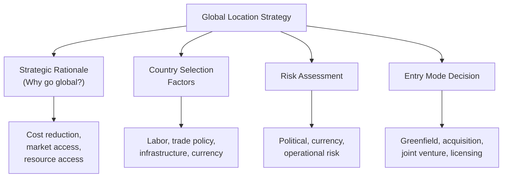
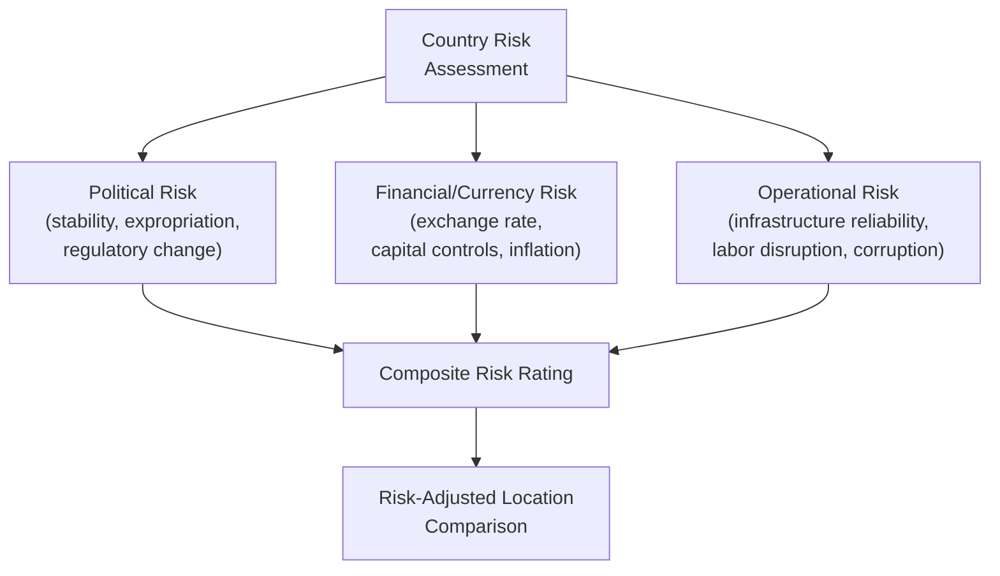
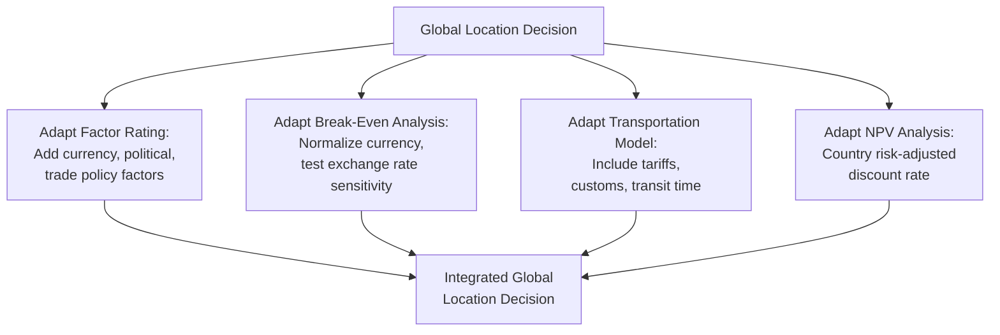

## Global Location Strategy

### Overview

Global location strategy addresses the additional layer of complexity that arises when facility location decisions cross national borders. Beyond the standard tangible/intangible factors covered in domestic location analysis (see related topic: Location decision factors and criteria), international location decisions must account for currency risk, trade policy, cultural and institutional differences, and geopolitical stability — factors that materially affect both the cost structure and the risk profile of a global facility investment.

### Strategic Rationale for Global Location

International facility location decisions are typically driven by one or more of four strategic motivations:

**1. Cost Reduction (Efficiency-Seeking)**

Locating production in countries with significantly lower labor costs, favorable tax regimes, or lower input costs to reduce total delivered cost — historically the dominant driver of offshoring in labor-intensive manufacturing.

**2. Market-Seeking (Market Access)**

Locating facilities within or near a target foreign market to serve local demand directly, often to avoid tariffs/import restrictions, reduce transportation lead time, adapt products to local preferences, and establish local market presence and goodwill.

**3. Resource-Seeking**

Locating near critical raw materials, natural resources, specialized labor skills, or technology/knowledge clusters not available (or not competitively available) domestically.

**4. Strategic/Risk-Diversification-Seeking**

Locating facilities across multiple countries/regions to diversify supply chain risk, hedge currency exposure, maintain flexibility against trade policy shifts, and avoid over-reliance on a single geographic source (a consideration that gained substantial prominence following major global supply chain disruptions).

| Motivation | Primary Driver | Typical Industry Examples |
| --- | --- | --- |
| Cost reduction | Lower factor costs | Apparel, electronics assembly, call centers |
| Market-seeking | Local market access, tariff avoidance | Automotive, consumer packaged goods |
| Resource-seeking | Raw material/talent access | Mining, oil and gas, semiconductor R&D |
| Risk diversification | Supply chain resilience | Multi-national manufacturers post-disruption reassessment |

### Global-Specific Location Factors

Beyond the standard domestic factors (labor, transportation, market proximity — see related topic), global location decisions introduce factors with no direct domestic equivalent:

#### Currency and Financial Factors

- **Exchange rate exposure**: Costs incurred in local currency but revenue earned in another currency (or vice versa) creates ongoing currency risk affecting realized profitability, independent of underlying operational performance.
- **Currency stability and convertibility**: Some countries impose capital controls restricting the ability to repatriate profits, a material risk factor beyond simple exchange rate volatility.
- **Local financing availability**: Access to local capital markets and financing terms, which can differ substantially in cost and availability from the firm's home market.

#### Trade Policy and Tariff Factors

- **Tariff structure**: Import/export duties applicable to inputs and finished goods, directly affecting the cost advantage of a given location relative to alternatives.
- **Trade agreement membership**: Preferential tariff treatment available through regional trade blocs or bilateral agreements, which can make a location attractive specifically as an export platform to member countries.
- **Non-tariff barriers**: Quotas, local content requirements (mandating a minimum percentage of local sourcing/labor), and technical/regulatory standards that affect operational feasibility and cost.

#### Political and Institutional Factors

- **Political stability**: Risk of regime change, civil unrest, or policy reversal affecting long-term investment security.
- **Legal system and property rights protection**: Reliability of contract enforcement, intellectual property protection, and legal recourse in disputes.
- **Expropriation/nationalization risk**: Historical precedent and current risk of government seizure of foreign-owned assets, particularly relevant in resource-extraction industries.
- **Corruption and business ease**: Transparency of regulatory/permitting processes, prevalence of informal payment requirements affecting both cost and ethical/compliance risk.

#### Cultural and Operational Factors

- **Cultural distance**: Differences in business practices, communication norms, and workplace culture affecting management complexity, particularly for expatriate staffing and local workforce integration.
- **Language barriers**: Operational and coordination complexity when facility-level communication differs from corporate headquarters language.
- **Local partner requirements**: Some countries require or strongly incentivize local joint venture partnerships or minimum local ownership stakes as a condition of market entry.
- **Intellectual property risk**: Varying strength of IP protection regimes, a critical consideration for technology-intensive or proprietary-process operations.

### Risk Assessment Frameworks

International location decisions typically undergo structured country risk assessment, often using published country risk indices (e.g., political risk ratings, ease-of-doing-business rankings, corruption perception indices) as inputs alongside firm-specific analysis. [Unverified — the specific indices used vary by firm and consulting practice, and their predictive reliability for a specific investment decision is a matter of ongoing debate in international business literature; they are best treated as one input among several rather than a definitive risk score.]

**Risk-adjusted evaluation** can be incorporated into quantitative location comparisons by applying a **risk-adjusted discount rate** in NPV analysis — higher perceived country risk warrants a higher discount rate applied to that location's projected cash flows, reducing its calculated present value relative to lower-risk alternatives with otherwise similar projected returns.

$$NPV_{\text{risk-adjusted}} = \sum_{t=0}^{n} \frac{CF_t}{(1+r_{\text{country}})^t} - \text{Initial Investment}$$

Where $r_{\text{country}}$ incorporates a country-specific risk premium above the firm's baseline cost of capital.

### Entry Mode Decision

Beyond selecting *where* to locate internationally, firms must decide *how* to establish operations in the target country — a decision closely linked to, but distinct from, the physical location choice:

| Entry Mode | Description | Capital Commitment | Control Level |
| --- | --- | --- | --- |
| Greenfield investment | Build entirely new facility from the ground up | High | High |
| Acquisition | Purchase an existing local company/facility | High | High |
| Joint venture | Partner with a local firm, sharing ownership/control | Moderate | Shared |
| Licensing/franchising | License local partner to produce/operate using firm's IP/brand | Low | Low |
| Contract manufacturing | Outsource production to a local third-party manufacturer | Low | Low |

**Trade-offs**: Greenfield and acquisition modes offer maximum control and full capture of location advantages but carry the highest capital exposure and risk. Joint ventures can reduce risk and provide valuable local market knowledge/relationships (particularly useful where local partner requirements exist or cultural/regulatory complexity is high) but require sharing profits and control, and can create coordination/governance challenges. Licensing and contract manufacturing minimize capital risk and market-entry speed but sacrifice the most control and long-term strategic positioning value.

### Offshoring, Nearshoring, and Reshoring

Global location strategy has evolved through distinct phases of thinking regarding the geographic distance between production and target markets:

- **Offshoring**: Locating production in a distant, typically lower-cost country primarily to minimize production cost, historically the dominant paradigm for labor-intensive manufacturing.
- **Nearshoring**: Locating production in a geographically closer country (though still foreign) to balance cost advantages with reduced transportation time/cost, lower supply chain risk, and easier logistics coordination — often considered as a partial retreat from pure offshoring economics in favor of improved responsiveness and resilience.
- **Reshoring**: Returning production to the firm's home country, typically motivated by rising costs in the previously offshored location (eroding the original cost advantage), automation reducing the labor cost differential's importance, supply chain risk concerns, or strategic/political considerations (e.g., domestic content incentives, tariff changes).

[Inference: the relative prevalence of these three strategies shifts over time with changing labor cost differentials, automation economics, and geopolitical conditions — general directional trends are discussed in supply chain/operations literature, but specific current industry-wide shift magnitudes should be verified against current data rather than assumed static.]

### Total Cost of Ownership Framework for Global Location

A common pitfall in global location analysis is comparing only direct unit production cost (e.g., labor rate) across countries, ignoring the full landed cost and risk-adjusted total cost of a global supply chain. A more complete **Total Cost of Ownership (TCO)** framework includes:

$$TCO = \text{Production Cost} + \text{Transportation/Logistics Cost} + \text{Inventory Carrying Cost} + \text{Tariffs/Duties} + \text{Quality/Risk Cost} + \text{Coordination/Overhead Cost}$$

**Example**: A location with a $3/unit lower labor cost than a domestic alternative may appear attractive on direct cost alone, but once longer transit times (requiring higher safety stock/inventory carrying cost), higher freight cost, applicable tariffs, greater quality-control/rework risk from distant oversight, and increased cross-border coordination overhead are added, the total landed cost advantage may narrow substantially or reverse entirely — a key reason many reshoring/nearshoring decisions have been driven by TCO reassessment rather than direct labor cost alone.

### Combining Global Factors with Standard Location Methods

The standard quantitative location tools (factor rating, center of gravity, transportation model, break-even analysis) remain applicable to global decisions, but require adaptation:

- **Factor rating**: Global-specific factors (currency risk, political stability, trade policy, cultural distance) are added as explicit weighted criteria alongside standard domestic factors.
- **Break-even/crossover analysis**: Cost inputs must be normalized to a common currency, with explicit sensitivity analysis on exchange rate assumptions given their volatility over a facility's multi-year operating life.
- **Transportation model**: International shipping costs must incorporate tariffs, customs processing time/cost, and potentially longer, less predictable transit times affecting the effective per-unit landed cost used in the model.
- **NPV/capital budgeting**: Risk-adjusted discount rates (incorporating country risk premiums) and explicit currency translation assumptions become essential rather than optional refinements.

### Key Points

- Global location strategy is driven by cost reduction, market access, resource access, and/or risk diversification motivations, often in combination.
- International decisions require evaluating currency, trade policy, political/institutional, and cultural factors with no direct domestic equivalent.
- Entry mode (greenfield, acquisition, joint venture, licensing) is a related but distinct decision from physical location choice, involving its own capital-commitment/control trade-offs.
- Total Cost of Ownership analysis, not direct unit production cost alone, should drive global location comparisons — narrow labor-cost comparisons frequently overstate the true landed-cost advantage of distant, low-cost locations.
- Standard location tools (factor rating, break-even, transportation model, NPV) remain applicable globally but require adaptation for currency, tariff, and risk-premium factors.

### Related Topics / Next Steps

- Location decision factors and criteria
- Factor rating method for location selection
- Transportation model for location decisions
- Location break-even analysis
- Supply chain risk management and resilience strategy
- Foreign direct investment entry mode strategy
- Currency risk management and hedging in international operations