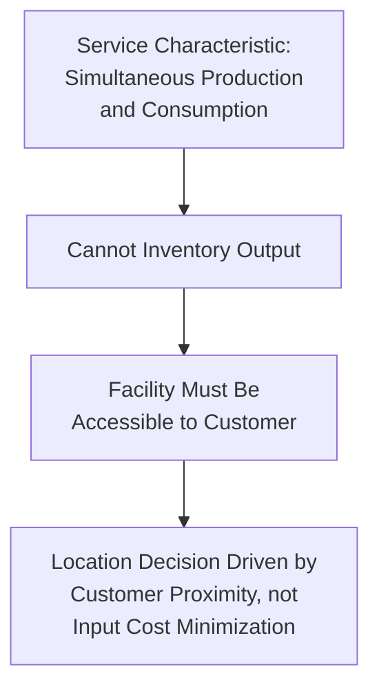
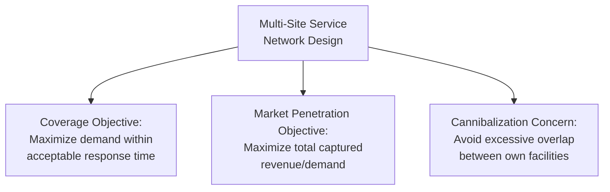
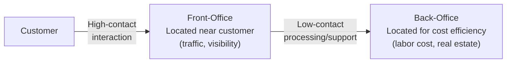

## Location Decisions for Service Facilities

### Overview and Fundamental Distinction from Manufacturing Location

Service facility location decisions differ fundamentally from manufacturing location decisions because most services are **produced and consumed simultaneously** and cannot be inventoried, shipped, or stored for later delivery. This characteristic — a core distinguishing feature of services in operations management — means the facility must generally be physically accessible to the customer (or the customer must travel to it), making customer proximity and market access the dominant location driver, in direct contrast to manufacturing's typical emphasis on cost minimization through proximity to labor and raw materials.

| Dimension | Manufacturing Location Emphasis | Service Location Emphasis |
| --- | --- | --- |
| Primary objective | Cost minimization | Revenue maximization / market coverage |
| Key proximity factor | Raw materials, labor, transportation | Customers, target market demographics |
| Demand nature | Can be met from inventory/stock built elsewhere | Must generally be met at point of delivery |
| Site visibility | Typically low priority | Often high priority (retail, hospitality) |
| Number of facilities | Often fewer, larger, centralized facilities | Often many, smaller, distributed facilities |
| Cost structure focus | Production and transportation cost | Revenue/demand capture and local operating cost |

### Revenue-Focused Location Criteria

Because service facility revenue is directly tied to captured local demand (rather than shipped output from a remote low-cost location), location analysis for services emphasizes **demand/traffic generation potential** over production cost minimization:

#### 1. Trade Area and Demographics

- **Population density and demographic fit**: Alignment between local population characteristics (age, income, household composition) and the target customer profile for the service offered.
- **Trade area analysis**: Defining the geographic radius/drive-time from which a location realistically draws customers, and estimating the population and purchasing power within that area.
- **Market saturation**: Existing supply of similar services already serving the trade area, affecting achievable market share for a new location.

#### 2. Traffic and Accessibility

- **Pedestrian/vehicle traffic volume**: Particularly critical for retail and quick-service locations reliant on visibility and convenience-driven, often unplanned, customer visits.
- **Ease of access**: Parking availability, public transit access, proximity to major roads, and ease of ingress/egress — directly affecting the practical convenience customers experience.
- **Visibility**: Physical prominence and signage visibility from surrounding traffic flow, a factor with essentially no manufacturing equivalent.

#### 3. Co-location and Complementary Business Effects

- **Retail clustering**: Proximity to complementary businesses that generate shared customer traffic (e.g., a coffee shop near office buildings, a shopping center anchor-tenant effect drawing traffic to smaller adjacent retailers).
- **Competitive clustering**: In some categories, direct competitor proximity is beneficial (comparison shopping districts, restaurant rows) by concentrating category-relevant traffic; in others, it is detrimental (direct market-share competition for identical, undifferentiated demand).

#### 4. Local Cost and Labor Factors

- **Local labor cost and availability**: Particularly significant for labor-intensive services (hospitality, healthcare, retail) where local wage rates and workforce availability substantially affect operating margin.
- **Real estate/lease cost**: Often the dominant fixed cost for retail/consumer service locations, requiring explicit trade-off analysis against the traffic/visibility benefits a higher-cost, higher-traffic site provides.

### Location Models Adapted for Service Applications

#### Huff Gravity Model (Retail Trade Area Analysis)

A specialized quantitative model developed specifically for retail/service location analysis, estimating the probability that a customer at a given location will patronize a particular facility based on facility attractiveness and travel distance/time.

$$P_{ij} = \frac{\dfrac{S_j}{T_{ij}^{\lambda}}}{\displaystyle\sum_{k=1}^{n} \dfrac{S_k}{T_{ik}^{\lambda}}}$$

Where $P_{ij}$ is the probability a customer at location $i$ patronizes facility $j$, $S_j$ is a measure of facility $j$'s attractiveness/size (e.g., square footage, service capacity), $T_{ij}$ is travel time/distance from $i$ to $j$, and $\lambda$ is a distance-decay parameter reflecting how strongly customer preference declines with travel distance for the specific service category (typically estimated empirically and varying by service type — customers travel farther for a specialty purchase than for a routine convenience purchase).

**Interpretation**: A candidate location's expected market capture can be estimated by summing the probability-weighted demand across all customer origin zones within the trade area, allowing comparison of candidate sites based on projected revenue capture rather than cost alone — directly addressing the revenue-maximization orientation distinctive to service location decisions.

#### Factor Rating Method (Service-Specific Weighting)

The general factor rating method (see related topic) remains applicable to service location decisions, but with a materially different weighting profile — traffic volume, visibility, demographic fit, and accessibility typically receive substantially higher weights relative to cost factors than in a manufacturing-focused application of the same method.

**Example weighting comparison:**

| Factor | Typical Manufacturing Weight | Typical Retail Service Weight |
| --- | --- | --- |
| Land/facility cost | High | Low-Moderate |
| Labor cost | High | Moderate |
| Transportation/logistics | High | Low (often minimal) |
| Customer traffic/visibility | Low/Not applicable | High |
| Demographic/market fit | Low-Moderate | High |
| Proximity to competitors | Low-Moderate | Variable (can be positive or negative) |

### Multi-Site Service Networks and Coverage Models

Many service operations (retail chains, bank branches, healthcare clinics, emergency services) require siting *multiple* facilities across a broader market, introducing network-level location considerations distinct from single-site selection:

#### Coverage-Based Location Models

For services where response time or accessibility standards are critical (emergency medical services, fire stations, some retail formats), location models often optimize for **maximum coverage** — siting facilities to ensure the largest possible share of demand/population falls within an acceptable travel time or distance threshold, rather than minimizing average distance/cost as in standard center-of-gravity analysis.

#### Cannibalization Considerations

When siting an *additional* facility within an existing multi-site service network, a critical and service-specific consideration is the degree to which the new location will draw customers away from the firm's own existing nearby facilities (cannibalization) rather than capturing genuinely incremental demand from competitors or previously unserved customers. Gravity-model-based tools (like the Huff model) can be extended to estimate this self-cannibalization effect by modeling the shift in captured probability at existing facilities once a new candidate location is added to the choice set.

### Distinction: Front-Office vs. Back-Office Service Location

Many service operations can be usefully decomposed into customer-facing ("front-office," high customer-contact) and non-customer-facing ("back-office," low customer-contact) functions, which often warrant **entirely different location logic**:

| Component | Customer Contact | Location Driver | Example |
| --- | --- | --- | --- |
| Front-office | High | Customer proximity, traffic, visibility (as described above) | Bank branch, retail storefront, restaurant |
| Back-office | Low/None | Cost minimization, similar to manufacturing logic (labor cost, real estate cost) | Call centers, claims processing, data centers, back-office accounting |

Back-office service functions, because they do not require simultaneous physical customer presence, can often be located using manufacturing-style location logic — including offshoring/nearshoring to lower-cost regions — even when the front-office component of the same overall service must remain customer-proximate. This decomposition is a key strategic lever in service network design, allowing firms to capture cost advantages for the portion of the service chain not constrained by the simultaneous-production-consumption characteristic. [Inference: this front-office/back-office decomposition is a well-established framework in service operations management, though the specific degree to which a given service can be decomposed this way is industry- and process-specific.]

### Service Capacity and Location Interaction

Because service capacity cannot be inventoried, location decisions for services are more tightly coupled to capacity planning than in manufacturing — a poorly located facility cannot compensate for demand shortfalls by shipping in inventory produced elsewhere. This reinforces why service location analysis typically prioritizes accurately estimating **local captured demand** (via trade area/gravity model analysis) over the cost-minimization emphasis standard in manufacturing location methods, since undersized or mislocated service capacity results directly and immediately in lost revenue (a customer who cannot be served at the moment of demand typically cannot be served later from that location, unlike a manufactured good that can be shipped from safety stock).

### Common Pitfalls in Service Location Decisions

- **Overweighting cost factors relative to demand-capture factors**: Applying manufacturing-style location logic (emphasizing land/labor cost minimization) to a customer-facing service location can result in selecting an inexpensive but low-traffic, low-visibility site that fails to generate adequate revenue despite its favorable cost profile.
- **Underestimating cannibalization in multi-site expansion**: Adding a new location without adequately modeling its effect on existing nearby facilities' revenue can result in a network-level revenue outcome well below the new site's standalone projected performance.
- **Misapplying trade area assumptions across service categories**: Distance-decay sensitivity ($\lambda$ in the Huff model) varies significantly by service type — customers accept much longer travel for infrequent, high-value/specialty services (a hospital, a specialty retailer) than for frequent, convenience-driven services (a coffee shop, a convenience store); using a generic distance-decay assumption across dissimilar service categories can materially mis-estimate captured demand.
- **Failing to decompose front-office and back-office components**: Applying customer-proximity location logic to back-office functions that do not require it (or vice versa) forgoes cost-saving or service-quality opportunities available through appropriate decomposition.

### Key Points

- Service location decisions prioritize customer proximity and demand/revenue capture over the cost-minimization emphasis typical in manufacturing location analysis, due to the simultaneous production-consumption characteristic of most services.
- The Huff gravity model provides a quantitative method for estimating a candidate service location's probable market capture based on facility attractiveness and distance-decay from customer origin points.
- Multi-site service networks require additional coverage and cannibalization analysis beyond single-site selection criteria.
- Decomposing service operations into front-office (customer-proximate) and back-office (cost-optimizable) components allows different location logic to be applied to each, often unlocking cost efficiencies not otherwise available.
- Because service capacity cannot be inventoried, location and capacity decisions for services are more tightly interdependent than in manufacturing.

### Related Topics / Next Steps

- Location decision factors and criteria
- Factor rating method for location selection
- Center of gravity method for location selection
- Capacity measurement and utilization metrics (service capacity perishability)
- Retail trade area analysis and gravity modeling
- Multi-site network design and coverage optimization
- Service process design and front-office/back-office decomposition