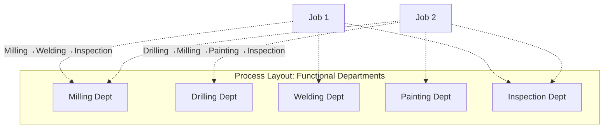
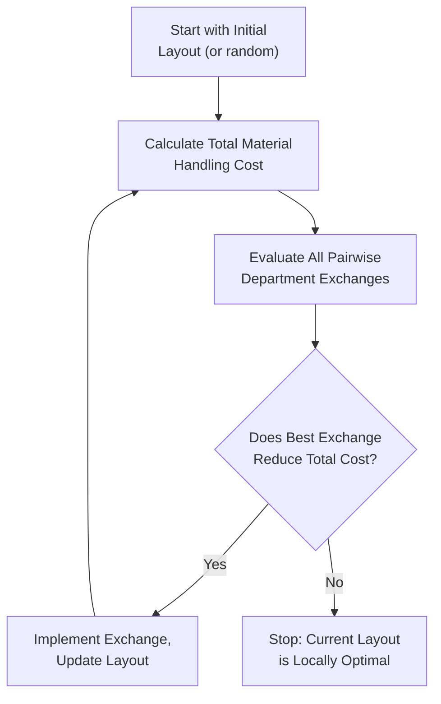

## Process (Functional) Layout

### Definition and Core Concept

A process layout (also called a functional layout) groups similar equipment, machines, or activities together by the function they perform, rather than by the sequence in which a specific product is produced. Departments or work centers are organized functionally — all milling machines in one area, all welding stations in another, all inspection stations in a third — and materials/jobs move between these functional departments in whatever sequence their specific processing requirements dictate.

This layout type is the standard choice for **job shop** and **low-volume, high-variety** production environments, where different products or customer orders require different processing sequences and cannot be efficiently accommodated by a fixed, product-specific flow (as used in product/line layouts).

### Characteristic Environments

Process layouts are typically found in:

- **Job shops**: Custom or made-to-order manufacturing (machine shops, print shops, custom fabrication)
- **Hospitals**: Functional departments (radiology, surgery, laboratory, pharmacy) serve patients with widely varying care paths
- **Universities**: Functional departments (registrar, library, various academic departments) serve students following different individualized paths
- **Batch processing operations**: Where product mix changes frequently and volume per product is too low to justify dedicated line layouts

### Key Design Characteristics

| Characteristic | Description |
| --- | --- |
| Equipment grouping | By function/process type, not by product sequence |
| Flow pattern | Variable, jumbled — different jobs follow different paths |
| Volume per product | Low to moderate |
| Product variety | High |
| Equipment | General-purpose, flexible |
| Labor | Skilled, versatile workers capable of handling varied tasks |
| Material handling | Variable-path, often requiring flexible handling equipment (forklifts, carts) rather than fixed conveyors |
| Setup/changeover | Frequent, since equipment serves multiple different jobs |

### Advantages

- **High flexibility**: Readily accommodates a wide variety of products and custom orders without requiring physical reconfiguration of the facility.
- **Resilience to equipment breakdown**: Since multiple similar machines typically exist within a functional department, the failure of one machine does not halt the entire operation — work can often be rerouted to another machine in the same department.
- **Lower capital risk**: General-purpose equipment usable across many different jobs/products reduces the risk of costly, product-specific dedicated equipment becoming obsolete if demand for a particular product declines.
- **Motivating work for skilled employees**: Workers often perform a broader range of tasks and exercise more judgment/skill than in highly repetitive line-layout roles, which can support higher job satisfaction and skill development.
- **Supports high product variety and customization**: Well suited to environments where no single product justifies dedicated, sequence-optimized equipment.

### Disadvantages

- **Higher material handling cost and complexity**: Because jobs follow variable paths between distant functional departments, transportation distance and handling time/cost are typically much higher than in a product/line layout.
- **Lower throughput efficiency**: The variable routing and frequent queuing at each functional department (as jobs wait for available equipment/operators) typically result in longer total production/cycle time and higher work-in-process inventory than line layouts.
- **More complex production planning and scheduling**: Routing and sequencing decisions must be made for each individual job, requiring more sophisticated scheduling systems (see related topics on job sequencing) compared to the fixed flow of a line layout.
- **Higher space requirements**: Aisles and buffer space between functional departments to accommodate variable material flow paths typically require more total floor space than the compact, sequential flow of a line layout.
- **More difficult to balance workload**: Uneven job routing patterns can create bottlenecks at popular functional departments while other departments sit underutilized, requiring ongoing capacity/scheduling management.

### Core Design Objective: Minimizing Material Handling Cost

The central quantitative design problem in process layout planning is determining the **relative placement of functional departments** to minimize total material handling cost (or distance-weighted flow) across the facility, since departments with high interdepartmental flow volume should be placed close together, while departments with little or no flow between them can be placed farther apart without material handling cost penalty.

$$\text{Total Material Handling Cost} = \sum_{i=1}^{n} \sum_{j=1}^{n} f_{ij} \times d_{ij} \times c_{ij}$$

Where $f_{ij}$ is the flow volume (trips, loads, or units) between department $i$ and department $j$, $d_{ij}$ is the distance between them, and $c_{ij}$ is the cost per unit distance per unit flow between them (often simplified to a constant if handling cost per distance is uniform across the facility).

### From-To Chart (Flow Volume Matrix)

The first step in process layout design is constructing a **from-to chart**, documenting the flow volume (number of loads, trips, or units moved) between each pair of departments over a representative planning period.

**Example From-To Chart** (number of loads moved per week between five departments):

| From \ To | A (Milling) | B (Drilling) | C (Welding) | D (Painting) | E (Inspection) |
| --- | --- | --- | --- | --- | --- |
| A (Milling) | — | 50 | 30 | 0 | 10 |
| B (Drilling) | 20 | — | 40 | 0 | 15 |
| C (Welding) | 0 | 0 | — | 60 | 5 |
| D (Painting) | 0 | 0 | 0 | — | 70 |
| E (Inspection) | 5 | 0 | 0 | 0 | — |

This matrix reveals that Welding→Painting (60 loads) and Painting→Inspection (70 loads) are the highest-volume flows, indicating these department pairs should be prioritized for close physical placement to minimize total material handling distance.

### Systematic Layout Planning (SLP) and Relationship Charts

Where flow volume data is unavailable or where **qualitative** relationship factors matter alongside quantitative flow (e.g., safety requirements, noise/vibration incompatibility, shared personnel or equipment needs), **Systematic Layout Planning (SLP)**, developed by Richard Muther, uses a **relationship chart** (or "REL chart") to capture the desired closeness rating between each pair of departments using a standardized letter code:

| Code | Closeness Rating |
| --- | --- |
| A | Absolutely necessary |
| E | Especially important |
| I | Important |
| O | Ordinary closeness okay |
| U | Unimportant |
| X | Undesirable (should not be adjacent) |

<svg xmlns="http://www.w3.org/2000/svg" viewBox="0 0 420 420">
<text x="210" y="24" font-size="15" text-anchor="middle" font-weight="bold" fill="#222">Relationship Chart (svg_diagram)</text>
<polygon points="210,50 250,80 210,110 170,80" fill="none" stroke="#333" />
<text x="210" y="84" font-size="11" text-anchor="middle">Milling</text>
<polygon points="330,130 370,160 330,190 290,160" fill="none" stroke="#333" />
<text x="330" y="164" font-size="11" text-anchor="middle">Drilling</text>
<polygon points="210,210 250,240 210,270 170,240" fill="none" stroke="#333" />
<text x="210" y="244" font-size="11" text-anchor="middle">Welding</text>
<polygon points="90,130 130,160 90,190 50,160" fill="none" stroke="#333" />
<text x="90" y="164" font-size="11" text-anchor="middle">Painting</text>
<polygon points="210,330 250,360 210,390 170,360" fill="none" stroke="#333" />
<text x="210" y="364" font-size="11" text-anchor="middle">Inspection</text>
<line x1="222" y1="98" x2="318" y2="148" stroke="#16a34a" stroke-width="3" />
<text x="280" y="112" font-size="12" fill="#16a34a" font-weight="bold">A</text>
<line x1="198" y1="98" x2="102" y2="148" stroke="#f59e0b" stroke-width="2" />
<text x="140" y="112" font-size="12" fill="#f59e0b" font-weight="bold">O</text>
<line x1="322" y1="178" x2="222" y2="222" stroke="#dc2626" stroke-width="3" />
<text x="290" y="215" font-size="12" fill="#dc2626" font-weight="bold">X</text>
<line x1="210" y1="270" x2="210" y2="330" stroke="#16a34a" stroke-width="3" />
<text x="220" y="300" font-size="12" fill="#16a34a" font-weight="bold">E</text>
</svg>

### CRAFT and Computer-Aided Layout Algorithms

For larger, more complex process layout problems (many departments, many flow relationships), manual trial-and-error placement becomes impractical. **CRAFT (Computerized Relative Allocation of Facilities Technique)** is a classic heuristic algorithm that starts from an initial layout and iteratively evaluates pairwise department exchanges, adopting any swap that reduces total material handling cost, continuing until no further improving swap can be found (a local-search/improvement heuristic, not a guaranteed global optimum).

[Inference: CRAFT and similar heuristics find a locally optimal solution relative to the starting configuration, not a guaranteed globally optimal layout — different starting layouts can converge to different local optima, so practitioners typically run the heuristic from multiple starting configurations for robustness.]

### Worked Example: Simple Two-Department Swap Evaluation

Using the from-to chart above, suppose an initial layout places departments in a line: A-B-C-D-E, with adjacent departments 1 distance unit apart, and non-adjacent departments' distance equal to the number of positions between them (e.g., A to C = 2 units, A to D = 3 units).

**Initial layout distances**: A-B=1, A-C=2, A-D=3, A-E=4, B-C=1, B-D=2, B-E=3, C-D=1, C-E=2, D-E=1

**Initial total cost** (using flow × distance, summing both directions per pair):

$$\text{Cost} = (50+20)(1) + (30+0)(2) + (0+0)(3) + (10+5)(4) + (40+0)(1) + (0+0)(2) + (15+0)(3) + (60+0)(1) + (5+0)(2) + (70+0)(1)$$

$$= 70 + 60 + 0 + 60 + 40 + 0 + 45 + 60 + 10 + 70 = 415$$

Testing a swap — e.g., exchanging the positions of B and D (given B-C and C-D are both high-flow, but D-E is also high-flow, so moving D away from E may or may not help) — would require recalculating total cost under the new arrangement and comparing to 415; if lower, the swap is adopted. This illustrates the mechanical logic of the CRAFT-style pairwise exchange evaluation, though real applications with more departments require software rather than manual calculation.

### Hybrid and Cellular Alternatives

Pure process layouts are frequently combined with elements of product/line layout thinking to capture some flow-efficiency benefits without sacrificing all flexibility — most notably through **cellular manufacturing** (grouping dissimilar machines into a "cell" dedicated to a family of similar parts/products, combining process-layout flexibility with line-layout flow efficiency for that specific part family) and **group technology** (classifying parts into families based on processing similarity to enable this cellular grouping). These hybrid approaches are covered in depth as distinct layout types.

### Key Points

- Process (functional) layout groups equipment/departments by function rather than by product-specific sequence, suited to low-volume, high-variety, job-shop-style operations.
- The central design objective is minimizing total material-handling cost by placing high-flow department pairs close together, typically informed by a from-to chart of flow volumes.
- Systematic Layout Planning (SLP) with qualitative relationship charts (A-E-I-O-U-X ratings) complements quantitative flow analysis when non-flow factors (safety, noise, shared resources) matter.
- CRAFT and similar heuristic algorithms provide computer-aided layout improvement for complex, many-department problems, though they yield locally rather than globally optimal solutions.
- Process layouts trade lower material-handling efficiency and higher work-in-process for greater flexibility, equipment-failure resilience, and lower product-specific capital risk compared to product/line layouts.

### Related Topics / Next Steps

- Product (line) layout
- Cellular manufacturing and group technology
- Systematic Layout Planning (SLP) and relationship charts
- CRAFT and computer-aided facility layout algorithms
- Facility layout evaluation metrics (material handling cost, space utilization)
- Job shop scheduling and sequencing
- Fixed-position layout