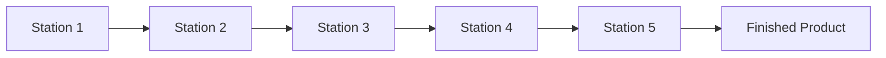
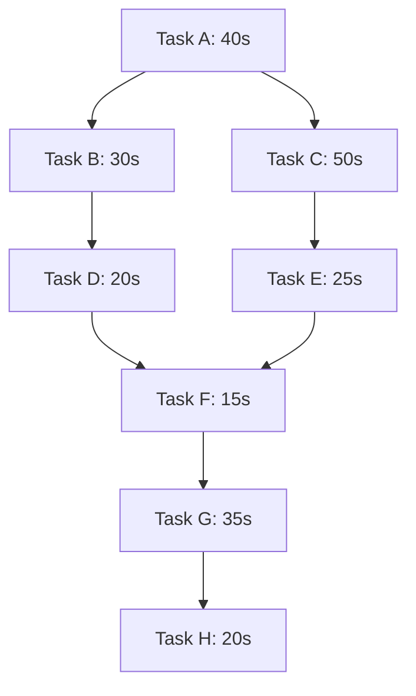
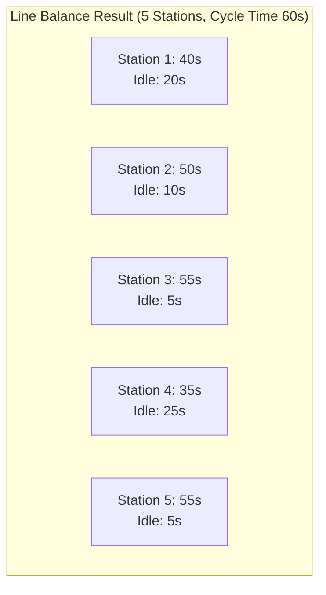

## Product (Line) Layout and Line Balancing

### Definition and Core Concept

A product layout (also called a line layout or flow-shop layout) arranges equipment and workstations in the sequence required by the manufacturing/assembly process for a specific product or family of similar products. Material flows in a linear, predetermined path from one workstation to the next, with each station performing a specific subset of the total work content. This layout is the standard choice for **high-volume, low-variety, standardized production** — the direct counterpart to the process (functional) layout used for low-volume, high-variety job-shop environments.

### Characteristic Environments

Product layouts are typically found in:

- **Automobile and appliance assembly lines**: Highly standardized, high-volume production with a fixed sequence of assembly operations.
- **Continuous-process industries**: Chemical processing, food/beverage bottling, oil refining — physical flow layouts dictated by process technology.
- **Fast-food and cafeteria service lines**: Standardized, sequential service delivery for a limited menu of similar options.

### Key Design Characteristics

| Characteristic | Description |
| --- | --- |
| Equipment arrangement | Sequential, matching product's process flow |
| Flow pattern | Fixed, linear, highly predictable |
| Volume per product | High |
| Product variety | Low (or a narrow family of similar variants) |
| Equipment | Specialized, often dedicated to a specific task |
| Labor | Often lower-skill, repetitive tasks (though automation reduces direct labor content in many modern lines) |
| Material handling | Fixed-path, often automated (conveyors, automated guided vehicles) |
| Setup/changeover | Minimal, since the line is dedicated to a narrow product range |

### Advantages

- **High throughput efficiency**: The fixed, sequential flow with minimal transport distance between consecutive operations produces much faster cycle times and higher output rates than process layouts for standardized products.
- **Low unit cost at high volume**: Specialized equipment and labor, combined with minimized material handling and work-in-process inventory, drive down per-unit cost — directly capturing economies of scale (see related topic).
- **Simplified production planning and control**: The fixed sequence and predictable flow greatly simplify scheduling relative to the variable-routing complexity of process layouts.
- **Lower work-in-process inventory**: Continuous, synchronized flow between stations minimizes queuing and buffer inventory compared to the batch-and-queue pattern typical of process layouts.
- **Simplified training**: Narrow, repetitive task scope at each station allows faster worker training compared to the broader skill requirements of process-layout jobs.

### Disadvantages

- **Low flexibility**: Difficult and costly to reconfigure for new products or significant design changes; the line is optimized for one specific product/process sequence.
- **High vulnerability to disruption**: Because stations are interdependent in a fixed sequence, a breakdown or slowdown at any single station can halt or bottleneck the entire line (see the bottleneck principle under capacity measurement).
- **High capital investment**: Specialized, often dedicated equipment represents a larger upfront capital commitment with limited resale/repurposing value if the product is discontinued.
- **Monotonous work**: Narrow, highly repetitive task assignments can reduce worker motivation and job satisfaction, and may increase repetitive-motion injury risk if ergonomics are not carefully managed.
- **Requires sufficient, stable volume to justify investment**: Only economically viable when expected volume is high and stable enough to amortize the specialized equipment investment (directly connecting to the crossover-volume logic in break-even analysis for capacity/process alternatives).

### Line Balancing: Core Concept

**Line balancing** is the process of assigning tasks to workstations along a product layout such that the workload is distributed as evenly as possible across stations, minimizing idle time while meeting the required output rate. Because line output is constrained by its slowest station (the bottleneck station), line balancing seeks to minimize the difference between each station's assigned work time and the line's target cycle time.

### Key Line Balancing Terminology and Formulas

**Cycle Time**: The maximum time allowed at each workstation to meet the required production rate, determined by the desired output rate:

$$\text{Cycle Time} (C) = \frac{\text{Production Time Available per Period}}{\text{Required Output per Period}}$$

**Theoretical Minimum Number of Stations**:

$$N_{min} = \frac{\sum t_i}{C}$$

Where $\sum t_i$ is the sum of all individual task times required to complete one unit, and $C$ is the cycle time. This value is typically rounded *up* to the next whole number, since a fractional station is not physically realizable.

**Efficiency of the Balanced Line**:

$$\text{Line Efficiency} = \frac{\sum t_i}{N_{actual} \times C} \times 100\%$$

Where $N_{actual}$ is the actual number of stations used (which may exceed $N_{min}$ due to precedence constraints preventing a perfectly even task assignment).

**Balance Delay** (the complement of efficiency, representing wasted/idle capacity):

$$\text{Balance Delay} = 100\% - \text{Line Efficiency}$$

### Worked Example: Line Balancing Procedure

A product requires 8 tasks with the following times and precedence relationships (each task must follow its listed predecessor(s)):

| Task | Time (seconds) | Immediate Predecessor(s) |
| --- | --- | --- |
| A | 40 | — |
| B | 30 | A |
| C | 50 | A |
| D | 20 | B |
| E | 25 | C |
| F | 15 | D, E |
| G | 35 | F |
| H | 20 | G |

**Total task time**: $\sum t_i = 40+30+50+20+25+15+35+20 = 235$ seconds

**Required output**: Assume the firm needs 60 units per 8-hour shift (28,800 seconds available).

**Step 1 — Calculate cycle time:**

$$C = \frac{28{,}800}{60} = 480 \text{ seconds per unit}$$

Note: This cycle time is very large relative to total task time for this small illustrative example — in practice, cycle time and task time must be on comparable scales for line balancing to be meaningful; a more realistic parallel example uses a much shorter cycle time. Recalculating with a target output that produces a meaningful balancing problem: assume required output is 120 units per 8-hour shift.

$$C = \frac{28{,}800}{120} = 240 \text{ seconds per unit}$$

Still large relative to task times; assume instead a required cycle time of 60 seconds (derived from a target output rate) to illustrate the balancing procedure meaningfully.

**Step 2 — Calculate theoretical minimum number of stations:**

$$N_{min} = \frac{235}{60} = 3.92 \rightarrow 4 \text{ stations (rounded up)}$$

**Step 3 — Assign tasks to stations** using a heuristic rule — commonly **"longest task time first"** among eligible tasks (tasks whose predecessors are already assigned), assigning to the current station until adding the next eligible task would exceed the cycle time, then moving to the next station.

Applying longest-task-time-first assignment with $C = 60$ seconds:

- **Station 1**: Task A (40s, only eligible task) → cumulative 40s. Next eligible: B(30), C(50). Adding either exceeds 60s (40+30=70, 40+50=90). Station 1 closes at 40s, idle time = 20s.
- **Station 2**: Eligible: B(30), C(50). Longest first: C(50) → cumulative 50s. Next eligible: B(30). Adding B exceeds 60 (50+30=80). Station 2 closes at 50s, idle time = 10s.
- **Station 3**: Eligible: B(30), E(25, since C is done). Longest first: B(30) → cumulative 30s. Next eligible: D(20, since B done), E(25). Longest: E(25) → cumulative 55s. Next eligible: D(20). Adding exceeds 60 (55+20=75). Station 3 closes at 55s, idle time = 5s.
- **Station 4**: Eligible: D(20). Assign D → cumulative 20s. Next eligible: F(15, since D and E both done). Add F → cumulative 35s. Next eligible: G(35). Adding exceeds 60 (35+35=70). Station 4 closes at 35s, idle time = 25s.
- **Station 5**: Eligible: G(35) → cumulative 35s. Next eligible: H(20). Add H → cumulative 55s. Station 5 closes at 55s, idle time = 5s.

**Result**: 5 stations required (exceeding the theoretical minimum of 4, due to precedence constraints preventing a perfectly even split).

| Station | Tasks Assigned | Station Time | Idle Time |
| --- | --- | --- | --- |
| 1 | A | 40s | 20s |
| 2 | C | 50s | 10s |
| 3 | B, E | 55s | 5s |
| 4 | D, F | 35s | 25s |
| 5 | G, H | 55s | 5s |

**Step 4 — Calculate line efficiency:**

$$\text{Line Efficiency} = \frac{235}{5 \times 60} \times 100\% = \frac{235}{300} \times 100\% = 78.3\%$$

$$\text{Balance Delay} = 100\% - 78.3\% = 21.7\%$$

This 21.7% balance delay represents idle capacity across the line resulting from the precedence constraints preventing a perfectly even task distribution — a normal and expected outcome, though alternative heuristics (e.g., "most followers" ranking, or exact optimization for small problems) may sometimes achieve a marginally better balance than the simple longest-task-time-first heuristic used here.

### Line Balancing Heuristics

Because finding the mathematically optimal line balance is a computationally complex combinatorial problem for realistic numbers of tasks (an NP-hard class of problem in general formulations), practical line balancing typically relies on heuristic assignment rules rather than guaranteed-optimal algorithms:

- **Longest Task Time First**: Among eligible tasks, assign the one with the longest duration first (used in the worked example above) — tends to front-load larger, harder-to-place tasks earlier when more station capacity remains.
- **Most Followers Rule (Ranked Positional Weight)**: Prioritizes tasks with the most successor tasks depending on them (or the highest sum of positional weight — the task's own time plus the time of all its successors) — tends to prioritize tasks that "unlock" the most subsequent work.
- **Shortest Task Time First**: Occasionally used when minimizing the number of very large idle-time gaps is prioritized over other considerations.

[Inference: no single heuristic guarantees the optimal (minimum-station, maximum-efficiency) solution for all precedence network structures; different heuristics can produce different results on the same problem, and practitioners often compare results from multiple heuristics or use exact optimization methods for smaller, critical lines.]

### Mixed-Model Line Balancing

Many modern production lines must accommodate multiple product variants on the same line (mixed-model lines) rather than a single, fully standardized product — increasing balancing complexity since different variants may have different task times or even different task sets. This typically requires calculating a weighted-average task time across the product mix (based on expected relative production volume of each variant) before applying the standard balancing procedure, and may require additional buffer capacity at stations with the highest task-time variability across variants.

### Line Balancing and Capacity Planning Interaction

Line balancing directly determines a product layout's effective capacity: the achievable output rate is governed by the cycle time of the slowest (bottleneck) station, reinforcing the bottleneck principle central to capacity measurement (see related topic: Capacity measurement and utilization metrics). Adjusting the target cycle time (by changing required output volume) requires *rebalancing* the line — reassigning tasks to stations — since a faster required cycle time typically requires more stations (to keep each station's task time within the shorter cycle time), while a slower required cycle time may allow consolidation to fewer stations, trading off labor cost against equipment/space efficiency.

$$\text{Maximum Line Output Rate} = \frac{\text{Available Time}}{\text{Cycle Time (bottleneck station time)}}$$

### Key Points

- Product (line) layout arranges workstations sequentially to match a specific product's process flow, suited to high-volume, low-variety, standardized production.
- Line balancing assigns tasks to stations to minimize idle time while respecting precedence constraints and meeting a target cycle time, with cycle time derived from required output rate.
- Theoretical minimum stations is $\sum t_i / C$ (rounded up); actual stations required often exceed this minimum due to precedence constraints.
- Line efficiency is calculated as $\sum t_i / (N_{actual} \times C)$, with balance delay as its complement, quantifying the idle capacity resulting from imperfect balance.
- Heuristic assignment rules (longest task time first, most followers/ranked positional weight) are standard practical approaches, since finding a guaranteed-optimal balance is computationally complex for realistic problem sizes.
- Line output capacity is governed by the bottleneck (slowest) station's cycle time, directly linking line balancing to the broader bottleneck principle in capacity management.

### Related Topics / Next Steps

- Process (functional) layout
- Capacity measurement and utilization metrics (bottleneck principle)
- Cellular manufacturing and group technology
- Economies and diseconomies of scale
- Break-even analysis for capacity decisions (line vs. process layout crossover)
- Job shop scheduling and sequencing
- Mixed-model production scheduling