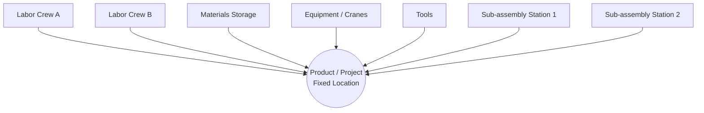

## Fixed-Position Layout

### Definition and Core Concept

A fixed-position layout is a facility arrangement in which the product remains stationary throughout the production or assembly process, while workers, materials, equipment, and tools are brought to the product's location. This is the inverse of process and product layouts, where the product moves through a sequence of stationary workstations.

This layout is used when the product is too large, too heavy, too fragile, or too complex to move economically or safely. Examples include shipbuilding, aircraft assembly, construction of buildings and bridges, locomotive manufacturing, and large-scale civil engineering projects.

### When Fixed-Position Layout Is Appropriate

**Key Points**

- Product size or weight makes movement impractical (ships, aircraft, turbines, dams)
- Product fragility makes movement risky (delicate assemblies, prototypes)
- Low production volume, often one-of-a-kind or custom projects (custom yachts, satellites)
- Long production cycle times, often spanning months or years
- Project-based work with unique specifications per unit

### Characteristics

- **Product**: Stays in one location from start to finish
- **Resources**: Labor, machinery, tools, and materials converge on the product
- **Workforce**: Often organized into specialized crews or trades (electricians, welders, riveters) who move in and out of the project at different phases
- **Scheduling**: Highly dependent on project management techniques rather than line-balancing techniques
- **Equipment**: Frequently mobile or temporary (cranes, scaffolding, portable welding units) rather than fixed-in-place machinery
- **Space utilization**: Requires substantial staging area around the product for materials, sub-assemblies, and equipment access

### Diagram: Fixed-Position Layout Concept

### Comparison with Other Layout Types

| Attribute | Fixed-Position | Process (Functional) | Product (Line) |
| --- | --- | --- | --- |
| Product movement | Stationary | Moves between departments | Moves along a line |
| Resource movement | Moves to product | Product moves to resources | Product moves to resources |
| Volume | Very low, often single-unit | Low to medium, varied | High, standardized |
| Flexibility | Very high | High | Low |
| Equipment | Mobile, general-purpose | General-purpose, grouped by function | Specialized, sequential |
| Typical scheduling tool | Network/project scheduling (CPM/PERT) | Job routing, queuing rules | Line balancing |
| Example industries | Shipbuilding, construction, aerospace | Hospitals, machine shops | Automotive assembly |

### Advantages

- High flexibility to accommodate design changes, since the product itself is not tied to a rigid material-flow sequence
- Enables customization; each unit can differ substantially from the last
- Minimizes material handling of the (typically massive) end product
- Reduces risk of product damage from transport between stations
- Team continuity is possible, since crews can follow a project through multiple phases, supporting accountability

### Disadvantages

- Low equipment utilization, since machinery is often idle while being relocated or waiting for the appropriate project phase
- High labor skill requirements and often higher labor costs, since generalized or highly skilled crews are needed rather than specialized line operators
- Difficult to achieve economies of scale; each unit may require a large share of near-custom engineering and coordination
- Space and congestion issues at the site, since multiple crews and equipment sets may need simultaneous access to the same location
- Complex scheduling and coordination, as delays in one trade or sub-assembly often cascade into downstream work
- Higher unit costs relative to product layout for equivalent volumes [Inference — cost outcomes depend on labor market, project scale, and specific process context]

### Scheduling and Project Management Tools

Because fixed-position projects are typically large, unique, and long-duration, they are managed with project scheduling techniques rather than assembly-line balancing:

- **Critical Path Method (CPM)**: Identifies the sequence of dependent tasks that determines the minimum project duration
- **Program Evaluation and Review Technique (PERT)**: Uses probabilistic time estimates for tasks with uncertain durations
- **Gantt charts**: Visual timeline of tasks, used for tracking progress against schedule
- **Resource leveling**: Ensures labor and equipment are not overcommitted across concurrent project phases

**Example**

For a fixed-position layout building a custom yacht:

1. Hull fabrication crew occupies the site first (weeks 1–8)
2. Engine and propulsion crew begins installation once the hull frame is ready (weeks 6–14, overlapping)
3. Electrical crew begins wiring runs once compartments are accessible (weeks 10–20)
4. Interior fit-out crew works after major systems are installed (weeks 18–28)
5. Finishing and quality inspection crew closes out the project (weeks 26–30)

Each crew's start is dependent on a milestone from the preceding crew, illustrating why CPM/PERT-based scheduling, not line balancing, governs this environment.

### Layout Planning Considerations

- **Staging zones**: Areas for raw material and sub-assembly storage must be planned around the product without obstructing crew access
- **Access paths**: Must accommodate the movement of heavy equipment (cranes, forklifts, hoists) to and around the product
- **Sequencing of trades**: Layout must allow multiple trades to work concurrently in different zones of the same product without interference
- **Safety zones**: Overlapping crews and heavy equipment increase safety coordination requirements
- **Sub-assembly (satellite) layout**: A hybrid technique where sub-components are built in nearby process or product layouts, then brought to the fixed-position site for final integration; this reduces congestion and idle-crane time at the main site

### Illustrative Layout Sketch (SVG)

<svg viewBox="0 0 640 380" xmlns="[http://www.w3.org/2000/svg">](http://www.w3.org/2000/svg%22%3E)

<text x="320" y="24" font-size="16" text-anchor="middle" font-family="sans-serif" font-weight="bold">Fixed-Position Layout — Shipbuilding Site (svg_diagram)</text>

<rect x="220" y="140" width="200" height="100" fill="#cfe8ff" stroke="#2b6cb0" stroke-width="2"/>

<text x="320" y="195" text-anchor="middle" font-family="sans-serif" font-size="13" font-weight="bold">Ship Hull</text>

<text x="320" y="210" text-anchor="middle" font-family="sans-serif" font-size="11">(fixed location)</text>

<rect x="40" y="60" width="120" height="60" fill="#fde68a" stroke="#b45309" stroke-width="1.5"/>

<text x="100" y="95" text-anchor="middle" font-family="sans-serif" font-size="11">Steel & Materials Storage</text>

<rect x="480" y="60" width="120" height="60" fill="#fde68a" stroke="#b45309" stroke-width="1.5"/>

<text x="540" y="95" text-anchor="middle" font-family="sans-serif" font-size="11">Engine / Propulsion Staging</text>

<rect x="40" y="270" width="120" height="60" fill="#bbf7d0" stroke="#15803d" stroke-width="1.5"/>

<text x="100" y="305" text-anchor="middle" font-family="sans-serif" font-size="11">Welding Crew Zone</text>

<rect x="480" y="270" width="120" height="60" fill="#bbf7d0" stroke="#15803d" stroke-width="1.5"/>

<text x="540" y="305" text-anchor="middle" font-family="sans-serif" font-size="11">Electrical Crew Zone</text>

<rect x="270" y="10" width="100" height="34" fill="#fecaca" stroke="#b91c1c" stroke-width="1.5"/>

<text x="320" y="32" text-anchor="middle" font-family="sans-serif" font-size="11">Gantry Crane</text>

<line x1="160" y1="90" x2="220" y2="150" stroke="#333" stroke-width="1.5" marker-end="url(#arrow)"/>

<line x1="480" y1="90" x2="420" y2="150" stroke="#333" stroke-width="1.5" marker-end="url(#arrow)"/>

<line x1="160" y1="300" x2="220" y2="230" stroke="#333" stroke-width="1.5" marker-end="url(#arrow)"/>

<line x1="480" y1="300" x2="420" y2="230" stroke="#333" stroke-width="1.5" marker-end="url(#arrow)"/>

<line x1="320" y1="44" x2="320" y2="140" stroke="#333" stroke-width="1.5" marker-end="url(#arrow)"/>

<defs>

<marker id="arrow" markerWidth="8" markerHeight="8" refX="6" refY="3" orient="auto">

<path d="M0,0 L0,6 L6,3 z" fill="#333"/>

</marker>

</defs>

</svg>

### Cost Structure Implications

- **Fixed costs**: Relatively lower for facility infrastructure since generalized, mobile equipment is used rather than dedicated production lines
- **Variable costs**: Relatively higher per unit due to skilled labor intensity, coordination overhead, and lower resource utilization rates
- This cost structure makes fixed-position layout economically justified only at low volumes; as volume or standardization increases, a shift toward product or cellular layout becomes more cost-effective [Inference — the crossover point depends on specific labor rates, project complexity, and capital costs]

### Related Topics

- Process (functional) layout
- Product (line) layout
- Cellular / group technology layout
- Line balancing techniques
- Critical Path Method (CPM) and PERT scheduling
- Project management in operations (WBS, resource leveling)
- Facility layout selection criteria and quantitative layout analysis (e.g., load-distance model)
- Hybrid layouts and satellite/sub-assembly area planning