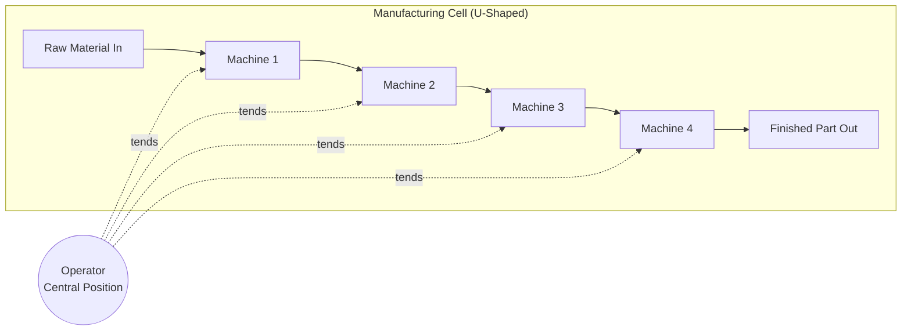

## Cellular Layout and Group Technology

### Definition and Core Concept

Cellular layout is a facility arrangement in which dissimilar machines or workstations are grouped into "cells" that process families of parts or products with similar processing requirements, shapes, or routings. It is a hybrid layout that combines the flow efficiency of product layouts with the flexibility of process layouts.

Group technology (GT) is the underlying philosophy and analytical methodology used to identify these part families and the associated machine groupings, based on shared design attributes (shape, size, material) or manufacturing attributes (routing, tooling, processing sequence). Cellular layout is essentially the physical/organizational implementation of group technology principles on the shop floor.

### Relationship Between GT and Cellular Layout

- **Group Technology (GT)**: The classification and coding methodology used to analyze parts and identify natural families based on similarities
- **Cellular Manufacturing**: The application of GT output to physically or logically reorganize equipment into dedicated cells
- GT can exist without full physical cellular reorganization (e.g., virtual cells with shared scheduling), but cellular layout is rarely implemented without GT-based analysis

### Part Family Formation Methods

**Key Points**

- **Visual inspection**: Manual grouping of parts by physical similarity; fastest but least rigorous
- **Classification and coding systems**: Parts are assigned alphanumeric codes describing design and/or manufacturing attributes (e.g., Opitz classification system)
- **Production flow analysis (PFA)**: Uses existing routing data (route sheets) rather than part design data to identify families based on shared machine sequences

### Classification and Coding Systems

Coding systems assign a structured code to each part describing attributes such as:

- Basic shape (rotational vs. non-rotational)
- Dimensions (length-to-diameter ratio, overall size)
- Material type
- Precision/tolerance requirements
- Auxiliary features (holes, threads, gear teeth)

**Example — Simplified Opitz-style code structure:**

| Digit Position | Attribute Represented | Example Value |
| --- | --- | --- |
| 1 | Part class (rotational/non-rotational) | 1 = rotational |
| 2 | External shape | 3 = stepped, one end |
| 3 | Internal shape | 2 = stepped bore |
| 4 | Plane surface machining | 0 = none |
| 5 | Auxiliary holes/gear teeth | 4 = axial holes |

A code such as `13204` would allow parts across the entire plant to be sorted and grouped by shared characteristics even if they were designed independently and by different engineers.

### Production Flow Analysis (PFA)

PFA groups parts based on actual routing similarity rather than design similarity. This is done through a **machine-part incidence matrix**: rows represent machines, columns represent parts, and a 1 indicates that a part visits that machine.

**Example incidence matrix (before clustering):**

|  | P1 | P2 | P3 | P4 | P5 |
| --- | --- | --- | --- | --- | --- |
| M1 | 1 | 0 | 1 | 0 | 1 |
| M2 | 0 | 1 | 0 | 1 | 0 |
| M3 | 1 | 0 | 1 | 0 | 1 |
| M4 | 0 | 1 | 0 | 1 | 0 |

**After clustering (rows/columns reordered):**

|  | P1 | P3 | P5 | P2 | P4 |
| --- | --- | --- | --- | --- | --- |
| M1 | 1 | 1 | 1 | 0 | 0 |
| M3 | 1 | 1 | 1 | 0 | 0 |
| M2 | 0 | 0 | 0 | 1 | 1 |
| M4 | 0 | 0 | 0 | 1 | 1 |

This reveals two natural cells: Cell A (M1, M3 processing P1, P3, P5) and Cell B (M2, M4 processing P2, P4). Algorithms commonly used for this clustering include Rank Order Clustering (ROC), Direct Clustering Algorithm (DCA), and similarity coefficient methods.

### Physical Cell Configurations

- **U-shaped cells**: Most common configuration; allows operators to move between the entry and exit points quickly and supports multi-machine tending, since input and output are close together
- **Straight-line cells**: Simple flow but less efficient operator movement
- **Loop or circular cells**: Support multiple products with slightly different routings within the same cell
- **L-shaped cells**: Compromise between space constraints and flow efficiency

### Diagram: U-Shaped Cell Layout

### SVG Illustration: U-Cell Physical Arrangement

<svg xmlns="http://www.w3.org/2000/svg" viewBox="0 0 500 320">
<text x="250" y="24" font-size="16" text-anchor="middle" font-family="sans-serif" font-weight="bold">U-Shaped Manufacturing Cell (svg_diagram)</text>
<rect x="80" y="60" width="60" height="50" fill="#cfe8ff" stroke="#2b6cb0" stroke-width="1.5" />
<text x="110" y="90" text-anchor="middle" font-family="sans-serif" font-size="10">M1</text>
<rect x="80" y="140" width="60" height="50" fill="#cfe8ff" stroke="#2b6cb0" stroke-width="1.5" />
<text x="110" y="170" text-anchor="middle" font-family="sans-serif" font-size="10">M2</text>
<rect x="220" y="200" width="60" height="50" fill="#cfe8ff" stroke="#2b6cb0" stroke-width="1.5" />
<text x="250" y="230" text-anchor="middle" font-family="sans-serif" font-size="10">M3</text>
<rect x="360" y="140" width="60" height="50" fill="#cfe8ff" stroke="#2b6cb0" stroke-width="1.5" />
<text x="390" y="170" text-anchor="middle" font-family="sans-serif" font-size="10">M4</text>
<rect x="360" y="60" width="60" height="50" fill="#cfe8ff" stroke="#2b6cb0" stroke-width="1.5" />
<text x="390" y="90" text-anchor="middle" font-family="sans-serif" font-size="10">M5 (Out)</text>
<circle cx="250" cy="120" r="22" fill="#fde68a" stroke="#b45309" stroke-width="1.5" />
<text x="250" y="124" text-anchor="middle" font-family="sans-serif" font-size="10">Operator</text>
<line x1="110" y1="110" x2="110" y2="140" stroke="#333" stroke-width="1.5" marker-end="url(#a2)" />
<line x1="140" y1="165" x2="220" y2="220" stroke="#333" stroke-width="1.5" marker-end="url(#a2)" />
<line x1="280" y1="220" x2="360" y2="165" stroke="#333" stroke-width="1.5" marker-end="url(#a2)" />
<line x1="390" y1="140" x2="390" y2="110" stroke="#333" stroke-width="1.5" marker-end="url(#a2)" />

<text x="40" y="90" font-family="sans-serif" font-size="10">In →</text>

</svg>

### Advantages of Cellular Layout

- Reduced material handling distance and time, since machines for a part family are physically adjacent
- Reduced setup times, since similar parts often share tooling and fixture requirements, reducing changeover between jobs
- Shorter throughput/cycle times and reduced work-in-process (WIP) inventory
- Improved quality and accountability, since a single cell team owns the full process for a part family
- Simplified scheduling and production control compared to process layouts, since routing is confined to one cell
- Improved employee ownership and cross-training, since cell workers typically operate multiple machines

### Disadvantages and Implementation Challenges

- Lower machine utilization than process layout if duplicate machines are needed across multiple cells (each cell may need its own drill press, for instance, rather than sharing one plant-wide)
- Higher capital cost due to potential equipment duplication
- Reduced routing flexibility; if a machine within a cell breaks down, the entire cell's flow can be disrupted, unlike a process layout where alternate machines elsewhere in the plant might substitute
- Requires significant upfront analysis effort (part family identification, incidence matrix clustering) and potential plant reconfiguration cost
- Demand or product mix changes can render part families and cell configurations obsolete, requiring re-analysis [Inference — the frequency of required re-analysis depends on the volatility of product mix in a given industry]

### Comparison of Cellular Layout with Other Layout Types

| Attribute | Cellular | Process (Functional) | Product (Line) |
| --- | --- | --- | --- |
| Machine grouping | By part family | By function/process type | By product sequence |
| Flexibility | Medium | High | Low |
| Setup time | Low (shared tooling) | High (frequent changeover) | Very low (dedicated) |
| WIP inventory | Low | High | Low |
| Material handling | Low | High | Low |
| Volume/variety fit | Medium volume, medium variety | Low volume, high variety | High volume, low variety |

### Virtual (Logical) Cells

An alternative to physically relocating machines is a **virtual cell**, where machines remain in their original process-layout locations but are logically dedicated (via scheduling and information systems) to a part family for a given period. This avoids the capital expense of physical rearrangement while still gaining some scheduling and routing simplification benefits. [Inference — the degree of benefit realized from virtual cells versus physical cells is context-dependent and may vary by implementation]

### Cell Staffing Models

- **One-worker, multiple-machines (OWMM)**: A single operator tends several machines in the cell, common in U-shaped configurations
- **Cell teams**: Multiple cross-trained workers rotate through stations within the cell, supporting flexibility and reducing fatigue/monotony

### Related Topics

- Process (functional) layout
- Product (line) layout
- Fixed-position layout
- Facility layout selection and quantitative analysis (load-distance, from-to charts)
- Setup time reduction (SMED)
- Just-in-Time (JIT) and lean manufacturing
- Line balancing techniques
- Flexible manufacturing systems (FMS)