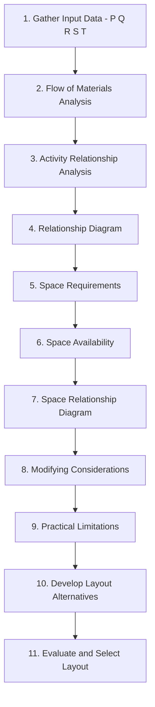

## Systematic Layout Planning

### Definition and Origin

Systematic Layout Planning (SLP) is a structured, step-by-step methodology developed by Richard Muther in the 1960s for designing or redesigning facility layouts. It provides a formalized framework for organizing departments, workstations, or activity areas based on the relationships and flows between them, rather than relying on ad hoc or intuitive arrangement decisions.

SLP is widely used because it is applicable across layout types (process, product, cellular, fixed-position) and across industries (manufacturing, warehousing, offices, hospitals).

### Core Inputs (The P-Q-R-S-T Framework)

SLP begins by gathering five categories of fundamental data, often referred to by Muther as the P-Q-R-S-T framework:

| Input | Description |
| --- | --- |
| **P** — Product | What is being produced or handled |
| **Q** — Quantity | Volume of each product/output |
| **R** — Routing | The sequence of operations/process steps |
| **S** — Supporting Services | Auxiliary activities (maintenance, storage, restrooms, offices) |
| **T** — Timing | When production occurs, scheduling constraints, urgency |

### The SLP Procedure — Overview



### Step 1: Flow of Materials Analysis

For layouts where material flow dominates (e.g., product or process layouts in manufacturing), SLP quantifies the flow intensity between departments. Common tools:

- **From-to chart**: A matrix showing the quantity or frequency of material moved between each pair of departments
- **Flow process chart**: Documents each step of the routing (operation, transport, inspection, delay, storage)

**Example From-To Chart (loads/day between departments):**

| From \ To | Dept A | Dept B | Dept C | Dept D |
| --- | --- | --- | --- | --- |
| Dept A | — | 50 | 10 | 0 |
| Dept B | 0 | — | 40 | 5 |
| Dept C | 0 | 0 | — | 60 |
| Dept D | 0 | 0 | 0 | — |

This data indicates that Dept C to Dept D has the highest flow (60 loads/day), suggesting these departments should be placed adjacently to minimize material handling distance.

### Step 2: Activity Relationship Analysis

For layouts where non-material factors matter (office layouts, hospitals, or service facilities), or as a complement to flow analysis in manufacturing, SLP uses the **Relationship Chart (REL Chart)**. Each pair of departments is assigned a closeness rating and a reason code.

**Closeness Rating Scale:**

| Code | Closeness | Meaning |
| --- | --- | --- |
| A | Absolutely necessary | Must be adjacent |
| E | Especially important | Strongly preferred adjacent |
| I | Important | Preferred adjacent |
| O | Ordinary closeness okay | No strong preference |
| U | Unimportant | Adjacency not relevant |
| X | Undesirable/Not close | Should be kept apart |

**Example Reason Codes:**

1. Shared personnel
2. Shared records/information flow
3. Shared equipment
4. Noise, dirt, or safety concerns
5. Convenience of workflow

**Example Relationship Chart Entry:**

| Pair | Closeness | Reason |
| --- | --- | --- |
| Receiving – Storage | A | 1 |
| Storage – Assembly | E | 1, 5 |
| Assembly – Paint Booth | X | 4 |
| Offices – Shop Floor | I | 2 |

### Step 3: Relationship Diagram

The relationship chart data is converted into a spatial diagram where departments are positioned based on their closeness ratings, using standardized line codes:

| Closeness | Line Representation |
| --- | --- |
| A | 4 straight lines |
| E | 3 straight lines |
| I | 2 straight lines |
| O | 1 straight line |
| U | No line |
| X | Wavy/zigzag line (or colored differently) |

```mermaid
graph LR
    Receiving ===|A| Storage
    Storage ===|E| Assembly
    Assembly -.X.- PaintBooth[Paint Booth]
    Offices ==|I| ShopFloor[Shop Floor]
    Storage --|O| Offices
```

### Step 4: Space Requirements and Availability

- **Space requirements**: Determined based on equipment footprint, staffing levels, material storage needs, aisle allowances, and safety clearances; often expressed per department in square feet/meters
- **Space availability**: Constrained by the actual building envelope, columns, ceiling heights, and structural limitations
- These two factors are reconciled to check feasibility before finalizing department sizes

### Step 5: Space Relationship Diagram

The relationship diagram (Step 3) is overlaid with actual space requirements (Step 4), producing a scaled, block-style layout showing each department as a properly sized block positioned according to its closeness relationships.

### Step 6: Modifying Considerations and Practical Limitations

Before finalizing alternatives, planners adjust the theoretical layout for real-world constraints:

**Key Points**

- Building shape and column placement
- Fire codes, safety regulations, and accessibility requirements (e.g., ADA compliance)
- Material handling equipment constraints (crane spans, conveyor paths)
- Utility placement (electrical, plumbing, HVAC)
- Future expansion plans
- Employee comfort, lighting, ventilation

### Step 7: Develop and Evaluate Layout Alternatives

Typically 2–4 layout alternatives are developed based on the space relationship diagram and constraints. These are evaluated using:

- **Qualitative evaluation**: Weighted factor comparison across criteria (flexibility, safety, cost, aesthetics)
- **Quantitative evaluation**: Total material handling cost or distance, calculated as:

$$TC = \sum_{i=1}^{n}\sum_{j=1}^{n} f_{ij} \cdot d_{ij} \cdot c_{ij}$$

Where $f_{ij}$ is the flow between departments $i$ and $j$, $d_{ij}$ is the distance between them, and $c_{ij}$ is the cost per unit distance per load.

**Example Weighted Factor Comparison:**

| Criterion | Weight | Layout Alt. 1 Score | Alt. 1 Weighted | Layout Alt. 2 Score | Alt. 2 Weighted |
| --- | --- | --- | --- | --- | --- |
| Material handling cost | 0.35 | 7 | 2.45 | 9 | 3.15 |
| Flexibility for future change | 0.25 | 8 | 2.00 | 6 | 1.50 |
| Employee safety | 0.20 | 9 | 1.80 | 8 | 1.60 |
| Space utilization | 0.20 | 6 | 1.20 | 8 | 1.60 |
| **Total** | 1.00 | — | **7.45** | — | **7.85** |

Based on this weighted scoring, Layout Alternative 2 would be selected due to its higher total score.

### SLP Applicability Across Layout Types

| Layout Type | Primary SLP Emphasis |
| --- | --- |
| Product layout | Heavy emphasis on flow analysis (from-to charts) |
| Process layout | Balanced flow and relationship chart analysis |
| Cellular layout | Flow analysis at the part-family level, informed by GT coding |
| Fixed-position layout | Relationship chart emphasis (crew/trade coordination, staging area proximity) |
| Office/service layout | Heavy emphasis on relationship chart (information flow, personnel interaction) |

### Advantages of SLP

- Provides a repeatable, documented methodology rather than relying on designer intuition alone
- Forces explicit consideration of both quantitative (flow) and qualitative (relationship) factors
- Facilitates stakeholder communication, since relationship charts and diagrams are easy to review with non-technical staff
- Applicable to greenfield (new facility) and brownfield (retrofit/reorganization) projects alike

### Limitations

- Time- and data-intensive, particularly the from-to chart and relationship chart development for large facilities
- Subjective judgment still required in assigning closeness ratings (A, E, I, O, U, X), which can introduce bias [Inference — the degree of subjectivity impact depends on the rigor of the data-gathering process and stakeholder consensus]
- Static snapshot approach; does not inherently account for future product mix or demand volatility unless explicitly built into modifying considerations
- Computerized layout algorithms (e.g., CRAFT, ALDEP, CORELAP) are often needed to handle the computational complexity of large from-to matrices, since manual iteration becomes impractical beyond a small number of departments

### Related Computerized Layout Tools

- **CRAFT (Computerized Relative Allocation of Facilities Technique)**: Improvement-type algorithm that starts from an existing layout and iteratively swaps department locations to reduce total transportation cost
- **CORELAP (Computerized Relationship Layout Planning)**: Construction-type algorithm that builds a layout from scratch using relationship chart data
- **ALDEP (Automated Layout Design Program)**: Construction-type algorithm similar to CORELAP, using relationship scores to place departments randomly then evaluate the score

### Related Topics

- Process (functional) layout
- Product (line) layout
- Cellular layout and group technology
- Load-distance model and quantitative layout analysis
- CRAFT, CORELAP, and ALDEP algorithms
- Facility location decision-making
- Material handling systems and equipment selection
- Lean facility design principles